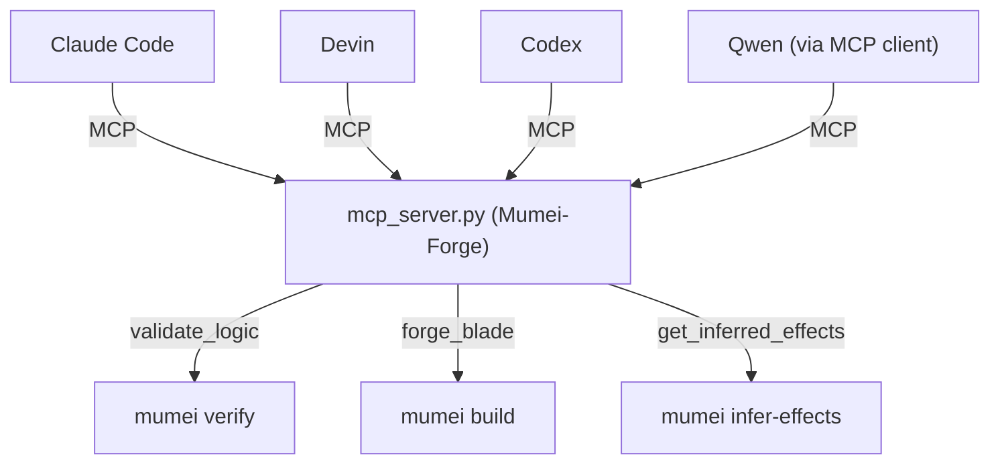

# Mumei (無銘) [](https://github.com/mumei-lang/mumei)

**Mathematical Proof-Driven Programming Language**

Mumei formally verifies every function with Z3 before compiling to LLVM IR.

> parse → resolve → monomorphize → lower_to_hir → **verify (Z3)** → codegen (LLVM IR)

```mumei
type Nat = i64 where v >= 0;

atom increment(n: Nat)
  requires: n >= 0;
  ensures: result >= 1;
  body: n + 1;

// Explicit return types for Str, f64, enums (Plan 18)
atom greet(name: Str) -> Str
  requires: true;
  ensures: true;
  body: "Hello, " + name;
```

```mumei
// Side effects are verified at compile time — undeclared effects won't compile.
effect FileWrite;
effect Log;

atom write_log(msg: Nat)
    effects: [FileWrite, Log];
    requires: msg >= 0;
    ensures: result == msg;
    body: {
        perform FileWrite.write(msg);
        perform Log.info(msg);
        msg
    };
```

```mumei
// Algebraic laws on traits — Z3 proves every impl satisfies them.
trait Comparable {
    fn leq(a: Self, b: Self) -> bool;
    law reflexive: leq(x, x) == true;
    law transitive: leq(a, b) && leq(b, c) => leq(a, c);
}

impl Comparable for i64 {
    fn leq(a: i64, b: i64) -> bool { a <= b }
}
```

---

## Install

```bash
# One-liner (macOS / Linux)
curl -fsSL https://mumei-lang.github.io/mumei/install.sh | bash

# Homebrew
brew install mumei-lang/mumei/mumei

# Specific version
curl -fsSL https://mumei-lang.github.io/mumei/install.sh | bash -s -- --version v0.2.0
```

No Rust toolchain required. Detects OS/arch automatically.

<details>
<summary>Build from source</summary>

```bash
# macOS
brew install llvm@17 z3
# Linux
sudo apt-get install -y libz3-dev llvm-17-dev libclang-17-dev

cargo build --release   # -> target/release/mumei
cargo install --path .  # -> ~/.cargo/bin/mumei

# Or auto-install Z3/LLVM
mumei setup && source ~/.mumei/env
```

</details>

---

## Getting Started

```bash
mumei init my_app
cd my_app
mumei build src/main.mm -o dist/output
```

### CLI

| Command | Description |
|---------|-------------|
| `mumei build <file> -o <out>` | Verify + codegen (`--emit llvm-ir` (default) / `c-header`) |
| `mumei verify <file>` | Z3 verification only |
| `mumei check <file>` | Parse + resolve (fast, no Z3) |
| `mumei init <name>` | Generate project template |
| `mumei add <dep>` | Add dependency (path / git / registry) |
| `mumei publish` | Publish to local registry |
| `mumei setup` | Download Z3 + LLVM toolchain |
| `mumei inspect` | Show development environment |
| `mumei infer-effects <file>` | Infer required effects (JSON output) |
| `mumei infer-contracts <file>` | Infer contracts for all atoms (JSON output) |
| `mumei repl` | Interactive REPL |
| `mumei doc <file> -o <dir>` | Generate HTML/Markdown documentation |
| `mumei lsp` | Start LSP server |

---

## Features

| Category | Highlights |
|----------|-----------|
| **Types** | Refinement types (`i64 where v >= 0`), Structs, Enums (ADT), Generics, explicit return types (`-> Str`) |
| **Verification** | Pre/postconditions, [loop invariants + termination proof](docs/LANGUAGE.md#termination-checking), `forall`/`exists` quantifiers, [temporal effect Z3 probes](docs/ARCHITECTURE.md#stateful-effects-temporal-effect-verification) |
| **Traits** | [Algebraic laws verified by Z3](docs/LANGUAGE.md#trait-definitions-with-laws) (`law reflexive: leq(x, x) == true`) |
| **Ownership** | [`ref` / `ref mut` / `consume`](docs/LANGUAGE.md#ownership-and-borrowing) with Z3 aliasing prevention, MIR-based move analysis |
| **Concurrency** | `async`/`await`, `task_group:all`/`task_group:any`, [deadlock-free proof via resource hierarchy](docs/LANGUAGE.md#asyncawait-and-resource-hierarchy) |
| **Effects** | Compile-time side-effect verification, `perform`/`effects:`, effect hierarchy, parameterized effects, [effect polymorphism (`<E: Effect>`)](docs/LANGUAGE.md), [capability security](docs/CAPABILITY_SECURITY.md), stateful effects with temporal ordering |
| **Lambda** | First-class closures `\|x, y\| x + y`, capture analysis |
| **Safety** | `trusted` / `unverified` atoms, taint analysis, BMC + inductive invariant, [`call_with_contract`](docs/LANGUAGE.md#higher-order-functions-phase-a) for higher-order function verification |
| **FFI** | `extern "Rust"` / `extern "C"` blocks, handle-based memory management (`json_free`, `http_free`), Str type interop |
| **Std Library** | Option, Result, List, BoundedArray, Vector, HashMap, JSON, HTTP, sort algorithms, effect definitions |
| **Output** | LLVM IR (native binary), C header (`.h`) via `--emit c-header`. Emitter plugin architecture enables adding new backends without changing core — see [Roadmap](docs/CROSS_PROJECT_ROADMAP.md) |
| **Tooling** | LSP server, VS Code extension, `mumei.toml` manifest, dependency manager, MCP server, semantic feedback (bilingual EN/JP) |

<details>
<summary><b>More examples</b></summary>

**Loop invariant + termination proof** — Z3 proves the loop terminates and the invariant holds inductively:

```mumei
atom sum_up_to(n: i64)
    requires: n >= 0;
    ensures: result >= 0;
    body: {
        let s = 0;
        let i = 0;
        while i < n
        invariant: s >= 0 && i <= n
        decreases: n - i
        {
            s = s + i;
            i = i + 1;
        };
        s
    };
```

**Higher-order function contracts** — `contract(f)` lets Z3 verify generic callbacks without `trusted`:

```mumei
atom apply_twice(x: i64, f: atom_ref(i64) -> i64)
    requires: x >= 0;
    ensures: result >= 0;
    contract(f): requires: x >= 0, ensures: result >= 0;
    body: {
        let first = call(f, x);
        call(f, first)
    };
```

**Deadlock-free concurrency** — resource priorities are verified at compile time:

```mumei
resource db   priority: 1 mode: exclusive;
resource cache priority: 2 mode: shared;

async atom transfer(amount: i64)
    resources: [db, cache];
    requires: amount >= 0;
    ensures: result >= 0;
    body: {
        acquire db { acquire cache { amount } }
    };
```

See [Language Reference](docs/LANGUAGE.md) for full syntax documentation.

</details>

### Rich Diagnostics

Multi-span diagnostics powered by [miette](https://crates.io/crates/miette) — multiple related source locations, compound constraint decomposition, and expression-level dataflow tracking on every error.

**Multi-span output** — primary error + related constraint/dataflow locations:

```
  × Verification Error: Effect constraint not satisfied for 'perform SafeFileRead.read(path)'
   ╭─[examples/server.mm:15:9]
14 │         let path = "/tmp/" + user_id + "/config.txt";
15 │         perform SafeFileRead.read(path);
   ·         ─────────────────────────────── constraint violated here
16 │
   ╰────
   ╭─[examples/server.mm:14:20]
14 │         let path = "/tmp/" + user_id + "/config.txt";
   ·                    ──────────────────────────────────── path constructed here
   ╰────
   ╭─[std/file.mm:3:5]
 3 │     where starts_with(path, "/tmp/") && not_contains(path, "..");
   ·           ──────────────────────────────────────────────────────── constraint defined here
   ╰────
  help: Sub-constraint [2/2] 'not_contains(path, "..")' may be violated.
        user_id に ".." が含まれていないか確認してください。
```

**Compound constraint decomposition** — each `&&`-joined sub-constraint is individually evaluated:

```
  × Verification Error: Postcondition (ensures) is not satisfied.
   ╭─[examples/basic.mm:5:1]
 4 │   ensures: result > 0;
 5 │   body: x - 1;
   ·   ──────────── verification failed here
 6 │
   ╰────
  help: ensures の条件を確認してください。body の返り値が事後条件を満たすか検討してください
```

**MCP JSON output** — structured data for AI agent consumption:

```json
{
  "failure_type": "precondition_violated",
  "semantic_feedback": {
    "violated_constraints": [{
      "param": "path",
      "constraint": "starts_with(path, \"/tmp/\") && not_contains(path, \"..\")",
      "sub_constraints": [
        {"index": 0, "raw": "starts_with(path, \"/tmp/\")", "satisfied": true},
        {"index": 1, "raw": "not_contains(path, \"..\")", "satisfied": false,
         "explanation": "'path' must not contain \"..\""}
      ]
    }],
    "data_flow": [
      {"step": "concat", "line": 14, "col": 20},
      {"step": "perform", "line": 15, "col": 9,
       "constraint": "starts_with(path, \"/tmp/\") && not_contains(path, \"..\")"}
    ],
    "related_locations": [
      {"file": "examples/server.mm", "line": 14, "label": "path constructed here"},
      {"file": "std/file.mm", "line": 3, "label": "constraint defined here"}
    ]
  }
}
```

LSP diagnostics include `relatedInformation` for multi-location errors, enabling IDE inline display of all related spans.

---

## Self-Healing Loop (AI + Z3)

See [mumei-agent](https://github.com/mumei-lang/mumei-agent) for the AI-driven
autonomous fix loop that combines LLM and Z3 formal verification.

The mumei CLI provides the verification interface:
- `mumei verify --json file.mm` — structured JSON output to stdout
- `mumei verify --report-dir <dir> file.mm` — write report.json to specified directory
- See [docs/REPORT_SCHEMA.md](docs/REPORT_SCHEMA.md) for the output schema.

### MCP Tools

| Tool | Description |
|------|-------------|
| `forge_blade` | Verify + code generation in one step |
| `validate_logic` | Z3 verification only (returns counter-example data) |
| `execute_mm` | General-purpose build / check execution |
| `get_inferred_effects` | Pre-check: infer required effects before writing code |
| `get_allowed_effects` | Query current effect boundary for the session |
| `set_allowed_effects` | Override effect boundary dynamically |

### MCP Setup

```bash
pip install "mcp[cli]>=1.0"
python mcp_server.py
```

**Demo Recording:**

[MCP + Rich Diagnostics Demo](https://github.com/user-attachments/assets/0f0594a4-8946-422c-9d54-bd81af45fc14)

[Demo 2: Compound Constraint Decomposition (Path Safety)](https://github.com/user-attachments/assets/cc5f7d93-a759-418d-9b46-520500c38672)

### Multi-Agent Collaboration

The MCP Server (`mcp_server.py`) is implemented as **FastMCP("Mumei-Forge")** and exposes mumei's formal verification capabilities to any MCP-compatible AI agent — Claude Code, Devin, Codex, Qwen, and others — without requiring agent-specific integration work.



#### AI Agent Features

- **Machine-readable output**: `_build_machine_readable()` parses `report.json` and returns structured JSON containing `failure_type`, `actions`, `counter_example`, `conflicting_constraints`, `data_flow`, `related_locations`, and more — ready for programmatic consumption by any agent.
- **Concurrent-safe verification**: `validate_logic` uses `mumei verify --report-dir` with a unique temporary directory per invocation, enabling multiple agents to run verification in parallel without conflicts.
- **Zero-configuration usage**: Any MCP-compatible agent can start using mumei's verification, build, and effect inference capabilities by simply connecting to `python mcp_server.py`.

#### mumei-agent vs. MCP Server

| | MCP Server (`mcp_server.py`) | [mumei-agent](https://github.com/mumei-lang/mumei-agent) |
|---|---|---|
| **Approach** | Generic interface — the agent's own LLM decides how to fix issues | Turnkey solution — LLM call + verification + retry integrated in one loop |
| **Integration** | Any MCP-compatible agent (Claude Code, Devin, Codex, Qwen, etc.) | Standalone CLI: `python -m agent file.mm` |
| **LLM** | Agent brings its own | Configurable via `.env` (Ollama, OpenAI, DashScope, etc.) |

The two approaches are **complementary**: the MCP Server enables any agent to access mumei's verification without requiring mumei-agent, while mumei-agent provides an out-of-the-box autonomous fix loop for users who want a single-command experience.

---

## Documentation

| Document | Content |
|----------|---------|
| [Language Reference](docs/LANGUAGE.md) | Types, generics, traits, ownership, async |
| [Standard Library](docs/STDLIB.md) | Option, Result, List, BoundedArray, sort |
| [Examples & Tests](docs/EXAMPLES.md) | Verification suite, pattern matching, negative tests |
| [Architecture](docs/ARCHITECTURE.md) | Compiler internals |
| [Toolchain](docs/TOOLCHAIN.md) | CLI commands, package management |
| [Roadmap](docs/ROADMAP.md) | Strategic roadmap |
| [Capability Security](docs/CAPABILITY_SECURITY.md) | Effect-based capability security evaluation |
| [Changelog](docs/CHANGELOG.md) | Release history |

---

## Development

```bash
pip install pre-commit && pre-commit install
cargo test
cargo clippy
```

---

## License

[Apache-2.0 license](LICENSE)
