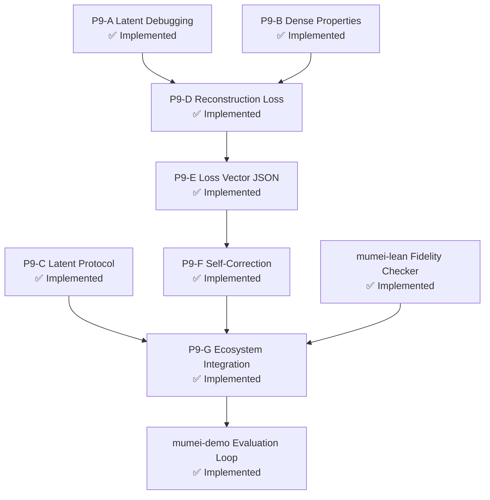
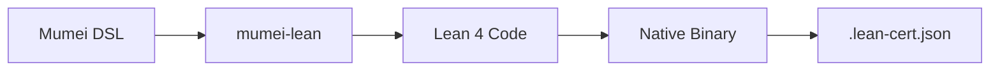
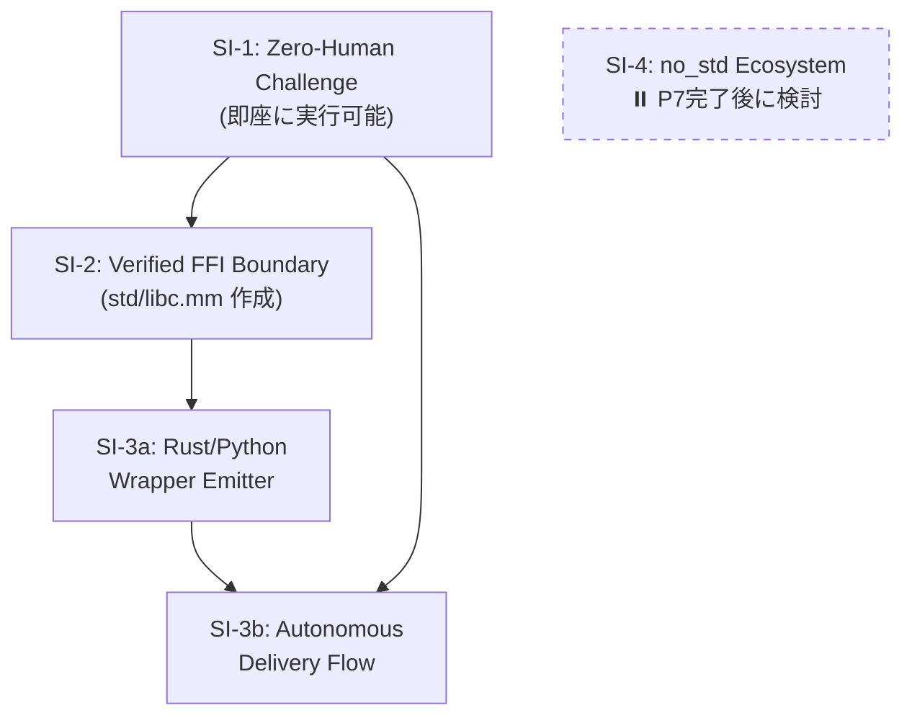
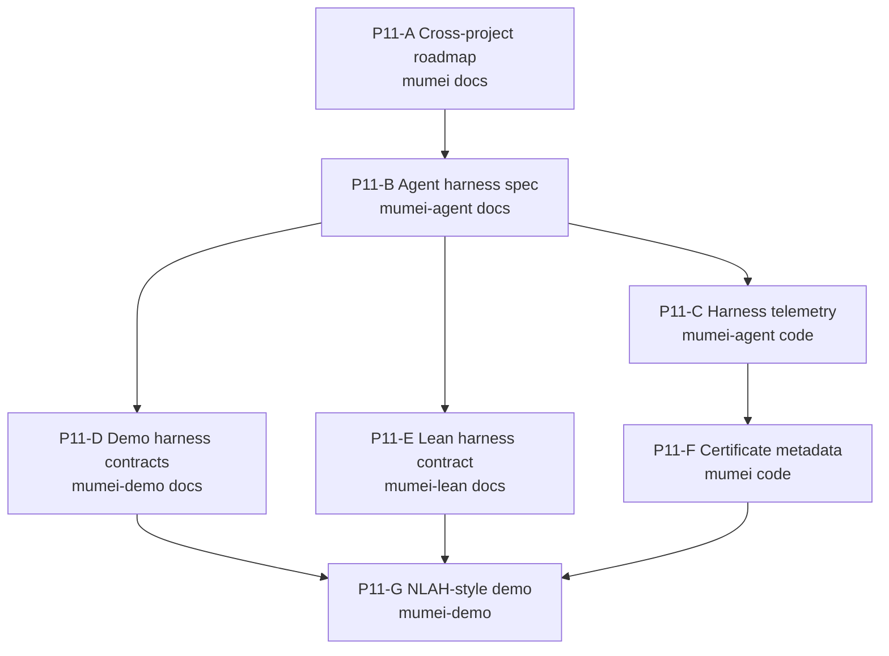
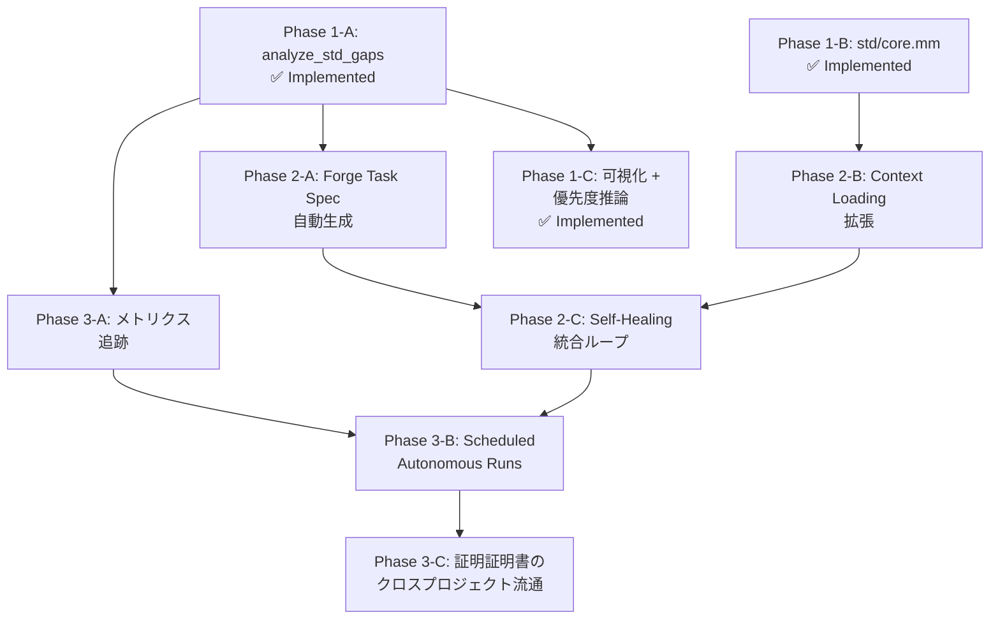
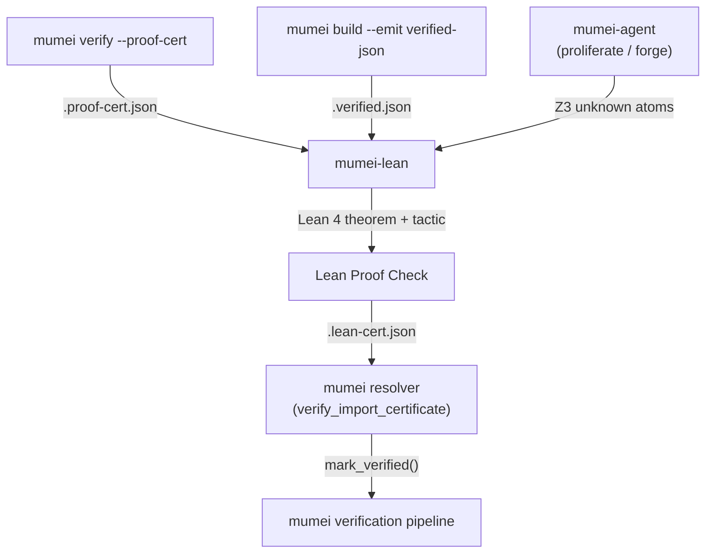
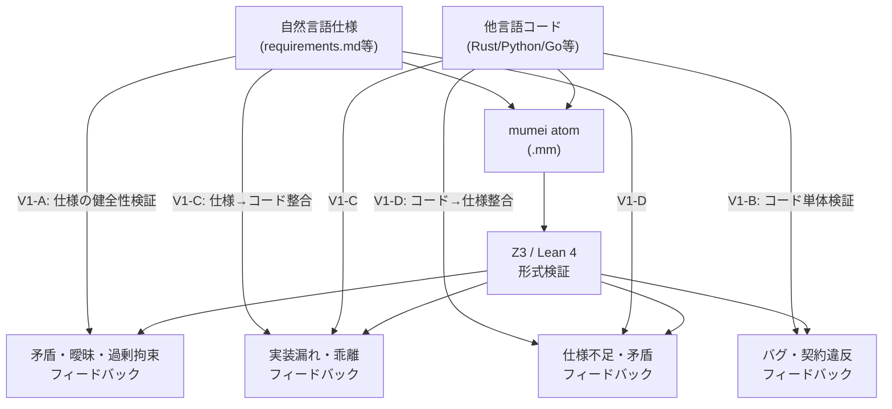
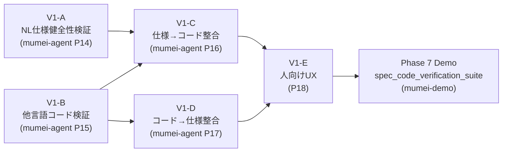

# Cross-Project Roadmap — mumei + mumei-agent (2026-03 〜)

> mumei エコシステム全体の次期ロードマップ。mumei の思想（proof-first / AI生成コード → 検証済み資産への変換）に沿って優先度を設定。

## Canonical cross-project contract

This file is the single top-level roadmap for `mumei`, `mumei-agent`, `mumei-lean`, and demo/tap follow-ups. Repository-local roadmaps may track local acceptance details, but they must not introduce a competing priority order. When wording diverges, align local docs back to this file first.

Canonical harness vocabulary:

| Term | Contract meaning | Primary owners |
| --- | --- | --- |
| `harness_contract` | Identifier/path for the policy that binds stages, gates, failure taxonomy, and evidence expectations. | `mumei` certificate metadata; agent/Lean/demo harness docs |
| `intent_fidelity` | Review metadata showing whether generated specs/artifacts still match the original natural-language intent. | `mumei-agent`, `mumei-demo`, certificate consumers |
| `artifact_paths` | Ordered evidence paths that CI, demos, or MCP clients must collect/compare. | compiler proof certificates, agent audit reports, Lean bridge summaries |
| `spec_health_issues`, `verification_violations`, `cross_validation_gaps`, `next_steps`, `migration_hints`, `healed_files`, `heal_errors` | Canonical no-`.mm` audit artifact set from existing code through migration and self-healing. | `mumei-agent audit --auto-migrate --auto-heal`, MCP `scan_and_fix`, `mumei-demo/scenarios/no_mm_audit` |
| `contract_consistency[]` ↔ `missing_constraints[]`; `global_invariant_conflicts[]` ↔ `divergences[]`; `circular_dependencies[]` ↔ `drift_issues[]` | Cross-spec artifact mapping shared by human review and MCP consumers. | `mumei cross_spec.json`, `mumei-agent` cross-validation, P14-D human review |
| `budget_policy_fingerprint` | Stable hash of the retry/search policy used when producing evidence. | agent self-healing/audit, compiler proof certificates |
| `lean_verified` | Certificate status for an atom accepted only when the current `translator_version` and `bridge_lemma_hash` match both certificate fields and Lean result metadata; otherwise the atom is stale/unproven. | `mumei-lean` bridge; `mumei` certificate resolver; CLI/MCP certificate consumers |

Current priority after the completed P11/P14 integration is docs-sync and harness-contract regression prevention: keep the vocabulary above stable, keep local docs subordinate to this roadmap, and run the bridge/MCP/audit/spec regression gates whenever those contracts move. Manual review is now backed by the deterministic `scripts/check_contract_vocabulary.py` docs-sync gate — which checks docs, CLI help (`src/cli.rs`), and MCP tool docstrings (`mcp_server.py`) for forbidden aliases and `contradiction_type` drift. MCP docstring extraction uses `ast`-based parsing with a count assertion (decorator count vs extracted docstring count) to prevent silent false-negatives from decorator-argument or signature variations. Repository-local contract tests in `mumei-agent`, `mumei-lean`, and `mumei-demo` complement the central gate; `mumei-demo` extends its `scripts/check_scenario_contracts.py` to cover docs/README files for forbidden aliases in key-like contexts (backtick, code fence, JSON key style). `mumei-lean` extends its `tests/test_contract_vocabulary.py` beyond docs text to cover Python bridge code surfaces: `scripts/export_cert.py` constants (`TRANSLATOR_VERSION`, `BRIDGE_LEMMA_HASH`) are asserted against `docs/LEAN_HARNESS_CONTRACT.md` pinned values for bidirectional drift detection, and docstrings/argparse help/user-visible strings in `export_cert.py`, `bridge.py`, `ingest_cert.py`, `bridge_harness.py` are checked for Lean vocabulary alias drift in key-like contexts. All four repositories now symmetrically cover docs + code-surface contract vocabulary regression.

## No-`.mm` front door and V1 order

The canonical no-`.mm` route is `mumei-agent audit --code-file ... --auto-migrate --auto-heal` and MCP `scan_and_fix`. Both names describe the same contract and must keep the gate order `audit -> migrate-suggest -> heal`:

Language coverage for this front door is Python, Rust, TypeScript, and Go. The language selector only changes the parser path; it must not rename or alias the seven no-`.mm` result keys. The fixed artifact keys and gate order do not vary by language: Rust overflow/bounds, TypeScript null/undefined, and Go bounds/nil/overflow findings are normalized into `verification_violations`, while spec/code drift remains `cross_validation_gaps` and human review still starts only at `next_steps`.

Deterministic/no-LLM mode must keep the same Z3 counterexample route for multi-language fixtures: Rust `a + b` i64 overflow/bounds, TypeScript `name!.length` null/undefined, and Go `values[idx]` bounds / `user.Name` nil / `a + b` overflow are audit findings before any Lean escalation. `mumei-demo/scenarios/no_mm_audit` is the cross-project demo fixture for this contract; it stops at `audit -> migrate-suggest -> heal` and does not expect `lean_verified`.

- `audit` classifies `spec_health_issues`, `verification_violations`, `cross_validation_gaps`, and `next_steps`.
- `migrate-suggest` / `--auto-migrate` emits `migration_hints` and generated `.mm` skeleton evidence.
- `heal` / `--auto-heal` emits `healed_files` and `heal_errors`.

Those seven no-`.mm` keys are the public contract for CLI JSON, MCP `scan_and_fix`, report formatting, and demo artifacts. Do not document `recommendations`, `actions`, `audit_issues`, `verification_gaps`, `repair_hints`, `review_actions`, `human_review`, or other aliases as alternate keys.
`mumei-demo` scenario metadata may list these same keys as `artifact_keys` so demo reviewers can compare them against ordered evidence paths; `artifact_keys` must not introduce alternate audit field names. Phase 7 is now materialized as `mumei-demo/scenarios/spec_code_verification_suite`, which runs V1-A〜V1-D as `mode_a -> mode_b -> mode_c -> mode_d` and still keeps `next_steps` as the only human-review entrypoint before migration/heal evidence.

The V1 implementation order is fixed across repositories:

1. `V1-A` natural-language spec health and `V1-B` existing-code audit run in parallel.
2. `V1-C` spec→code conformance and `V1-D` code→spec conformance run after V1-A/V1-B stabilize the artifact contract.
3. `V1-E` human review comes last and starts from `next_steps` plus `intent_fidelity` evidence.

`mumei-lean` is a complement for Z3 `unknown` only. The multi-language no-`.mm` audit expansion does not widen that role: Rust / TypeScript / Go audit findings remain agent-side `verification_violations` / `cross_validation_gaps`, not Lean fallback candidates. It must not be documented as a general fallback for `sat`, `unsat`, parser failures, or audit findings; promotion to `lean_verified` requires current `translator_version` and `bridge_lemma_hash`, otherwise the failure condition is `stale_translator`.

Every PR in this area should review this file together with the local roadmap it changes and record the bridge/MCP/audit/spec regression commands from `mumei-agent/tests/` and `mumei-lean/tests/`.

## 現状サマリ

**mumei (コンパイラ)**: P1〜P3の戦略ロードマップ、Plan 1〜24すべて実装済み。エフェクトシステム、MIR、temporal verification、modular verification、LSP completion/definitionまで到達。

**mumei-agent**: mumeiリポジトリから分離直後（PR #90）。single/multi-stage strategy、retry history、generate mode、metricsが実装済み。ただしまだ初期段階。

---

## Priority 1: mumei-agent の実用化（"AI → 検証済み資産" パイプラインの完成）

mumeiの根幹思想は「AIが生成した不確実なコードを検証済みの信頼できる資産に変換する」こと。

現在のmumei-agentは **fix（修正）** に特化しているが、**generate（生成）** モードが追加されたばかりで、まだ「自然言語仕様 → 検証済みコード」のフルパイプラインが未完成。

### P1-A: Generate Mode の強化

**Repository**: `mumei-lang/mumei-agent`

現在の `generate_code` は基本的なコード生成のみ。以下を追加すべき:

- **仕様からの atom 生成**: 自然言語で `requires`/`ensures` を記述 → LLMが `atom` を生成 → `mumei verify --json` で検証 → 失敗時は self-healing ループへ
- **`mumei infer-contracts`/`mumei infer-effects` との統合**: 生成前にエフェクト推論を実行し、LLMプロンプトに注入
- **テンプレートベースの生成**: `atom` のスケルトン（requires/ensures/body）をLLMに埋めさせる形式で、hallucination を抑制

### P1-B: structured_unsat_core の活用

**Repository**: `mumei-lang/mumei-agent`

mumei側で最近追加された `structured_unsat_core`（PR #97）をagent側で消費する:

- `report.json` の `structured_unsat_core` フィールドをパースし、LLMプロンプトに「どの制約が矛盾しているか」を具体的に伝える
- 現在のプロンプトテンプレート群（`agent/prompts/`）を拡張し、unsat core 情報を活用

### P1-C: E2E テスト・CI の整備

**Repository**: `mumei-lang/mumei-agent`

- GitHub Actions で `pytest` を実行するCI
- mumei バイナリのモック or 実バイナリを使ったインテグレーションテスト
- 各 violation type（precondition, effect_mismatch, temporal_effect 等）に対する修正成功率の回帰テスト

---

## Priority 2: mumei コンパイラの検証能力深化

mumeiの差別化は「Z3による完全自動検証」。この強みをさらに深める。

### P2-A: Cross-atom contract composition（呼び出し元での契約合成） ✅ Implemented

**Repository**: `mumei-lang/mumei`

- ✅ `analyze_temporal_effects_with_contracts()` in `mumei-core/src/mir_analysis.rs`: forward dataflow analysis verifies callee `effect_pre` against caller's current temporal state and applies `effect_post` as state transition
- ✅ `AtomEffectContract` struct mapping effect names to (pre_state, post_state) pairs
- ✅ `TemporalOp` enum distinguishing `Perform` and `Call` operations
- ✅ `mumei-core/src/verification.rs` builds `callee_contracts` map from `ModuleEnv` and passes to analysis
- ✅ 5 unit tests: valid composition, invalid order, no contracts, chained A→B→C, effect_post available to caller
- ✅ E2E tests: `tests/test_modular_verification.mm`, `tests/test_modular_verification_error.mm`, `tests/test_cross_atom_chain.mm`

### P2-B: Trait method constraints の Z3 注入 ✅ Implemented

**Repository**: `mumei-lang/mumei`

- ✅ `TraitMethod.param_constraints` injected into Z3 at both `verify_impl` (law verification) and inter-atom call sites
- ✅ Naive `.replace("v", ...)` replaced with word-boundary-aware `replace_constraint_placeholder()` using `\bv\b` regex
- ✅ `method_trait_index: HashMap<String, Vec<(String, usize)>>` added to `ModuleEnv` for deterministic method→trait lookup
- ✅ `get_traits_for_method()` returns all candidates; callers use `find_impl()` to disambiguate
- ✅ `infer_requires` callee argument substitution with simultaneous placeholder-based replacement
- ✅ `collect_callees_with_args_expr/stmt` and `expr_to_source_string` helpers added
- ✅ `check_contract_subsumption()`: when `atom_ref(concrete)` is passed to a `contract(f)` parameter, verifies that concrete ensures implies contract ensures (warning, not hard error)
- ✅ Unit tests for all items (replace_constraint_placeholder, method_trait_index, infer_requires substitution, subsumption check)

### P2-C: Struct method parsing（`impl Struct { atom ... }` 構文） ✅ Implemented

**Repository**: `mumei-lang/mumei`

- ~~`StructDef.method_names` は存在するが、`impl Stack { atom push(...) }` 構文のパーサーが未実装~~
- ~~OOP的なメソッド呼び出し `stack.push(x)` を可能にし、実用的なデータ構造定義を支援~~
- ✅ `ImplBlock` AST node added (`Item::ImplBlock` variant)
- ✅ `impl StructName { atom method(...) ... }` syntax parsing implemented
- ✅ Methods registered in `ModuleEnv` with qualified names (`StructName::method_name`)
- ✅ Handled in all match arms (`main.rs`, `resolver.rs`, `lsp.rs`, `cmd_build`, `cmd_check`, REPL)

### Verified FFI Layer ✅ Implemented

**Repository**: `mumei-lang/mumei`

- ✅ `ExternFn` extended with optional `requires`/`ensures` fields
- ✅ Extern function contracts propagated to `Atom` registration (no more hardcoded `"true"`)
- ✅ Contracts verified at call sites by Z3 (callers must satisfy `requires`)
- ✅ Backward compatible: omitted contracts default to `"true"`

---

## Priority 3: 実世界ユースケースの証明（"Proof of Concept → Proof of Value"）

mumeiの思想を体現する実践的なデモが不足している。

### P3-A: 実行可能な HTTP API スクリプトの E2E デモ ✅ Demo Ready

**Repository**: `mumei-lang/mumei`

- ~~`examples/http_demo.mm` を実際にビルド・実行し、HTTP レスポンスを取得するデモ~~
- ~~FFI バックエンド（`reqwest`）が実際にリンク・動作することの検証~~
- ✅ `examples/http_e2e_demo.mm` — Verified HTTP client demo with:
  - Safe/unsafe URL handling (Z3 catches unconstrained inputs)
  - JSON parse pipeline with contract propagation
  - Multi-user fetch composition with verified contracts

### P3-B: mumei-agent による「仕様 → 検証済みAPI クライアント」デモ

**Repository**: `mumei-lang/mumei-agent`

mumeiの思想の究極的な体現:

1. 自然言語で「GitHub API からユーザー情報を取得し、名前を返す」と指示
2. mumei-agent が `atom` を生成（`effects: [SecureHttpGet]`, `requires`/`ensures` 付き）
3. `mumei verify` で検証
4. 失敗時は self-healing ループで自動修正
5. 検証通過後、LLVM IR にコンパイル（ネイティブバイナリ生成）し FFI 経由で利用

### P3-C: Capability Security の実践デモ ✅ Demo Ready

**Repository**: `mumei-lang/mumei`

- ~~`SecurityPolicy` を使って「このagentは `/tmp/` 以下のファイルのみ読み書き可能」を強制するデモ~~
- ~~mumei-agent が生成したコードが capability boundary を超えた場合に自動的にリジェクトされるフロー~~
- ✅ `examples/capability_demo.mm` — Comprehensive capability security demo with:
  - `SafeFileRead`: `/tmp/` path restriction + traversal prevention
  - `SafeFileWrite`: `/tmp/output/` write restriction
  - `SecureHttpGet`: HTTPS-only URL enforcement
  - Sandboxed pipeline composing all three capabilities
  - Three unsafe examples that Z3 rejects at compile time (passwd read, path traversal, plain HTTP)

### P3-D: Phase 1 Demo: Ownership Transfer Protocol ✅ Demo Ready

**Repository**: `mumei-lang/mumei`

- ✅ `std/ownership.mm` — Stateful `Ownership` effect with `Idle`, `PendingTransfer`, and `Transferred` states
- ✅ Verified atoms for proposal, acceptance, cancellation, full transfer, and propose-then-cancel composition
- ✅ E2E tests covering valid transfer flows and hostile takeover rejection via temporal effect verification

---

## Emitter Plugin Architecture (コード生成プラグイン構造)

mumei のコード生成バックエンドをプラグイン化し、LLVM IR 以外のターゲットへの出力を可能にするアーキテクチャ。

### Phase 1 (Current — PR scope) ✅ Implemented

- `Emitter` trait と enum ベースの静的ディスパッチを mumei core に追加
- 既存の `codegen::compile()` (LLVM IR バックエンド) を `LlvmEmitter` としてトレイトを実装
- `CHeaderEmitter` を第2のエミッターとして追加 — 検証済み `HirAtom` から `.h` ヘッダファイルを生成
- `mumei build` コマンドに `--emit` CLI フラグを追加（値: `llvm-ir` (デフォルト), `c-header`）
- すべてのエミッターは mumei バイナリクレート内で `pub(crate)` のまま
- ワークスペース再構成は不要
- ✅ `Artifact` 抽象化: `Emitter` trait の戻り値を `MumeiResult<Vec<Artifact>>` に変更。`Artifact` 構造体（`name`, `data`, `kind`）と `ArtifactKind` enum (`Binary`, `Source`, `Header`) を追加。ファイル書き出しを `cmd_build` 側に移動
- ✅ `CHeaderEmitter` の Doxygen 形式強化: `/* requires: ... */` → `/** @pre ... */`, `/* ensures: ... */` → `/** @post ... */`, `@brief` コメント自動生成
- ✅ 型マッピング拡充: `i32` → `int32_t`, `u32` → `uint32_t`, `f32` → `float`

### Phase 2 (Future — 3+ emitters exist 時) ✅ Implemented

- ✅ `mumei-core` 共有クレートを抽出: `HirAtom`, `ModuleEnv`, `Emitter` trait, 関連型を含む
- ✅ リポジトリを Cargo ワークスペース構造に変換 (`mumei-core`, `mumei-emit-llvm`, `mumei-cli`)
- ✅ `Emitter` trait とコア型を `pub` にし、外部クレートがエミッターを実装可能にする
- ✅ 外部プラグインリポジトリ (例: `mumei-emit-wasm`) が可能になる
- ✅ `VerifiedJsonEmitter` を第3のエミッターとして追加 (`--emit verified-json`)
- ✅ `ProofBookEmitter` を第4のエミッターとして追加 (`--emit proof-book`) — 検証済み Atom から人間可読な Markdown 証明書ドキュメントを生成

### Phase 3 (✅ Implemented)

- ✅ 動的プラグインローディングのファウンデーション (Task 1-C):
  - `mumei-core/src/emitter.rs` に `EmitTarget::External(String)` バリアントを追加し、CLI 不明文字列を外部プラグイン名として保持できるようにした。
  - `ArtifactKind::Metadata` バリアントを追加し、`Source` / `Header` / `Binary` のいずれにも当てはまらないプラグイン由来サイドカー (Wasm component manifest, lean cert blob 等) のための分類軸を用意。
  - `pub type BoxedEmitter = Box<dyn Emitter + Send + Sync>` 型エイリアスと `pub fn load_external_emitter(name: &str) -> MumeiResult<BoxedEmitter>` を公開。`~/.mumei/emitters/<name>/libmumei_emit_<name>.{so,dylib,dll}` を `crate::manifest::mumei_home()` 経由で解決し、`libloading` で実 dlopen を行う。
  - プラグインは `mumei_emitter_abi_version() -> u32` と `mumei_create_emitter() -> EmitterPluginHandle` を export する。ホスト側は `EMITTER_ABI_VERSION` を検証し、C-compatible な2ポインタ handle から trait object を復元して、`PanicSafeEmitter` で `emit()` 中の panic を `MumeiError` に変換する。
  - `src/main.rs` の `--emit` 文字列マッチを拡張し、未知ターゲット文字列は `EmitTarget::External(other.to_string())` として保持する。`cmd_build` は外部 emitter を build ごとに1回だけロードし、`dispatch_emit` の `External(name)` 分岐へ再利用して渡す。
  - 単体テスト: `test_artifact_kind_metadata_distinct`、`test_emit_target_external_carries_name`、`test_load_external_emitter_missing_plugin_errors`、`test_emitter_abi_version_constant`、`test_panic_safe_emitter_catches_panic`。
- ✅ 動的ローダー本体 (`libloading` 経由の dlopen + ABI バージョニング + panic-safety wrapper) を実装。
- ⏸ `mumei add --emitter wasm` スタイルの CLI で外部エミッターをインストール
- ⏸ Wasm ターゲット（現在保留中）を外部プラグインとして core に触れずに追加可能

### Design Decisions

- **プラグイン境界**: `HirAtom` + `ModuleEnv` + `ExternBlock[]` (LLVM 非依存のデータ構造)
- **将来の境界**: MIR (`MirBody`) が MIR ベースの codegen 実装後にプラグイン境界となる可能性
- **静的ディスパッチ**: 安全性のため enum ベースのディスパッチを動的ディスパッチ (trait objects / .so loading) より優先
- **Wasm 出力**: 意図的に延期; プラグインアーキテクチャにより core を変更せずに後から追加可能

---

## Priority 5: 検証済み資産の流通基盤 (Verified Asset Distribution) ✅ Implemented

mumeiの思想「AI生成コード → 検証済み資産への変換」の次段階。検証済み資産を流通・消費できるエコシステムの構築。

### P5-A: Proof Certificate Chain（証明書チェーン） ✅ Implemented

**Repository**: `mumei-lang/mumei`

- ✅ `AtomCertificate` 拡張: `proof_hash`, `dependencies`, `effects`, `requires`, `ensures` フィールド追加
- ✅ `ProofCertificate` 拡張: `package_name`, `package_version`, `certificate_hash`, `all_verified` フィールド追加
- ✅ `generate_certificate()` が `ModuleEnv` を活用して推移的ハッシュ・依存関係グラフを埋める
- ✅ `mumei verify-cert <path>` CLI コマンド: 証明書の整合性検証
- ✅ `--emit proof-cert` フラグ: `.proof-cert.json` 出力

### P5-B: パッケージレジストリの実装 ✅ Implemented

**Repository**: `mumei-lang/mumei`

- ✅ `VersionEntry` 拡張: `cert_path`, `cert_hash` フィールド追加
- ✅ `mumei publish`: 検証 → 証明書自動生成 → レジストリ登録
- ✅ `mumei add`: レジストリ解決 → 証明書検証 → `mumei.toml` 自動追記

### P5-C: Verified Import（検証済みインポート） ✅ Implemented

**Repository**: `mumei-lang/mumei`

- ✅ インポート時の `.proof-cert.json` 自動検証
- ✅ 証明書なし/期限切れのインポートは taint analysis 対象
- ✅ `--strict-imports` フラグ: 証明書なしインポートをハードエラーに

---

## Priority 6: エージェントの自律性深化 (Agent Autonomy Deepening) ✅ Implemented

### P6-A: Multi-atom / Multi-file 生成 ✅ Implemented

**Repository**: `mumei-lang/mumei-agent`

- ✅ Multi-atom spec JSON フォーマット (`atoms: [...]` 配列)
- ✅ `generate_multi_atom()`: 依存関係検出・ソート・一括生成・atom 単位 retry
- ✅ 既存 single-atom spec との後方互換性維持

### P6-B: Pattern Library の学習型拡張 ✅ Implemented

**Repository**: `mumei-lang/mumei-agent`

- ✅ `FixPattern` に `applied_count` / `success_count` フィールド追加
- ✅ `try_pattern_fix()`: 成功率ベースのパターン自動適用（LLM バイパス）
- ✅ `lookup()` の成功率ランキング
- ✅ `Metrics` に `pattern_attempts` / `pattern_successes` 追加

### P6-C: Specification Refinement Loop ✅ Implemented

**Repository**: `mumei-lang/mumei-agent`

- ✅ `spec_refinement.py`: 検証失敗時に仕様（requires/ensures）自体の修正を提案
- ✅ `RetryHistory.is_same_error_repeating()` トリガーで仕様洗練モードに切り替え
- ✅ `mumei infer-contracts` 結果を活用した仕様推論

---

## Priority 7: 実行基盤の完成 (Runtime Completion)

### P7-A: REPL 実行エンジン

**Repository**: `mumei-lang/mumei`

LLVM ORC LLJIT を使用した JIT 実行:

- `inc(5)` → `= 6` のような即時評価
- atom 定義 → JIT コンパイル → 式評価の連続フロー
- 相互依存 atom の incremental 解決と atom redefinition（`ResourceTracker` による再コンパイル）
- FFI 関数（`json_parse`, `http_get` 等）の JIT 内シンボル解決
- `mumei-emit-llvm/src/jit.rs` に `JitEngine`（ORC LLJIT ベース）/ `compile_to_module()` を追加
- `cmd_repl()` に `ReplContext` 構造体を導入
- 回帰テスト: `tests/test_repl_incremental.rs` が cross-atom resolution と redefine を担保

### P7-B: End-to-End バイナリ実行

**Repository**: `mumei-lang/mumei`

- `mumei run src/main.mm` コマンド: verify → codegen → link → execute を一括実行
- `--emit binary` フラグ: 全 atom を単一 LLVM Module にコンパイル → `clang` でリンク → 実行可能バイナリ
- `atom main()` をエントリポイントとして C の `main` にエクスポート
- ランタイムライブラリ: `@__mumei_resource_{name}` mutex / `@__effect_{name}` ハンドラのスタブ

### P7-C: Wasm Target — ⏸ Deferred / not starting now

**Repository**: `mumei-lang/mumei`

**Not starting now**: Emitter Plugin Architecture lets `mumei-emit-wasm` be added later as an external library without moving it into core. Runtime ABI, distribution evidence, and `artifact_paths` / `harness_contract` are still changing, so near-term priority stays on docs-sync and harness-contract regression prevention.

**意図的に保留**。Emitter Plugin Architecture (Phase 3) により、`mumei-emit-wasm` を外部プラグインとして core に触れずに後から追加可能。P7-A/P7-B の実行基盤が安定した後に検討する。

---

## Priority 8: DX の成熟 (Developer Experience)

### P8-A: VS Code Extension の Marketplace 公開 — ✅ Ready for Publish

LSP は completion/definition まで実装済み。Marketplace 公開に必要なファイル一式を整備完了:
- TextMate grammar（全キーワード・契約・エフェクト・演算子対応）
- language-configuration.json（ブロックコメント、折り畳み、自動閉じペア）
- tsconfig.json / .vscodeignore / README.md / CHANGELOG.md / icon.png
- `vsce package` で .vsix 生成可能な状態
- 公開には Marketplace publisher アカウントと PAT が必要

### P8-B: Counter-example Visualizer in Editor — ✅ Implemented (Plan 22, PR #167)

LSP の `relatedInformation` を活用し、Z3 counter-example をエディタ内でインライン表示する拡張がマージ済み。mumei doc 拡張と同期して [PR #167](https://github.com/mumei-lang/mumei/pull/167) で導入された。

### P8-G: Retry Budget Theoretical Foundation — ✅ Implemented

Self-healing loop と Lean escalation の retry を、固定回数の経験則ではなく `BudgetPolicy` による明示的な制御問題として扱う基盤を実装済み。

**Implemented scope**:
- `mumei-core/src/proof_cert.rs`: `BudgetPolicy`, `ActionClassLimit`, `AttemptSummary`, `CostSuccessMetrics` と atom certificate retry metadata fields を追加
- `mumei-agent/agent/budget_policy.py`: policy JSON loader、SHA-256 fingerprint、action class classification、budget exhaustion 判定
- `mumei-agent/agent/self_healing.py`: `--budget-policy`、同一 counterexample signature 抑制、budget exhaustion 時の `manual_review_required` structured summary
- `mumei-agent/agent/strategies/fix_strategy.py`: action class を prompt に注入し、budget exhausted の場合は LLM call を抑制
- `mumei-agent/agent/budget_metrics.py`: `attempts_to_success`, `tokens_to_success`, `solver_seconds_to_success`, `spec_drift_score` aggregation

**Operational plan**:
1. Forge / heal / MCP request ごとに policy fingerprint を証明書・agent log・quarterly metrics に保存する。
2. Default policy は `max_attempts`, `max_tokens`, `max_solver_time_ms`, `max_semantic_delta` と action class limits（`llm_fix`, `effect_fix`, `precondition_strengthening`, `postcondition_fix`, `lean_escalation`）を持つ。
3. 同一 counterexample signature が再出現した場合、情報利得なしの retry とみなし manual review へ切り替える。
4. Lean escalation は action class limit により bounded にし、unknown / timeout の無制限再投入を避ける。
5. 四半期ごとに proof health gain per token と retry success rate を集計し、default budget を再調整する。

---

## P9: NLAE Integration — ✅ Implemented

Anthropic Natural Language Autoencoders (NLAE) の構図を mumei エコシステムに対応させ、自然言語・LLM 推論・Mumei DSL・Z3/Lean 証明を Loss Vector で閉じた自己修復ループとして接続する。

### P9-A〜G 実装状態

| Phase | 状態 | 実装済みスコープ |
| --- | --- | --- |
| P9-A: Latent-space Debugging | ✅ Implemented | `mumei-agent` の `LatentEncoder` / `LatentDecoder` / `LatentDebugStrategy` が修復前段の潜在表現と fallback を提供 |
| P9-B: Dense Property Generation | ✅ Implemented | `mumei-agent` の `DensePropertyGenerator` が spec/source から圧縮された `requires` / `ensures` 候補を生成 |
| P9-C: Latent Protocol for Agent Communication | ✅ Implemented | `send_latent_message`, `send_latent_message_batch`, `async_send_latent_message` MCP tools が latent protocol を外部 agent に公開 |
| P9-D: Reconstruction Loss Formalization | ✅ Implemented | `mumei` が Z3 反例・違反 property・constraint/data-flow trace を復元誤差として Loss Vector に格納 |
| P9-E: Structured Feedback JSON Schema | ✅ Implemented | `mumei verify --emit loss-vector <file.mm>` と `get_structured_feedback` MCP tool が P9-E JSON を出力 |
| P9-F: Self-Correction Protocol | ✅ Implemented | `mumei-agent self-correct <file.mm>` / `self_correct` MCP tool が Loss Vector を使って修復・再検証を bounded loop 化 |
| P9-G: Ecosystem Integration | ✅ Implemented | `NLAEPipeline` / `run_nlae_pipeline` / `examples/nlae_integration_demo.mm` / Lean witness / demo harness で 4 repo E2E を接続 |

### 4リポジトリ NLAE コンポーネントマッピング

| Repository | NLAE 役割 | 最新 artifact |
| --- | --- | --- |
| `mumei-lang/mumei-agent` | Module A (AV) / Self-Correction Controller | `agent/nlae_pipeline.py`, `python -m agent self-correct`, `run_nlae_pipeline` MCP tool |
| `mumei-lang/mumei` | Module B (AR) / Z3 reconstruction | `mumei verify --emit loss-vector`, P9-E Loss Vector schema, `examples/nlae_integration_demo.mm` |
| `mumei-lang/mumei-lean` | Fidelity Checker | live generated theorem path の `lean_verified` export、`scripts/known_witnesses.py` の NLAE vault witnesses |
| `mumei-lang/mumei-demo` | Evaluation Loop | `demos/nlae_integration/run_demo.sh`, expected output fixture, 4 repo flow evidence |

### 推奨実行順序



---

## Strategic Initiatives: 「信頼のインフラ」への道筋

> mumei は「あらゆる言語、プラットフォーム、そして AI エージェントに対して『数学的真理』を供給するインフラ」という独自の頂点を目指す。以下は、その実現に向けた戦略的イニシアチブの評価と推奨順序。

### SI-1: Zero-Human Challenge（自律性の証明）— ✅ Complete

**目的**: mumei-agent に難易度の高い課題を与え、人間が一切介入せずに検証をパスするまでのログを公開する。

**思想との整合性: ★★★** — mumei の根幹思想「AI生成コード → 検証済み資産への変換」の直接的な証明。

**完了済みインフラ**:
- ✅ mumei-agent の generate mode + self-healing loop + pattern library + retry history
- ✅ `mumei verify --json` による構造化フィードバック
- ✅ P6-A (Multi-atom 生成) による複数 atom モジュール生成

**課題 spec (7/7 バリデーション OK)**:
- ✅ **100% 安全なキュー** (`safe_queue_spec.json`): 4-atom, overflow/underflow 防止
- ✅ **Verified JSON validator** (`verified_json_validator_spec.json`): SafeFileRead エフェクト + capability security
- ✅ **Deadlock-free producer-consumer** (`deadlock_free_producer_consumer_spec.json`): resource hierarchy による deadlock-free 証明
- ✅ bounded_queue, safe_arithmetic, payment, verified_clamp

**成果物**:
- ✅ `examples/challenges/` ディレクトリに課題 spec + 結果テンプレート + サンプル生成コード
- ✅ `docs/ZERO_HUMAN_CHALLENGE.md` にチャレンジ分析ドキュメント
- ✅ `.github/workflows/challenge.yml` で `workflow_dispatch` によるフル実行可能

---

### SI-2: Verified FFI Boundary（安全でない関数を安全に使う）— ✅ Implemented

**目的**: C 標準ライブラリ（`memcpy`, `strlen`, `malloc` 等）を mumei から呼ぶ際、厳格な事前条件を課した検証済みラッパーを量産する。

**思想との整合性: ★★★** — mumei の Verified FFI Contracts (`extern "C"` + `requires`/`ensures`) の実践的活用。

**既存インフラ**: 完備
- `extern "C"` ブロックに `requires`/`ensures` 契約を付与し、Z3 が呼び出し元で検証する仕組みが実装済み
- `--emit c-header` で Doxygen `@pre`/`@post` 付き `.h` ファイルを自動生成
- ExternFn → trusted atom への自動変換が実装済み

**実装内容**:
- ✅ `std/libc.mm` モジュールを新規作成
- ✅ `memcpy`, `memmove`, `memset`, `strlen`, `malloc`, `free`, `calloc`, `realloc`, `snprintf` の検証済みラッパー（9関数）
- ✅ 各ラッパーに現実的な `requires`/`ensures` 契約（例: `memcpy` の `requires: n >= 0 && dst_size >= n && src_size >= n`）
- ✅ `tests/test_libc_contracts.mm` / `tests/test_libc.mm` による呼び出し元検証テスト
- ✅ `tests/test_libc_contracts_error.mm` / `tests/test_libc_error.mm` による契約違反テスト
- ✅ `examples/libc_demo.mm` — メモリ確保→使用→解放パイプライン + 安全/不安全呼び出しデモ
- ✅ `--emit c-header` で生成される `.h` を C プロジェクトが直接利用可能（Doxygen `@pre`/`@post` 付き）

**追加実装**: コンパイラ側の変更は不要。`std/libc.mm` の作成のみ。

---

### Phase 3: Verified Microservice Demo — ✅ Implemented

**目的**: 検証済み支払いロジック + RBAC を実装し、Python FFI 経由で呼び出すデモを提供する。

**実装内容**:
- ✅ `examples/verified_microservice/payment.mm` — `calc_subtotal`, `calc_tax`, `calc_total` atoms
- ✅ `examples/verified_microservice/rbac.mm` — capability security による RBAC 検証
- ✅ `examples/verified_microservice/demo_ffi.py` — Python ctypes FFI デモ
- ✅ `examples/verified_microservice/build.sh` — verify → emit c-header ビルドスクリプト
- ✅ `examples/verified_microservice/README.md` — "logic fortress" パターンのドキュメント

**パターン**: 「logic fortress」— ビジネスロジックを mumei で形式検証し、FFI 経由で任意の言語から呼び出す。

---

### SI-3: Autonomous Delivery Flow（完全自律型デリバリー）— ✅ Complete (実地検証完了)

**目的**: mumei-agent が mumei コードを書く → 検証 → Rust/Python ラッパーを自動生成 → PR を出す、完全自律パイプライン。

**思想との整合性: ★★★** — 「生成 → 検証 → 流通」パイプラインの完成形。

**実装内容**:

| 必要な機能 | 状態 |
|-----------|------|
| mumei コード生成 + 検証 | ✅ generate mode + self-healing |
| C ラッパー生成 | ✅ `--emit c-header` |
| Rust ラッパー生成 | ✅ `--emit rust-wrapper` (`mumei-emit-rust` crate) |
| Python ラッパー生成 | ✅ `--emit python-wrapper` (`mumei-emit-python` crate) |
| PR 自動作成 | ✅ `--publish` モード (mumei-agent) |

**重要**: `RustWrapperEmitter` / `PythonWrapperEmitter` は **トランスパイラではない**。
コンパイル済み mumei バイナリ（`.so`/`.dll`）を FFI 経由で安全に呼び出すためのグルーコードを生成するもの。
`CHeaderEmitter` と同じレイヤー。

**実現ステップ**:
1. ✅ `RustWrapperEmitter` + `PythonWrapperEmitter` を emitter plugin として追加（`CHeaderEmitter` パターンを踏襲）
2. ✅ mumei-agent に `--publish` モードを追加（生成 → 検証 → ラッパー生成 → git commit → PR）
3. ✅ GitHub Actions CI テスト（Rust/Python からラッパーを呼び出し、契約が守られることを確認）

**実地検証（E2E テスト・CI 連携確認）**:
- ✅ `tests/test_publish_e2e.py` — E2E インテグレーションテスト（既存 spec + mock mumei バイナリ）
- ✅ `tests/test_wrapper_validation.py` — C/Rust/Python ラッパーの静的検証テスト
- ✅ `.github/workflows/verify-examples.yml` — publish dry-run テストジョブ追加
- ✅ `docs/AUTONOMOUS_DELIVERY.md` — パイプラインドキュメント（mermaid フロー図、使い方、CI 連携）

**前提条件**: SI-1 (Zero-Human Challenge) と SI-2 (Verified FFI Boundary) の完了

---

### SI-4: no_std Ecosystem — ⏸ Deferred / not starting now

**Not starting now**: `no_std` requires redesigning `reqwest`, `serde_json`, pthread/runtime, and stdlib FFI assumptions. Completed items remain in place; future priority is docs-sync plus regression prevention for `harness_contract`, `artifact_paths`, `budget_policy_fingerprint`, and `lean_verified`.

**目的**: no_std 環境での動作を安定させ、マイコン等で「スタックオーバーフローが物理的に起きない」制御ソフトのデモを作る。

**思想との整合性: ★★☆** — 検証の価値は高いが、現在の mumei の強みはアプリケーションレベルの検証。

**保留理由**:
- ランタイムが `reqwest`, `serde_json`, `pthread` に依存しており、no_std 化には大幅な再設計が必要
- std ライブラリ（Vector, HashMap, JSON, HTTP）がすべて allocator 前提
- 静的スタックサイズ解析が未実装
- P7（実行基盤の完成）が完了し、リンカーパイプラインが安定した後に検討すべき

---

### SI-6: Lean 4 Executable Code Generation — ✅ Completed

**目的**: ArkLibの「Lean 4で本番コード（CLIツール等）を直接書く」アプローチをMumeiエコシステムに統合

**関連リンク**:
- Vitalik's comment: "you can even write live production code (including eg. CLI tools) directly in Lean"

**思想との整合性: ★★★** — Mumei DSL → Lean 4 → 実行可能バイナリの完全パイプラインにより、証明された仕様がそのまま本番コードになる世界を実現

**実装内容**:
- `mumei-lean/scripts/lean_to_executable.py`: Lean 4モジュールから実行可能バイナリを生成
- `mumei-lean/examples/lean_cli/`: Lean 4で書かれたCLIツールの例
- `mumei-lean/docs/LEAN_EXECUTABLE.md`: Lean 4実行可能コードのガイドライン
- `mumei-lean/examples/lean_cli/.lean-cert.json`: Lean executable artifact contract と witness theorem を記録

**アーキテクチャ**:


**完了状態**: Phase 4-6 デモと mumei-lean witness modules が揃い、Lean 4 CLI executable pipeline は `mumei-lean/scripts/lean_to_executable.py`、`mumei-lean/examples/lean_cli/`、`mumei-lean/docs/LEAN_EXECUTABLE.md` で実行・レビュー可能。

---

### Strategic Initiatives 推奨実行順序



| 順序 | イニシアチブ | 理由 |
|------|------------|------|
| **1** | SI-1: Zero-Human Challenge | 追加実装ゼロ。mumei の思想を最も直接的に証明。マーケティング効果大 |
| **2** | SI-2: Verified FFI Boundary | `std/libc.mm` の作成のみ。C header emitter との相乗効果。実用的価値が高い |
| **3** | SI-3: Autonomous Delivery Flow | Rust/Python emitter の追加が必要だが、既存の `CHeaderEmitter` パターンを踏襲可能 |
| **保留** | SI-4: no_std Ecosystem | P7 完了後。ランタイム・リンカー・std の大幅な再設計が必要 |

---

## Priority 11: Natural-Language Agent Harnesses 対応ロードマップ

**背景**: "Natural-Language Agent Harnesses" (arXiv:2603.25723) は、エージェント性能をモデル単体ではなく、周辺の harness（実行制御、状態、検証、停止条件、artifact 契約）が強く規定することを示す。Mumei エコシステムでは、既に P6 self-healing、P8-G retry budget、P9 Forge、P10 MCP、P11 natural-language spec extraction、P12 NLAE、mumei-lean fallback、mumei-demo scenario runner が分散実装されている。次の焦点は、これらを「コードに埋もれた制御」ではなく、外部化・計測・ablation 可能な harness 仕様として扱うことである。

### 学ぶべき設計原則

1. **Harness を第一級オブジェクトにする**
   生成、修復、検証、Lean fallback、PR 作成、demo 実行を controller code の暗黙状態ではなく、読み書き可能な harness policy として表現する。
2. **自然言語 = 方針、Mumei DSL / JSON schema / Z3 / Lean = 執行**
   NLAH の編集性は取り入れるが、決定的な検証、証明証明書、adapter、schema validation はコード・DSL・証明器側に残す。
3. **Artifact contract と file-backed state を必須にする**
   各段階で読むファイル、生成するファイル、検証証拠、停止条件を明記し、長期実行や子エージェント handoff を context 依存にしない。
4. **Verifier は evaluator / intent に近づける**
   Z3/Lean の数学的正しさだけでなく、元の要求仕様との fidelity、semantic drift、manual review 条件も artifact に残す。
5. **重い探索より acceptance path を短くする**
   Multi-candidate search は費用対効果が悪化し得るため、まずは単一路線の generate → verify → repair → evidence gate を堅牢化し、分岐は独立性と budget が明確な場合だけ使う。
6. **Module ablation を前提に設計する**
   file-backed state、evidence-backed answering、verifier separation、self-evolution、multi-candidate search、context compression、markdown memory を個別に ON/OFF できるようにし、成功率・token・solver time・handoff loss を比較する。

### P11-A: Cross-project harness plan & task ordering — ✅ This roadmap PR

**Repository**: `mumei-lang/mumei`

既存ロードマップへ NLAH 論文からの学習点を統合し、以降の PR 順序を明文化する。

**成果物**:
- `docs/CROSS_PROJECT_ROADMAP.md` に Priority 11 を追加。
- mumei-agent / mumei-demo / mumei-lean / mumei 本体の責務境界を整理。
- 後続 PR の順序を「まず harness 仕様と artifact contract、次に runtime 実装、最後に demo/Lean/MCP 連携」に固定。

### P11-B: Agent Harness Spec（NLAH 風プレイブック）導入 — ✅ Completed

**Repository**: `mumei-lang/mumei-agent`

mumei-agent の Forge / heal / extract-spec / proliferate / Lean fallback を、外部化された harness 仕様として文書化し、実行時ログと対応付ける。

**実装タスク**:
- `docs/AGENT_HARNESS_SPEC.md` を追加し、role、stage、artifact contract、state semantics、verifier gates、failure taxonomy、budget policy、stopping criteria を定義。
- `docs/ROADMAP.md` に P13: Harness Externalization を追加。
- `agent` の既存 CLI は変更せず、まずは仕様と運用契約を固定する。
- `summary.json` / `forge_log.json` / `lean_fallback` / `budget_metrics` の各フィールドがどの harness stage の証拠かを対応表にする。

**受け入れ条件**:
- `pytest -q` が通る。
- `AGENT_HARNESS_SPEC.md` だけで Forge run の入力、出力、検証ゲート、停止条件をレビューできる。

### P11-C: Harness telemetry & ablation metrics — ✅ Completed

**Repository**: `mumei-lang/mumei-agent`

論文の module ablation を Mumei 向けに実行できるよう、module flags と集計指標を追加する。

**実装タスク**:
- `agent/harness_metrics.py` を追加し、`module_enabled`, `artifact_contract_passed`, `verification_gate`, `handoff_count`, `retry_class`, `intent_fidelity_status` を集計。
- P8-G `budget_metrics.py` と統合し、`tokens_to_success`, `solver_seconds_to_success`, `spec_drift_score` と同じ summary に出す。
- `--harness-profile basic|stateful|verifier|self_evolution|lean_fallback|full` を Forge / proliferate dry-run に追加する。
- `tests/test_harness_metrics.py` で module ON/OFF と summary JSON を検証する。

**受け入れ条件**:
- module ごとの成功率・コスト・drift を比較可能。
- 重い multi-candidate search は default off のまま、明示 profile のみで起動する。

### P11-D: Demo scenario harness contracts — ✅ Completed

**Repository**: `mumei-lang/mumei-demo`

scenario runner を NLAH 風の artifact contract と evidence gate で説明可能にする。

**実装タスク**:
- `docs/HARNESS_CONTRACTS.md` を追加し、scenario.json の `l1_z3`, `l2_agent`, `l3_lean` を stage contract として定義。
- 各 scenario の `result.json`, `report.md`, proof certificate, dashboard summary がどの gate の証拠かを明記。
- `docs/SCENARIO_SPEC.md` に `artifact_contracts` と `intent_fidelity` の推奨フィールドを追記。
- `Makefile` の scenario 一覧と README の ten-scenario 記述を整合させる。

**受け入れ条件**:
- `python3 -m compileall -q scripts dashboard`
- `bash -n scripts/setup_repos.sh scripts/run_scenario.sh scripts/run_all.sh`
- 代表 scenario JSON が `python3 -m json.tool` を通る。

### P11-E: Lean bridge harness contract — ✅ Completed

**Repository**: `mumei-lang/mumei-lean`

mumei-lean を「Z3 unknown を受ける deep-proof verifier module」として、入力・出力・失敗分類を harness contract 化する。

**実装タスク**:
- `docs/LEAN_HARNESS_CONTRACT.md` を追加し、`.proof-cert.json` / generated Lean / lake build / `.lean-cert.json` の contract を定義。
- `manual_lemma_required`, `translator_ir`, `bridge_lemma_hash`, `stale_translator`, `lake_missing`, `lean_verified` の failure taxonomy を整理。
- `docs/BRIDGE_PIPELINE.md` から参照する。
- CI pending 対策として、live E2E job に timeout と skip diagnostics を追加する別 PR を後続で切る。

**受け入れ条件**:
- `PYTHONPATH=scripts MUMEI_LEAN_SKIP_LIVE=1 python -m pytest -q`
- `PATH="$HOME/.elan/bin:$PATH" lake build`（環境が重い場合は結果を PR に明記）

### P11-F: Mumei-side harness certificate fields — ✅ Completed

**Repository**: `mumei-lang/mumei`

mumei 本体の proof certificate / MCP / doc 生成に、harness が参照できる intent・artifact・budget メタデータを追加する。

**実装タスク**:
- `ProofCertificate` に optional `harness_contract`, `intent_fidelity`, `artifact_paths`, `budget_policy_fingerprint` を追加する設計を固める。
- `mumei verify --proof-cert` で既存 schema と後方互換を保ったまま追加 metadata を出す。
- `mcp_server.py::get_proof_certificate` と `generate_doc` が追加 metadata を返す。
- `docs/PROOF_CERTIFICATE.md` を更新する。

**受け入れ条件**:
- `cargo test` または関連 unit tests。
- `python -m pytest tests/test_mcp_server.py -v`。
- 既存 certificate consumer が optional field を無視して動作する。

### P11-G: NLAH-style integrated demo — ✅ Completed

**Repository**: `mumei-lang/mumei-demo`

P11-B〜F の成果を、demo で「自然言語要件 → harness spec → artifact contract → Z3/Lean/agent evidence」として可視化する。

**実装タスク**:
- 既存 `nl_to_verified` scenario を拡張し、harness policy、state file、verification evidence、intent fidelity を dashboard に表示。
- `make demo-nl` で harness contract compliance を report に出す。
- Phase 4 Merkle Tree / Phase 5 DeFi Invariant / Phase 6 ArkLib-Style Audit がこの contract を標準採用する。

**受け入れ条件**:
- `make demo-nl` または fixture mode equivalent が PASS。
- dashboard summary に harness contract compliance が表示される。

### P11-H: Cross-repository harness consistency check — ✅ Completed

**Repository**: `mumei-lang/mumei`, `mumei-lang/mumei-agent`, `mumei-lang/mumei-lean`, `mumei-lang/mumei-demo`

P11-B〜G と Phase 4-6 完了後の横断確認。各 repository の harness 仕様、artifact contract、failure taxonomy が同じ役割境界を共有していることを確認した。

**整合性確認結果**:
- `mumei-agent/docs/AGENT_HARNESS_SPEC.md`: Forge / heal / extract-spec / proliferate / Lean fallback の stage、artifact、verifier gate、budget/failure taxonomy を定義。
- `mumei-lean/docs/BRIDGE_HARNESS_SPEC.md` と `docs/LEAN_HARNESS_CONTRACT.md`: `mumei-lean-bridge-harness/v1`、`.proof-cert.json` → generated Lean → `lake build` → `.lean-cert.json` → summary JSON の artifact contract、`manual_lemma_required` / `translator_ir` / `bridge_lemma_hash` / `stale_translator` / `lake_missing` / `lean_verified` を安定 vocabulary として定義。
- `mumei-demo/docs/HARNESS_CONTRACTS.md`: `scenario-harness/v1`、`harness_contract_compliance`、scenario-to-gate mapping、Phase 4-6 を含む全 scenario の `artifact_contract` / `verifier_gate` / `failure_taxonomy` を dashboard/report evidence に接続。
- `mumei/docs/PROOF_CERTIFICATE.md`: `harness_contract`, `intent_fidelity`, `artifact_paths`, `budget_policy_fingerprint` を optional certificate metadata として定義し、demo/agent/Lean harnesses から参照可能。

### 推奨 PR 順序



| 順序 | PR | Repository | 理由 |
|------|----|------------|------|
| 1 | P11-A | `mumei` | クロスプロジェクトの順序と責務を固定する |
| 2 | P11-B ✅ Completed | `mumei-agent` | 実行制御の中心である agent harness contract を先に外部化する |
| 3 | P11-D ✅ Completed | `mumei-demo` | 既存 scenario runner を artifact contract として説明可能にする |
| 4 | P11-E ✅ Completed | `mumei-lean` | deep-proof verifier の input/output/failure taxonomy を固定する |
| 5 | P11-C ✅ Completed | `mumei-agent` | harness module の計測・ablation を実装する |
| 6 | P11-F ✅ Completed | `mumei` | certificate / MCP metadata を harness から参照可能にする |
| 7 | P11-G ✅ Completed | `mumei-demo` | 全成果を統合 demo として可視化する |
| 8 | P11-H ✅ Completed | 全リポジトリ | harness 仕様・artifact contract・failure taxonomy の横断整合性を確認する |

---

## P14: `.mm`を書かない入口と Human-in-the-Loop UX（2026-06-15 実装状態）

P14 は「既存コード/自然言語仕様を入口に、必要になった部分だけ `.mm` へ段階移行する」
ためのクロスプロジェクト層。P11 の harness contract を前提に、mumei 側は
multi-file cross-spec と MCP 向け conflict analysis を提供し、mumei-agent 側は
audit / migration / self-healing / MCP の 1 コマンド導線を提供する。

### P14-A: 自然言語仕様の健全性検証強化 ✅ Implemented

**Repository**: `mumei-lang/mumei-agent`（主）、`mumei-lang/mumei`（検証バックエンド）

**実装タスク**:

1. `validate-spec` / `extract-spec --check-contradiction-only` で自然言語仕様を
   Mumei contract atom に変換し、矛盾・曖昧さ・過制約・vacuity を検出する。
2. `contradiction_type` を structured result と human/markdown report に含め、
   `direct_contradiction` / `overconstraint` / `satisfiability` 系の原因を人間と MCP client が
   同じキーで扱えるようにする。
3. MCP から `check_spec_contradiction` を呼び、コード生成前に spec-only の fail-fast
   verification を実行できるようにする。

**対象ファイル**:

- `mumei-agent/agent/cross_validation.py` — `NLSpecValidationResult.contradiction_type`
- `mumei-agent/agent/extract_spec.py` — contradiction-only extraction / report generation
- `mumei-agent/agent/report_formatter.py` — `contradiction_type` の human / markdown 表示
- `mumei-agent/agent/mcp_server.py` — `check_spec_contradiction`
- `mumei/mumei-core/src/proof_cert.rs` / `mumei-core/src/verification/*` — Z3 result と
  proof metadata の検証基盤

**成功指標**:

- 仕様だけを入力した場合に `.mm` 生成へ進む前に直接矛盾を検出できる。
- CLI / MCP / report のすべてで `contradiction_type` が同じ意味で読める。
- `validate-spec` の出力が human review で原因分類・修正対象・再検証手順を追える。

### P14-B: 他言語コードの論理的健全性検証 ✅ Implemented

**Repository**: `mumei-lang/mumei-agent`

**実装タスク**:

1. `audit --code-file <file>` で既存 Python/Rust/TypeScript から仕様を抽出し、
   spec health、foreign-code contract verification、cross-validation をまとめて実行する。
2. `audit --code-file src/` のディレクトリスキャンで対応拡張子を再帰収集し、
   ファイルごとの `AuditResult` と集約 `AuditDirectoryResult` を返す。
3. 問題がある関数に対して `migrate-suggest` の `.mm` skeleton を生成し、
   `--auto-migrate --auto-heal` で skeleton 生成から self-healing まで 1 コマンド化する。
4. MCP tool `scan_and_fix` で同じ audit → migrate → optional heal flow を外部 agent から呼べるようにする。

**対象ファイル**:

- `mumei-agent/agent/audit.py` — `AuditPipeline.audit_file()` / `audit_directory()`,
  `--auto-migrate`, `--auto-heal`, `--heal-output-dir`
- `mumei-agent/agent/extract_spec.py` — `_collect_code_files()` と directory extraction
- `mumei-agent/agent/mm_migration_advisor.py` — `.mm` migration skeleton generation
- `mumei-agent/agent/mcp_server.py` — `scan_and_fix`

**成功指標**:

- 単一ファイルとディレクトリを同じ `--code-file` 導線で監査できる。
- 問題なしなら `.mm` を書かずに監査完了、問題ありなら skeleton / heal 結果が機械可読に返る。
- MCP 経由でも `scan_and_fix(code_file, language, auto_heal=true)` で同等の flow を再現できる。

### P14-C: 仕様↔コードのクロス検証 ✅ Implemented

**Repository**: `mumei-lang/mumei-agent`（主）、`mumei-lang/mumei`（multi-file cross-spec）

**実装タスク**:

1. mumei PR #285 の multi-file cross-spec verification を基盤に、
   `mumei verify --cross-spec-files a.mm,b.mm --report-dir reports/ main.mm` で複数 `.mm`
   の contract consistency / global invariant / circular dependency を検査する。
2. `validate-spec-to-code` で自然言語仕様の制約が既存コードに実装されているかを検査する。
3. `validate-code-to-spec` でコード変更に仕様が追従しているかを drift として検査する。
4. mumei-agent PR #121 の MCP tools で `check_cross_spec_consistency` を公開し、
   cross-spec report を外部 agent が利用できる JSON に正規化する。
5. mumei MCP 側では `analyze_contract_conflicts` / `propose_interface_refactoring`
   が `cross_spec.json` を読み、interface-level refactoring proposal を返す。

**対象ファイル**:

- `mumei/src/cli.rs` — `verify --cross-spec-verify`, `--cross-spec-files`, `--report-dir`
- `mumei/src/pipeline.rs` — `load_cross_spec_files()` / `merge_module_env()`
- `mumei/mumei-core/src/cross_spec/mod.rs` — `CrossSpecVerifier`,
  `CrossSpecResult`, `GlobalInvariantConflict`
- `mumei/mcp_server.py` — `analyze_contract_conflicts`, `propose_interface_refactoring`
- `mumei-agent/agent/cross_validation.py` — spec↔code alignment / drift result
- `mumei-agent/agent/mcp_server.py` — `check_cross_spec_consistency`,
  `validate_spec_to_code`, `validate_code_to_spec`

**成功指標**:

- `reports/cross_spec.json` に `contract_consistency[]`, `global_invariants[]`,
  `global_invariant_conflicts[]`, `circular_dependencies[]` が出力される。
- 複数ファイル間の caller/callee contract mismatch が `caller_file` / `callee_file`
  付きで説明される。
- spec↔code drift が `missing_constraints[]`, `divergences[]`, `drift_issues[]`
  として CLI / MCP の両方で取得できる。

### P14-D: 人間向けUX強化（Human-in-the-Loop）✅ Implemented

**Repository**: `mumei-lang/mumei`, `mumei-lang/mumei-agent`, `mumei-lang/mumei-demo`

**実装タスク**:

1. `.mm` を書かない入口を README / workflow guide / demo scenario に明文化し、
   `audit --auto-migrate --auto-heal` と MCP `scan_and_fix` を標準導線にする。
2. 反例・仕様矛盾・cross-validation gap を human-readable report と structured JSON の
   両方で出し、人間レビュー対象を `contradiction_type` や migration hints で分類する。
3. mumei 側の cross-spec diagnostics と mumei-agent 側の audit summary をつなぎ、
   「完了」「移行候補」「要 human review」の判断を同じ artifact set で追跡する。
4. mumei-demo では no-`.mm` audit scenario / human review workflow をデモ化し、
   人間が判断する境界を可視化する。

**対象ファイル**:

- `mumei-agent/README.md` — `.mmを書かない入口` flowchart
- `mumei-agent/docs/VERIFICATION_WORKFLOW_GUIDE.md` — audit / directory scan / MCP guide
- `mumei-agent/agent/human_review.py`, `agent/audit.py`, `agent/report_formatter.py`
- `mumei/docs/ROADMAP.md`, `docs/CROSS_PROJECT_ROADMAP.md`
- `mumei-demo/scenarios/*`, `scripts/run_scenario.sh`, `reports/*`（demo 側）

**成功指標**:

- ユーザーは既存コードに対して `mumei-agent audit --code-file src/ --auto-migrate --auto-heal`
  または MCP `scan_and_fix` から開始できる。
- `.mm` を手で書く前に「監査完了」「自動移行」「human review」の分岐が説明される。
- demo / docs / CLI output が同じ P14 用語（audit, migration hints, contradiction_type,
  cross-validation gaps）で揃っている。

---

## 優先度マトリクス（更新版）

| 優先度 | 項目 | リポジトリ | 状態 |
|--------|------|-----------|------|
| ~~最高~~ | P1-A/B/C: Agent 実用化 | mumei-agent | ✅ Complete |
| ~~高~~ | P2-A/B/C: 検証能力深化 | mumei | ✅ Complete |
| ~~中~~ | P3-A/B/C: 実世界デモ | 両方 | ✅ Complete |
| ~~中~~ | Emitter Plugin Phase 1-2 | mumei | ✅ Complete |
| ~~最高~~ | P5-A/B/C: 検証済み資産の流通 | mumei | ✅ Complete |
| ~~最高~~ | P6-A/B/C: エージェント自律性深化 | mumei-agent | ✅ Complete |
| ~~高~~ | P7-A: REPL 実行エンジン | mumei | ✅ Implemented |
| ~~高~~ | P7-B: E2E バイナリ実行 | mumei | ✅ Implemented (Known Limitations fixed) |
| ~~高~~ | SI-1: Zero-Human Challenge | mumei-agent | ✅ Complete |
| ~~高~~ | SI-2: Verified FFI Boundary | mumei | ✅ Implemented |
| ~~中~~ | SI-3: Autonomous Delivery Flow | 両方 | ✅ Complete (実地検証完了) |
| ⏸️ | P7-C: Wasm ターゲット | mumei | Deferred |
| ✅ | P8-A: VS Code Extension Marketplace 公開準備 | mumei | Published workflow ready (PR #153) |
| ✅ | P8-B: Counter-example Visualizer | mumei | Implemented (Plan 22, PR #167) |
| ✅ | P9-A〜G: NLAE Integration | 全リポジトリ | Implemented (Loss Vector, self-correction, 4 repo demo) |
| ✅ | P9: Autonomous Forge Mode | mumei-agent | Complete (SI-5 統合、vStd-1/2/5 鍛造検証済) |
| ✅ | vStd-5: SafeList | mumei | Forged (PR #151) |
| ✅ | Phase 1 Demo: Ownership Transfer Protocol | mumei + mumei-lean + mumei-agent | Complete (PR #184, mumei-lean PR #5, mumei-agent PR #53) |
| ✅ | Phase 2 Demo: RTGS Settlement | mumei-demo + 全リポジトリ | Complete |
| ✅ | Phase 3 Demo: RegTech Compliance | mumei-demo + 全リポジトリ | Complete |
| ✅ | mumei-demo: 統合デモリポジトリ | mumei-lang/mumei-demo | Complete (ten-scenario harness suite) |
| ✅ | Phase 4: Merkle Tree Verification | mumei-demo + mumei-lean + mumei-agent | Completed |
| ✅ | Phase 5: DeFi Invariant | mumei-demo | Completed |
| ✅ | Phase 6: ArkLib-Style Audit | mumei-demo + mumei-lean | Completed |
| ✅ | P11: NLAH-style Harness Externalization | 全リポジトリ | Completed |
| ✅ | P14-A: 自然言語仕様の健全性検証強化 | mumei-agent | Implemented |
| ✅ | P14-B: 他言語コードの論理的健全性検証 | mumei-agent | Implemented |
| ✅ | P14-C: 仕様↔コードのクロス検証 | mumei-agent + mumei | Implemented |
| ✅ | P14-D: 人間向けUX強化（Human-in-the-Loop） | mumei + mumei-agent + mumei-demo | Implemented |
| ✅ | SI-6: Lean 4 Executable Code Generation | mumei-lean | Completed |
| ✅ | SI-6 / Lean fallback unknown-obligation bridge | mumei + mumei-lean | Implemented (live generated paths: `abs_saturating`, `bounded_mul_with_overflow_check`, `constant_time_eq_flag`, `ff_zero_eq_zero`, `verified_insertion_sort_ascending`) |
| ✅ | vStd crypto primitives forge | mumei + mumei-agent | Complete (`std/crypto/primitives.mm`; Z3 decidable fragment; Lean escalation 不要) |
| ✅ | vStd core guards forge | mumei + mumei-agent | Complete (`std/core_guards.mm`; deterministic bodies; Z3 decidable fragment; Lean escalation 不要) |
| ✅ | 多言語 no-`.mm` 監査の回帰固定 | mumei-agent | Implemented (Rust/TypeScript/Go Z3 counterexamples normalize to `verification_violations`) |
| ⏸️ | SI-4: no_std Ecosystem | mumei | Deferred |

## vStd: Verified Standard Library Expansion

検証済み標準ライブラリの拡張。AI エージェントが再利用可能な検証済み部品を発見・活用するための基盤。

### vStd-1: std/contracts.mm — Verified Contract Catalog

汎用の精緻型（`Port`, `Percentage`, `Byte`, `HttpStatus` 等）と検証済みバリデータ（`clamp`, `abs_val`, `safe_divide` 等）のカタログ。AI エージェントが新規コード生成前に再利用可能な型とバリデーションロジックを発見するためのモジュール。

### vStd-2: std/math/fixed_point.mm — Fixed-Point Arithmetic

4 桁精度（スケールファクター 10000）の固定小数点演算モジュール。加減乗除、整数変換、述語チェックを提供し、すべての演算でオーバーフロー防止契約を Z3 で検証する。浮動小数点が使えない環境での金額計算等に有用。

### vStd-3: std/container/safe_queue.mm — Verified FIFO Queue

`std/container/bounded_array.mm` と同パターンの検証済み FIFO キュー。enqueue/dequeue のオーバーフロー/アンダーフロー防止、バッチ操作、安全な操作バリアントを提供。SI-1 Zero-Human Challenge の「100% 安全なキュー」課題の基盤。

### vStd-4: std/http_secure.mm — HTTPS-only HTTP Client

`std/http.mm` の FFI バックエンドを再利用しつつ、パラメタライズドエフェクト（`SecureHttpGet`, `SecureHttpPost`, `SecureHttpPut`, `SecureHttpDelete`）で `starts_with(url, "https://")` 制約をコンパイル時に強制する HTTPS 専用クライアント。

### vStd-MCP: list_std_catalog ツール

MCP サーバーに `list_std_catalog` ツールを追加。`std/` ディレクトリを再帰的にスキャンし、全モジュールの型定義・atom シグネチャ・構造体定義を JSON で返す。AI エージェントがコード生成前に既存の検証済み部品を発見するためのディスカバリ API。

### vStd-5: std/container/safe_list.mm — Verified SafeList

境界チェックが数学的に証明されたリスト。`safe_get(index)` の `requires: 0 <= index < len` により Out of Bounds アクセスを完全に排除。`std/container/safe_queue.mm` / `std/container/bounded_array.mm` と同パターン。mumei-agent Forge モード（P9）による初の無人鍛造ターゲット。

### vStd-Core: std/core.mm — Core Axioms（最小の真理セット）

プロジェクト全体で共有すべき最も基礎的な精緻型と安全な操作。`Size`, `Index`, `NonZero`, `BoundedIndex` の公理型、`safe_to_non_negative`/`safe_narrow`/`checked_add`/`checked_sub`/`checked_mul` の安全変換 atom、`equals`/`compare`/`min`/`max` の比較 atom を提供。全 atom が Z3 で完全検証済み（`trusted atom` を使用しない）。`std/prelude.mm` / `std/contracts.mm` より下層に位置し、他 std モジュールが公理として利用できる最小の真理セット。

### vStd-Crypto-Primitives: std/crypto/primitives.mm — ✅ Complete

`forge_tasks/vstd_crypto_primitives.json` から決定的 forge された crypto predicate
モジュール。`is_valid_key_len`, `is_valid_nonce_len`, `constant_time_eq_flag`,
`digest_len_ok` は Z3 decidable fragment 内で proof certificate 検証済みで、Lean
escalation は不要。`constant_time_eq_flag` は mumei-lean 側の crypto live generated
theorem fixture としても使われ、Z3 `unknown` ルーティング時は
`Generated.Std.Crypto.Primitives.constant_time_eq_flag_correct` へ昇格する。

### vStd-Core-Guards: std/core_guards.mm — ✅ Complete

`forge_tasks/vstd_core_guards.json` から決定的 forge された core-seeded defensive
guard モジュール。`is_in_bounds`, `safe_abs_diff`, `clamp_to_positive`,
`both_positive` は明示 body と `deterministic_bodies: true` により LLM credential
なしでレンダリングされ、Z3 decidable fragment 内で proof certificate 検証済み。Lean
escalation は不要。

### vStd-MCP-Gaps: analyze_std_gaps ツール

MCP サーバーの `list_std_catalog` と対を成すディスカバリ API。`std/` 依存グラフ構築、`trusted atom`（証明の穴）検出、`TODO`/`Phase` コメント収集、`tests/`/`examples/` 内の atom 利用頻度分析を統合し、「次に実装すべき std コンポーネント」を優先度付きで最大 3 件提案する。SI-5 Autonomous Proliferation の「次に何を作るか」を AI エージェントが自己判断するための基盤。

2026-Q2 continuation: `analyze_std_gaps` now returns `core_seed` and `extension_anchor` metadata, keeping vStd follow-up anchored on `std/core.mm` atoms such as `safe_to_index` and `is_nonzero`; `P7-C` (Wasm Target) and `SI-4` (no_std Ecosystem) remain deferred. Its `candidate_policy` / `next_implementation_candidates` output narrows each std implementation batch to 1–3 items before agents start work.

### vStd-Trusted-Atoms: Runtime Contract Harness — ✅ Implemented

`docs/TRUSTED_ATOMS.md` の Reduction roadmap Step 1。`std/json.mm`, `std/http.mm`, `std/http_secure.mm`, `std/http_server.mm`, `std/file.mm` の 48 trusted atom から `requires`/`ensures` を抽出し、`scripts/ffi_contract_test_gen.py` が `tests/ffi_contracts/*.rs` を生成する。`mumei-ffi-tests` crate が Rust FFI backend（JSON/HTTP/HTTPS/HTTP server/File）に対して proptest property tests を実行し、CI は `.github/workflows/ffi-contract-tests.yml` で std/・FFI backend 変更時に生成差分チェック + `cargo test -p mumei-ffi-tests` を走らせる。

### Forge Mode Integration (mumei-agent P9)

mumei-agent の forge モード（P9）により、vStd の各タスクを自律的に実行可能。タスク spec JSON → generate → verify → self-healing → commit の完全自律パイプライン。Z3 Logical Repair Protocol と Cross-file Context Loading により、複数 std ファイルをまたいだスタイル / 契約一貫性を担保する。

| vStd 項目 | Forge タスク | 状態 |
|-----------|-------------|------|
| vStd-1: contracts.mm 拡張 | `vstd_safe_add.json`, `vstd_safe_multiply.json` | ✅ Forged (PR #151 — `safe_add`, `safe_multiply`) |
| vStd-2: fixed_point.mm | `vstd_fixed_point.json` | ✅ Forged (PR #151 — `fp_negate`, `fp_min`, `fp_max`, `fp_clamp`) |
| vStd-3: safe_queue.mm | — | ✅ Already exists |
| vStd-4: http_secure.mm | — | ✅ Already exists |
| vStd-5: safe_list.mm | `vstd_safe_list.json` | ✅ Forged (PR #151 — 初回鍛造完了) |
| vStd-MCP: list_std_catalog | — | ✅ Implemented |
| vStd-Core: std/core.mm | — | ✅ Implemented (SI-5 Phase 1-B 基盤) |
| vStd-Core-Predicates: std/core_predicates.mm | `vstd_core_predicates.json` | ✅ Forged (deterministic bodies, no LLM credential required; Z3 decidable fragment) |
| vStd-Core-Guards: std/core_guards.mm | `vstd_core_guards.json` | ✅ Forged (deterministic bodies, no LLM credential required; Z3 decidable fragment) |
| vStd-MCP-Gaps: analyze_std_gaps | — | ✅ Implemented (SI-5 Phase 1-A 基盤) |

---

## 統合デモ戦略 (mumei-demo)

**Repository**: [`mumei-lang/mumei-demo`](https://github.com/mumei-lang/mumei-demo)

3リポジトリ（mumei / mumei-agent / mumei-lean）を統合し、「1つの体験」として見せるデモリポジトリ。

### デモの核心メッセージ

> "Mumei detects bugs in LLM-generated code using formal verification."

技術説明ではなく「LLM のバグを証明で潰す」というストーリーを中心に据える。
成功例より**失敗例**（バグ検出の瞬間）を見せることで、mumei の価値を直感的に伝える。

### Phase 1: Ownership Transfer Protocol — ✅ Complete

| リポジトリ | PR | 内容 |
|---|---|---|
| mumei | #184 | `std/ownership.mm` — Temporal Effect による状態遷移検証 |
| mumei-lean | #5 | `MumeiLean/Ownership.lean` — `no_transfer_without_accept` 到達不可能性証明 + `decide` タクティク |
| mumei-agent | #53 | `forge_tasks/vstd_ownership.json` — Forge タスク仕様 |

デモストーリー:
1. LLM が ownership transfer を実装（バグ入り: accept なしに直接 Transferred へ遷移）
2. mumei verify → InvalidPreState でバグ検出 + 反例表示
3. mumei-lean → 正しい実装の到達不可能性を数学的に証明
4. BEFORE (LLM alone: バグ見逃し) vs AFTER (LLM + mumei: バグ検出)

### Phase 2: RTGS Settlement — ✅ Complete

基幹システム寄りのデモ。mumei の全機能を同時に活用:
- Resource Hierarchy（デッドロック防止）
- Temporal Effects（決済ステータス遷移）
- Loop invariant + decreases（停止性証明）
- forall 量化子（残高不変量）
- safe_queue（キュー操作）

実装:
- ✅ mumei: `std/settlement.mm` — RTGS 決済プロトコル。Temporal Effect (`Pending → Validated → Settled`)、Resource Hierarchy (`ledger → queue`)、Loop invariant + decreases（キュー処理停止性）、forall 量化子（全残高の非負性）を統合。

Z3 → Lean エスカレーション: Z3 が個別トランザクションの安全性を証明、Lean がグローバル残高保存の帰納的証明を担当。

### Phase 3: RegTech Compliance — ✅ Completed

規制遵守の論理的コンプライアンス保証。forall 量化子 + match 網羅性で Z3 が処理。
注: Z3 だけで完結する可能性が高いため、2層検証デモとして設計。

実装:
- ✅ mumei: `std/compliance.mm` — KYC/AML コンプライアンスプロトコル。`CustomerType` / `RiskLevel` enum、全顧客タイプの match 網羅性、forall 量化子による全取引の限度額遵守、`RiskScore` / `TransactionAmount` 精緻型、guards による承認レベル分類を統合。Lean 不要の Z3-only デモとして構成。
- ✅ mumei-demo: `scenarios/regtech_compliance/` — バグ検出デモ、正しい実装検証、E2E テスト、ドキュメント、デモ動画。
- ✅ mumei: `tests/test_compliance.mm` — E2E テストスイート。
- ✅ mumei: `tests/test_compliance_negative.mm` — 負テストスイート（PEP漏れ検出）。

### Phase 4: Merkle Tree Verification — ✅ Completed

**目的**: VitalikがArkLibで示した「マージルツリーの衝突抵抗性」をMumei DSLで証明

**関連リンク**:
- Vitalik's FV article: https://vitalik.eth.limo/general/2026/05/18/fv.html
- ArkLib: https://github.com/Verified-zkEVM/ArkLib

**実装内容**:
- `scenarios/merkle_tree_verification/buggy_code.mm`: ハッシュ関数が破られた前提での衝突攻撃コード
- `scenarios/merkle_tree_verification/correct_code.mm`: 正しいマージルツリー実装（`requires: hash_function_secure`）
- `scenarios/merkle_tree_verification/scenario.json`: 3層検証（L1 Z3 + L2 Agent + L3 Lean）
- `MumeiLean/MerkleTree.lean`: Phase 4 witness module
- `forge_task.json`: `--harness-profile verifier` で L2 agent harness を dry-run 可能

**トップレベル定理（Mumei DSL）**:
```mumei
atom verify_merkle_proof(root: Hash, leaf: Hash, proof: [Hash], index: i64)
    requires: hash_function_secure;
    ensures: result == true => merkle_root(leaf, proof, index) == root;
    body: { ... };
```

### Phase 5: DeFi Invariant — ✅ Completed

**目的**: スマートコントラクトの典型的な脆弱性（オーバーフロー、アンダーフロー）をMumeiのrefinement typesで防止

**関連リンク**:
- zkSecurity "End Coding": https://blog.zksecurity.xyz/posts/end-coding/

**実装内容**:
- `scenarios/defi_invariant/erc20_overflow.mm`: オーバーフロー脆弱性のあるtransfer実装
- `scenarios/defi_invariant/erc20_safe.mm`: `type Uint256 = i64 where v >= 0 && v <= MAX_UINT256` で保護
- `scenarios/defi_invariant/scenario.json`: 2層検証（Z3のみで完結可能）
- `scenarios/defi_invariant/correct_code.mm`: harness contract compliance と proof density を dashboard summary に出力する Z3-only acceptance path

**トップレベル定理**:
```mumei
type Uint256 = i64 where v >= 0 && v <= 115792089237316195423570985008687907853269984665640564039457584007913129639935;

atom safe_transfer(from: Uint256, to: Uint256, amount: Uint256, balance_from: Uint256, balance_to: Uint256)
    requires: balance_from >= amount;
    ensures: result.from_balance == balance_from - amount && result.to_balance == balance_to + amount;
    body: { ... };
```

### Phase 6: ArkLib-Style Audit — ✅ Completed

**目的**: Vitalikの「レビュアーはトップレベル定理だけを確認し、実装はLeanの証明スタンプを信じる」という監査パラダイムを実証

**関連リンク**:
- Vitalik's comment on ArkLib: https://github.com/Verified-zkEVM/ArkLib
- zkSecurity "End Coding": https://blog.zksecurity.xyz/posts/end-coding/

**実装内容**:
- `scenarios/arklib_style_audit/complex_implementation.mm`: 複雑な最適化を含む実装（人間が読むのは困難）
- `scenarios/arklib_style_audit/top_level_theorem.mm`: クリーンな`requires`/`ensures`のみを定義
- `scenarios/arklib_style_audit/scenario.json`: L3 Lean層で「実装の正しさ」を証明
- `MumeiLean/ArkLibAudit.lean`: Phase 6 reviewed top-level theorem witness

**トップレベル定理（人間がレビューする対象）**:
```mumei
atom verified_merkle_branch(root: Hash, leaf: Hash, path: [Hash], index: i64) -> bool
    requires: 0 <= index && index < 2^path.length;
    ensures: result == true => hash_collision_impossible;
    // bodyは複雑な最適化実装（レビュー不要）
```

**Lean 4証明（mumei-lean側）**:
- `MumeiLean.MerkleBranch.verified_merkle_branch_correct`: 実装の正しさを数学的に証明
- `.lean-cert.json`が「証明スタンプ」として機能

### ディレクトリ構成設計

scenarios/ 配下にシナリオを配置。scenario.json の layers フィールドで 2層/3層を切り替え可能。
- 3層: ["l1_z3", "l2_agent", "l3_lean"]（Ownership Transfer, RTGS）
- 2層: ["l1_z3", "l2_agent"]（RegTech）

### デモ実行

目標: `make demo` の1行で全シナリオを実行可能にする。

---

## SI-5: Autonomous Proliferation（自律増殖） — ✅ Complete

**目的**: AI エージェントが「次に何を作るか」を自己判断し、検証済み資産を自律的に増殖させるループを完成させる。SI-3 の「生成 → 検証 → 流通」パイプラインに「ディスカバリ → 計画 → 実装 → 計測」の自己参照サイクルを接続する。

**思想との整合性: ★★★** — 検証済み資産を起点に、人間の介入なしで標準ライブラリが成長し続けるエコシステム。

**全体像**: 3 層 × 3 フェーズの構成。

- **Phase 1（ディスカバリ基盤）**: 「何が足りないか」を自動で把握する。
- **Phase 2（計画 + 生成）**: 欠落を埋める spec を自動生成し、Forge で鍛造する。
- **Phase 3（計測 + 拡張）**: 成果物の質・利用度を計測し、ループを継続する。

### Phase 1: Discovery Layer（ディスカバリ基盤）

#### Phase 1-A: `analyze_std_gaps` MCP ツール — ✅ Implemented

**Repository**: `mumei-lang/mumei`

`std/` を走査し、依存グラフ、`trusted atom`（証明の穴）、TODO/Phase コメント、`tests/`/`examples/` 内の利用頻度を統合して「次に実装すべきコンポーネント」を最大 3 件提案する MCP ツール。AI エージェントが「何を作るか」を自己判断するための基盤。

#### Phase 1-B: `std/core.mm` シード — ✅ Implemented

**Repository**: `mumei-lang/mumei`

プロジェクト全体で共有する最小の真理セット。`Size`, `Index`, `NonZero`, `BoundedIndex` の公理型、`safe_to_non_negative`/`safe_narrow`/`checked_add`/`checked_sub`/`checked_mul` の安全変換、`equals`/`compare`/`min`/`max` の比較 atom を提供。全 atom が Z3 で完全検証済み。std 拡張時に参照できる「公理の根」として機能する。

#### Phase 1-C: 依存グラフ可視化 + 優先度推論の精緻化 — ✅ Implemented

**Repository**: `mumei-lang/mumei`

`analyze_std_gaps` の出力を Mermaid / DOT 形式で可視化し、`visualizer/` に統合。ヒューリスティクス（現在はルールベース）を `atom 使用頻度` × `依存深度` × `trusted 密度` の加重スコアに拡張し、提案の精度を向上させる。

実装:
- ✅ `mcp_server.py` に `visualize_std_graph(format)` MCP ツール追加。Mermaid / DOT 双方を生成し、ノードを健全度で色分け（green = 完全検証済 / yellow = trusted atom あり / red = 検証失敗予約）。ラベルに `<N> atoms, <M> trusted` を含める。
- ✅ `mcp_server.py::analyze_std_gaps` の `_rank_key` を 3 軸加重スコア (`_compute_weighted_score`) に刷新。`usage_demand` × `dep_depth` × `trusted_density` − `difficulty_penalty` を 0.30 / 0.30 / 0.25 / 0.15 の重みで合成し、proposals に `score` フィールドを付加。`priority` は score 降順の連番として維持。
- ✅ `visualizer/generate_graph.py` と `visualizer/std_graph.md` を追加。`mcp_server` 内のヘルパを再利用し、GitHub 上で直接レンダリングされる Mermaid を `std_graph.md` に書き出す。CI の `update-metrics.yml` / `proliferate.yml` から定期再生成可能。
- ✅ ws5 (PR #154) で visualizer ヘルパを `std_graph_lib.py` に抽出 — `_scan_std_imports` / `_collect_trusted_atoms` / `_count_atoms_per_file` / `_trusted_by_file_counts` / `_classify_health` / `_sanitize_node_id` / `_render_std_graph_mermaid` / `_render_std_graph_dot` を純粋 Python モジュールに切り出し、`mcp_server.py` と `visualizer/generate_graph.py` の両方が直接 import する構成に統一。FastMCP 依存の lazy-import dance を排除。

#### Phase 1-D: Claude Code MCP 統合 — ✅ Complete

**Repository**: `mumei-lang/mumei`

Claude Code CLI が project scope の MCP 設定として自動検出する `.mcp.json` と、プロジェクト固有の作業指示 `.claude/CLAUDE.md` を追加。`mcp_server.py` の FastMCP stdio server (`mumei-forge`) を Claude Code から直接利用し、検証・ビルド・std 分析・証明証明書・doc 生成までの mumei ツールを会話内で呼び出せる。

- ✅ `.mcp.json` — `mumei-forge` を stdio transport で起動。Claude Code 互換性のため `cwd` には依存せず、shell wrapper でリポジトリルートへ移動して `python mcp_server.py` を実行。
- ✅ `.claude/CLAUDE.md` — mumei の概要、MCP ツール一覧、推奨ワークフロー、`.mm` 基本構文、`semantic_feedback` / `machine_readable` / `counter_example` の読み方を記載。
- ✅ `docs/CLAUDE_CODE_QUICKSTART.md` — Claude Code + mumei のセットアップ、動作確認、バグ修正ワークフロー、MCP ツール早見表を追加。
- ✅ P10-D toolchain — `mcp_server.py` の `measure_std_health()` / `get_proof_certificate(module_path)` / `generate_doc(source_code, format)` を Claude Code から直接呼び出せる状態に整理。

### Phase 2: Planning & Generation Layer（計画 + 生成）

#### Phase 2-A: Forge Task Spec 自動生成 — ✅ Implemented

**Repository**: `mumei-lang/mumei-agent`

`analyze_std_gaps` の JSON 提案を入力として、`forge_tasks/vstd_*.json` 形式の spec を自動生成する。`depends_on`、`difficulty`、`reason` フィールドから `requires`/`ensures` テンプレートと `import` プレアンブルを構築。

実装: `mumei-lang/mumei-agent` の `agent/propose.py` と `python -m agent propose` サブコマンド（`--gaps-json` / `--auto` / `--output-dir` / `--overwrite` / `--dry-run`）。`difficulty` → `max_retries`（low=3 / medium=5 / high=8）のスケーリング、`depends_on` → `import "<path>" as <alias>;` プレアンブル構築、`forge_discovery._load_task` 互換のラウンドトリップ検証を含む（mumei-agent PR #35）。

#### Phase 2-B: Cross-file Context Loading の拡張 — ✅ Implemented

**Repository**: `mumei-lang/mumei-agent`

P9 の `Cross-file Context Loading` を拡張し、`std/core.mm` の公理型 / 安全 atom を常に LLM プロンプトのプレフィックスに注入する。新規 std モジュールが「公理の根」を自動的に再利用できるようにする。

実装: `mumei-lang/mumei-agent` の `agent/strategies/generate_strategy.py` に `_is_std_module` / `_summarise_core_axioms` / `_load_core_axiom_context` / `_build_core_axiom_context` を追加し、単一 atom (`generate_code`) と複数 atom (`generate_multi_atom`) の両経路で `std/` 配下モジュール生成時に公理ブロックを注入。`AgentConfig.core_axiom_path` / `inject_core_axioms` (`CORE_AXIOM_PATH` / `INJECT_CORE_AXIOMS` 環境変数) で制御可能、`(path, mtime)` キーのキャッシュで繰り返し読み取りを回避（mumei-agent PR #35）。

#### Phase 2-C: Self-Healing + Forge の統合ループ — ✅ Implemented

**Repository**: `mumei-lang/mumei-agent`

Forge が生成した `.mm` を verify → 失敗時は self-healing ループに委譲 → 成功時は PR を自動作成するフロー。SI-3 の既存の `--publish` モードと統合する。

実装: `mumei-lang/mumei-agent` の `agent/proliferate.py` と `python -m agent proliferate` サブコマンド。

- `analyze_gaps(std_dir)` — `mcp_server.py::analyze_std_gaps` と同等のロジックをローカルファイルシステム上で直接実行（MCP サーバー起動不要）。依存グラフ、trusted atom、TODO/FIXME、提案リストを返し、difficulty + 未充足依存数でランキング。
- `generate_specs_from_gaps(gaps, max_count)` — `propose.build_spec_from_proposal` を再利用して forge 互換 spec を生成。
- `check_blast_radius(mumei_client, repo_dir, new_file_path, code)` — 新規 `.mm` を `std/` にトランザクション的に仮配置 → 既存 `std/*.mm` を全件 `mumei verify` → 仮ファイルを自動除去（例外時も確実にクリーンアップ）。既存 std を壊したかどうかを判定する安全柵。
- `attempt_heal(client, model, broken_info, mumei_client)` — 既存 `agent/strategies/fix_strategy.py` の `get_fix` を再利用し、blast-radius で壊れた既存 `.mm` を自動修復。
- `proliferate(mumei_repo_dir, max_proposals, dry_run)` — 全体オーケストレーター。各提案を独立処理（1 件の失敗が他をブロックしない）、壊れたファイルが生じた場合は rollback / heal を自動選択、ループ前後で Phase 3-A の `measure_health` を呼び出し健全度 delta を表示。

CLI: `python -m agent proliferate --mumei-repo <path> [--max-proposals 3] [--dry-run]`。`--dry-run` では git/PR 操作と生成ファイルの永続化をスキップし、analyze → spec 生成 → generate → blast-radius のフローのみを検証可能（mumei-agent PR #36）。

### Phase 3: Measurement & Expansion Layer（計測 + 拡張）

#### Phase 3-A: 利用頻度・証明健全度メトリクス — ✅ Implemented

**Repository**: `mumei-lang/mumei-agent` (+ 将来的に `mumei-lang/mumei` 側で時系列 CI を追加予定)

`analyze_std_gaps` の `usage_frequency` を時系列で記録し、`docs/STDLIB_METRICS.md` を自動更新する CI ジョブ。`trusted atom` 数の推移を「証明の穴の数」として追跡。

実装（エージェント側の定量測定層）: `mumei-lang/mumei-agent` の `agent/std_health.py` と `python -m agent health` サブコマンド。

- `measure_health(mumei_client, std_dir)` — `std/` 配下の各 `.mm` を `mumei verify` で検証し、atom 数 / trusted atom 数 / TODO 数を集計。返却: `total_files` / `verified_files` / `failed_files` / `total_atoms` / `verified_atoms` / `trusted_atoms` / `health_score` / `todo_count` / `details[]`。
- `compute_health_score(total, verified, trusted, todo)` — 0.0〜1.0 クランプされた健全度スコア。base = `(proven_atoms + TRUSTED_CREDIT × trusted_atoms) / total_atoms`（proven = atoms - trusted, TRUSTED_CREDIT = 0.8）、TODO ペナルティは 1 件あたり 0.01（累積上限 0.2）、`mumei verify` が FAIL した場合は最終スコアを半減。ws1 (PR #150) で `trusted` は「レビュー済み契約」として 0.8 credit を与える設計に更新（旧式では FFI を trusted に変更すると score が下がる矛盾があった）。
- `proliferate.py` からの統合 — 増殖ループの前後で `measure_health` を呼び出し、健全度 delta をログ表示（将来的なロールバック判定の基盤）。

CLI: `python -m agent health --mumei-repo <path> [--format json|table]`。失敗ファイルが 1 件でもあれば exit code 2 を返し、CI ゲートとして使用可能（mumei-agent PR #36）。

mumei 側の時系列記録（`docs/STDLIB_METRICS.md` 自動更新 CI）は `.github/workflows/update-metrics.yml` + `scripts/generate_stdlib_metrics.py` で実装済み（✅ SI-5 Phase 3-A 完了）。`std/**` への push で走り、各モジュールの atom / trusted atom / TODO / `mumei verify` 結果 / health score を集計した `docs/STDLIB_METRICS.md` を自動生成 + コミットする。

#### Phase 3-B: Scheduled Autonomous Runs — ✅ Implemented

**Repository**: `mumei-lang/mumei-agent` + `mumei-lang/mumei`

週次の GitHub Actions で `analyze_std_gaps` → Forge → PR を自動実行。人間の介入なしで提案が実装され続ける定常ループを確立する。

- ✅ `mumei-lang/mumei-agent` `.github/workflows/proliferate.yml`
  - 毎週月曜 00:00 UTC (`cron: '0 0 * * 1'`) で自動起動 + `workflow_dispatch` で手動トリガー可
  - mumei-agent と mumei の両リポジトリを checkout し、mumei コンパイラを `cargo build --release` でビルドして `PATH` に追加
  - `python -m agent health` で pre/post-flight のヘルスチェックを JSON 出力
  - `python -m agent proliferate --mumei-repo ../mumei --output-json /tmp/proliferate/summary.json` を実行
  - 初期の安全柵として `schedule` 起動時と `workflow_dispatch` の `dry_run=true` デフォルトでは `--dry-run` を強制し、PR を作らずにパイプラインを検証
  - 必要なシークレット: `MUMEI_REPO_TOKEN`（cross-repo で mumei に push/PR するため）、`OPENAI_API_KEY`
  - 生成物: `pre_health.json` / `post_health.json` / `proliferate.log` / `summary.json` を artifact `proliferate-logs` として保存
- ✅ `mumei-lang/mumei-agent` `agent/proliferate.py` の CI 対応強化
  - `[PROLIFERATE] Step N/4: ...` 形式のステップログで CI 出力を人間が追いやすく
  - `--output-json <path>` オプションで `timestamp` / `pre_health` / `post_health` / `proposals_processed` / `proposals_succeeded` / `proposals_failed` / `details[]` を構造化出力
  - `publish()` に `pr_title_prefix` / `pr_body_extra` を渡し、自動生成 PR のタイトルに `[SI-5 Autonomous Proliferation]` を付与、description に提案・健全度 delta・検証サマリを含める
- ✅ `mumei-lang/mumei` `.github/workflows/verify-std.yml`（回帰差分ゲート）
  - `std/**` / コア / backend / `Cargo.*` に触れる PR で自動起動
  - 同一 job 内で PR head と PR base の両方を `cargo build --release` → `find std -type f -name '*.mm'` で全件 `mumei verify` にかけ、それぞれの失敗集合を `/tmp/verify-std/{head,base}_failures.txt` に記録
  - `comm -23 head base` で **新規に失敗したモジュールが 1 件以上あれば CI 失敗**、既に base で失敗していたモジュールは許容（develop 時点で 8 モジュールが未検証状態のため絶対基準では全 PR がブロックされてしまう問題への対応）
  - artifact `verify-std-report` に `head_failures.txt` / `base_failures.txt` / `new_failures.txt` / `fixed_modules.txt` を出力し、pre-existing / 新規回帰 / 新規修復 を可視化
  - proliferate が開いた PR が「既存の green だった std モジュールを red に戻す」事故を防ぐ安全柵として機能

#### Phase 3-C: Cross-Project Proof Certificate Sharing — ✅ Implemented

**Repository**: `mumei-lang/mumei` + `mumei-lang/homebrew-mumei`

生成された検証済みモジュールの `.proof.json` を下流プロジェクトが再利用できるように `homebrew-mumei` 経由で配布。検証済み資産の「流通」を自動化する SI-3 の延長。

実装:
- ✅ `mumei-lang/mumei` `.github/workflows/generate-std-certs.yml` — `std/**` への push で走り、`find std -type f -name '*.mm'` の全件に対して `mumei verify --proof-cert --output std/certs/<rel>.proof.json` を実行。失敗ファイルは `::warning` を出しつつ継続。生成された `std/certs/` を artifact として upload + develop ブランチへ自動コミット。
- ✅ `mumei-lang/mumei` `scripts/bundle_std_certs.py` — `std/certs/` 配下の全 `.proof.json` を単一の `std-proof-bundle.json` に集約する CLI。bundle schema は `bundle_version` / `generated_at` / `mumei_version` / `modules` / `summary` (total_modules / all_verified / partial_verified / total_atoms / proven_atoms) を含み、各 `AtomCertificate` の Lean translator contract metadata (`translator_version` / `binder_mapping` / `bridge_lemma_hash` / `manual_lemma_reason` / `translator_ir`) をそのまま配布する。
- ✅ `mumei-lang/mumei` `.github/workflows/release.yml` — Unix ターゲット向けパッケージング直前に `mumei verify --proof-cert` で全 std モジュールの証明書を生成し、`bundle_std_certs.py` で `std-proof-bundle.json` を作成して release tarball に同梱。
- ✅ `mumei-lang/homebrew-mumei` `Formula/mumei.rb` + `mumei-lang/mumei` `scripts/homebrew/mumei.rb` (テンプレート) — tarball に含まれる `std-proof-bundle.json` を `#{share}/mumei/std-proof-bundle.json` に install し、`MUMEI_PROOF_BUNDLE` を `etc/mumei/env.sh` から export。`caveats` にもパスを明示。
- ✅ `mumei-lang/mumei` `mumei-core/src/resolver.rs::verify_import_certificate` — `MUMEI_PROOF_BUNDLE` 環境変数を参照するフォールバックを追加 (PR #152)。ローカルの `.proof-cert.json` / `proof_certificate.json` を優先し、見つからない場合はバンドル内 `modules["std/<dir>/<stem>"]` を引く 3-tier 探索。`module_key_from_source()` がソースパスから正規キーを抽出し、`lookup_bundle_certificate()` が `ImplBlock` メソッドも含む qualified atom 名でも動作する。Lean 側から返る `lean_verified` atom は `translator_version` と `bridge_lemma_hash` が現在の translator contract と一致する場合のみ受理し、不一致は `stale_translator` として再翻訳を要求する (PR #221)。

### SI-5 推奨実行順序



| 順序 | フェーズ | 理由 |
|------|---------|------|
| **1** | 1-A, 1-B | 「何を作るか」を決定する基盤。互いに独立なので並行実装可能 |
| **2** | 1-C | 1-A の出力を人間/エージェント双方が理解できる形に可視化 |
| **3** | 2-A, 2-B | 生成パイプラインを std/core.mm と analyze_std_gaps に接続 |
| **4** | 2-C | 生成 → 検証 → PR の完全自律サイクル |
| **5** | 3-A | 定量評価（「証明の穴」の推移を計測） |
| **6** | 3-B | 定常ループの確立（週次自動実行） |
| **7** | 3-C | 下流プロジェクトへの流通（エコシステム拡大） |

**前提条件**: SI-3 (Autonomous Delivery Flow) 完了、P9 (Autonomous Forge Mode) のインフラ完了、vStd-MCP (`list_std_catalog`) 実装済み。

---

## 推奨実行順序


---

## 残課題サマリー（SI-5 完了後）

SI-5 Autonomous Proliferation が 9 フェーズ全て ✅ Implemented / Complete に到達した時点での残課題を整理する。ws1〜ws6 (PR #150〜#155) で多くの後続タスクを消化した後の現状スナップショット。

### Active

| 項目 | リポジトリ | 状態 | 備考 |
|------|-----------|------|------|
| std/ 健全度維持 (health 0.9+ 継続) | mumei | ✅ Achieved (0.917 @ ws1) | FFI + quantified-forall を trusted 化、TRUSTED_CREDIT = 0.8。Z3 Array store 追跡が入ったら trusted を外す `// TODO` コメントで逆転マーキング済 |
| vStd 鍛造実績拡大 | mumei | ✅ Baseline (PR #151) | vStd-1/2/5 の初回鍛造完了。今後は forge_tasks/ を追加投入して proliferate ループ駆動 |
| resolver.rs MUMEI_PROOF_BUNDLE フォールバック | mumei | ✅ Implemented (PR #152) | 3-tier 探索 (local `.proof-cert.json` → `proof_certificate.json` → bundle env) + `module_key_from_source()` / `lookup_bundle_certificate()` |
| visualizer ヘルパ分離 (std_graph_lib.py) | mumei | ✅ Implemented (PR #154) | FastMCP lazy-import dance を排除、`mcp_server.py` / `visualizer/generate_graph.py` の両経路が直接 import |
| VS Code Extension Marketplace 公開 | mumei | ✅ Published | `.github/workflows/publish-vscode.yml` 経由で [`mumei-lang.mumei`](https://marketplace.visualstudio.com/items?itemName=mumei-lang.mumei) を公開。`vscode-v*` タグ push で再発行可能 |
| STDLIB_METRICS.md 時系列推移の表示 | mumei | ✅ Implemented | `scripts/generate_stdlib_metrics.py` が `git log` から過去 `docs(std): auto-update STDLIB_METRICS.md` コミットを遡って Summary 行を抽出し、`## History` テーブル (最大 20 行, 同日コミットは最新のみ) を出力。`--no-history` / `--stdout` では省略可能 |
| trusted atom の削減 (Z3 Array store 追跡 + fold index) | mumei | ✅ Complete (sort / fold index 系) | Task 1-A で `std/list.mm::verified_insertion_sort` / `verified_merge_sort` から `trusted` を除去。`mumei-core/src/mir.rs::infer_hir_ty()` に配列アクセスの要素型推論を追加し、`[i64]` / `[f64]` / `[bool]` などの polymorphic 配列型 (`[T]`) から `let key = arr[i]` の Copy 推論を成立させる（型注釈なし配列は後方互換として `i64` にフォールバック）。二重 while 内側ループの MIR move 解析 false-positive は `tests/test_nested_while_no_trusted.mm::nested_while_with_array_read_init` と `tests/test_verified_sort.mm::verify_insertion_sort_full` で回帰テスト。`verified_insertion_sort` は OOB 推論用に `forall(i, 0, n, arr[i] >= 0)` を `requires` に追加（`verify_insertion_sort_skeleton` と同じイディオム）。`std/list.mm::fold_min_index` / `fold_max_index` も early-return 分岐 (`n == 0` -> -1 / else -> valid index) が Z3 path 条件と MIR move 解析で証明可能になったため `trusted` を除去し、`tests/test_fold_no_trusted.mm` で同じ body パターンを回帰検証。残る `std/list.mm::fold_left` の `trusted` は `atom_ref` 契約展開の制限に起因。 |
| P10-D mumei-side MCP tools | mumei | ✅ Complete | `mcp_server.py` に `measure_std_health()` / `get_proof_certificate(module_path)` / `generate_doc(source_code, format)` を実装済み。Claude Code 統合として `.mcp.json` と `.claude/CLAUDE.md` を配置し、`docs/CLAUDE_CODE_QUICKSTART.md` にセットアップ・動作確認手順を追加。 |

### Deferred

| 項目 | リポジトリ | 備考 |
|------|-----------|------|
| P7-C: Wasm ターゲット | mumei | LLVM Wasm backend 依存 + ABI 設計が必要 |

| SI-4: no_std Ecosystem | mumei | embedded 向け、ランタイム・リンカ・std の再設計が必要 |

---

## mumei-lean: External Lean 4 Proof Backend — ⏸️ Deferred (External Project)

**Repository**: [`mumei-lang/mumei-lean`](https://github.com/mumei-lang/mumei-lean)

mumei の Z3 検証で `unknown` となる複雑な性質に対し、Lean 4 による対話型証明を**外部プロジェクト**として提供する。mumei 本体には変更を加えず、既存の Proof Certificate Chain (P5-A) と `MUMEI_PROOF_BUNDLE` (SI-5 Phase 3-C) を介してのみ連携する。

- **入力**: `.proof-cert.json` / `std-proof-bundle.json` 内で `z3_check_result: "unknown"` となっている `AtomCertificate`
- **出力**: mumei 互換の `.lean-cert.json`(`ProofCertificate` スキーマ準拠)。成功した atom は `z3_check_result: "lean_verified"` / `status: "verified"` を持つ
- **連携**: resolver の 3-tier 探索 (tier 1: ローカル `.proof-cert.json` / `proof_certificate.json`、tier 3: `MUMEI_PROOF_BUNDLE`) に統合

**思想的位置づけ**: mumei の「完全自動検証」思想は維持。Lean は Z3 の能力を超える領域(暗号プリミティブの正当性、量化子重視の不変条件 等)のみを対象とし、mumei ユーザーには透過的に動作する。`mumei-core/src/resolver.rs::verify_import_certificate` はデフォルトで `"unsat"` 以外を `"unproven"` 扱いするが、PR 2 で導入された `--allow-lean-verified` フラグと `verify_certificate(.., allow_lean_verified)` シグネチャ拡張により、オプトインしたビルドだけが `"lean_verified"` を `"proven"` として認識する（後方互換）。

**連携アーキテクチャの全体像**:



| 項目 | 状態 | 備考 |
|------|------|------|
| Lean 4 プロジェクト初期構成 | ✅ Implemented (mumei-lean PR #1) | `lakefile.lean` (mathlib4 依存), `lean-toolchain` (`leanprover/lean4:v4.15.0`), `MumeiLean/{Basic,CertParser,TheoremGen,Verify,CertWriter}.lean` |
| Python ブリッジ | ✅ Implemented (mumei-lean PR #1) | `scripts/{expr_translator,ingest_cert,export_cert,bridge}.py` — mumei 契約式 → Lean `Prop` トランスレータ + cert ↔ `generated/*.lean` ↔ `.lean-cert.json` パイプライン |
| pytest スイート + GitHub Actions CI | ✅ Implemented (mumei-lean PR #1) | 24 ケース。`lake build` ジョブは mathlib4 ブートストラップ中の暫定 `continue-on-error: true` |
| Ownership 到達不可能性証明 | ✅ Implemented (mumei-lean PR #5) | `MumeiLean/Ownership.lean` — `no_transfer_without_accept` 定理。`decide` タクティクを `mumei_arith` に追加 |
| SC 頻出パターン証明ライブラリ | ✅ Implemented (mumei-lean PR #7) | `MumeiLean/Patterns.lean` — `add_bounded`, `transfer_preserves_sum`, `list_transfer_preserves_sum`, `monotone_comp`, `counter_monotone` |
| RTGS 残高保存の帰納的証明 | ✅ Implemented (mumei-lean PR #7) | `MumeiLean/Settlement.lean` — `balance_conservation` 定理 |
| 契約式トランスレータ拡張 (mathlib4 active 利用) | ⏸️ Deferred | 量化子・有限体・群論ライブラリを使った暗号プリミティブの証明。ブリッジ v1 は算術比較 + 論理結合 + 整数リテラルのみ |
| mumei 側 `"lean_verified"` 認識 | ✅ Implemented (PR 2 + Task 1-B) | `verify_certificate(.., allow_lean_verified)` と `--allow-lean-verified` CLI フラグ (`build` / `verify` / `verify-cert`) を追加。デフォルトでは `"unsat"` のみ受付、フラグ付けで `"lean_verified"` も `"proven"` として認識。Task 1-B で resolver の (a) `strict_imports` をマニフェスト dep 配下のサブ import (`path` / `git` / `registry` 全分岐) の `ResolverContext` にも伝播 (`test_strict_imports_propagated_to_sub_imports` で回帰)、(b) `allow_lean_verified` で `"lean_verified"` atom を `"proven"` として受理した際に `🔗 Lean-verified atom '{}' accepted as proven (--allow-lean-verified)` の audit ログを `eprintln!` に追加、(c) `mumei verify --proof-cert` 完了時に `z3_check_result == "unknown"` の atom 数を `ℹ️  N atom(s) returned 'unknown' from Z3. Consider running mumei-lean to discharge them.` として要約出力。 |
| P8-B Counter-example Visualizer | ✅ Implemented (Plan 22) | LSP `relatedInformation` を活用した Z3 反例のインライン表示。mumei doc 拡張と同期して PR #167 でマージ |

---

## Priority 14
現状の各リポジトリを把握できました。以下にロードマップ整理と新規追加提案をまとめます。

---

## 現状の整理

まず、ユーザーが求める4機能と**既存実装の対応関係**を整理します。

```
求める機能                                    既存の実装（部分的）
─────────────────────────────────────────────────────────────────
① 自然言語仕様の検証・FB          ← ambiguity_detector.py, P8-B SpecContradiction
② 他言語コードの検証・FB          ← code_to_spec.py (コード→仕様抽出のみ)
③ 自然言語仕様→他言語コード整合   ← spec_code_mapper.py, intent_tracker.py (部分的)
④ 他言語コード→自然言語仕様整合   ← code_to_spec.py (抽出のみ、比較なし)
```

①は`ambiguity_detector.py`と`P8-B`で部分実装済みですが、②③④は「抽出」止まりで**検証・フィードバック**まで届いていません。

---

## ロードマップ提案

### 全体像



---

### V1-A: 自然言語仕様の健全性検証

**対象リポジトリ**: `mumei-lang/mumei-agent`（主）、`mumei-lang/mumei`（MCP拡張）

**現状のギャップ**:
- `ambiguity_detector.py`は曖昧さを検出するが、**仕様の充足可能性・完全性・一貫性**は未検証
- `P8-B SpecContradiction`はmumei atom内の矛盾検出だが、**自然言語テキスト段階**での検証がない
- フィードバックが英語のみ・機械向けで、人が読みやすい形式になっていない

**追加すべき機能**:

```
V1-A-1: 仕様充足可能性チェック
  - requires同士の矛盾（例: "残高 >= 0 かつ 残高 < 0"）を抽出前に検出
  - 暗黙の前提条件の欠落を警告（例: 除算があるのに分母 != 0 がない）
  - Z3で充足可能性を事前チェックし、SpecContradictionを仕様テキスト段階に前出し

V1-A-2: 仕様完全性チェック
  - ドメインヒントに基づく必須条件の欠落検出
  - 例: financial ドメインで "残高保存則" が ensures に含まれていない場合に警告
  - 既存 DOMAIN_TEMPLATES を「チェックリスト」として活用

V1-A-3: 人向けフィードバックレポート
  - 日本語/英語対応の構造化フィードバック
  - 問題箇所の引用 + 修正提案 + 重要度（error/warning/info）
  - CLI: python -m agent verify-spec --text-file requirements.md --report report.md
  - MCP: verify_spec_soundness(natural_language, domain_hint) → structured JSON
```

**実装ファイル**:
- `agent/spec_verifier.py` — 新規: 仕様健全性検証エンジン
- `agent/prompts/spec_verification.py` — 新規: 検証プロンプト
- `agent/verify_spec.py` — 新規: CLIサブコマンド
- `agent/mcp_server.py` — `verify_spec_soundness()` ツール追加
- `mumei/mcp_server.py` — `check_spec_satisfiability()` ツール追加（Z3連携）

---

### V1-B: 既存他言語コードの検証・フィードバック

**対象リポジトリ**: `mumei-lang/mumei-agent`（主）、`mumei-lang/mumei`（コンパイラ拡張）

**現状のギャップ**:
- `code_to_spec.py` + `extract_spec_from_code` は「コード → 仕様抽出」まで
- 抽出した仕様をZ3で検証し、**元のコードの問題点にフィードバックを返す**部分が未実装
- コードの行番号・関数名と検証失敗を紐付けるマッピングがない

**追加すべき機能**:

```
V1-B-1: コード→仕様→Z3検証パイプライン
  - code_to_spec.py で抽出した forge task spec を mumei verify にかける
  - 検証失敗を元のコードの行番号・関数名にマッピングして返す
  - 既存の spec_code_mapper.py を逆方向（検証結果→コード位置）に拡張

V1-B-2: 言語別の検証ヒューリスティクス
  - Rust: ownership/borrow違反パターン、unwrap()の危険箇所
  - Python: 型アノテーション不整合、None安全性
  - Go: goroutineリーク、エラー無視
  - 各言語の「よくある問題」をdomain_templatesと同様に注入

V1-B-3: 差分フィードバック
  - 検証前後の比較（どの関数が問題か、どう直すか）
  - CLI: python -m agent verify-code --code-file src/payment.rs --language rust
  - MCP: verify_foreign_code(code_file, language, domain_hint)
```

**実装ファイル**:
- `agent/code_verifier.py` — 新規: コード検証エンジン（code_to_spec + verify + map back）
- `agent/verify_code.py` — 新規: CLIサブコマンド
- `agent/mcp_server.py` — `verify_foreign_code()` ツール追加
- `agent/prompts/code_verification.py` — 新規: 言語別検証プロンプト

---

### V1-C: 自然言語仕様 → 他言語コードの整合性検証

**対象リポジトリ**: `mumei-lang/mumei-agent`（主）

**現状のギャップ**:
- `spec_code_mapper.py`は仕様とコードのマッピングを持つが、**仕様に書かれた条件がコードに実装されているか**の検証がない
- `intent_tracker.py`はspec refinement時のdrift検出だが、**外部コードとの整合**には未対応

**追加すべき機能**:

```
V1-C-1: 仕様→コード網羅性チェック
  - 自然言語仕様の requires/ensures 相当の条件が、コード内に実装されているか検証
  - 例: "残高不足はエラーにする" → コード内に balance < amount のチェックがあるか
  - LLMによる意味的マッピング + Z3による形式的検証の2段階

V1-C-2: 未実装条件の特定とフィードバック
  - 仕様に書かれているが実装されていない条件を列挙
  - 実装されているが仕様に書かれていない条件（隠れた仕様）を検出
  - 修正提案（コードへの追加 or 仕様への追記）を提示

V1-C-3: トレーサビリティマトリクス生成
  - 仕様の各条件 ↔ コードの各関数/行のマッピング表を生成
  - 人が確認しやすいMarkdown/HTML形式で出力
  - CLI: python -m agent verify-conformance --spec req.md --code src/ --language rust
  - MCP: verify_spec_code_conformance(spec_text, code_file, language)
```

**実装ファイル**:
- `agent/conformance_verifier.py` — 新規: 整合性検証エンジン
- `agent/verify_conformance.py` — 新規: CLIサブコマンド
- `agent/mcp_server.py` — `verify_spec_code_conformance()` ツール追加
- `agent/prompts/conformance_verification.py` — 新規

---

### V1-D: 他言語コード → 自然言語仕様の整合性検証

**対象リポジトリ**: `mumei-lang/mumei-agent`（主）

**現状のギャップ**:
- `code_to_spec.py`でコードから仕様を抽出できるが、**元の自然言語仕様との比較・差分検出**がない
- 「コードが仕様を超えた実装をしている」「仕様に書かれていない副作用がある」の検出がない

**追加すべき機能**:

```
V1-D-1: コード→抽出仕様 vs 元仕様の差分検出
  - code_to_spec.py で抽出した仕様と元の自然言語仕様を比較
  - 仕様に書かれていない条件がコードに実装されている（仕様の不足）
  - コードが仕様の条件を満たしていない（実装の問題）
  - 既存 intent_tracker.py の IntentDriftResult を活用・拡張

V1-D-2: 仕様ドリフトレポート
  - 仕様とコードの乖離度スコア（0.0〜1.0）
  - 乖離箇所の具体的な説明と修正提案
  - 仕様側の修正案 or コード側の修正案を選択可能

V1-D-3: 双方向整合性サマリ（実装済み）
  - V1-C（仕様→コード）とV1-D（コード→仕様）を組み合わせた統合レポート
  - CLI: python -m agent verify-traceability --code src/ --spec req.md
  - MCP: verify_code_spec_traceability(code_file, spec_text, language)
  - 出力: conformance / drift / cross_validation_gaps / drift_score / next_steps
  - next_steps が唯一の human-review 入口で、recommendations 等の alias は出さない
```

**実装ファイル**:
- `agent/traceability_verifier.py` — 実装済み: トレーサビリティ検証エンジン
- `agent/verify_traceability.py` — 実装済み: CLIサブコマンド
- `agent/mcp_server.py` — 実装済み: `verify_code_spec_traceability()` ツール追加

---

### V1-E: 人向けUX強化（Human-Friendly UX）

**対象リポジトリ**: 全リポジトリ

**現状のギャップ**:
- フィードバックが機械向けJSON中心で、人が読む際の可読性が低い
- CLIの出力が英語のみ
- インタラクティブな対話フローがない（一方向の検証のみ）

**追加すべき機能**:

```
V1-E-1: 人向けフィードバックフォーマット（実装済み）
  - --format human|json|markdown の選択
  - 問題の重要度（🔴 error / 🟡 warning / 🔵 info）の視覚的表示
  - 日本語/英語の自動切り替え（LANG環境変数対応）
  - 修正提案を「コピペできるコード」として提示

V1-E-2: インタラクティブ検証モード（実装済み）
  - mumei repl の拡張: :verify-spec, :verify-code コマンド追加
  - mumei-agent CLI サブプロセス連携を採用: `validate-spec --format json` / `validate-code` JSON stdout を parse
  - 出力語彙は `spec_health_issues` / `verification_violations` / `cross_validation_gaps` / `next_steps` に固定
  - 検証失敗時に「修正しますか？ (y/n)」の対話フローを出し、`next_steps[0].command` を提示（自動実行はしない）

V1-E-3: エディタ統合（LSP拡張） — 実装済み
  - 既存 LSP サーバー（src/lsp.rs）に mumei-agent diagnostics を追加
  - `.mm` 内の自然言語コメント（/// spec: ...）を `validate-spec --format json` で検証し、`spec_health_issues` を該当コメント行へ表示
  - `.py` / `.rs` / `.ts` / `.tsx` / `.go` を開いた際に `validate-code --input <path>` を呼び（`--language` は任意、拡張子から推定）、`verification_violations` / `cross_validation_gaps` をインライン表示
  - `mumei-agent` JSON サブプロセス連携を採用し、`mumei-agent` 不在・JSON parse 失敗時は既存 `.mm` diagnostics のみ返す graceful degrade
  - 出力語彙は `spec_health_issues` / `verification_violations` / `cross_validation_gaps` / `next_steps` に固定し、`next_steps` を唯一の human-review 入口として表示する

V1-E-4: mumei-demo への統合 — 実装済み
  - `mumei-demo/scenarios/spec_code_verification_suite/` に V1-A〜D の4モードをデモシナリオとして追加
  - "仕様のバグを証明で潰す" ストーリーを `mode_a` (spec health) / `mode_b` (code audit) / `mode_c` (spec→code conformance) / `mode_d` (code→spec drift) で可視化
  - Phase 7: Spec-Code Verification Suite デモは no-`.mm` 入力を前面に出し、`next_steps` を唯一の human-review 入口として固定
```

V1-E-3 の LSP diagnostics 拡張により、V1-E 系は V1-E-1〜V1-E-4 まで全完了。これで V1-A〜V1-E はすべて実装済み。local roadmap (`docs/ROADMAP.md`) も P3 / LSP の完了項目としてレビュー済み。

---

## 既存ロードマップへの組み込み位置

| 新規項目 | 組み込み先 | 前提条件 |
|---------|-----------|---------|
| V1-A: NL仕様健全性検証 | mumei-agent P14 | P11（extract-spec）✅ |
| V1-B: 他言語コード検証 | mumei-agent P15 | code_to_spec.py ✅ |
| V1-C: 仕様→コード整合 | mumei-agent P16 | V1-A + V1-B |
| V1-D: コード→仕様整合 | mumei-agent P17 | V1-B + intent_tracker ✅ |
| V1-E: 人向けUX | mumei P10 / mumei-agent P18 | V1-A〜D |
| mumei-lean連携 | ✅ 実装済み（math / crypto / algebra / sort の5 live generated theorem paths が `known_witness_used = false` で `lean_verified` を E2E export） | V1-A〜D（Z3 unknown時）✅ |

---

## 推奨実装順序



**V1 系はすべて実装済み**。`mumei-lean連携` は Z3 `unknown` 専用の補完経路として math / crypto / algebra / sort の5 live generated theorem paths を通し、いずれも `known_witness_used = false` のまま `lean_verified` を E2E export することを確認済みです。sort ascending-preservation 経路は `tests/fixtures/sort_ascending.mm::verified_insertion_sort_ascending` の `forall(i, 0, n-1, arr[i] <= arr[i+1])` ensures を `MumeiLean.Sort.insertion_sort_ascending_bridge` で mathlib の `List.Sorted` に接続します。`Phase 7 Demo` は `mumei-demo/scenarios/spec_code_verification_suite` として実体化済みで、推奨順序を壊さずに4モードを1本の CI fixture シナリオで確認できます。

---

## 既存思想との整合性

| mumei の思想 | V1 での体現 |
|-------------|------------|
| Proof-First | 自然言語仕様も「証明前に健全性を検証」する対象として扱う |
| AI生成コード → 検証済み資産 | 他言語コードも「検証済み資産への変換」の対象に拡張 |
| Logic Fortress | 仕様とコードの両方が「要塞の壁」として機能するか検証 |
| Structured Feedback | 人向けフィードバックも `structured_unsat_core` と同じ構造化原則で設計 |
| Harness Externalization (P11/P13) | V1の各検証モードも AGENT_HARNESS_SPEC.md のステージとして定義 |

既存の `agent/spec_extractor.py`、`agent/code_to_spec.py`、`agent/ambiguity_detector.py`、`agent/spec_code_mapper.py`、`agent/intent_tracker.py` はすべて**変更せず再利用**し、新規モジュールがそれらを組み合わせる設計にすることで、既存パイプラインへの影響を最小化できます。 [0-cite-1](#0-cite-1) [0-cite-8](#0-cite-8) [0-cite-2](#0-cite-2) [0-cite-4](#0-cite-4) [0-cite-9](#0-cite-9)

---

## Related Documents

- [`docs/ROADMAP.md`](ROADMAP.md) — mumei compiler strategic roadmap (P1-P3, Plans 1-24)
- [`docs/SESSION_PLANS.md`](SESSION_PLANS.md) — Detailed session plans for compiler phases
- [mumei-agent `docs/ROADMAP.md`](https://github.com/mumei-lang/mumei-agent/blob/develop/docs/ROADMAP.md) — Agent-specific roadmap
- [mumei-lean `docs/ARCHITECTURE.md`](https://github.com/mumei-lang/mumei-lean/blob/develop/docs/ARCHITECTURE.md) — External Lean 4 proof backend architecture & schema contract
- [`instruction.md`](../instruction.md) — Development guidelines and priorities
- [`docs/ZERO_HUMAN_CHALLENGE.md`](ZERO_HUMAN_CHALLENGE.md) — Zero-Human Challenge results
