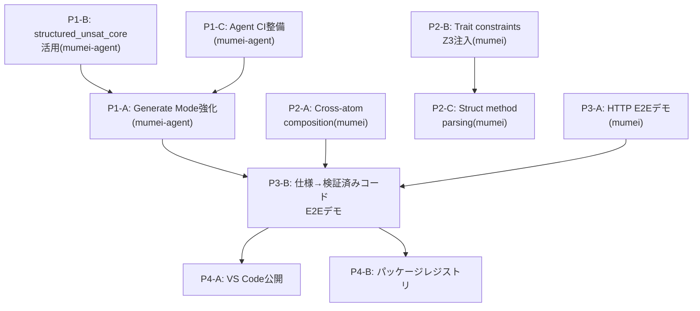

# Cross-Project Roadmap — mumei + mumei-agent (2026-03 〜)

> mumei エコシステム全体の次期ロードマップ。mumei の思想（proof-first / AI生成コード → 検証済み資産への変換）に沿って優先度を設定。

## 現状サマリ

**mumei (コンパイラ)**: P1〜P3の戦略ロードマップ、Plan 1〜24すべて実装済み。エフェクトシステム、MIR、temporal verification、modular verification、LSP completion/definitionまで到達。

**mumei-agent**: mumeiリポジトリから分離直後（PR #90）。single/multi-stage strategy、retry history、generate mode、metricsが実装済み。ただしまだ初期段階。

---

## Priority 1: mumei-agent の実用化（"AI → 検証済み資産" パイプラインの完成）

mumeiの根幹思想は「AIが生成した不確実なコードを検証済みの信頼できる資産に変換する」こと。

現在のmumei-agentは **fix（修正）** に特化しているが、**generate（生成）** モードが追加されたばかりで、まだ「自然言語仕様 → 検証済みコード」のフルパイプラインが未完成。

### P1-A: Generate Mode の強化

**Repository**: `mumei-lang/mumei-agent`

現在の `generate_code` は基本的なコード生成のみ。以下を追加すべき:

- **仕様からの atom 生成**: 自然言語で `requires`/`ensures` を記述 → LLMが `atom` を生成 → `mumei verify --json` で検証 → 失敗時は self-healing ループへ
- **`mumei infer-contracts`/`mumei infer-effects` との統合**: 生成前にエフェクト推論を実行し、LLMプロンプトに注入
- **テンプレートベースの生成**: `atom` のスケルトン（requires/ensures/body）をLLMに埋めさせる形式で、hallucination を抑制

### P1-B: structured_unsat_core の活用

**Repository**: `mumei-lang/mumei-agent`

mumei側で最近追加された `structured_unsat_core`（PR #97）をagent側で消費する:

- `report.json` の `structured_unsat_core` フィールドをパースし、LLMプロンプトに「どの制約が矛盾しているか」を具体的に伝える
- 現在のプロンプトテンプレート群（`agent/prompts/`）を拡張し、unsat core 情報を活用

### P1-C: E2E テスト・CI の整備

**Repository**: `mumei-lang/mumei-agent`

- GitHub Actions で `pytest` を実行するCI
- mumei バイナリのモック or 実バイナリを使ったインテグレーションテスト
- 各 violation type（precondition, effect_mismatch, temporal_effect 等）に対する修正成功率の回帰テスト

---

## Priority 2: mumei コンパイラの検証能力深化

mumeiの差別化は「Z3による完全自動検証」。この強みをさらに深める。

### P2-A: Cross-atom contract composition（呼び出し元での契約合成） ✅ Implemented

**Repository**: `mumei-lang/mumei`

- ✅ `analyze_temporal_effects_with_contracts()` in `mumei-core/src/mir_analysis.rs`: forward dataflow analysis verifies callee `effect_pre` against caller's current temporal state and applies `effect_post` as state transition
- ✅ `AtomEffectContract` struct mapping effect names to (pre_state, post_state) pairs
- ✅ `TemporalOp` enum distinguishing `Perform` and `Call` operations
- ✅ `mumei-core/src/verification.rs` builds `callee_contracts` map from `ModuleEnv` and passes to analysis
- ✅ 5 unit tests: valid composition, invalid order, no contracts, chained A→B→C, effect_post available to caller
- ✅ E2E tests: `tests/test_modular_verification.mm`, `tests/test_modular_verification_error.mm`, `tests/test_cross_atom_chain.mm`

### P2-B: Trait method constraints の Z3 注入 ✅ Implemented

**Repository**: `mumei-lang/mumei`

- ✅ `TraitMethod.param_constraints` injected into Z3 at both `verify_impl` (law verification) and inter-atom call sites
- ✅ Naive `.replace("v", ...)` replaced with word-boundary-aware `replace_constraint_placeholder()` using `\bv\b` regex
- ✅ `method_trait_index: HashMap<String, Vec<(String, usize)>>` added to `ModuleEnv` for deterministic method→trait lookup
- ✅ `get_traits_for_method()` returns all candidates; callers use `find_impl()` to disambiguate
- ✅ `infer_requires` callee argument substitution with simultaneous placeholder-based replacement
- ✅ `collect_callees_with_args_expr/stmt` and `expr_to_source_string` helpers added
- ✅ `check_contract_subsumption()`: when `atom_ref(concrete)` is passed to a `contract(f)` parameter, verifies that concrete ensures implies contract ensures (warning, not hard error)
- ✅ Unit tests for all items (replace_constraint_placeholder, method_trait_index, infer_requires substitution, subsumption check)

### P2-C: Struct method parsing（`impl Struct { atom ... }` 構文） ✅ Implemented

**Repository**: `mumei-lang/mumei`

- ~~`StructDef.method_names` は存在するが、`impl Stack { atom push(...) }` 構文のパーサーが未実装~~
- ~~OOP的なメソッド呼び出し `stack.push(x)` を可能にし、実用的なデータ構造定義を支援~~
- ✅ `ImplBlock` AST node added (`Item::ImplBlock` variant)
- ✅ `impl StructName { atom method(...) ... }` syntax parsing implemented
- ✅ Methods registered in `ModuleEnv` with qualified names (`StructName::method_name`)
- ✅ Handled in all match arms (`main.rs`, `resolver.rs`, `lsp.rs`, `cmd_build`, `cmd_check`, REPL)

### Verified FFI Layer ✅ Implemented

**Repository**: `mumei-lang/mumei`

- ✅ `ExternFn` extended with optional `requires`/`ensures` fields
- ✅ Extern function contracts propagated to `Atom` registration (no more hardcoded `"true"`)
- ✅ Contracts verified at call sites by Z3 (callers must satisfy `requires`)
- ✅ Backward compatible: omitted contracts default to `"true"`

---

## Priority 3: 実世界ユースケースの証明（"Proof of Concept → Proof of Value"）

mumeiの思想を体現する実践的なデモが不足している。

### P3-A: 実行可能な HTTP API スクリプトの E2E デモ ✅ Demo Ready

**Repository**: `mumei-lang/mumei`

- ~~`examples/http_demo.mm` を実際にビルド・実行し、HTTP レスポンスを取得するデモ~~
- ~~FFI バックエンド（`reqwest`）が実際にリンク・動作することの検証~~
- ✅ `examples/http_e2e_demo.mm` — Verified HTTP client demo with:
  - Safe/unsafe URL handling (Z3 catches unconstrained inputs)
  - JSON parse pipeline with contract propagation
  - Multi-user fetch composition with verified contracts

### P3-B: mumei-agent による「仕様 → 検証済みAPI クライアント」デモ

**Repository**: `mumei-lang/mumei-agent`

mumeiの思想の究極的な体現:

1. 自然言語で「GitHub API からユーザー情報を取得し、名前を返す」と指示
2. mumei-agent が `atom` を生成（`effects: [SecureHttpGet]`, `requires`/`ensures` 付き）
3. `mumei verify` で検証
4. 失敗時は self-healing ループで自動修正
5. 検証通過後、LLVM IR にコンパイル（ネイティブバイナリ生成）し FFI 経由で利用

### P3-C: Capability Security の実践デモ ✅ Demo Ready

**Repository**: `mumei-lang/mumei`

- ~~`SecurityPolicy` を使って「このagentは `/tmp/` 以下のファイルのみ読み書き可能」を強制するデモ~~
- ~~mumei-agent が生成したコードが capability boundary を超えた場合に自動的にリジェクトされるフロー~~
- ✅ `examples/capability_demo.mm` — Comprehensive capability security demo with:
  - `SafeFileRead`: `/tmp/` path restriction + traversal prevention
  - `SafeFileWrite`: `/tmp/output/` write restriction
  - `SecureHttpGet`: HTTPS-only URL enforcement
  - Sandboxed pipeline composing all three capabilities
  - Three unsafe examples that Z3 rejects at compile time (passwd read, path traversal, plain HTTP)

---

## Emitter Plugin Architecture (コード生成プラグイン構造)

mumei のコード生成バックエンドをプラグイン化し、LLVM IR 以外のターゲットへの出力を可能にするアーキテクチャ。

### Phase 1 (Current — PR scope) ✅ Implemented

- `Emitter` trait と enum ベースの静的ディスパッチを mumei core に追加
- 既存の `codegen::compile()` (LLVM IR バックエンド) を `LlvmEmitter` としてトレイトを実装
- `CHeaderEmitter` を第2のエミッターとして追加 — 検証済み `HirAtom` から `.h` ヘッダファイルを生成
- `mumei build` コマンドに `--emit` CLI フラグを追加（値: `llvm-ir` (デフォルト), `c-header`）
- すべてのエミッターは mumei バイナリクレート内で `pub(crate)` のまま
- ワークスペース再構成は不要
- ✅ `Artifact` 抽象化: `Emitter` trait の戻り値を `MumeiResult<Vec<Artifact>>` に変更。`Artifact` 構造体（`name`, `data`, `kind`）と `ArtifactKind` enum (`Binary`, `Source`, `Header`) を追加。ファイル書き出しを `cmd_build` 側に移動
- ✅ `CHeaderEmitter` の Doxygen 形式強化: `/* requires: ... */` → `/** @pre ... */`, `/* ensures: ... */` → `/** @post ... */`, `@brief` コメント自動生成
- ✅ 型マッピング拡充: `i32` → `int32_t`, `u32` → `uint32_t`, `f32` → `float`

### Phase 2 (Future — 3+ emitters exist 時) ✅ Implemented

- ✅ `mumei-core` 共有クレートを抽出: `HirAtom`, `ModuleEnv`, `Emitter` trait, 関連型を含む
- ✅ リポジトリを Cargo ワークスペース構造に変換 (`mumei-core`, `mumei-emit-llvm`, `mumei-cli`)
- ✅ `Emitter` trait とコア型を `pub` にし、外部クレートがエミッターを実装可能にする
- ✅ 外部プラグインリポジトリ (例: `mumei-emit-wasm`) が可能になる
- ✅ `VerifiedJsonEmitter` を第3のエミッターとして追加 (`--emit verified-json`)
- ✅ `ProofBookEmitter` を第4のエミッターとして追加 (`--emit proof-book`) — 検証済み Atom から人間可読な Markdown 証明書ドキュメントを生成

### Phase 3 (Future — ecosystem growth)

- 動的プラグインローディングまたはレジストリベースのエミッター検出
- `mumei add --emitter wasm` スタイルの CLI で外部エミッターをインストール
- Wasm ターゲット（現在保留中）を外部プラグインとして core に触れずに追加可能

### Design Decisions

- **プラグイン境界**: `HirAtom` + `ModuleEnv` + `ExternBlock[]` (LLVM 非依存のデータ構造)
- **将来の境界**: MIR (`MirBody`) が MIR ベースの codegen 実装後にプラグイン境界となる可能性
- **静的ディスパッチ**: 安全性のため enum ベースのディスパッチを動的ディスパッチ (trait objects / .so loading) より優先
- **Wasm 出力**: 意図的に延期; プラグインアーキテクチャにより core を変更せずに後から追加可能

---

## Priority 5: Verified Asset Distribution（検証済み資産の配布）

mumeiの「検証済みコード」を安全にパッケージ化・配布・消費するためのインフラストラクチャ。

### P5-A: Proof Certificate Chain ✅ Implemented

**Repository**: `mumei-lang/mumei`

- ✅ `AtomCertificate` extended with `proof_hash`, `dependencies`, `effects`, `requires`, `ensures`
- ✅ `ProofCertificate` extended with `package_name`, `package_version`, `certificate_hash`, `all_verified`
- ✅ `generate_certificate()` accepts `ModuleEnv` parameter — fills proof_hash via `compute_proof_hash()`, dependencies from `dependency_graph`, effects/contracts from atom fields
- ✅ `EmitTarget::ProofCert` variant added — `--emit proof-cert` generates `.proof-cert.json`
- ✅ `mumei verify-cert <path>` CLI command — loads cert, verifies against source, prints per-atom status
- ✅ `compute_sha256()` utility in `proof_cert.rs` for certificate hash computation
- ✅ Unit tests: extended fields, change detection, hash determinism, SHA-256 utility, all_verified flag, JSON roundtrip

### P5-B: Package Registry Certificate Integration ✅ Implemented

**Repository**: `mumei-lang/mumei`

- ✅ `VersionEntry` extended with `cert_path: Option<String>` and `cert_hash: Option<String>` (backward compatible via `#[serde(default)]`)
- ✅ `register_with_cert()` function stores certificate metadata in registry
- ✅ `cmd_publish` generates proof certificate and registers with cert_path/cert_hash
- ✅ `cmd_add` verifies proof certificate when resolving packages from registry
- ✅ Unit tests: serialization with cert fields, backward compatibility, skip_serializing_if None

### P5-C: Verified Import ✅ Implemented

**Repository**: `mumei-lang/mumei`

- ✅ `resolve_imports_recursive()` checks `.proof-cert.json` for imported modules — proven atoms get `mark_verified()`, changed/unproven atoms get warnings
- ✅ `resolve_manifest_dependencies()` applies cert verification to path, git, and registry dependencies
- ✅ `--strict-imports` CLI flag for `verify` and `build` commands — missing/invalid certs become hard errors
- ✅ Taint integration: unverified imported atoms registered with `TrustLevel::Unverified` via `set_trust_level()`
- ✅ `mark_dependency_atoms_with_cert()` helper consolidates cert verification logic for all dependency types
- ✅ Unit tests: check_cert_for_atom (proven/changed/unproven/missing), mark_dependency_atoms_with_cert (verified/unverified/legacy), ResolverContext strict_imports

---

## Priority 4: エコシステム・DX の成熟

### P4-A: VS Code Extension の Marketplace 公開

**Repository**: `mumei-lang/mumei`

LSP は completion/definition まで実装済み。公開すれば採用障壁が大幅に下がる。

### P4-B: パッケージレジストリの実用化

**Repository**: `mumei-lang/mumei`

`mumei publish` / `mumei add` コマンドは存在するが、レジストリの実体が不明。

- ローカルレジストリ or GitHub-based レジストリの実装
- `mumei.toml` の依存関係解決の実動作確認

### P4-C: REPL の実行エンジン

**Repository**: `mumei-lang/mumei`

- `inc(5)` → `= 6` のような即時評価
- HTTP リクエストの REPL 内実行

---

## 優先度マトリクス

| 優先度 | 項目 | リポジトリ | 思想との整合性 | 実用的インパクト |
|--------|------|-----------|---------------|----------------|
| **最高** | P1-A: Generate Mode 強化 | mumei-agent | ★★★ AI→検証済み資産の核心 | ★★★ |
| **最高** | P1-B: structured_unsat_core 活用 | mumei-agent | ★★★ 検証フィードバックの精度向上 | ★★☆ |
| **高** | P1-C: Agent CI/テスト整備 | mumei-agent | ★★☆ 品質保証 | ★★★ |
| **高** | P2-A: Cross-atom composition | mumei | ★★★ モジュラー検証の完成 | ★★☆ |
| **中** | P2-B: Trait constraints Z3注入 | mumei | ★★☆ 型安全性の深化 | ★★☆ |
| **中** | P2-C: Struct method parsing | mumei | ★☆☆ 利便性 | ★★☆ |
| **中** | P3-A/B: 実世界E2Eデモ | 両方 | ★★★ 思想の証明 | ★★★ |
| **中** | Emitter Plugin Architecture | mumei | ★★☆ 拡張性・多ターゲット対応 | ★★☆ |
| **低** | P4-A: VS Code公開 | mumei | ★☆☆ DX | ★★☆ |
| **低** | P4-B: パッケージレジストリ | mumei | ★☆☆ エコシステム | ★☆☆ |

## 推奨実行順序

**最初に着手すべきは P1-C → P1-B → P1-A の順**。mumei-agent のテスト基盤を固め、structured_unsat_core を活用してプロンプト精度を上げ、その上で Generate Mode を強化する。並行して mumei 側では P2-A（cross-atom composition）を進める。これらが揃った時点で P3-B の「仕様 → 検証済みコード」E2E デモが実現可能になり、mumei の思想を最も強力に体現するショーケースとなる。

---

## Related Documents

- [`docs/ROADMAP.md`](ROADMAP.md) — mumei compiler strategic roadmap (P1-P3, Plans 1-24)
- [`docs/SESSION_PLANS.md`](SESSION_PLANS.md) — Detailed session plans for compiler phases
- [mumei-agent `docs/ROADMAP.md`](https://github.com/mumei-lang/mumei-agent/blob/develop/docs/ROADMAP.md) — Agent-specific roadmap
- [`instruction.md`](../instruction.md) — Development guidelines and priorities
