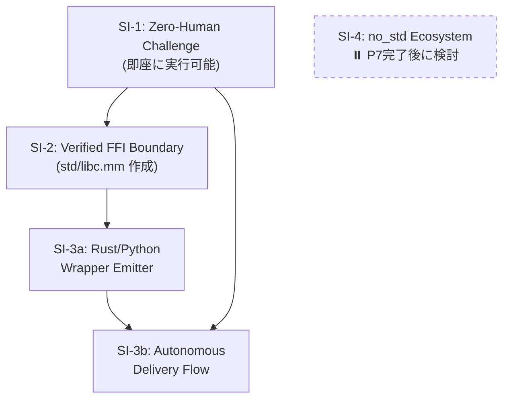
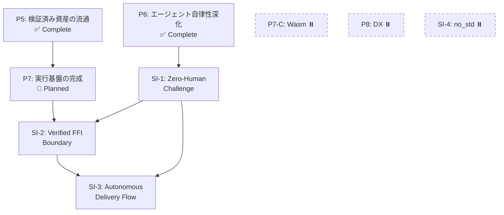

# Cross-Project Roadmap — mumei + mumei-agent (2026-03 〜)

> mumei エコシステム全体の次期ロードマップ。mumei の思想（proof-first / AI生成コード → 検証済み資産への変換）に沿って優先度を設定。

## 現状サマリ

**mumei (コンパイラ)**: P1〜P3の戦略ロードマップ、Plan 1〜24すべて実装済み。エフェクトシステム、MIR、temporal verification、modular verification、LSP completion/definitionまで到達。

**mumei-agent**: mumeiリポジトリから分離直後（PR #90）。single/multi-stage strategy、retry history、generate mode、metricsが実装済み。ただしまだ初期段階。

---

## Priority 1: mumei-agent の実用化（"AI → 検証済み資産" パイプラインの完成）

mumeiの根幹思想は「AIが生成した不確実なコードを検証済みの信頼できる資産に変換する」こと。

現在のmumei-agentは **fix（修正）** に特化しているが、**generate（生成）** モードが追加されたばかりで、まだ「自然言語仕様 → 検証済みコード」のフルパイプラインが未完成。

### P1-A: Generate Mode の強化

**Repository**: `mumei-lang/mumei-agent`

現在の `generate_code` は基本的なコード生成のみ。以下を追加すべき:

- **仕様からの atom 生成**: 自然言語で `requires`/`ensures` を記述 → LLMが `atom` を生成 → `mumei verify --json` で検証 → 失敗時は self-healing ループへ
- **`mumei infer-contracts`/`mumei infer-effects` との統合**: 生成前にエフェクト推論を実行し、LLMプロンプトに注入
- **テンプレートベースの生成**: `atom` のスケルトン（requires/ensures/body）をLLMに埋めさせる形式で、hallucination を抑制

### P1-B: structured_unsat_core の活用

**Repository**: `mumei-lang/mumei-agent`

mumei側で最近追加された `structured_unsat_core`（PR #97）をagent側で消費する:

- `report.json` の `structured_unsat_core` フィールドをパースし、LLMプロンプトに「どの制約が矛盾しているか」を具体的に伝える
- 現在のプロンプトテンプレート群（`agent/prompts/`）を拡張し、unsat core 情報を活用

### P1-C: E2E テスト・CI の整備

**Repository**: `mumei-lang/mumei-agent`

- GitHub Actions で `pytest` を実行するCI
- mumei バイナリのモック or 実バイナリを使ったインテグレーションテスト
- 各 violation type（precondition, effect_mismatch, temporal_effect 等）に対する修正成功率の回帰テスト

---

## Priority 2: mumei コンパイラの検証能力深化

mumeiの差別化は「Z3による完全自動検証」。この強みをさらに深める。

### P2-A: Cross-atom contract composition（呼び出し元での契約合成） ✅ Implemented

**Repository**: `mumei-lang/mumei`

- ✅ `analyze_temporal_effects_with_contracts()` in `mumei-core/src/mir_analysis.rs`: forward dataflow analysis verifies callee `effect_pre` against caller's current temporal state and applies `effect_post` as state transition
- ✅ `AtomEffectContract` struct mapping effect names to (pre_state, post_state) pairs
- ✅ `TemporalOp` enum distinguishing `Perform` and `Call` operations
- ✅ `mumei-core/src/verification.rs` builds `callee_contracts` map from `ModuleEnv` and passes to analysis
- ✅ 5 unit tests: valid composition, invalid order, no contracts, chained A→B→C, effect_post available to caller
- ✅ E2E tests: `tests/test_modular_verification.mm`, `tests/test_modular_verification_error.mm`, `tests/test_cross_atom_chain.mm`

### P2-B: Trait method constraints の Z3 注入 ✅ Implemented

**Repository**: `mumei-lang/mumei`

- ✅ `TraitMethod.param_constraints` injected into Z3 at both `verify_impl` (law verification) and inter-atom call sites
- ✅ Naive `.replace("v", ...)` replaced with word-boundary-aware `replace_constraint_placeholder()` using `\bv\b` regex
- ✅ `method_trait_index: HashMap<String, Vec<(String, usize)>>` added to `ModuleEnv` for deterministic method→trait lookup
- ✅ `get_traits_for_method()` returns all candidates; callers use `find_impl()` to disambiguate
- ✅ `infer_requires` callee argument substitution with simultaneous placeholder-based replacement
- ✅ `collect_callees_with_args_expr/stmt` and `expr_to_source_string` helpers added
- ✅ `check_contract_subsumption()`: when `atom_ref(concrete)` is passed to a `contract(f)` parameter, verifies that concrete ensures implies contract ensures (warning, not hard error)
- ✅ Unit tests for all items (replace_constraint_placeholder, method_trait_index, infer_requires substitution, subsumption check)

### P2-C: Struct method parsing（`impl Struct { atom ... }` 構文） ✅ Implemented

**Repository**: `mumei-lang/mumei`

- ~~`StructDef.method_names` は存在するが、`impl Stack { atom push(...) }` 構文のパーサーが未実装~~
- ~~OOP的なメソッド呼び出し `stack.push(x)` を可能にし、実用的なデータ構造定義を支援~~
- ✅ `ImplBlock` AST node added (`Item::ImplBlock` variant)
- ✅ `impl StructName { atom method(...) ... }` syntax parsing implemented
- ✅ Methods registered in `ModuleEnv` with qualified names (`StructName::method_name`)
- ✅ Handled in all match arms (`main.rs`, `resolver.rs`, `lsp.rs`, `cmd_build`, `cmd_check`, REPL)

### Verified FFI Layer ✅ Implemented

**Repository**: `mumei-lang/mumei`

- ✅ `ExternFn` extended with optional `requires`/`ensures` fields
- ✅ Extern function contracts propagated to `Atom` registration (no more hardcoded `"true"`)
- ✅ Contracts verified at call sites by Z3 (callers must satisfy `requires`)
- ✅ Backward compatible: omitted contracts default to `"true"`

---

## Priority 3: 実世界ユースケースの証明（"Proof of Concept → Proof of Value"）

mumeiの思想を体現する実践的なデモが不足している。

### P3-A: 実行可能な HTTP API スクリプトの E2E デモ ✅ Demo Ready

**Repository**: `mumei-lang/mumei`

- ~~`examples/http_demo.mm` を実際にビルド・実行し、HTTP レスポンスを取得するデモ~~
- ~~FFI バックエンド（`reqwest`）が実際にリンク・動作することの検証~~
- ✅ `examples/http_e2e_demo.mm` — Verified HTTP client demo with:
  - Safe/unsafe URL handling (Z3 catches unconstrained inputs)
  - JSON parse pipeline with contract propagation
  - Multi-user fetch composition with verified contracts

### P3-B: mumei-agent による「仕様 → 検証済みAPI クライアント」デモ

**Repository**: `mumei-lang/mumei-agent`

mumeiの思想の究極的な体現:

1. 自然言語で「GitHub API からユーザー情報を取得し、名前を返す」と指示
2. mumei-agent が `atom` を生成（`effects: [SecureHttpGet]`, `requires`/`ensures` 付き）
3. `mumei verify` で検証
4. 失敗時は self-healing ループで自動修正
5. 検証通過後、LLVM IR にコンパイル（ネイティブバイナリ生成）し FFI 経由で利用

### P3-C: Capability Security の実践デモ ✅ Demo Ready

**Repository**: `mumei-lang/mumei`

- ~~`SecurityPolicy` を使って「このagentは `/tmp/` 以下のファイルのみ読み書き可能」を強制するデモ~~
- ~~mumei-agent が生成したコードが capability boundary を超えた場合に自動的にリジェクトされるフロー~~
- ✅ `examples/capability_demo.mm` — Comprehensive capability security demo with:
  - `SafeFileRead`: `/tmp/` path restriction + traversal prevention
  - `SafeFileWrite`: `/tmp/output/` write restriction
  - `SecureHttpGet`: HTTPS-only URL enforcement
  - Sandboxed pipeline composing all three capabilities
  - Three unsafe examples that Z3 rejects at compile time (passwd read, path traversal, plain HTTP)

---

## Emitter Plugin Architecture (コード生成プラグイン構造)

mumei のコード生成バックエンドをプラグイン化し、LLVM IR 以外のターゲットへの出力を可能にするアーキテクチャ。

### Phase 1 (Current — PR scope) ✅ Implemented

- `Emitter` trait と enum ベースの静的ディスパッチを mumei core に追加
- 既存の `codegen::compile()` (LLVM IR バックエンド) を `LlvmEmitter` としてトレイトを実装
- `CHeaderEmitter` を第2のエミッターとして追加 — 検証済み `HirAtom` から `.h` ヘッダファイルを生成
- `mumei build` コマンドに `--emit` CLI フラグを追加（値: `llvm-ir` (デフォルト), `c-header`）
- すべてのエミッターは mumei バイナリクレート内で `pub(crate)` のまま
- ワークスペース再構成は不要
- ✅ `Artifact` 抽象化: `Emitter` trait の戻り値を `MumeiResult<Vec<Artifact>>` に変更。`Artifact` 構造体（`name`, `data`, `kind`）と `ArtifactKind` enum (`Binary`, `Source`, `Header`) を追加。ファイル書き出しを `cmd_build` 側に移動
- ✅ `CHeaderEmitter` の Doxygen 形式強化: `/* requires: ... */` → `/** @pre ... */`, `/* ensures: ... */` → `/** @post ... */`, `@brief` コメント自動生成
- ✅ 型マッピング拡充: `i32` → `int32_t`, `u32` → `uint32_t`, `f32` → `float`

### Phase 2 (Future — 3+ emitters exist 時) ✅ Implemented

- ✅ `mumei-core` 共有クレートを抽出: `HirAtom`, `ModuleEnv`, `Emitter` trait, 関連型を含む
- ✅ リポジトリを Cargo ワークスペース構造に変換 (`mumei-core`, `mumei-emit-llvm`, `mumei-cli`)
- ✅ `Emitter` trait とコア型を `pub` にし、外部クレートがエミッターを実装可能にする
- ✅ 外部プラグインリポジトリ (例: `mumei-emit-wasm`) が可能になる
- ✅ `VerifiedJsonEmitter` を第3のエミッターとして追加 (`--emit verified-json`)
- ✅ `ProofBookEmitter` を第4のエミッターとして追加 (`--emit proof-book`) — 検証済み Atom から人間可読な Markdown 証明書ドキュメントを生成

### Phase 3 (Future — ecosystem growth)

- 動的プラグインローディングまたはレジストリベースのエミッター検出
- `mumei add --emitter wasm` スタイルの CLI で外部エミッターをインストール
- Wasm ターゲット（現在保留中）を外部プラグインとして core に触れずに追加可能

### Design Decisions

- **プラグイン境界**: `HirAtom` + `ModuleEnv` + `ExternBlock[]` (LLVM 非依存のデータ構造)
- **将来の境界**: MIR (`MirBody`) が MIR ベースの codegen 実装後にプラグイン境界となる可能性
- **静的ディスパッチ**: 安全性のため enum ベースのディスパッチを動的ディスパッチ (trait objects / .so loading) より優先
- **Wasm 出力**: 意図的に延期; プラグインアーキテクチャにより core を変更せずに後から追加可能

---

## Priority 5: 検証済み資産の流通基盤 (Verified Asset Distribution) ✅ Implemented

mumeiの思想「AI生成コード → 検証済み資産への変換」の次段階。検証済み資産を流通・消費できるエコシステムの構築。

### P5-A: Proof Certificate Chain（証明書チェーン） ✅ Implemented

**Repository**: `mumei-lang/mumei`

- ✅ `AtomCertificate` 拡張: `proof_hash`, `dependencies`, `effects`, `requires`, `ensures` フィールド追加
- ✅ `ProofCertificate` 拡張: `package_name`, `package_version`, `certificate_hash`, `all_verified` フィールド追加
- ✅ `generate_certificate()` が `ModuleEnv` を活用して推移的ハッシュ・依存関係グラフを埋める
- ✅ `mumei verify-cert <path>` CLI コマンド: 証明書の整合性検証
- ✅ `--emit proof-cert` フラグ: `.proof-cert.json` 出力

### P5-B: パッケージレジストリの実装 ✅ Implemented

**Repository**: `mumei-lang/mumei`

- ✅ `VersionEntry` 拡張: `cert_path`, `cert_hash` フィールド追加
- ✅ `mumei publish`: 検証 → 証明書自動生成 → レジストリ登録
- ✅ `mumei add`: レジストリ解決 → 証明書検証 → `mumei.toml` 自動追記

### P5-C: Verified Import（検証済みインポート） ✅ Implemented

**Repository**: `mumei-lang/mumei`

- ✅ インポート時の `.proof-cert.json` 自動検証
- ✅ 証明書なし/期限切れのインポートは taint analysis 対象
- ✅ `--strict-imports` フラグ: 証明書なしインポートをハードエラーに

---

## Priority 6: エージェントの自律性深化 (Agent Autonomy Deepening) ✅ Implemented

### P6-A: Multi-atom / Multi-file 生成 ✅ Implemented

**Repository**: `mumei-lang/mumei-agent`

- ✅ Multi-atom spec JSON フォーマット (`atoms: [...]` 配列)
- ✅ `generate_multi_atom()`: 依存関係検出・ソート・一括生成・atom 単位 retry
- ✅ 既存 single-atom spec との後方互換性維持

### P6-B: Pattern Library の学習型拡張 ✅ Implemented

**Repository**: `mumei-lang/mumei-agent`

- ✅ `FixPattern` に `applied_count` / `success_count` フィールド追加
- ✅ `try_pattern_fix()`: 成功率ベースのパターン自動適用（LLM バイパス）
- ✅ `lookup()` の成功率ランキング
- ✅ `Metrics` に `pattern_attempts` / `pattern_successes` 追加

### P6-C: Specification Refinement Loop ✅ Implemented

**Repository**: `mumei-lang/mumei-agent`

- ✅ `spec_refinement.py`: 検証失敗時に仕様（requires/ensures）自体の修正を提案
- ✅ `RetryHistory.is_same_error_repeating()` トリガーで仕様洗練モードに切り替え
- ✅ `mumei infer-contracts` 結果を活用した仕様推論

---

## Priority 7: 実行基盤の完成 (Runtime Completion)

### P7-A: REPL 実行エンジン

**Repository**: `mumei-lang/mumei`

inkwell の ExecutionEngine (MCJIT) を使用した JIT 実行:

- `inc(5)` → `= 6` のような即時評価
- atom 定義 → JIT コンパイル → 式評価の連続フロー
- FFI 関数（`json_parse`, `http_get` 等）の JIT 内シンボル解決
- `mumei-emit-llvm/src/jit.rs` に `JitEngine` / `compile_to_module()` を追加
- `cmd_repl()` に `ReplContext` 構造体を導入

### P7-B: End-to-End バイナリ実行

**Repository**: `mumei-lang/mumei`

- `mumei run src/main.mm` コマンド: verify → codegen → link → execute を一括実行
- `--emit binary` フラグ: 全 atom を単一 LLVM Module にコンパイル → `clang` でリンク → 実行可能バイナリ
- `atom main()` をエントリポイントとして C の `main` にエクスポート
- ランタイムライブラリ: `@__mumei_resource_{name}` mutex / `@__effect_{name}` ハンドラのスタブ

### P7-C: Wasm ターゲット — ⏸️ Deferred

**Repository**: `mumei-lang/mumei`

**意図的に保留**。Emitter Plugin Architecture (Phase 3) により、`mumei-emit-wasm` を外部プラグインとして core に触れずに後から追加可能。P7-A/P7-B の実行基盤が安定した後に検討する。

---

## Priority 8: DX の成熟 (Developer Experience) — ⏸️ Deferred

P7 完了後に着手。

### P8-A: VS Code Extension の Marketplace 公開

LSP は completion/definition まで実装済み。公開すれば採用障壁が大幅に下がる。

### P8-B: Counter-example Visualizer in Editor

LSP の `relatedInformation` を活用し、Z3 counter-example をエディタ内でインライン表示。

---

## Strategic Initiatives: 「信頼のインフラ」への道筋

> mumei は「あらゆる言語、プラットフォーム、そして AI エージェントに対して『数学的真理』を供給するインフラ」という独自の頂点を目指す。以下は、その実現に向けた戦略的イニシアチブの評価と推奨順序。

### SI-1: Zero-Human Challenge（自律性の証明）— 推奨度: 最高

**目的**: mumei-agent に難易度の高い課題を与え、人間が一切介入せずに検証をパスするまでのログを公開する。

**思想との整合性: ★★★** — mumei の根幹思想「AI生成コード → 検証済み資産への変換」の直接的な証明。

**既存インフラ**: ほぼ完備
- mumei-agent の generate mode + self-healing loop + pattern library + retry history
- `mumei verify --json` による構造化フィードバック
- P6-A (Multi-atom 生成) による複数 atom モジュール生成

**推奨課題**:
- **100% 安全なキュー**: `enqueue`/`dequeue` の overflow/underflow 防止（`std/container/bounded_array.mm` の `bounded_push`/`bounded_pop` と同等の難易度）
- **Verified JSON validator**: FFI + capability security の組み合わせ
- **Deadlock-free producer-consumer**: resource hierarchy による deadlock-free 証明

**追加実装**: ほぼゼロ。spec JSON を書いて実行し、ログを記録するだけ。

**成果物**:
- `examples/challenges/` ディレクトリに課題 spec + 生成ログ + 最終検証済みコード
- `docs/ZERO_HUMAN_CHALLENGE.md` にチャレンジ結果のドキュメント

---

### SI-2: Verified FFI Boundary（安全でない関数を安全に使う）— ✅ Implemented

**目的**: C 標準ライブラリ（`memcpy`, `strlen`, `malloc` 等）を mumei から呼ぶ際、厳格な事前条件を課した検証済みラッパーを量産する。

**思想との整合性: ★★★** — mumei の Verified FFI Contracts (`extern "C"` + `requires`/`ensures`) の実践的活用。

**既存インフラ**: 完備
- `extern "C"` ブロックに `requires`/`ensures` 契約を付与し、Z3 が呼び出し元で検証する仕組みが実装済み
- `--emit c-header` で Doxygen `@pre`/`@post` 付き `.h` ファイルを自動生成
- ExternFn → trusted atom への自動変換が実装済み

**実装内容**:
- ✅ `std/libc.mm` モジュールを新規作成
- ✅ `memcpy`, `memmove`, `memset`, `strlen`, `malloc`, `free`, `calloc`, `realloc`, `snprintf` の検証済みラッパー（9関数）
- ✅ 各ラッパーに現実的な `requires`/`ensures` 契約（例: `memcpy` の `requires: n >= 0 && dst_size >= n && src_size >= n`）
- ✅ `tests/test_libc_contracts.mm` / `tests/test_libc.mm` による呼び出し元検証テスト
- ✅ `tests/test_libc_contracts_error.mm` / `tests/test_libc_error.mm` による契約違反テスト
- ✅ `examples/libc_demo.mm` — メモリ確保→使用→解放パイプライン + 安全/不安全呼び出しデモ
- ✅ `--emit c-header` で生成される `.h` を C プロジェクトが直接利用可能（Doxygen `@pre`/`@post` 付き）

**追加実装**: コンパイラ側の変更は不要。`std/libc.mm` の作成のみ。

---

### Phase 3: Verified Microservice Demo — ✅ Implemented

**目的**: 検証済み支払いロジック + RBAC を実装し、Python FFI 経由で呼び出すデモを提供する。

**実装内容**:
- ✅ `examples/verified_microservice/payment.mm` — `calc_subtotal`, `calc_tax`, `calc_total` atoms
- ✅ `examples/verified_microservice/rbac.mm` — capability security による RBAC 検証
- ✅ `examples/verified_microservice/demo_ffi.py` — Python ctypes FFI デモ
- ✅ `examples/verified_microservice/build.sh` — verify → emit c-header ビルドスクリプト
- ✅ `examples/verified_microservice/README.md` — "logic fortress" パターンのドキュメント

**パターン**: 「logic fortress」— ビジネスロジックを mumei で形式検証し、FFI 経由で任意の言語から呼び出す。

---

### SI-3: Autonomous Delivery Flow（完全自律型デリバリー）— ✅ Implemented

**目的**: mumei-agent が mumei コードを書く → 検証 → Rust/Python ラッパーを自動生成 → PR を出す、完全自律パイプライン。

**思想との整合性: ★★★** — 「生成 → 検証 → 流通」パイプラインの完成形。

**実装内容**:

| 必要な機能 | 状態 |
|-----------|------|
| mumei コード生成 + 検証 | ✅ generate mode + self-healing |
| C ラッパー生成 | ✅ `--emit c-header` |
| Rust ラッパー生成 | ✅ `--emit rust-wrapper` (`mumei-emit-rust` crate) |
| Python ラッパー生成 | ✅ `--emit python-wrapper` (`mumei-emit-python` crate) |
| PR 自動作成 | ✅ `--publish` モード (mumei-agent) |

**重要**: `RustWrapperEmitter` / `PythonWrapperEmitter` は **トランスパイラではない**。
コンパイル済み mumei バイナリ（`.so`/`.dll`）を FFI 経由で安全に呼び出すためのグルーコードを生成するもの。
`CHeaderEmitter` と同じレイヤー。

**実現ステップ**:
1. ✅ `RustWrapperEmitter` + `PythonWrapperEmitter` を emitter plugin として追加（`CHeaderEmitter` パターンを踏襲）
2. ✅ mumei-agent に `--publish` モードを追加（生成 → 検証 → ラッパー生成 → git commit → PR）
3. GitHub Actions で PR の CI テスト（Rust/Python からラッパーを呼び出し、契約が守られることを確認）

**前提条件**: SI-1 (Zero-Human Challenge) と SI-2 (Verified FFI Boundary) の完了

---

### SI-4: no_std Ecosystem（ベアメタル）— ⏸️ Deferred

**目的**: no_std 環境での動作を安定させ、マイコン等で「スタックオーバーフローが物理的に起きない」制御ソフトのデモを作る。

**思想との整合性: ★★☆** — 検証の価値は高いが、現在の mumei の強みはアプリケーションレベルの検証。

**保留理由**:
- ランタイムが `reqwest`, `serde_json`, `pthread` に依存しており、no_std 化には大幅な再設計が必要
- std ライブラリ（Vector, HashMap, JSON, HTTP）がすべて allocator 前提
- 静的スタックサイズ解析が未実装
- P7（実行基盤の完成）が完了し、リンカーパイプラインが安定した後に検討すべき

---

### Strategic Initiatives 推奨実行順序

| 順序 | イニシアチブ | 理由 |
|------|------------|------|
| **1** | SI-1: Zero-Human Challenge | 追加実装ゼロ。mumei の思想を最も直接的に証明。マーケティング効果大 |
| **2** | SI-2: Verified FFI Boundary | `std/libc.mm` の作成のみ。C header emitter との相乗効果。実用的価値が高い |
| **3** | SI-3: Autonomous Delivery Flow | Rust/Python emitter の追加が必要だが、既存の `CHeaderEmitter` パターンを踏襲可能 |
| **保留** | SI-4: no_std Ecosystem | P7 完了後。ランタイム・リンカー・std の大幅な再設計が必要 |

---

## 優先度マトリクス（更新版）

| 優先度 | 項目 | リポジトリ | 状態 |
|--------|------|-----------|------|
| ~~最高~~ | P1-A/B/C: Agent 実用化 | mumei-agent | ✅ Complete |
| ~~高~~ | P2-A/B/C: 検証能力深化 | mumei | ✅ Complete |
| ~~中~~ | P3-A/B/C: 実世界デモ | 両方 | ✅ Complete |
| ~~中~~ | Emitter Plugin Phase 1-2 | mumei | ✅ Complete |
| ~~最高~~ | P5-A/B/C: 検証済み資産の流通 | mumei | ✅ Complete |
| ~~最高~~ | P6-A/B/C: エージェント自律性深化 | mumei-agent | ✅ Complete |
| **高** | P7-A: REPL 実行エンジン | mumei | 🔧 Planned |
| **高** | P7-B: E2E バイナリ実行 | mumei | 🔧 Planned |
| **高** | SI-1: Zero-Human Challenge | mumei-agent | 📋 Next |
| **高** | SI-2: Verified FFI Boundary | mumei | ✅ Implemented |
| **中** | SI-3: Autonomous Delivery Flow | 両方 | 🔧 In Progress |
| ⏸️ | P7-C: Wasm ターゲット | mumei | Deferred |
| ⏸️ | P8-A/B: DX の成熟 | mumei | Deferred |
| ⏸️ | SI-4: no_std Ecosystem | mumei | Deferred |

## 推奨実行順序

---

## Related Documents

- [`docs/ROADMAP.md`](ROADMAP.md) — mumei compiler strategic roadmap (P1-P3, Plans 1-24)
- [`docs/SESSION_PLANS.md`](SESSION_PLANS.md) — Detailed session plans for compiler phases
- [mumei-agent `docs/ROADMAP.md`](https://github.com/mumei-lang/mumei-agent/blob/develop/docs/ROADMAP.md) — Agent-specific roadmap
- [`instruction.md`](../instruction.md) — Development guidelines and priorities
- [`docs/ZERO_HUMAN_CHALLENGE.md`](ZERO_HUMAN_CHALLENGE.md) — Zero-Human Challenge results (planned)
