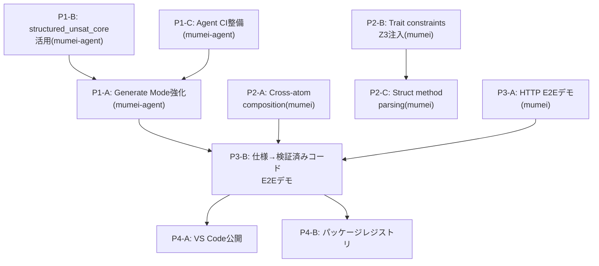

# Cross-Project Roadmap — mumei + mumei-agent (2026-03 〜)

> mumei エコシステム全体の次期ロードマップ。mumei の思想（proof-first / AI生成コード → 検証済み資産への変換）に沿って優先度を設定。

## 現状サマリ

**mumei (コンパイラ)**: P1〜P3の戦略ロードマップ、Plan 1〜24すべて実装済み。エフェクトシステム、MIR、temporal verification、modular verification、LSP completion/definitionまで到達。

**mumei-agent**: mumeiリポジトリから分離直後（PR #90）。single/multi-stage strategy、retry history、generate mode、metricsが実装済み。ただしまだ初期段階。

---

## Priority 1: mumei-agent の実用化（"AI → 検証済み資産" パイプラインの完成）

mumeiの根幹思想は「AIが生成した不確実なコードを検証済みの信頼できる資産に変換する」こと。

現在のmumei-agentは **fix（修正）** に特化しているが、**generate（生成）** モードが追加されたばかりで、まだ「自然言語仕様 → 検証済みコード」のフルパイプラインが未完成。

### P1-A: Generate Mode の強化

**Repository**: `mumei-lang/mumei-agent`

現在の `generate_code` は基本的なコード生成のみ。以下を追加すべき:

- **仕様からの atom 生成**: 自然言語で `requires`/`ensures` を記述 → LLMが `atom` を生成 → `mumei verify --json` で検証 → 失敗時は self-healing ループへ
- **`mumei infer-contracts`/`mumei infer-effects` との統合**: 生成前にエフェクト推論を実行し、LLMプロンプトに注入
- **テンプレートベースの生成**: `atom` のスケルトン（requires/ensures/body）をLLMに埋めさせる形式で、hallucination を抑制

### P1-B: structured_unsat_core の活用

**Repository**: `mumei-lang/mumei-agent`

mumei側で最近追加された `structured_unsat_core`（PR #97）をagent側で消費する:

- `report.json` の `structured_unsat_core` フィールドをパースし、LLMプロンプトに「どの制約が矛盾しているか」を具体的に伝える
- 現在のプロンプトテンプレート群（`agent/prompts/`）を拡張し、unsat core 情報を活用

### P1-C: E2E テスト・CI の整備

**Repository**: `mumei-lang/mumei-agent`

- GitHub Actions で `pytest` を実行するCI
- mumei バイナリのモック or 実バイナリを使ったインテグレーションテスト
- 各 violation type（precondition, effect_mismatch, temporal_effect 等）に対する修正成功率の回帰テスト

---

## Priority 2: mumei コンパイラの検証能力深化

mumeiの差別化は「Z3による完全自動検証」。この強みをさらに深める。

### P2-A: Cross-atom contract composition（呼び出し元での契約合成）

**Repository**: `mumei-lang/mumei`

Plan 24で明示的に「未実装」と記載されている:

> Cross-atom contract composition at call sites is not yet implemented (each atom verified independently)

`effect_pre`/`effect_post` を持つ atom を呼び出す側で、temporal state が正しく引き継がれることを検証する。これにより、モジュラー検証が真に実用的になる。

### P2-B: Trait method constraints の Z3 注入

**Repository**: `mumei-lang/mumei`

CHANGELOGで「pipeline integration pending」と記載:

- `TraitMethod.param_constraints` が `verify_impl` と inter-atom calls で Z3 に注入されていない
- `Numeric` trait の `div(a: Self, b: Self where v != 0)` が呼び出し元で自動的にチェックされるようにする

### P2-C: Struct method parsing（`impl Struct { atom ... }` 構文）

**Repository**: `mumei-lang/mumei`

- `StructDef.method_names` は存在するが、`impl Stack { atom push(...) }` 構文のパーサーが未実装
- OOP的なメソッド呼び出し `stack.push(x)` を可能にし、実用的なデータ構造定義を支援

---

## Priority 3: 実世界ユースケースの証明（"Proof of Concept → Proof of Value"）

mumeiの思想を体現する実践的なデモが不足している。

### P3-A: 実行可能な HTTP API スクリプトの E2E デモ ✅ Demo Ready

**Repository**: `mumei-lang/mumei`

- ~~`examples/http_demo.mm` を実際にビルド・実行し、HTTP レスポンスを取得するデモ~~
- ~~FFI バックエンド（`reqwest`）が実際にリンク・動作することの検証~~
- ✅ `examples/http_e2e_demo.mm` — Verified HTTP client demo with:
  - Safe/unsafe URL handling (Z3 catches unconstrained inputs)
  - JSON parse pipeline with contract propagation
  - Multi-user fetch composition with verified contracts

### P3-B: mumei-agent による「仕様 → 検証済みAPI クライアント」デモ

**Repository**: `mumei-lang/mumei-agent`

mumeiの思想の究極的な体現:

1. 自然言語で「GitHub API からユーザー情報を取得し、名前を返す」と指示
2. mumei-agent が `atom` を生成（`effects: [SecureHttpGet]`, `requires`/`ensures` 付き）
3. `mumei verify` で検証
4. 失敗時は self-healing ループで自動修正
5. 検証通過後、LLVM IR にコンパイル（ネイティブバイナリ生成）し FFI 経由で利用

### P3-C: Capability Security の実践デモ ✅ Demo Ready

**Repository**: `mumei-lang/mumei`

- ~~`SecurityPolicy` を使って「このagentは `/tmp/` 以下のファイルのみ読み書き可能」を強制するデモ~~
- ~~mumei-agent が生成したコードが capability boundary を超えた場合に自動的にリジェクトされるフロー~~
- ✅ `examples/capability_demo.mm` — Comprehensive capability security demo with:
  - `SafeFileRead`: `/tmp/` path restriction + traversal prevention
  - `SafeFileWrite`: `/tmp/output/` write restriction
  - `SecureHttpGet`: HTTPS-only URL enforcement
  - Sandboxed pipeline composing all three capabilities
  - Three unsafe examples that Z3 rejects at compile time (passwd read, path traversal, plain HTTP)

---

## Priority 4: エコシステム・DX の成熟

### P4-A: VS Code Extension の Marketplace 公開

**Repository**: `mumei-lang/mumei`

LSP は completion/definition まで実装済み。公開すれば採用障壁が大幅に下がる。

### P4-B: パッケージレジストリの実用化

**Repository**: `mumei-lang/mumei`

`mumei publish` / `mumei add` コマンドは存在するが、レジストリの実体が不明。

- ローカルレジストリ or GitHub-based レジストリの実装
- `mumei.toml` の依存関係解決の実動作確認

### P4-C: REPL の実行エンジン

**Repository**: `mumei-lang/mumei`

- `inc(5)` → `= 6` のような即時評価
- HTTP リクエストの REPL 内実行

---

## 優先度マトリクス

| 優先度 | 項目 | リポジトリ | 思想との整合性 | 実用的インパクト |
|--------|------|-----------|---------------|----------------|
| **最高** | P1-A: Generate Mode 強化 | mumei-agent | ★★★ AI→検証済み資産の核心 | ★★★ |
| **最高** | P1-B: structured_unsat_core 活用 | mumei-agent | ★★★ 検証フィードバックの精度向上 | ★★☆ |
| **高** | P1-C: Agent CI/テスト整備 | mumei-agent | ★★☆ 品質保証 | ★★★ |
| **高** | P2-A: Cross-atom composition | mumei | ★★★ モジュラー検証の完成 | ★★☆ |
| **中** | P2-B: Trait constraints Z3注入 | mumei | ★★☆ 型安全性の深化 | ★★☆ |
| **中** | P2-C: Struct method parsing | mumei | ★☆☆ 利便性 | ★★☆ |
| **中** | P3-A/B: 実世界E2Eデモ | 両方 | ★★★ 思想の証明 | ★★★ |
| **低** | P4-A: VS Code公開 | mumei | ★☆☆ DX | ★★☆ |
| **低** | P4-B: パッケージレジストリ | mumei | ★☆☆ エコシステム | ★☆☆ |

## 推奨実行順序

**最初に着手すべきは P1-C → P1-B → P1-A の順**。mumei-agent のテスト基盤を固め、structured_unsat_core を活用してプロンプト精度を上げ、その上で Generate Mode を強化する。並行して mumei 側では P2-A（cross-atom composition）を進める。これらが揃った時点で P3-B の「仕様 → 検証済みコード」E2E デモが実現可能になり、mumei の思想を最も強力に体現するショーケースとなる。

---

## Related Documents

- [`docs/ROADMAP.md`](ROADMAP.md) — mumei compiler strategic roadmap (P1-P3, Plans 1-24)
- [`docs/SESSION_PLANS.md`](SESSION_PLANS.md) — Detailed session plans for compiler phases
- [mumei-agent `docs/ROADMAP.md`](https://github.com/mumei-lang/mumei-agent/blob/develop/docs/ROADMAP.md) — Agent-specific roadmap
- [`instruction.md`](../instruction.md) — Development guidelines and priorities
