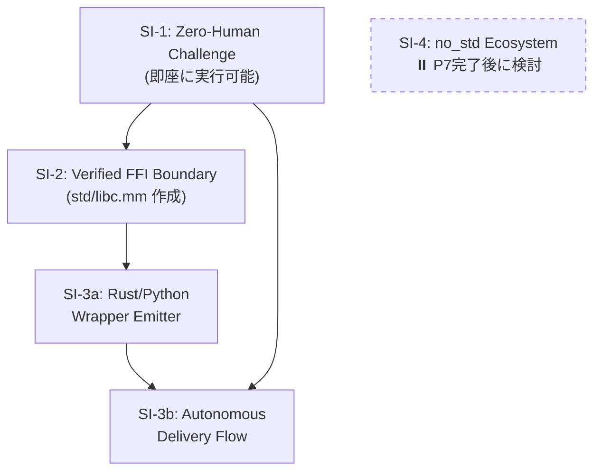
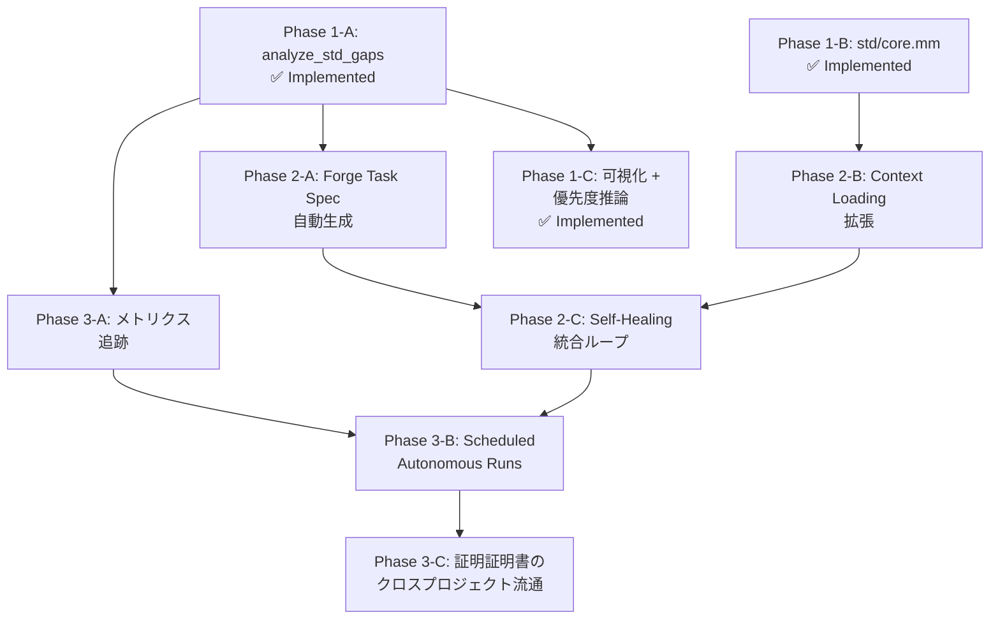
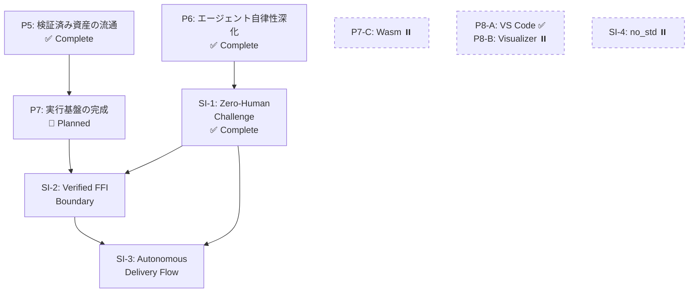

# Cross-Project Roadmap — mumei + mumei-agent (2026-03 〜)

> mumei エコシステム全体の次期ロードマップ。mumei の思想（proof-first / AI生成コード → 検証済み資産への変換）に沿って優先度を設定。

## 現状サマリ

**mumei (コンパイラ)**: P1〜P3の戦略ロードマップ、Plan 1〜24すべて実装済み。エフェクトシステム、MIR、temporal verification、modular verification、LSP completion/definitionまで到達。

**mumei-agent**: mumeiリポジトリから分離直後（PR #90）。single/multi-stage strategy、retry history、generate mode、metricsが実装済み。ただしまだ初期段階。

---

## Priority 1: mumei-agent の実用化（"AI → 検証済み資産" パイプラインの完成）

mumeiの根幹思想は「AIが生成した不確実なコードを検証済みの信頼できる資産に変換する」こと。

現在のmumei-agentは **fix（修正）** に特化しているが、**generate（生成）** モードが追加されたばかりで、まだ「自然言語仕様 → 検証済みコード」のフルパイプラインが未完成。

### P1-A: Generate Mode の強化

**Repository**: `mumei-lang/mumei-agent`

現在の `generate_code` は基本的なコード生成のみ。以下を追加すべき:

- **仕様からの atom 生成**: 自然言語で `requires`/`ensures` を記述 → LLMが `atom` を生成 → `mumei verify --json` で検証 → 失敗時は self-healing ループへ
- **`mumei infer-contracts`/`mumei infer-effects` との統合**: 生成前にエフェクト推論を実行し、LLMプロンプトに注入
- **テンプレートベースの生成**: `atom` のスケルトン（requires/ensures/body）をLLMに埋めさせる形式で、hallucination を抑制

### P1-B: structured_unsat_core の活用

**Repository**: `mumei-lang/mumei-agent`

mumei側で最近追加された `structured_unsat_core`（PR #97）をagent側で消費する:

- `report.json` の `structured_unsat_core` フィールドをパースし、LLMプロンプトに「どの制約が矛盾しているか」を具体的に伝える
- 現在のプロンプトテンプレート群（`agent/prompts/`）を拡張し、unsat core 情報を活用

### P1-C: E2E テスト・CI の整備

**Repository**: `mumei-lang/mumei-agent`

- GitHub Actions で `pytest` を実行するCI
- mumei バイナリのモック or 実バイナリを使ったインテグレーションテスト
- 各 violation type（precondition, effect_mismatch, temporal_effect 等）に対する修正成功率の回帰テスト

---

## Priority 2: mumei コンパイラの検証能力深化

mumeiの差別化は「Z3による完全自動検証」。この強みをさらに深める。

### P2-A: Cross-atom contract composition（呼び出し元での契約合成） ✅ Implemented

**Repository**: `mumei-lang/mumei`

- ✅ `analyze_temporal_effects_with_contracts()` in `mumei-core/src/mir_analysis.rs`: forward dataflow analysis verifies callee `effect_pre` against caller's current temporal state and applies `effect_post` as state transition
- ✅ `AtomEffectContract` struct mapping effect names to (pre_state, post_state) pairs
- ✅ `TemporalOp` enum distinguishing `Perform` and `Call` operations
- ✅ `mumei-core/src/verification.rs` builds `callee_contracts` map from `ModuleEnv` and passes to analysis
- ✅ 5 unit tests: valid composition, invalid order, no contracts, chained A→B→C, effect_post available to caller
- ✅ E2E tests: `tests/test_modular_verification.mm`, `tests/test_modular_verification_error.mm`, `tests/test_cross_atom_chain.mm`

### P2-B: Trait method constraints の Z3 注入 ✅ Implemented

**Repository**: `mumei-lang/mumei`

- ✅ `TraitMethod.param_constraints` injected into Z3 at both `verify_impl` (law verification) and inter-atom call sites
- ✅ Naive `.replace("v", ...)` replaced with word-boundary-aware `replace_constraint_placeholder()` using `\bv\b` regex
- ✅ `method_trait_index: HashMap<String, Vec<(String, usize)>>` added to `ModuleEnv` for deterministic method→trait lookup
- ✅ `get_traits_for_method()` returns all candidates; callers use `find_impl()` to disambiguate
- ✅ `infer_requires` callee argument substitution with simultaneous placeholder-based replacement
- ✅ `collect_callees_with_args_expr/stmt` and `expr_to_source_string` helpers added
- ✅ `check_contract_subsumption()`: when `atom_ref(concrete)` is passed to a `contract(f)` parameter, verifies that concrete ensures implies contract ensures (warning, not hard error)
- ✅ Unit tests for all items (replace_constraint_placeholder, method_trait_index, infer_requires substitution, subsumption check)

### P2-C: Struct method parsing（`impl Struct { atom ... }` 構文） ✅ Implemented

**Repository**: `mumei-lang/mumei`

- ~~`StructDef.method_names` は存在するが、`impl Stack { atom push(...) }` 構文のパーサーが未実装~~
- ~~OOP的なメソッド呼び出し `stack.push(x)` を可能にし、実用的なデータ構造定義を支援~~
- ✅ `ImplBlock` AST node added (`Item::ImplBlock` variant)
- ✅ `impl StructName { atom method(...) ... }` syntax parsing implemented
- ✅ Methods registered in `ModuleEnv` with qualified names (`StructName::method_name`)
- ✅ Handled in all match arms (`main.rs`, `resolver.rs`, `lsp.rs`, `cmd_build`, `cmd_check`, REPL)

### Verified FFI Layer ✅ Implemented

**Repository**: `mumei-lang/mumei`

- ✅ `ExternFn` extended with optional `requires`/`ensures` fields
- ✅ Extern function contracts propagated to `Atom` registration (no more hardcoded `"true"`)
- ✅ Contracts verified at call sites by Z3 (callers must satisfy `requires`)
- ✅ Backward compatible: omitted contracts default to `"true"`

---

## Priority 3: 実世界ユースケースの証明（"Proof of Concept → Proof of Value"）

mumeiの思想を体現する実践的なデモが不足している。

### P3-A: 実行可能な HTTP API スクリプトの E2E デモ ✅ Demo Ready

**Repository**: `mumei-lang/mumei`

- ~~`examples/http_demo.mm` を実際にビルド・実行し、HTTP レスポンスを取得するデモ~~
- ~~FFI バックエンド（`reqwest`）が実際にリンク・動作することの検証~~
- ✅ `examples/http_e2e_demo.mm` — Verified HTTP client demo with:
  - Safe/unsafe URL handling (Z3 catches unconstrained inputs)
  - JSON parse pipeline with contract propagation
  - Multi-user fetch composition with verified contracts

### P3-B: mumei-agent による「仕様 → 検証済みAPI クライアント」デモ

**Repository**: `mumei-lang/mumei-agent`

mumeiの思想の究極的な体現:

1. 自然言語で「GitHub API からユーザー情報を取得し、名前を返す」と指示
2. mumei-agent が `atom` を生成（`effects: [SecureHttpGet]`, `requires`/`ensures` 付き）
3. `mumei verify` で検証
4. 失敗時は self-healing ループで自動修正
5. 検証通過後、LLVM IR にコンパイル（ネイティブバイナリ生成）し FFI 経由で利用

### P3-C: Capability Security の実践デモ ✅ Demo Ready

**Repository**: `mumei-lang/mumei`

- ~~`SecurityPolicy` を使って「このagentは `/tmp/` 以下のファイルのみ読み書き可能」を強制するデモ~~
- ~~mumei-agent が生成したコードが capability boundary を超えた場合に自動的にリジェクトされるフロー~~
- ✅ `examples/capability_demo.mm` — Comprehensive capability security demo with:
  - `SafeFileRead`: `/tmp/` path restriction + traversal prevention
  - `SafeFileWrite`: `/tmp/output/` write restriction
  - `SecureHttpGet`: HTTPS-only URL enforcement
  - Sandboxed pipeline composing all three capabilities
  - Three unsafe examples that Z3 rejects at compile time (passwd read, path traversal, plain HTTP)

---

## Emitter Plugin Architecture (コード生成プラグイン構造)

mumei のコード生成バックエンドをプラグイン化し、LLVM IR 以外のターゲットへの出力を可能にするアーキテクチャ。

### Phase 1 (Current — PR scope) ✅ Implemented

- `Emitter` trait と enum ベースの静的ディスパッチを mumei core に追加
- 既存の `codegen::compile()` (LLVM IR バックエンド) を `LlvmEmitter` としてトレイトを実装
- `CHeaderEmitter` を第2のエミッターとして追加 — 検証済み `HirAtom` から `.h` ヘッダファイルを生成
- `mumei build` コマンドに `--emit` CLI フラグを追加（値: `llvm-ir` (デフォルト), `c-header`）
- すべてのエミッターは mumei バイナリクレート内で `pub(crate)` のまま
- ワークスペース再構成は不要
- ✅ `Artifact` 抽象化: `Emitter` trait の戻り値を `MumeiResult<Vec<Artifact>>` に変更。`Artifact` 構造体（`name`, `data`, `kind`）と `ArtifactKind` enum (`Binary`, `Source`, `Header`) を追加。ファイル書き出しを `cmd_build` 側に移動
- ✅ `CHeaderEmitter` の Doxygen 形式強化: `/* requires: ... */` → `/** @pre ... */`, `/* ensures: ... */` → `/** @post ... */`, `@brief` コメント自動生成
- ✅ 型マッピング拡充: `i32` → `int32_t`, `u32` → `uint32_t`, `f32` → `float`

### Phase 2 (Future — 3+ emitters exist 時) ✅ Implemented

- ✅ `mumei-core` 共有クレートを抽出: `HirAtom`, `ModuleEnv`, `Emitter` trait, 関連型を含む
- ✅ リポジトリを Cargo ワークスペース構造に変換 (`mumei-core`, `mumei-emit-llvm`, `mumei-cli`)
- ✅ `Emitter` trait とコア型を `pub` にし、外部クレートがエミッターを実装可能にする
- ✅ 外部プラグインリポジトリ (例: `mumei-emit-wasm`) が可能になる
- ✅ `VerifiedJsonEmitter` を第3のエミッターとして追加 (`--emit verified-json`)
- ✅ `ProofBookEmitter` を第4のエミッターとして追加 (`--emit proof-book`) — 検証済み Atom から人間可読な Markdown 証明書ドキュメントを生成

### Phase 3 (Future — ecosystem growth)

- 動的プラグインローディングまたはレジストリベースのエミッター検出
- `mumei add --emitter wasm` スタイルの CLI で外部エミッターをインストール
- Wasm ターゲット（現在保留中）を外部プラグインとして core に触れずに追加可能

### Design Decisions

- **プラグイン境界**: `HirAtom` + `ModuleEnv` + `ExternBlock[]` (LLVM 非依存のデータ構造)
- **将来の境界**: MIR (`MirBody`) が MIR ベースの codegen 実装後にプラグイン境界となる可能性
- **静的ディスパッチ**: 安全性のため enum ベースのディスパッチを動的ディスパッチ (trait objects / .so loading) より優先
- **Wasm 出力**: 意図的に延期; プラグインアーキテクチャにより core を変更せずに後から追加可能

---

## Priority 5: 検証済み資産の流通基盤 (Verified Asset Distribution) ✅ Implemented

mumeiの思想「AI生成コード → 検証済み資産への変換」の次段階。検証済み資産を流通・消費できるエコシステムの構築。

### P5-A: Proof Certificate Chain（証明書チェーン） ✅ Implemented

**Repository**: `mumei-lang/mumei`

- ✅ `AtomCertificate` 拡張: `proof_hash`, `dependencies`, `effects`, `requires`, `ensures` フィールド追加
- ✅ `ProofCertificate` 拡張: `package_name`, `package_version`, `certificate_hash`, `all_verified` フィールド追加
- ✅ `generate_certificate()` が `ModuleEnv` を活用して推移的ハッシュ・依存関係グラフを埋める
- ✅ `mumei verify-cert <path>` CLI コマンド: 証明書の整合性検証
- ✅ `--emit proof-cert` フラグ: `.proof-cert.json` 出力

### P5-B: パッケージレジストリの実装 ✅ Implemented

**Repository**: `mumei-lang/mumei`

- ✅ `VersionEntry` 拡張: `cert_path`, `cert_hash` フィールド追加
- ✅ `mumei publish`: 検証 → 証明書自動生成 → レジストリ登録
- ✅ `mumei add`: レジストリ解決 → 証明書検証 → `mumei.toml` 自動追記

### P5-C: Verified Import（検証済みインポート） ✅ Implemented

**Repository**: `mumei-lang/mumei`

- ✅ インポート時の `.proof-cert.json` 自動検証
- ✅ 証明書なし/期限切れのインポートは taint analysis 対象
- ✅ `--strict-imports` フラグ: 証明書なしインポートをハードエラーに

---

## Priority 6: エージェントの自律性深化 (Agent Autonomy Deepening) ✅ Implemented

### P6-A: Multi-atom / Multi-file 生成 ✅ Implemented

**Repository**: `mumei-lang/mumei-agent`

- ✅ Multi-atom spec JSON フォーマット (`atoms: [...]` 配列)
- ✅ `generate_multi_atom()`: 依存関係検出・ソート・一括生成・atom 単位 retry
- ✅ 既存 single-atom spec との後方互換性維持

### P6-B: Pattern Library の学習型拡張 ✅ Implemented

**Repository**: `mumei-lang/mumei-agent`

- ✅ `FixPattern` に `applied_count` / `success_count` フィールド追加
- ✅ `try_pattern_fix()`: 成功率ベースのパターン自動適用（LLM バイパス）
- ✅ `lookup()` の成功率ランキング
- ✅ `Metrics` に `pattern_attempts` / `pattern_successes` 追加

### P6-C: Specification Refinement Loop ✅ Implemented

**Repository**: `mumei-lang/mumei-agent`

- ✅ `spec_refinement.py`: 検証失敗時に仕様（requires/ensures）自体の修正を提案
- ✅ `RetryHistory.is_same_error_repeating()` トリガーで仕様洗練モードに切り替え
- ✅ `mumei infer-contracts` 結果を活用した仕様推論

---

## Priority 7: 実行基盤の完成 (Runtime Completion)

### P7-A: REPL 実行エンジン

**Repository**: `mumei-lang/mumei`

inkwell の ExecutionEngine (MCJIT) を使用した JIT 実行:

- `inc(5)` → `= 6` のような即時評価
- atom 定義 → JIT コンパイル → 式評価の連続フロー
- FFI 関数（`json_parse`, `http_get` 等）の JIT 内シンボル解決
- `mumei-emit-llvm/src/jit.rs` に `JitEngine` / `compile_to_module()` を追加
- `cmd_repl()` に `ReplContext` 構造体を導入

### P7-B: End-to-End バイナリ実行

**Repository**: `mumei-lang/mumei`

- `mumei run src/main.mm` コマンド: verify → codegen → link → execute を一括実行
- `--emit binary` フラグ: 全 atom を単一 LLVM Module にコンパイル → `clang` でリンク → 実行可能バイナリ
- `atom main()` をエントリポイントとして C の `main` にエクスポート
- ランタイムライブラリ: `@__mumei_resource_{name}` mutex / `@__effect_{name}` ハンドラのスタブ

### P7-C: Wasm ターゲット — ⏸️ Deferred

**Repository**: `mumei-lang/mumei`

**意図的に保留**。Emitter Plugin Architecture (Phase 3) により、`mumei-emit-wasm` を外部プラグインとして core に触れずに後から追加可能。P7-A/P7-B の実行基盤が安定した後に検討する。

---

## Priority 8: DX の成熟 (Developer Experience)

### P8-A: VS Code Extension の Marketplace 公開 — ✅ Ready for Publish

LSP は completion/definition まで実装済み。Marketplace 公開に必要なファイル一式を整備完了:
- TextMate grammar（全キーワード・契約・エフェクト・演算子対応）
- language-configuration.json（ブロックコメント、折り畳み、自動閉じペア）
- tsconfig.json / .vscodeignore / README.md / CHANGELOG.md / icon.png
- `vsce package` で .vsix 生成可能な状態
- 公開には Marketplace publisher アカウントと PAT が必要

### P8-B: Counter-example Visualizer in Editor

LSP の `relatedInformation` を活用し、Z3 counter-example をエディタ内でインライン表示。

---

## Strategic Initiatives: 「信頼のインフラ」への道筋

> mumei は「あらゆる言語、プラットフォーム、そして AI エージェントに対して『数学的真理』を供給するインフラ」という独自の頂点を目指す。以下は、その実現に向けた戦略的イニシアチブの評価と推奨順序。

### SI-1: Zero-Human Challenge（自律性の証明）— ✅ Complete

**目的**: mumei-agent に難易度の高い課題を与え、人間が一切介入せずに検証をパスするまでのログを公開する。

**思想との整合性: ★★★** — mumei の根幹思想「AI生成コード → 検証済み資産への変換」の直接的な証明。

**完了済みインフラ**:
- ✅ mumei-agent の generate mode + self-healing loop + pattern library + retry history
- ✅ `mumei verify --json` による構造化フィードバック
- ✅ P6-A (Multi-atom 生成) による複数 atom モジュール生成

**課題 spec (7/7 バリデーション OK)**:
- ✅ **100% 安全なキュー** (`safe_queue_spec.json`): 4-atom, overflow/underflow 防止
- ✅ **Verified JSON validator** (`verified_json_validator_spec.json`): SafeFileRead エフェクト + capability security
- ✅ **Deadlock-free producer-consumer** (`deadlock_free_producer_consumer_spec.json`): resource hierarchy による deadlock-free 証明
- ✅ bounded_queue, safe_arithmetic, payment, verified_clamp

**成果物**:
- ✅ `examples/challenges/` ディレクトリに課題 spec + 結果テンプレート + サンプル生成コード
- ✅ `docs/ZERO_HUMAN_CHALLENGE.md` にチャレンジ分析ドキュメント
- ✅ `.github/workflows/challenge.yml` で `workflow_dispatch` によるフル実行可能

---

### SI-2: Verified FFI Boundary（安全でない関数を安全に使う）— ✅ Implemented

**目的**: C 標準ライブラリ（`memcpy`, `strlen`, `malloc` 等）を mumei から呼ぶ際、厳格な事前条件を課した検証済みラッパーを量産する。

**思想との整合性: ★★★** — mumei の Verified FFI Contracts (`extern "C"` + `requires`/`ensures`) の実践的活用。

**既存インフラ**: 完備
- `extern "C"` ブロックに `requires`/`ensures` 契約を付与し、Z3 が呼び出し元で検証する仕組みが実装済み
- `--emit c-header` で Doxygen `@pre`/`@post` 付き `.h` ファイルを自動生成
- ExternFn → trusted atom への自動変換が実装済み

**実装内容**:
- ✅ `std/libc.mm` モジュールを新規作成
- ✅ `memcpy`, `memmove`, `memset`, `strlen`, `malloc`, `free`, `calloc`, `realloc`, `snprintf` の検証済みラッパー（9関数）
- ✅ 各ラッパーに現実的な `requires`/`ensures` 契約（例: `memcpy` の `requires: n >= 0 && dst_size >= n && src_size >= n`）
- ✅ `tests/test_libc_contracts.mm` / `tests/test_libc.mm` による呼び出し元検証テスト
- ✅ `tests/test_libc_contracts_error.mm` / `tests/test_libc_error.mm` による契約違反テスト
- ✅ `examples/libc_demo.mm` — メモリ確保→使用→解放パイプライン + 安全/不安全呼び出しデモ
- ✅ `--emit c-header` で生成される `.h` を C プロジェクトが直接利用可能（Doxygen `@pre`/`@post` 付き）

**追加実装**: コンパイラ側の変更は不要。`std/libc.mm` の作成のみ。

---

### Phase 3: Verified Microservice Demo — ✅ Implemented

**目的**: 検証済み支払いロジック + RBAC を実装し、Python FFI 経由で呼び出すデモを提供する。

**実装内容**:
- ✅ `examples/verified_microservice/payment.mm` — `calc_subtotal`, `calc_tax`, `calc_total` atoms
- ✅ `examples/verified_microservice/rbac.mm` — capability security による RBAC 検証
- ✅ `examples/verified_microservice/demo_ffi.py` — Python ctypes FFI デモ
- ✅ `examples/verified_microservice/build.sh` — verify → emit c-header ビルドスクリプト
- ✅ `examples/verified_microservice/README.md` — "logic fortress" パターンのドキュメント

**パターン**: 「logic fortress」— ビジネスロジックを mumei で形式検証し、FFI 経由で任意の言語から呼び出す。

---

### SI-3: Autonomous Delivery Flow（完全自律型デリバリー）— ✅ Complete (実地検証完了)

**目的**: mumei-agent が mumei コードを書く → 検証 → Rust/Python ラッパーを自動生成 → PR を出す、完全自律パイプライン。

**思想との整合性: ★★★** — 「生成 → 検証 → 流通」パイプラインの完成形。

**実装内容**:

| 必要な機能 | 状態 |
|-----------|------|
| mumei コード生成 + 検証 | ✅ generate mode + self-healing |
| C ラッパー生成 | ✅ `--emit c-header` |
| Rust ラッパー生成 | ✅ `--emit rust-wrapper` (`mumei-emit-rust` crate) |
| Python ラッパー生成 | ✅ `--emit python-wrapper` (`mumei-emit-python` crate) |
| PR 自動作成 | ✅ `--publish` モード (mumei-agent) |

**重要**: `RustWrapperEmitter` / `PythonWrapperEmitter` は **トランスパイラではない**。
コンパイル済み mumei バイナリ（`.so`/`.dll`）を FFI 経由で安全に呼び出すためのグルーコードを生成するもの。
`CHeaderEmitter` と同じレイヤー。

**実現ステップ**:
1. ✅ `RustWrapperEmitter` + `PythonWrapperEmitter` を emitter plugin として追加（`CHeaderEmitter` パターンを踏襲）
2. ✅ mumei-agent に `--publish` モードを追加（生成 → 検証 → ラッパー生成 → git commit → PR）
3. ✅ GitHub Actions CI テスト（Rust/Python からラッパーを呼び出し、契約が守られることを確認）

**実地検証（E2E テスト・CI 連携確認）**:
- ✅ `tests/test_publish_e2e.py` — E2E インテグレーションテスト（既存 spec + mock mumei バイナリ）
- ✅ `tests/test_wrapper_validation.py` — C/Rust/Python ラッパーの静的検証テスト
- ✅ `.github/workflows/verify-examples.yml` — publish dry-run テストジョブ追加
- ✅ `docs/AUTONOMOUS_DELIVERY.md` — パイプラインドキュメント（mermaid フロー図、使い方、CI 連携）

**前提条件**: SI-1 (Zero-Human Challenge) と SI-2 (Verified FFI Boundary) の完了

---

### SI-4: no_std Ecosystem（ベアメタル）— ⏸️ Deferred

**目的**: no_std 環境での動作を安定させ、マイコン等で「スタックオーバーフローが物理的に起きない」制御ソフトのデモを作る。

**思想との整合性: ★★☆** — 検証の価値は高いが、現在の mumei の強みはアプリケーションレベルの検証。

**保留理由**:
- ランタイムが `reqwest`, `serde_json`, `pthread` に依存しており、no_std 化には大幅な再設計が必要
- std ライブラリ（Vector, HashMap, JSON, HTTP）がすべて allocator 前提
- 静的スタックサイズ解析が未実装
- P7（実行基盤の完成）が完了し、リンカーパイプラインが安定した後に検討すべき

---

### Strategic Initiatives 推奨実行順序

| 順序 | イニシアチブ | 理由 |
|------|------------|------|
| **1** | SI-1: Zero-Human Challenge | 追加実装ゼロ。mumei の思想を最も直接的に証明。マーケティング効果大 |
| **2** | SI-2: Verified FFI Boundary | `std/libc.mm` の作成のみ。C header emitter との相乗効果。実用的価値が高い |
| **3** | SI-3: Autonomous Delivery Flow | Rust/Python emitter の追加が必要だが、既存の `CHeaderEmitter` パターンを踏襲可能 |
| **保留** | SI-4: no_std Ecosystem | P7 完了後。ランタイム・リンカー・std の大幅な再設計が必要 |

---

## 優先度マトリクス（更新版）

| 優先度 | 項目 | リポジトリ | 状態 |
|--------|------|-----------|------|
| ~~最高~~ | P1-A/B/C: Agent 実用化 | mumei-agent | ✅ Complete |
| ~~高~~ | P2-A/B/C: 検証能力深化 | mumei | ✅ Complete |
| ~~中~~ | P3-A/B/C: 実世界デモ | 両方 | ✅ Complete |
| ~~中~~ | Emitter Plugin Phase 1-2 | mumei | ✅ Complete |
| ~~最高~~ | P5-A/B/C: 検証済み資産の流通 | mumei | ✅ Complete |
| ~~最高~~ | P6-A/B/C: エージェント自律性深化 | mumei-agent | ✅ Complete |
| ~~高~~ | P7-A: REPL 実行エンジン | mumei | ✅ Implemented |
| ~~高~~ | P7-B: E2E バイナリ実行 | mumei | ✅ Implemented (Known Limitations fixed) |
| ~~高~~ | SI-1: Zero-Human Challenge | mumei-agent | ✅ Complete |
| ~~高~~ | SI-2: Verified FFI Boundary | mumei | ✅ Implemented |
| ~~中~~ | SI-3: Autonomous Delivery Flow | 両方 | ✅ Complete (実地検証完了) |
| ⏸️ | P7-C: Wasm ターゲット | mumei | Deferred |
| ✅ | P8-A: VS Code Extension Marketplace 公開準備 | mumei | Ready for Publish |
| ⏸️ | P8-B: Counter-example Visualizer | mumei | Deferred |
| 🔧 | P9: Autonomous Forge Mode | mumei-agent | Infrastructure Complete (PR #31) |
| 📋 | vStd-5: SafeList | mumei | Planned (Forge target) |
| ⏸️ | SI-4: no_std Ecosystem | mumei | Deferred |

## vStd: Verified Standard Library Expansion

検証済み標準ライブラリの拡張。AI エージェントが再利用可能な検証済み部品を発見・活用するための基盤。

### vStd-1: std/contracts.mm — Verified Contract Catalog

汎用の精緻型（`Port`, `Percentage`, `Byte`, `HttpStatus` 等）と検証済みバリデータ（`clamp`, `abs_val`, `safe_divide` 等）のカタログ。AI エージェントが新規コード生成前に再利用可能な型とバリデーションロジックを発見するためのモジュール。

### vStd-2: std/math/fixed_point.mm — Fixed-Point Arithmetic

4 桁精度（スケールファクター 10000）の固定小数点演算モジュール。加減乗除、整数変換、述語チェックを提供し、すべての演算でオーバーフロー防止契約を Z3 で検証する。浮動小数点が使えない環境での金額計算等に有用。

### vStd-3: std/container/safe_queue.mm — Verified FIFO Queue

`std/container/bounded_array.mm` と同パターンの検証済み FIFO キュー。enqueue/dequeue のオーバーフロー/アンダーフロー防止、バッチ操作、安全な操作バリアントを提供。SI-1 Zero-Human Challenge の「100% 安全なキュー」課題の基盤。

### vStd-4: std/http_secure.mm — HTTPS-only HTTP Client

`std/http.mm` の FFI バックエンドを再利用しつつ、パラメタライズドエフェクト（`SecureHttpGet`, `SecureHttpPost`, `SecureHttpPut`, `SecureHttpDelete`）で `starts_with(url, "https://")` 制約をコンパイル時に強制する HTTPS 専用クライアント。

### vStd-MCP: list_std_catalog ツール

MCP サーバーに `list_std_catalog` ツールを追加。`std/` ディレクトリを再帰的にスキャンし、全モジュールの型定義・atom シグネチャ・構造体定義を JSON で返す。AI エージェントがコード生成前に既存の検証済み部品を発見するためのディスカバリ API。

### vStd-5: std/container/safe_list.mm — Verified SafeList

境界チェックが数学的に証明されたリスト。`safe_get(index)` の `requires: 0 <= index < len` により Out of Bounds アクセスを完全に排除。`std/container/safe_queue.mm` / `std/container/bounded_array.mm` と同パターン。mumei-agent Forge モード（P9）による初の無人鍛造ターゲット。

### vStd-Core: std/core.mm — Core Axioms（最小の真理セット）

プロジェクト全体で共有すべき最も基礎的な精緻型と安全な操作。`Size`, `Index`, `NonZero`, `BoundedIndex` の公理型、`safe_to_non_negative`/`safe_narrow`/`checked_add`/`checked_sub`/`checked_mul` の安全変換 atom、`equals`/`compare`/`min`/`max` の比較 atom を提供。全 atom が Z3 で完全検証済み（`trusted atom` を使用しない）。`std/prelude.mm` / `std/contracts.mm` より下層に位置し、他 std モジュールが公理として利用できる最小の真理セット。

### vStd-MCP-Gaps: analyze_std_gaps ツール

MCP サーバーの `list_std_catalog` と対を成すディスカバリ API。`std/` 依存グラフ構築、`trusted atom`（証明の穴）検出、`TODO`/`Phase` コメント収集、`tests/`/`examples/` 内の atom 利用頻度分析を統合し、「次に実装すべき std コンポーネント」を優先度付きで最大 3 件提案する。SI-5 Autonomous Proliferation の「次に何を作るか」を AI エージェントが自己判断するための基盤。

### Forge Mode Integration (mumei-agent P9)

mumei-agent の forge モード（P9）により、vStd の各タスクを自律的に実行可能。タスク spec JSON → generate → verify → self-healing → commit の完全自律パイプライン。Z3 Logical Repair Protocol と Cross-file Context Loading により、複数 std ファイルをまたいだスタイル / 契約一貫性を担保する。

| vStd 項目 | Forge タスク | 状態 |
|-----------|-------------|------|
| vStd-1: contracts.mm 拡張 | `vstd_safe_add.json` | 📋 Ready (forge_tasks/) |
| vStd-2: fixed_point.mm | `vstd_fixed_point.json` | 📋 Planned |
| vStd-3: safe_queue.mm | — | ✅ Already exists |
| vStd-4: http_secure.mm | — | ✅ Already exists |
| vStd-5: safe_list.mm | `vstd_safe_list.json` | 📋 Ready — 初回鍛造ターゲット |
| vStd-MCP: list_std_catalog | — | ✅ Implemented |
| vStd-Core: std/core.mm | — | ✅ Implemented (SI-5 Phase 1-B 基盤) |
| vStd-MCP-Gaps: analyze_std_gaps | — | ✅ Implemented (SI-5 Phase 1-A 基盤) |

---

## SI-5: Autonomous Proliferation（自律増殖） — ✅ Complete

**目的**: AI エージェントが「次に何を作るか」を自己判断し、検証済み資産を自律的に増殖させるループを完成させる。SI-3 の「生成 → 検証 → 流通」パイプラインに「ディスカバリ → 計画 → 実装 → 計測」の自己参照サイクルを接続する。

**思想との整合性: ★★★** — 検証済み資産を起点に、人間の介入なしで標準ライブラリが成長し続けるエコシステム。

**全体像**: 3 層 × 3 フェーズの構成。

- **Phase 1（ディスカバリ基盤）**: 「何が足りないか」を自動で把握する。
- **Phase 2（計画 + 生成）**: 欠落を埋める spec を自動生成し、Forge で鍛造する。
- **Phase 3（計測 + 拡張）**: 成果物の質・利用度を計測し、ループを継続する。

### Phase 1: Discovery Layer（ディスカバリ基盤）

#### Phase 1-A: `analyze_std_gaps` MCP ツール — ✅ Implemented

**Repository**: `mumei-lang/mumei`

`std/` を走査し、依存グラフ、`trusted atom`（証明の穴）、TODO/Phase コメント、`tests/`/`examples/` 内の利用頻度を統合して「次に実装すべきコンポーネント」を最大 3 件提案する MCP ツール。AI エージェントが「何を作るか」を自己判断するための基盤。

#### Phase 1-B: `std/core.mm` シード — ✅ Implemented

**Repository**: `mumei-lang/mumei`

プロジェクト全体で共有する最小の真理セット。`Size`, `Index`, `NonZero`, `BoundedIndex` の公理型、`safe_to_non_negative`/`safe_narrow`/`checked_add`/`checked_sub`/`checked_mul` の安全変換、`equals`/`compare`/`min`/`max` の比較 atom を提供。全 atom が Z3 で完全検証済み。std 拡張時に参照できる「公理の根」として機能する。

#### Phase 1-C: 依存グラフ可視化 + 優先度推論の精緻化 — ✅ Implemented

**Repository**: `mumei-lang/mumei`

`analyze_std_gaps` の出力を Mermaid / DOT 形式で可視化し、`visualizer/` に統合。ヒューリスティクス（現在はルールベース）を `atom 使用頻度` × `依存深度` × `trusted 密度` の加重スコアに拡張し、提案の精度を向上させる。

実装:
- ✅ `mcp_server.py` に `visualize_std_graph(format)` MCP ツール追加。Mermaid / DOT 双方を生成し、ノードを健全度で色分け（green = 完全検証済 / yellow = trusted atom あり / red = 検証失敗予約）。ラベルに `<N> atoms, <M> trusted` を含める。
- ✅ `mcp_server.py::analyze_std_gaps` の `_rank_key` を 3 軸加重スコア (`_compute_weighted_score`) に刷新。`usage_demand` × `dep_depth` × `trusted_density` − `difficulty_penalty` を 0.30 / 0.30 / 0.25 / 0.15 の重みで合成し、proposals に `score` フィールドを付加。`priority` は score 降順の連番として維持。
- ✅ `visualizer/generate_graph.py` と `visualizer/std_graph.md` を追加。`mcp_server` 内のヘルパを再利用し、GitHub 上で直接レンダリングされる Mermaid を `std_graph.md` に書き出す。CI の `update-metrics.yml` / `proliferate.yml` から定期再生成可能。

### Phase 2: Planning & Generation Layer（計画 + 生成）

#### Phase 2-A: Forge Task Spec 自動生成 — ✅ Implemented

**Repository**: `mumei-lang/mumei-agent`

`analyze_std_gaps` の JSON 提案を入力として、`forge_tasks/vstd_*.json` 形式の spec を自動生成する。`depends_on`、`difficulty`、`reason` フィールドから `requires`/`ensures` テンプレートと `import` プレアンブルを構築。

実装: `mumei-lang/mumei-agent` の `agent/propose.py` と `python -m agent propose` サブコマンド（`--gaps-json` / `--auto` / `--output-dir` / `--overwrite` / `--dry-run`）。`difficulty` → `max_retries`（low=3 / medium=5 / high=8）のスケーリング、`depends_on` → `import "<path>" as <alias>;` プレアンブル構築、`forge_discovery._load_task` 互換のラウンドトリップ検証を含む（mumei-agent PR #35）。

#### Phase 2-B: Cross-file Context Loading の拡張 — ✅ Implemented

**Repository**: `mumei-lang/mumei-agent`

P9 の `Cross-file Context Loading` を拡張し、`std/core.mm` の公理型 / 安全 atom を常に LLM プロンプトのプレフィックスに注入する。新規 std モジュールが「公理の根」を自動的に再利用できるようにする。

実装: `mumei-lang/mumei-agent` の `agent/strategies/generate_strategy.py` に `_is_std_module` / `_summarise_core_axioms` / `_load_core_axiom_context` / `_build_core_axiom_context` を追加し、単一 atom (`generate_code`) と複数 atom (`generate_multi_atom`) の両経路で `std/` 配下モジュール生成時に公理ブロックを注入。`AgentConfig.core_axiom_path` / `inject_core_axioms` (`CORE_AXIOM_PATH` / `INJECT_CORE_AXIOMS` 環境変数) で制御可能、`(path, mtime)` キーのキャッシュで繰り返し読み取りを回避（mumei-agent PR #35）。

#### Phase 2-C: Self-Healing + Forge の統合ループ — ✅ Implemented

**Repository**: `mumei-lang/mumei-agent`

Forge が生成した `.mm` を verify → 失敗時は self-healing ループに委譲 → 成功時は PR を自動作成するフロー。SI-3 の既存の `--publish` モードと統合する。

実装: `mumei-lang/mumei-agent` の `agent/proliferate.py` と `python -m agent proliferate` サブコマンド。

- `analyze_gaps(std_dir)` — `mcp_server.py::analyze_std_gaps` と同等のロジックをローカルファイルシステム上で直接実行（MCP サーバー起動不要）。依存グラフ、trusted atom、TODO/FIXME、提案リストを返し、difficulty + 未充足依存数でランキング。
- `generate_specs_from_gaps(gaps, max_count)` — `propose.build_spec_from_proposal` を再利用して forge 互換 spec を生成。
- `check_blast_radius(mumei_client, repo_dir, new_file_path, code)` — 新規 `.mm` を `std/` にトランザクション的に仮配置 → 既存 `std/*.mm` を全件 `mumei verify` → 仮ファイルを自動除去（例外時も確実にクリーンアップ）。既存 std を壊したかどうかを判定する安全柵。
- `attempt_heal(client, model, broken_info, mumei_client)` — 既存 `agent/strategies/fix_strategy.py` の `get_fix` を再利用し、blast-radius で壊れた既存 `.mm` を自動修復。
- `proliferate(mumei_repo_dir, max_proposals, dry_run)` — 全体オーケストレーター。各提案を独立処理（1 件の失敗が他をブロックしない）、壊れたファイルが生じた場合は rollback / heal を自動選択、ループ前後で Phase 3-A の `measure_health` を呼び出し健全度 delta を表示。

CLI: `python -m agent proliferate --mumei-repo <path> [--max-proposals 3] [--dry-run]`。`--dry-run` では git/PR 操作と生成ファイルの永続化をスキップし、analyze → spec 生成 → generate → blast-radius のフローのみを検証可能（mumei-agent PR #36）。

### Phase 3: Measurement & Expansion Layer（計測 + 拡張）

#### Phase 3-A: 利用頻度・証明健全度メトリクス — ✅ Implemented

**Repository**: `mumei-lang/mumei-agent` (+ 将来的に `mumei-lang/mumei` 側で時系列 CI を追加予定)

`analyze_std_gaps` の `usage_frequency` を時系列で記録し、`docs/STDLIB_METRICS.md` を自動更新する CI ジョブ。`trusted atom` 数の推移を「証明の穴の数」として追跡。

実装（エージェント側の定量測定層）: `mumei-lang/mumei-agent` の `agent/std_health.py` と `python -m agent health` サブコマンド。

- `measure_health(mumei_client, std_dir)` — `std/` 配下の各 `.mm` を `mumei verify` で検証し、atom 数 / trusted atom 数 / TODO 数を集計。返却: `total_files` / `verified_files` / `failed_files` / `total_atoms` / `verified_atoms` / `trusted_atoms` / `health_score` / `todo_count` / `details[]`。
- `compute_health_score(total, verified, trusted, todo)` — 0.0〜1.0 クランプされた健全度スコア。base = `(verified_atoms - trusted_atoms) / total_atoms`、TODO ペナルティは 1 件あたり 0.01（累積上限 0.2）、trusted atom は「信仰による証明」として差し引く設計。
- `proliferate.py` からの統合 — 増殖ループの前後で `measure_health` を呼び出し、健全度 delta をログ表示（将来的なロールバック判定の基盤）。

CLI: `python -m agent health --mumei-repo <path> [--format json|table]`。失敗ファイルが 1 件でもあれば exit code 2 を返し、CI ゲートとして使用可能（mumei-agent PR #36）。

mumei 側の時系列記録（`docs/STDLIB_METRICS.md` 自動更新 CI）は `.github/workflows/update-metrics.yml` + `scripts/generate_stdlib_metrics.py` で実装済み（✅ SI-5 Phase 3-A 完了）。`std/**` への push で走り、各モジュールの atom / trusted atom / TODO / `mumei verify` 結果 / health score を集計した `docs/STDLIB_METRICS.md` を自動生成 + コミットする。

#### Phase 3-B: Scheduled Autonomous Runs — ✅ Implemented

**Repository**: `mumei-lang/mumei-agent` + `mumei-lang/mumei`

週次の GitHub Actions で `analyze_std_gaps` → Forge → PR を自動実行。人間の介入なしで提案が実装され続ける定常ループを確立する。

- ✅ `mumei-lang/mumei-agent` `.github/workflows/proliferate.yml`
  - 毎週月曜 00:00 UTC (`cron: '0 0 * * 1'`) で自動起動 + `workflow_dispatch` で手動トリガー可
  - mumei-agent と mumei の両リポジトリを checkout し、mumei コンパイラを `cargo build --release` でビルドして `PATH` に追加
  - `python -m agent health` で pre/post-flight のヘルスチェックを JSON 出力
  - `python -m agent proliferate --mumei-repo ../mumei --output-json /tmp/proliferate/summary.json` を実行
  - 初期の安全柵として `schedule` 起動時と `workflow_dispatch` の `dry_run=true` デフォルトでは `--dry-run` を強制し、PR を作らずにパイプラインを検証
  - 必要なシークレット: `MUMEI_REPO_TOKEN`（cross-repo で mumei に push/PR するため）、`OPENAI_API_KEY`
  - 生成物: `pre_health.json` / `post_health.json` / `proliferate.log` / `summary.json` を artifact `proliferate-logs` として保存
- ✅ `mumei-lang/mumei-agent` `agent/proliferate.py` の CI 対応強化
  - `[PROLIFERATE] Step N/4: ...` 形式のステップログで CI 出力を人間が追いやすく
  - `--output-json <path>` オプションで `timestamp` / `pre_health` / `post_health` / `proposals_processed` / `proposals_succeeded` / `proposals_failed` / `details[]` を構造化出力
  - `publish()` に `pr_title_prefix` / `pr_body_extra` を渡し、自動生成 PR のタイトルに `[SI-5 Autonomous Proliferation]` を付与、description に提案・健全度 delta・検証サマリを含める
- ✅ `mumei-lang/mumei` `.github/workflows/verify-std.yml`（回帰差分ゲート）
  - `std/**` / コア / backend / `Cargo.*` に触れる PR で自動起動
  - 同一 job 内で PR head と PR base の両方を `cargo build --release` → `find std -type f -name '*.mm'` で全件 `mumei verify` にかけ、それぞれの失敗集合を `/tmp/verify-std/{head,base}_failures.txt` に記録
  - `comm -23 head base` で **新規に失敗したモジュールが 1 件以上あれば CI 失敗**、既に base で失敗していたモジュールは許容（develop 時点で 8 モジュールが未検証状態のため絶対基準では全 PR がブロックされてしまう問題への対応）
  - artifact `verify-std-report` に `head_failures.txt` / `base_failures.txt` / `new_failures.txt` / `fixed_modules.txt` を出力し、pre-existing / 新規回帰 / 新規修復 を可視化
  - proliferate が開いた PR が「既存の green だった std モジュールを red に戻す」事故を防ぐ安全柵として機能

#### Phase 3-C: Cross-Project Proof Certificate Sharing — ✅ Implemented

**Repository**: `mumei-lang/mumei` + `mumei-lang/homebrew-mumei`

生成された検証済みモジュールの `.proof.json` を下流プロジェクトが再利用できるように `homebrew-mumei` 経由で配布。検証済み資産の「流通」を自動化する SI-3 の延長。

実装:
- ✅ `mumei-lang/mumei` `.github/workflows/generate-std-certs.yml` — `std/**` への push で走り、`find std -type f -name '*.mm'` の全件に対して `mumei verify --proof-cert --output std/certs/<rel>.proof.json` を実行。失敗ファイルは `::warning` を出しつつ継続。生成された `std/certs/` を artifact として upload + develop ブランチへ自動コミット。
- ✅ `mumei-lang/mumei` `scripts/bundle_std_certs.py` — `std/certs/` 配下の全 `.proof.json` を単一の `std-proof-bundle.json` に集約する CLI。bundle schema は `bundle_version` / `generated_at` / `mumei_version` / `modules` / `summary` (total_modules / all_verified / partial_verified / total_atoms / proven_atoms) を含む。
- ✅ `mumei-lang/mumei` `.github/workflows/release.yml` — Unix ターゲット向けパッケージング直前に `mumei verify --proof-cert` で全 std モジュールの証明書を生成し、`bundle_std_certs.py` で `std-proof-bundle.json` を作成して release tarball に同梱。
- ✅ `mumei-lang/homebrew-mumei` `Formula/mumei.rb` + `mumei-lang/mumei` `scripts/homebrew/mumei.rb` (テンプレート) — tarball に含まれる `std-proof-bundle.json` を `#{share}/mumei/std-proof-bundle.json` に install し、`MUMEI_PROOF_BUNDLE` を `etc/mumei/env.sh` から export。`caveats` にもパスを明示。
- ℹ️ 下流プロジェクト側の取り込みは `mumei-core/src/resolver.rs::verify_import_certificate` の既存ディレクトリ探索 (`.proof-cert.json` / `proof_certificate.json`) と独立しており、バンドルはフォールバック候補として扱う前提。現時点では resolver は変更せず、`MUMEI_PROOF_BUNDLE` を参照する拡張は後続 PR 候補として残置。

### SI-5 推奨実行順序

| 順序 | フェーズ | 理由 |
|------|---------|------|
| **1** | 1-A, 1-B | 「何を作るか」を決定する基盤。互いに独立なので並行実装可能 |
| **2** | 1-C | 1-A の出力を人間/エージェント双方が理解できる形に可視化 |
| **3** | 2-A, 2-B | 生成パイプラインを std/core.mm と analyze_std_gaps に接続 |
| **4** | 2-C | 生成 → 検証 → PR の完全自律サイクル |
| **5** | 3-A | 定量評価（「証明の穴」の推移を計測） |
| **6** | 3-B | 定常ループの確立（週次自動実行） |
| **7** | 3-C | 下流プロジェクトへの流通（エコシステム拡大） |

**前提条件**: SI-3 (Autonomous Delivery Flow) 完了、P9 (Autonomous Forge Mode) のインフラ完了、vStd-MCP (`list_std_catalog`) 実装済み。

---

## 推奨実行順序

---

## Related Documents

- [`docs/ROADMAP.md`](ROADMAP.md) — mumei compiler strategic roadmap (P1-P3, Plans 1-24)
- [`docs/SESSION_PLANS.md`](SESSION_PLANS.md) — Detailed session plans for compiler phases
- [mumei-agent `docs/ROADMAP.md`](https://github.com/mumei-lang/mumei-agent/blob/develop/docs/ROADMAP.md) — Agent-specific roadmap
- [`instruction.md`](../instruction.md) — Development guidelines and priorities
- [`docs/ZERO_HUMAN_CHALLENGE.md`](ZERO_HUMAN_CHALLENGE.md) — Zero-Human Challenge results
