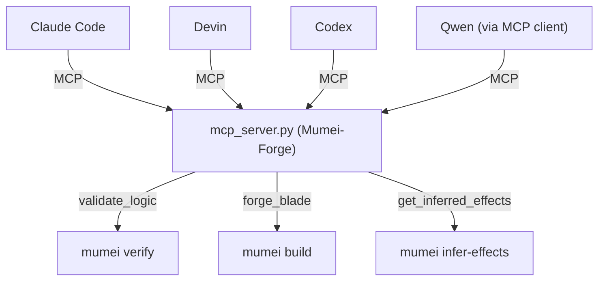

# MCP Integration

Mumei exposes formal verification capabilities through `mcp_server.py`, implemented as **FastMCP("Mumei-Forge")**. Any MCP-compatible AI agent can call the same verifier, builder, effect inference, proof-certificate, and stdlib-inspection tools without agent-specific integration.

For end-to-end workflows that start from natural-language specifications or foreign code before `.mm` exists, see the mumei-agent [Verification Workflow Guide](https://github.com/mumei-lang/mumei-agent/blob/develop/docs/VERIFICATION_WORKFLOW_GUIDE.md).

## MCP Tools

| Tool | Description |
|------|-------------|
| `forge_blade` | Verify + code generation in one step |
| `validate_logic` | Z3 verification only; returns counter-example and semantic feedback data |
| `execute_mm` | General-purpose build / check execution |
| `get_inferred_effects` | Pre-check: infer required effects before writing code |
| `get_allowed_effects` | Query current effect boundary for the session |
| `set_allowed_effects` | Override effect boundary dynamically |
| `analyze_std_gaps` | Identify gaps in std/ coverage |
| `list_std_catalog` | List all atoms in the std/ catalog |
| `visualize_std_graph` | Render std/ dependency graph (Mermaid or DOT) |
| `measure_std_health` | Measure std/ health metrics |
| `get_proof_certificate` | Retrieve proof certificate for a module |
| `generate_doc` | Generate structured documentation (`mumei doc --format json`) |
| `analyze_contract_conflicts` | Analyze cross-atom contract conflicts and circular dependencies (Meta-Architect) |
| `propose_interface_refactoring` | Propose interface-level refactorings for architectural issues (Meta-Architect) |
| `get_spec_guideline` / `get_spec_guidelines` | Return agent-facing specification-writing guidelines |
| `verify_with_orchestration` | Verify with worker-pool orchestration, caching, and task tracking |
| `get_structured_feedback` | Return P9-E structured feedback JSON for source code |

## MCP Setup

```bash
pip install "mcp[cli]>=1.0"
python mcp_server.py
```

## Example tool calls

Use `validate_logic` for verification-only checks:

```json
{
  "tool": "validate_logic",
  "arguments": {
    "source_code": "atom transfer(balance: i64, amount: i64) requires: balance >= amount && amount > 0; ensures: result >= 0; body: balance - amount;",
    "trace_id": "payment-transfer-v1"
  }
}
```

Use `forge_blade` when the agent should verify and emit LLVM IR:

```json
{
  "tool": "forge_blade",
  "arguments": {
    "source_code": "atom safe_div(a: i64, b: i64) requires: b != 0; ensures: true; body: a / b;",
    "output_name": "safe_div"
  }
}
```

The CLI verification surface used by MCP is:

- `mumei verify --json file.mm` — structured JSON output to stdout
- `mumei verify --report-dir <dir> file.mm` — write `report.json` to a specified directory
- `mumei verify --cross-spec-verify file.mm` — cross-spec consistency check; outputs `cross_spec.json`
- `mumei verify --cross-spec-files dep.mm file.mm` — multi-file cross-spec verification

See [Report Schema](REPORT_SCHEMA.md) and [Cross-Spec Verification](CROSS_SPEC_GUIDE.md) for output formats.

## Multi-Agent Collaboration



## AI Agent Features

- **Machine-readable output**: `_build_machine_readable()` parses `report.json` and returns structured JSON containing `failure_type`, `actions`, `counter_example`, `conflicting_constraints`, `data_flow`, `related_locations`, and more.
- **Concurrent-safe verification**: `validate_logic` uses `mumei verify --report-dir` with a unique temporary directory per invocation, enabling multiple agents to run verification in parallel without conflicts.
- **Zero-configuration usage**: Any MCP-compatible agent can start using mumei's verification, build, and effect inference capabilities by connecting to `python mcp_server.py`.

## mumei-agent vs. MCP Server

| | MCP Server (`mcp_server.py`) | [mumei-agent](https://github.com/mumei-lang/mumei-agent) |
|---|---|---|
| **Approach** | Generic interface — the agent's own LLM decides how to fix issues | Turnkey solution — LLM call + verification + retry integrated in one loop |
| **Integration** | Any MCP-compatible agent (Claude Code, Devin, Codex, Qwen, etc.) | Standalone CLI: `python -m agent file.mm` |
| **LLM** | Agent brings its own | Configurable via `.env` (Ollama, OpenAI, DashScope, etc.) |

The two approaches are complementary: the MCP Server enables any agent to access mumei verification without requiring mumei-agent, while mumei-agent provides an out-of-the-box autonomous fix loop for users who want a single-command experience.

## Demo recordings

- [MCP + Rich Diagnostics Demo](https://github.com/user-attachments/assets/0f0594a4-8946-422c-9d54-bd81af45fc14)
- [Compound Constraint Decomposition (Path Safety)](https://github.com/user-attachments/assets/cc5f7d93-a759-418d-9b46-520500c38672)
