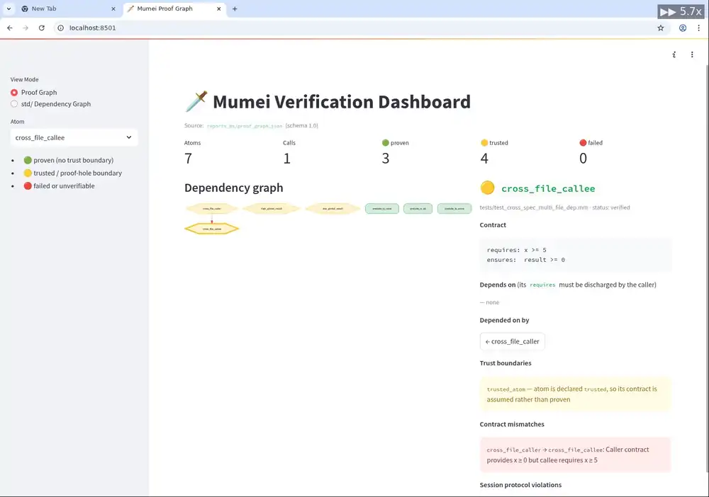
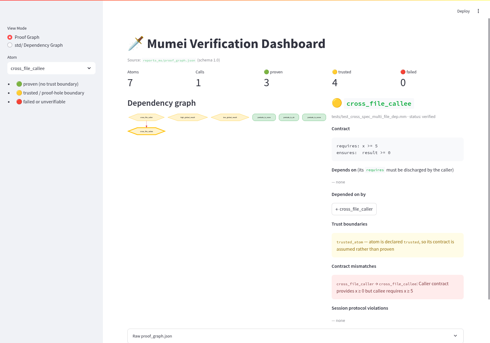
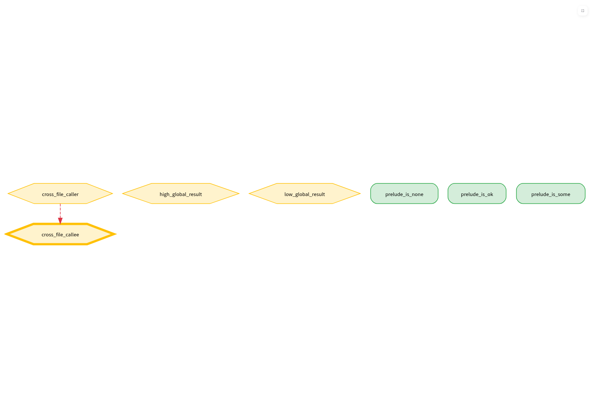
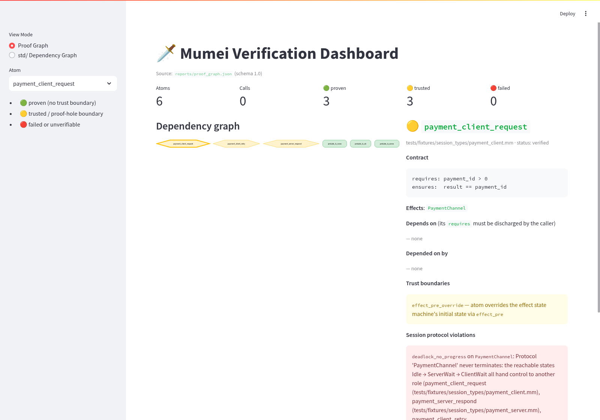
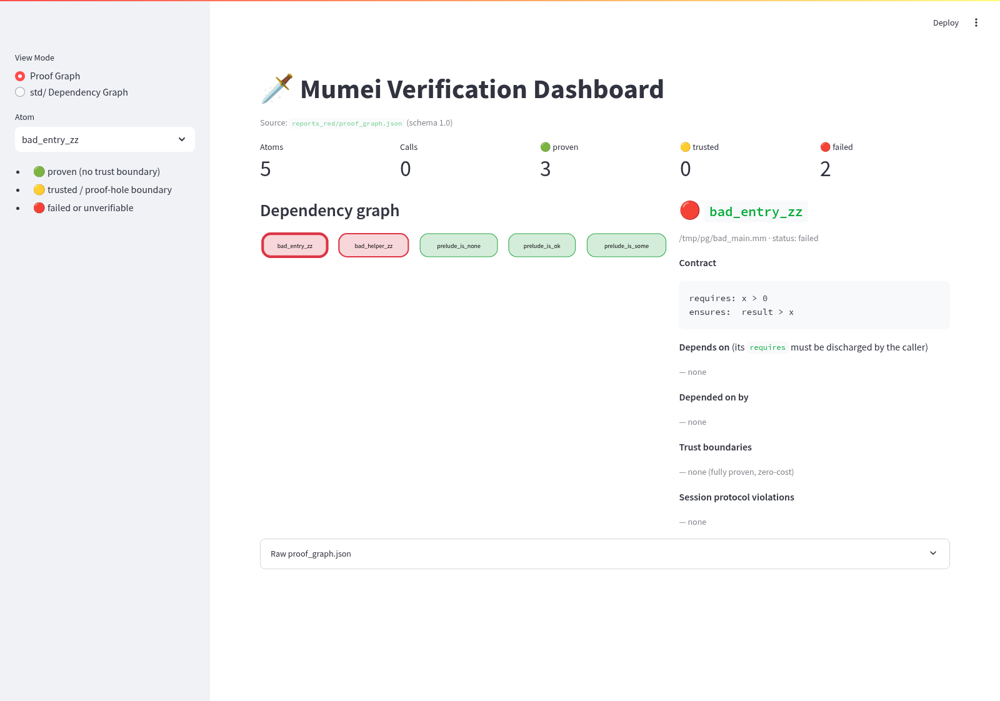
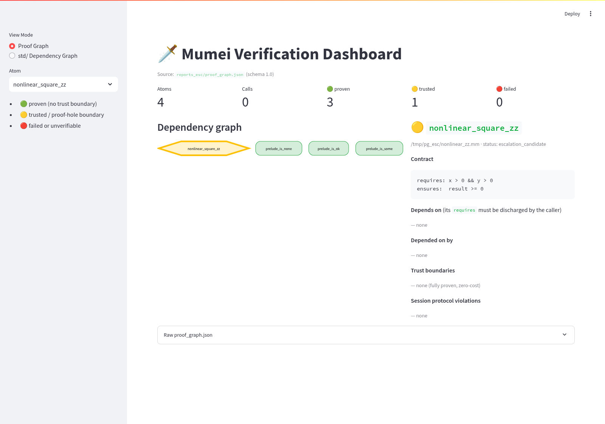

# 🗺️ Strategic Roadmap — Mumei v0.3.0+

> Three strategic roadmap priorities to evolve Mumei from an experimental language to a practical tool.

## Cross-project source of truth

`docs/CROSS_PROJECT_ROADMAP.md` is the only top-level roadmap for cross-repository priority order. This file keeps mumei-local implementation checkpoints and must use the same contract vocabulary: `harness_contract`, `intent_fidelity`, `artifact_paths`, `budget_policy_fingerprint`, and `lean_verified`. Future work is prioritized toward docs-sync and harness-contract regression prevention before reopening deferred portability projects. Priority 17 is implemented in the canonical roadmap; its local surfaces are `stdlib-proof-gate.yml`, `verify_packaged_certs.py`, `std_proof_baseline.json`, `check_proof_bundle_drift.py`, `LSP_DIAGNOSTIC_DATA.md`, and `MCP_TOOL_CONTRACT.md`. The `scripts/check_contract_vocabulary.py` gate now covers docs, CLI help (`src/cli.rs`), and MCP tool docstrings (`mcp_server.py`) for forbidden-alias and `contradiction_type` drift detection.

### Contract regression gate

When this roadmap or the cross-project roadmap changes, reviewers should include the major referenced docs in the diff review:

- `docs/CROSS_PROJECT_ROADMAP.md`
- `docs/ROADMAP.md`
- `docs/PROOF_CERTIFICATE.md`
- `../mumei-agent/README.md`
- `../mumei-agent/docs/VERIFICATION_WORKFLOW_GUIDE.md`
- `../mumei-agent/docs/ROADMAP.md`
- `../mumei-lean/README.md`
- `../mumei-lean/docs/BRIDGE_HARNESS_SPEC.md`
- `../mumei-lean/docs/LEAN_HARNESS_CONTRACT.md`

The same PR/changeset should record both the automatic docs-sync gate and the relevant bridge/MCP/audit/spec test commands:

```bash
python3 scripts/check_contract_vocabulary.py
(cd ../mumei-agent && uv run pytest tests/test_contract_vocabulary.py -q)
(cd ../mumei-lean && PYTHONPATH=scripts MUMEI_LEAN_SKIP_LIVE=1 python -m pytest tests/test_contract_vocabulary.py -q)
(cd ../mumei-demo && python3 scripts/check_scenario_contracts.py)
```

### V1 execution order

The current cross-repo execution order is fixed and should be reviewed with `docs/CROSS_PROJECT_ROADMAP.md` whenever this local roadmap changes:

| Order | Workstream | Local meaning |
| --- | --- | --- |
| 1 | `V1-A` and `V1-B` in parallel | `V1-A` validates natural-language spec health; `V1-B` audits existing code through `mumei-agent audit --code-file ... --auto-migrate --auto-heal` and MCP `scan_and_fix`. |
| 2 | `V1-C` and `V1-D` | Compare spec→code and code→spec only after V1-A/V1-B artifacts use the stable names `spec_health_issues`, `verification_violations`, `verification_status`, `cross_validation_gaps`, `next_steps`, `migration_hints`, `healed_files`, and `heal_errors`. |
| 3 | `V1-E` | Human review enters through `next_steps` and the traceability metadata, not through renamed issue fields. The Phase 7 `mumei-demo/scenarios/spec_code_verification_suite` scenario now demonstrates V1-A〜V1-D in one fixture-safe flow before migration or Lean escalation. |

The no-`.mm` front door remains `audit -> migrate-suggest -> heal`. `mumei-lean` is expanded only for Z3 `unknown` obligations, not `sat` / `unsat` / parser failure / audit findings, and now completes the V1 live generated theorem paths (thirteen in total: `abs_saturating`, `bounded_mul_with_overflow_check`, `constant_time_eq_flag`, `ff_zero_eq_zero`, `verified_insertion_sort_ascending`, `poly_bound_monotone`, `exists_pivot_partition`, `sum_nonneg_inductive`, `rtgs_transfer_conservation`, `ff_mul_commutative`, `ff_mul_associative`, `ff_mul_add_distributive`, `predicate_guard_collapse`). The reference path `Generated.Std.Math.Abs.abs_saturating_correct` exports `lean_verified` with `known_witness_used = false` when `translator_version` and `bridge_lemma_hash` match; stale metadata is `stale_translator`, and `known_witness_used = true` remains fallback witness evidence only.

Local docs were reviewed with the five-language no-`.mm` contract: Python, Rust,
TypeScript, Go, and Solidity all use the same eight audit keys, and language selection
only swaps parser paths. Deterministic/no-LLM demos must keep Rust `a + b` i64
overflow/bounds, TypeScript `name!.length` null/undefined, Go `values[idx]`
bounds / `user.Name` nil / `a + b` overflow, and Solidity reentrancy/CEI/access-control
findings in the Z3 counterexample `verification_violations` path, with
`next_steps` as the only human-review entrypoint before migration/heal evidence.

## Overview

| Priority | Theme | Goal | Status |
|---|---|---|---|
| 🥇 P1 | Network-First Standard Library | Practical utility as an API scripting language | ✅ Implemented |
| 🥈 P2 | Runtime Portability | Run-anywhere distribution foundation | ✅ Implemented |
| 🥉 P3 | CLI Developer Experience | World-class CLI developer experience | ✅ Implemented |

### vStd Autonomous Expansion Checkpoint

The 2026-Q2 forge pass added or refreshed high-priority standard-library modules from `mumei-agent/forge_tasks`:

- `std/concurrency/aviation.mm` — runway allocation effect/resource ordering (`allocate_runway`)
- `std/container/sorted_map.mm` — insertion position, length, and key-ordering witnesses plus sorted-map helpers
- `std/math/factorial.mm` — bounded factorial step and safe-range predicate
- `std/math/fibonacci.mm` — accumulator-step and loop-decrease witnesses
- `std/string/validator.mm` — ASCII numeric and alphanumeric predicates
- `std/core.mm` — `safe_to_index` and `is_nonzero` were added as the next core-seed atoms for bounded-index and NonZero follow-on work

All listed modules were checked with `mumei verify --proof-cert`; proof certificates were emitted without Lean escalation candidates. `analyze_std_gaps` now exposes a `core_seed` block and per-proposal `extension_anchor` metadata for proposals that depend on `std/core.mm`, keeping vStd continuation anchored on the existing core axioms.

---

## 🥇 Priority 1: Network-First Standard Library

### Vision

HTTP requests and JSON operations should be "standard equipment" in modern programming.
Leveraging the FFI foundation from PR #29, we prioritize **wrapping Rust's power in Mumei's skin**.

**Goal**: Create motivation to write "scripts that hit APIs and process data" in Mumei.

### Phase A: FFI Bridge Completion

Complete auto-conversion from extern declarations to trusted atoms.
This is the **prerequisite** for std.http / std.json.

**Current State**:
- ✅ `extern "Rust" { fn sqrt(x: f64) -> f64; }` syntax parsed
- ✅ `ExternFn` / `ExternBlock` AST + Span
- ✅ `Item::ExternBlock` all match arms covered
- ✅ extern → ModuleEnv auto-registration (trusted atom) — implemented in PR #32
- ✅ LLVM codegen (extern function declare + call)

**Implementation Plan**:

```
1. ExternBlock → trusted atom auto-conversion
   - Generate Atom from ExternFn signature
   - Set TrustLevel::Trusted (skip body verification)
   - Auto-register in ModuleEnv.atoms

2. LLVM declare generation
   - Output extern functions as LLVM IR `declare`
   - Type mapping: Mumei types → LLVM types

3. Call-site code generation
   - Generate call to extern atoms registered in ModuleEnv
   - Ensure ABI compatibility (extern "C" / extern "Rust")
```

**Files to modify**:
- `src/main.rs` — ExternBlock → atom conversion in `load_and_prepare()`
- `mumei-core/src/verification.rs` — trusted verification for extern atoms
- `mumei-emit-llvm/src/codegen.rs` — LLVM `declare` + `call` generation
- `docs/FFI.md` — implementation status update

### Phase B: std.json

String/object conversion. Combine with Mumei's type inference for type-safe JSON handling.

**Target API**:

```mumei
import "std/json" as json;

// Parse: string → structured data
let data = json.parse(raw_string);

// Stringify: structured data → string
let output = json.stringify(data);

// Type-safe field access
let name = json.get_string(data, "name");
let age = json.get_int(data, "age");
```

**Backend**: `serde_json` (already a Cargo.toml dependency)

**Files to create/modify**:
- `std/json.mm` — JSON operation atom definitions
- `mumei-core/src/parser/` — string literal type extension (if needed)
- `docs/STDLIB.md` — std.json reference

### Phase C: std.http (Client)

HTTP client wrapping `reqwest` behind FFI backend.

**Target API**:

```mumei
import "std/http" as http;

// Simple GET — maximum simplicity
let response = await http.get("https://api.example.com/users");
let status = http.status(response);
let body = http.body(response);

// POST with JSON body
let response = await http.post("https://api.example.com/users", payload);
```

**Backend**: Rust `reqwest` crate (via FFI)

**Files to create/modify**:
- `std/http.mm` — HTTP operation atom definitions
- `Cargo.toml` — `reqwest` dependency
- `docs/STDLIB.md` — std.http reference

### Phase D: Integration Demo

Integration demo with `task_group` for parallel requests.

```mumei
import "std/http" as http;
import "std/json" as json;

// Concurrent API requests — Mumei's killer feature
task_group:all {
    task { http.get("https://api.example.com/users") };
    task { http.get("https://api.example.com/orders") };
    task { http.get("https://api.example.com/products") }
}
```

**Files to create**:
- `examples/http_demo.mm` — HTTP demo
- `examples/json_demo.mm` — JSON demo
- `examples/concurrent_http.mm` — Parallel HTTP demo

---

## 🥈 Priority 2: Runtime Portability

### Vision

"Running anywhere" is an absolute requirement for adoption.
Reduce the installation barrier to near-zero and target the niche of
"quick automation scripts" in GitHub Actions and CI/CD environments.

### Phase A: Static Linking Optimization

Statically link all shared library dependencies so that a single `mumei`
executable runs anywhere.

**Current State**:
- ✅ GitHub Actions release workflow (macOS x86_64/aarch64, Linux x86_64)
- ✅ `mumei setup` for Z3/LLVM auto-download
- ✅ musl target (fully static linking) — added in Plan 7
- ✅ Windows binaries (`x86_64-pc-windows-msvc`) — added in Plan 7

**Implementation Plan**:

```
1. Add musl target
   - x86_64-unknown-linux-musl target
   - Add musl build job to GitHub Actions

2. Verify static linking of dependencies
   - Z3: verify static linking feasibility
   - LLVM: confirm static link settings
   - Verify with ldd on all targets

3. Windows support (stretch goal)
   - x86_64-pc-windows-msvc target
   - Add Windows job to GitHub Actions
```

**Files to modify**:
- `.github/workflows/release.yml` — add musl/Windows builds
- `Cargo.toml` — static link settings
- `docs/TOOLCHAIN.md` — update supported platforms

### Phase B: Homebrew Tap

One-command installation via `brew install mumei-lang/mumei`.

**Implementation Plan**:

```
1. ✅ Create mumei-lang/homebrew-mumei repository
2. ✅ Create Formula (download from GitHub Releases)
3. ✅ Auto-update Formula via CI (release.yml integration)
   — Formula テンプレートは scripts/generate_formula.py に分離し、
     update-homebrew ジョブから呼び出してローカルでも再現可能。
```

**Formula example**:
```ruby
class Mumei < Formula
  desc "Mathematical Proof-Driven Programming Language"
  homepage "https://github.com/mumei-lang/mumei"
  url "https://github.com/mumei-lang/mumei/releases/download/v0.3.0/mumei-aarch64-apple-darwin.tar.gz"
  sha256 "..."
  license "MIT"

  def install
    bin.install "mumei"
    (share/"mumei-std").install Dir["std/*"]
  end
end
```

### Phase C: WebInstall (curl | sh)

```bash
curl -fsSL https://mumei-lang.github.io/install.sh | sh
```

**Implementation Plan**:

```
1. Create install.sh script
   - Auto-detect OS/arch
   - Download latest binary from GitHub Releases
   - Guide user to add to PATH

2. Host on GitHub Pages
3. Add installation instructions to README
```

**Files to create**:
- `scripts/install.sh` — installer script
- `.github/workflows/release.yml` — auto-update install.sh

---

## 🥉 Priority 3: CLI Developer Experience

### Vision

Instead of focusing on LSP, we aim for world-class "CLI-based development experience".
Languages with great documentation enable users to be self-sufficient,
and communities grow organically.

### Phase A: mumei repl

Enhanced REPL (Read-Eval-Print Loop) for experimenting with syntax
and trying HTTP requests.

**Target UX**:

```
$ mumei repl
Mumei v0.3.0 REPL — type :help for commands, :quit to exit

mumei> type Nat = i64 where v >= 0;
Type defined: Nat

mumei> atom inc(n: Nat) requires: n >= 0; ensures: result >= 1; body: n + 1;
✅ Verified: inc

mumei> inc(5)
= 6

mumei> inc(-1)
❌ Verification failed: requires n >= 0, but got n = -1

mumei> :load examples/http_demo.mm
Loaded 3 atoms from examples/http_demo.mm

mumei> :quit
```

**Implementation Plan**:

```
1. REPL loop foundation
   - rustyline (line editing + history) or stdin-based
   - parse → verify → eval pipeline

2. Incremental definitions
   - Append to ModuleEnv incrementally
   - Support definition overwriting

3. Special commands
   - :help, :quit, :load, :env (list current definitions)
   - :type <expr> (display type inference result)
   - :verify <atom> (.mm atom verification path)
   - :verify-spec <path|inline> (mumei-agent validate-spec JSON; displays spec_health_issues / verification_violations / cross_validation_gaps / next_steps)
   - :verify-code <path> (mumei-agent validate-code --input <path> JSON; --language is optional, inferred from extension; displays spec_health_issues / verification_violations / verification_status / cross_validation_gaps / next_steps)

4. HTTP/JSON integration (after P1 completion)
   - Execute http.get() directly from REPL
```

**Files to create/modify**:
- `src/repl.rs` — REPL engine
- `src/main.rs` — `mumei repl` subcommand
- `Cargo.toml` — `rustyline` dependency

### Phase B: mumei doc

Generate beautiful HTML documentation from source code comments,
similar to Rust's `rustdoc`.

**Target UX**:

```bash
$ mumei doc src/main.mm -o docs/

# Generates:
# docs/index.html
# docs/atoms/increment.html   (requires/ensures/body)
# docs/types/Nat.html          (refinement predicate)
# docs/traits/Comparable.html  (methods + laws)
```

**Doc comment syntax**:

```mumei
/// Increments a natural number by 1.
///
/// # Examples
/// ```
/// inc(5) == 6
/// inc(0) == 1
/// ```
atom inc(n: Nat)
    requires: n >= 0;
    ensures: result >= 1;
    body: n + 1;
```

**Implementation Plan**:

```
1. Doc comment parser
   - Extract /// comments
   - Markdown parsing (lightweight)

2. HTML template engine
   - Pages for atom / type / trait / struct / enum
   - Index page (all definitions)
   - requires/ensures visualization

3. CSS styling
   - Dark mode support
   - Syntax highlighting

4. CLI integration
   - mumei doc <input> -o <output_dir>
   - mumei doc --json (structured output)
```

**Files to create/modify**:
- `src/doc.rs` — documentation generation engine
- `src/main.rs` — `mumei doc` subcommand
- `templates/` — HTML templates

### Phase C: REPL + HTTP Integration

Demo for trying HTTP requests directly from REPL (after P1 + P3A completion).

```
mumei> import "std/http" as http;
mumei> let res = await http.get("https://httpbin.org/get");
mumei> http.status(res)
= 200
mumei> http.body(res)
= "{ \"origin\": \"...\" }"
```

---

## Dependencies

```
P1-A (FFI Bridge) ──→ P1-B (std.json) ──→ P1-D (Integration Demo)
                  ──→ P1-C (std.http)  ──→ P1-D
                                        ──→ P3-C (REPL + HTTP)

P2-A (Static Link) ──→ P2-B (Homebrew) ──→ P2-C (WebInstall)

P3-A (REPL) ─────────→ P3-C (REPL + HTTP)
P3-B (mumei doc)       (independent)
```

---

## Success Metrics

| Metric | Target | Measurement |
|---|---|---|
| **API Script Demo** | `http.get` + `json.parse` working | examples/http_demo.mm passes |
| **Install Time** | < 30 seconds | `curl \| sh` from clean environment |
| **REPL Responsiveness** | < 100ms per eval | Benchmark on standard hardware |
| **Doc Coverage** | 100% of std library | `mumei doc std/` generates all pages |
| **Binary Size** | < 50MB (static) | `ls -la target/release/mumei` |
| **Platform Support** | macOS + Linux + Windows | CI green on all targets |

---

## Timeline (Estimated)

| Phase | Duration | Milestone |
|---|---|---|
| P1-A: FFI Bridge | 1-2 weeks | extern → trusted atom auto-registration |
| P1-B: std.json | 1 week | `json.parse` / `json.stringify` |
| P1-C: std.http | 1-2 weeks | `http.get` / `http.post` |
| P1-D: Demo | 1 week | Integration demo + documentation |
| P2-A: Static Link | 1 week | musl build + CI |
| P2-B: Homebrew | 1 week | `brew install mumei` |
| P2-C: WebInstall | 1 week | `curl \| sh` |
| P3-A: REPL | 2 weeks | `mumei repl` basic functionality plus `:verify-spec` / `:verify-code` interactive checks |
| P3-B: Doc Gen | 2-3 weeks | `mumei doc` HTML generation |
| P3-C: Integration | 1 week | REPL + HTTP integration |

---

## P4: Effect System — Inference, Refinement, Hierarchy

### Current Implementation

- **Effect Inference**: Call graph traversal infers required effects from callee atoms
- **Hybrid Path Verification**: Constant Folding (Rust-side) + Z3 String Sort (symbolic paths)
- **Effect Hierarchy (Subtyping)**: `parent:` field on EffectDef enables Network → HttpRead/TcpConnect
- **MCP Pre-check**: `get_inferred_effects` tool lets AI check required permissions before writing code

### Z3 String Sort Integration (Complete)

Z3's native String sort has been integrated for symbolic effect parameter verification.
The hybrid approach (Constant Folding + Z3 String Sort) is now active:

**Completed**:
- ✅ `z3` crate 0.12.1 confirmed with stable `z3::ast::String` support
- ✅ `z3::ast::String` imported as `Z3String` in verification.rs
- ✅ `parse_constraint_to_z3_string()` maps constraint strings to Z3 String operations:
  - `starts_with(path, "/tmp/")` → `Z3String::prefix_of`
  - `ends_with(path, ".txt")` → `Z3String::suffix_of`
  - `contains(path, "data")` → `Z3String::contains`
  - `not_contains(path, "..")` → `NOT Z3String::contains`
- ✅ Perform handler extended: symbolic (variable) args verified via Z3 String constraints
- ✅ Sort-aware timeout: Z3 solving timeout doubled when String constraints are present
- ✅ Constraint budget checked on String constraint creation
- ✅ Performance validated: 10 String constraints solve in < 500ms

**Hybrid Strategy**:
- Constant paths: verified by `check_constant_constraint()` (Rust-side, zero Z3 overhead)
- Symbolic paths (variables): verified by Z3 String Sort constraints in the solver
- `path_id_map` / `prefix_ranges` retained as `#[allow(dead_code)]` for future Int encoding fallback

**Future Unlocks**:
- ~~Free-form path construction: `"/tmp/" + user_id + "/log.txt"` verification~~ ✅ Implemented (Plan 21)
- ~~Regex-based path policies: `matches(path, "/tmp/[a-z]+\\.txt")`~~ ✅ Implemented (Plan 23)
- ~~URL validation for std.http effects: `starts_with(url, "https://")`~~ ✅ Implemented (Plan 23)

### Effect Hierarchy Extensions

Extensions to the effect subtyping system:

1. **Multi-parent (Intersection)**: `effect SecureNetRead parent: [Network, Encrypted];` — ✅ Done (Plan 6)
2. **Effect polymorphism**: `atom pipe<E: Effect>(f: atom_ref(T) -> U with E)` — ✅ Done
3. **Effect narrowing**: When calling a `Network`-annotated function with only `HttpRead`, narrow the effect at the call site — ✅ Done (Plan 6, info diagnostic)
4. **Negative effects**: `atom pure_compute() effects: [!IO];` — explicitly deny effects — ✅ Done (Plan 6)
5. **Effect aliases**: `effect IO = FileRead | FileWrite | ConsoleOut;` — union types for convenience — ✅ Done (Plan 6)

---

## Multi-Stage IR Roadmap

| Phase | Item | Status | Prerequisite |
|---|---|---|---|
| Phase 0 | Expr/Stmt separation | ✅ Done | — |
| Phase 1 | HIR introduction (typed AST, eliminate String-based body_expr) | ✅ Done | Phase 0 |
| Phase 2 | Basic Effect System (parameterized effects, security policy) | ✅ Done | ✅ Expression parser migrated to recursive descent (item parsing still regex) |
| Phase 2.5 | Lambda / Closure Support | ✅ Done | Phase 2 |
| Phase 2.5 | Semantic Feedback v2 (all failure types, bilingual) | ✅ Done | Phase 1 |
| Phase 3 | Effect Polymorphism | ✅ Done | Phase 2 |
| Phase 4 | MIR introduction (CFG for borrow checking) | ✅ Phase 4a-4c done: liveness, move analysis, Copy/Move distinction, drop insertion | LinearityCtx wired + MIR data structures + mir_analysis.rs |
| Phase 5 | HIR Effect Type Information | ✅ Done | HirEffectSet on HirAtom/HirExpr, lower_atom_to_hir_with_env |
| Phase 6 | Capability Security evaluation | ✅ Done | See docs/CAPABILITY_SECURITY.md |
| Phase 7 | Temporal Effect Verification (Stateful Effects) | ✅ Done | EffectStateMachine, forward dataflow, Phase 1i |
| Phase 8 | Modular Verification (effect_pre / effect_post) | ✅ Done | Cross-atom temporal effect state tracking via contracts |

### Why Phases 2–5 Are Deferred

- **Phase 2 (Basic Effects)**: ✅ Complete — parameterized effects (`FileRead(path: Str)`, `HttpGet(url: Str)`) implemented with security policy enforcement. Standard library effects defined in `std/effects.mm`, `std/http.mm`, `std/file.mm`. Z3 verifies parameter constraints (e.g., `starts_with(path, "/tmp/")`) at compile time.
- **Phase 3 (Effect Polymorphism)**: ✅ Complete — Effect polymorphism via `<E: Effect>` bounds and `with E` syntax. Resolved through monomorphization (same as type polymorphism).
- **Phase 4 (MIR)**: A CFG-based intermediate representation is needed for borrow checking and lifetime analysis, but the borrow checking design itself is not yet started. Will be introduced after the design is finalized.
- **Phase 5 (HIR Effect Type Information)**: ✅ Complete — `HirEffectSet` attached to `HirAtom`, `HirExpr::Call`, `HirExpr::Perform`. `lower_atom_to_hir_with_env()` populates effect info from `ModuleEnv`. Codegen reads effects from `hir_atom.effect_set`.
- **Phase 6 (Capability Security)**: ✅ Complete — Evaluation documented in `docs/CAPABILITY_SECURITY.md`. Recommendation: Continue with parameterized effects + Z3 (Option A). `EffectCtx`, `SecurityPolicy`, `verify_effect_params`, `verify_effect_consistency`, `build_effect_feedback` all wired into the verification pipeline.

---

## Phase 4c+ Implementation Plans

Detailed session plans for the next 8 implementation priorities are documented in [SESSION_PLANS.md](./SESSION_PLANS.md).

| # | Plan | Status |
|---|------|--------|
| 1 | Phase 4c: MIR Copy/Move type distinction | ✅ Implemented |
| 2 | MIR Lowering: remaining expression forms | ✅ Implemented |
| 3 | MIR control flow lowering hardening | ✅ Implemented |
| 4 | MIR Drop Insertion: SwitchInt successor drops | ✅ Implemented |
| 5 | Z3 String Sort migration | ✅ Implemented |
| 6 | Effect Hierarchy extensions | ✅ Implemented |
| 7 | Runtime Portability: musl + Windows | ✅ CI infrastructure verified and stable |
| 8 | Concurrency improvements | ✅ Parser/AST/HIR infrastructure added (codegen placeholder) |
| 9 | Plan 15: Examples + E2E tests | ✅ 5 examples + 3 test files |
| 10 | Plan 16: FFI memory management | ✅ json_free/string_free/http_free |
| 11 | Plan 17: Str type migration | ✅ Examples use Str-typed parameters |
| 12 | Plan 18: Codegen return types | ✅ `resolve_return_type()`, `-> Type` syntax |
| 13 | Plan 19: MIR Phase 4c completion | ✅ MoveAnalysis is primary engine |
| 14 | Plan 20: Z3 temporal effect integration | ✅ `encode_effect_state()`, ConflictingState Z3 probes |
| 15 | Plan 21: Verified HTTP Server + Path Safety | ✅ SafeFileRead/SafeFileWrite effects, `&&` compound constraints, HTTP server FFI, HttpServer stateful effect, path traversal prevention demo |
| 16 | Plan 22: PII Pipeline Example | ✅ DataPipeline temporal effect demo + E2E tests |
| 17 | Plan 23: Regex Path Policies + URL Validation | ✅ RegexSafeFileRead, SecureHttpGet/Post, Z3 approximation improvements |
| 18 | Plan 24: Modular Verification | ✅ effect_pre/effect_post contracts, cross-atom temporal state tracking |
| 19 | Plan 25: LSP Completion & Definition | ✅ textDocument/completion, textDocument/definition, multi-editor docs |
| 20 | V1-E-3: LSP Agent Diagnostics | ✅ `/// spec:` `spec_health_issues` / `cross_validation_gaps` + silent-failure fallback, `.py`/`.rs`/`.ts`/`.tsx`/`.go`/`.sol` `verification_violations` / `cross_validation_gaps` / `verification_status`, graceful `mumei-agent` degrade |

### Plan 22: PII Pipeline Example

A practical demonstration of Temporal Effect Verification applied to data privacy enforcement.
The `DataPipeline` stateful effect defines `Raw` and `Anonymized` states with transitions
`load: Raw → Raw`, `anonymize: Raw → Anonymized`, and `log: Anonymized → Anonymized`.
This ensures that personal data **must** pass through anonymization before it can be logged —
any attempt to log raw data is caught at compile time as an `InvalidPreState` violation.

**Files**:
- `examples/pii_pipeline.mm` — Valid pipeline demonstrating correct load → anonymize → log sequence
- `examples/pii_pipeline_error.mm` — Invalid pipeline (skips anonymize) showing compile-time rejection
- `tests/test_pii_pipeline.mm` — E2E integration test with multiple valid pipeline patterns
- `src/mir_analysis.rs` — 3 unit tests: valid sequence, skip anonymize (InvalidPreState), branch conflict (ConflictingState)

### Plan 23: Regex Path Policies + URL Validation

Extends the P4 effect system with regex-based path constraints and HTTPS URL validation.

**Regex Path Policies**:
- `RegexSafeFileRead(path: Str) where matches(path, "^/tmp/[a-z]+/.*")` in `std/effects.mm`
- Z3 approximation improvements: exact match (`^literal$`) and prefix+suffix (`^prefix.*suffix$`) patterns

**URL Validation**:
- `SecureHttpGet(url: Str) where starts_with(url, "https://")` in `std/http.mm`
- `SecureHttpPost(url: Str) where starts_with(url, "https://")` in `std/http.mm`
- Backward compatible: existing `HttpGet`/`HttpPost` unchanged

**Files**:
- `std/effects.mm` — Added `RegexSafeFileRead` effect definition
- `std/http.mm` — Added `SecureHttpGet`/`SecureHttpPost` effect definitions
- `examples/regex_path_policy.mm` — Regex path constraint demo
- `examples/secure_http.mm` — HTTPS enforcement demo
- `tests/test_regex_policy.mm` — E2E test for regex path validation
- `tests/test_url_validation.mm` — E2E test for URL validation
- `src/verification.rs` — Z3 regex approximation improvements (exact match, prefix+suffix)

### Plan 24: Modular Verification (effect_pre / effect_post)

Adds cross-atom temporal effect state tracking via `effect_pre`/`effect_post` contracts.

**Syntax**:
```
atom open_file(x: i64)
    effects: [File];
    effect_pre: { File: Closed };
    effect_post: { File: Open };
    ...
```

**Implementation**:
- `effect_pre` overrides initial state of corresponding state machines
- `effect_post` is checked against exit states; mismatch emits `UnexpectedFinalState`
- Invalid state names in `effect_pre`/`effect_post` produce hard errors; missing state machines emit warnings
- Monomorphizer substitutes effect type variables in keys (e.g., `{ E: Closed }` → `{ FileWrite: Closed }`)
- All Atom construction sites updated with default empty `HashMap`
- Parser extension for `{ Key: Value, Key2: Value2 }` syntax
- Cross-atom contract composition at call sites is now implemented via `analyze_temporal_effects_with_contracts()` (P2-A)

**Files**:
- `mumei-core/src/parser/ast.rs` — Added `effect_pre`/`effect_post` fields to `Atom` struct
- `mumei-core/src/parser/item.rs` — Parser for `effect_pre:`/`effect_post:` clauses
- `mumei-core/src/verification.rs` — Initial state override + final state check
- `src/main.rs`, `mumei-core/src/resolver.rs`, `mumei-core/src/ast.rs`, `mumei-core/src/mir.rs`, `mumei-core/src/mir_analysis.rs` — Updated Atom construction sites
- `tests/test_modular_verification.mm` — E2E test with File effect contracts
- `mumei-core/src/mir_analysis.rs` — 3 unit tests for modular verification
- `mumei-core/src/parser/mod.rs` — 3 parser tests for effect_pre/effect_post

### Plan 25: LSP Completion & Definition

Unfreezes the LSP server and adds two major features: textDocument/completion and textDocument/definition.

**textDocument/completion**:
- 56 mumei keywords returned as CompletionItem (kind=14 Keyword)
- Atom names extracted from parsed items cache (kind=3 Function)
- Effect names from EffectDef items (kind=8 Interface)
- Type/struct/enum names from TypeDef/StructDef/EnumDef items (kind=7 Class)
- Trigger characters: `.`, `:`

**textDocument/definition**:
- Extract word at cursor position from document text
- Search all cached parsed items for matching definitions (atom, type, struct, enum, effect, trait, resource)
- Return Location (URI + range) based on item's Span

**Performance: Parsed items cache**:
- `HashMap<String, Vec<Item>>` alongside existing `documents` HashMap
- Updated on every didOpen/didChange (reuses parse result from diagnose)
- Used for completion and definition lookups without re-parsing

**Multi-editor configuration docs**:
- `docs/EDITORS.md` with setup examples for Neovim, Helix, Emacs, Sublime Text, and Zed

**Files**:
- `src/lsp.rs` — Completion handler, definition handler, parsed items cache, keyword list, helper functions, unit tests
- `docs/EDITORS.md` — Editor configuration documentation (5 editors)
- `instruction.md` — §11 LSP status changed from "Frozen" to "Active"
- `docs/ROADMAP.md` — This plan entry

### V1-E-3: LSP Agent Diagnostics

Extends `mumei lsp` diagnostics beyond `.mm` parse/Z3 feedback by reusing the same `mumei-agent` JSON contract as the REPL:

- `.mm` comments matching `/// spec: ...` are extracted into a temporary spec input and checked with `mumei-agent validate-spec --input <tmpfile> --format json`; `spec_health_issues` appear on the original comment line.
- `.py`, `.rs`, `.ts`, `.tsx`, `.go`, and `.sol` files are checked with `mumei-agent validate-code --input <tmpfile>` (`--language` is optional; inferred from extension); `verification_violations`, `cross_validation_gaps`, and `verification_status` appear as `source: "mumei-agent"` diagnostics. The current editor buffer is written to a temporary file so `textDocument/didChange` re-runs validation on the unsaved source.
- `next_steps` remains the human-review entrypoint and is included in diagnostic messages and `relatedInformation` without renaming the fixed buckets.
- Missing `mumei-agent` or malformed JSON silently degrades to existing `.mm` diagnostics, preserving Z3 `relatedInformation` and `data.counterexample`.

**Regression test**: `LLVM_SYS_170_PREFIX=/usr/lib/llvm-17 LIBCLANG_PATH=/usr/lib/x86_64-linux-gnu cargo test --test test_lsp_spec_diagnostics` uses a fake `mumei-agent` on `PATH` to pin spec-comment diagnostics, foreign-code diagnostics, `textDocument/didChange` re-validation/diagnostic clearing, and graceful missing-agent behavior.

### P7: Runtime Completion (REPL JIT + Binary Execution)

Enables mumei's verified code to actually run — both interactively in the REPL and as standalone native binaries.

**P7-A: REPL Execution Engine (JIT)** — ✅ Implemented
- `mumei-emit-llvm/src/jit.rs` — JitEngine struct backed by LLVM ORC LLJIT
- Refactored `codegen::compile()` into `compile_atom_into_module()` (in-memory) + `compile()` (file-based)
- `compile_to_module()` returns LLVM IR as string for standalone use
- REPL (`cmd_repl()`) enhanced with JIT: atom definitions are verified then JIT-compiled; expressions are wrapped as `__repl_eval` atoms, verified, executed, and results displayed
- `:eval <expr>` command for unverified JIT execution (debugging)
- `:load` now also compiles loaded atoms into the JIT module

**P7-B: End-to-End Binary Execution** — ✅ Implemented
- `EmitTarget::Binary` variant added to emitter
- `src/linker.rs` — finds clang and links LLVM IR to native binary (`clang -O2 -o <output> <merged.ll> -lm -lpthread`)
- `mumei-emit-llvm/src/binary.rs` — `compile_atoms_to_binary_ll()` merges all atoms into single LLVM module with C-compatible `main` wrapper
- `mumei run <file.mm>` CLI command: verify → compile → link → execute → cleanup
- FFI warning: extern blocks trigger a warning about runtime library requirement
- Examples: `examples/run_demo.mm`, `examples/run_with_calls.mm`

**Known Limitations**:
- ~~**MCJIT incremental compilation**: The JIT engine uses MCJIT, which finalizes the entire module on first `get_function` call. Defining multiple interdependent atoms across REPL iterations and then calling them may fail.~~ **Resolved**: Migrated to ORC LLJIT. Each atom is compiled as an independent module and linked into a shared JITDylib, enabling incremental compilation of interdependent atoms and atom redefinition via `ResourceTracker` removal + recompilation. Regression tests in `tests/test_repl_incremental.rs` cover cross-atom resolution and redefine flows.
- ~~**Binary compilation: top-level atoms only**: `mumei run` and `mumei build --emit binary` only compile top-level `atom` definitions. `impl` block methods are not included in the binary. Programs using struct methods will fail to link.~~ **Fixed**: `impl` block methods are now included in binary compilation with qualified names (`StructName::method_name`).
- ~~**Self-recursive `main` atom**: The rename strategy (`main` → `__mumei_user_main`) does not rename recursive calls inside the body. If `main` calls itself, the call target will reference the C wrapper instead.~~ **Fixed**: `rename_calls_in_hir_stmt/expr` now recursively renames all `main` calls to `__mumei_user_main` in the HIR tree.
- ~~**`find_clang()` is Unix-only**: Uses the `which` command, which is not available on Windows.~~ **Fixed**: `find_on_path()` helper uses `which` on Unix and `where` on Windows, with `clang.exe` fallback for Windows toolchain paths.

**Verification Domain Extension Patterns**:
- ✅ Verified Configuration Pattern (`examples/verified_config.mm`) — refinement types for configuration validation
- ✅ Verified State Machine Pattern (`examples/order_state_machine.mm`) — temporal effects for business process modeling
- See [`docs/PATTERNS.md`](PATTERNS.md) for detailed pattern documentation

**P7-C: Wasm Target** — Deferred / 今は着手しない
- WebAssembly compilation target for browser/edge execution
- Not started now because runtime ABI, distribution evidence, and `artifact_paths` / `harness_contract` expectations are still changing
- Revisit only after docs-sync and harness-contract regression gates are stable

**Future: Developer Experience** — Deferred
- Enhanced error messages, IDE integration improvements, debugging tools
- Will be implemented after runtime completion is stable

**SI-4: no_std Ecosystem** — Deferred / 今は着手しない
- Not started now because `reqwest`, `serde_json`, pthread/runtime pieces, and stdlib FFI assumptions require a broader redesign
- Keep completed runtime portability work intact; current priority is contract vocabulary drift prevention across docs and harnesses

**Files**:
- `mumei-emit-llvm/src/jit.rs` — JIT execution engine (5 unit tests)
- `mumei-emit-llvm/src/binary.rs` — Binary compilation pipeline
- `mumei-emit-llvm/src/codegen.rs` — Refactored compile functions
- `mumei-emit-llvm/src/lib.rs` — Module exports + LlvmContext re-export
- `mumei-core/src/emitter.rs` — EmitTarget::Binary variant
- `src/linker.rs` — Clang linker pipeline
- `src/main.rs` — `cmd_run()`, REPL JIT enhancements, `Run` command variant
- `examples/run_demo.mm` — Simple binary execution demo
- `examples/run_with_calls.mm` — Multi-atom binary execution demo

---

### P8: 形式検証の理論的限界への対処

Z3 ベースの自動検証は Mumei の主要な強みだが、SMT ソルバのモデルは「仕様が正しい」ことや「反例が意味論的に正当である」ことまでは保証しない。
P8 では、形式仕様そのものの健全性を検査し、Z3 で扱える決定可能断片を明文化し、必要な場合だけ Lean 4 へエスカレーションする運用境界を定義する。

**P8-A: Spurious Counterexample Detection（偽反例検出）** — ✅ Implemented

Lean 4 の `bv_decide` / BVDecide が反例を再構成して検証するアプローチを参照し、Z3 の `sat` モデルをそのまま信じず、Mumei の意味論で再評価するメタ検証層を追加する。

**Implementation Plan**:

```
1. 反例モデルの正当性チェック
   - Z3 から得たモデルを HIR/MIR 式へ再代入
   - requires / ensures / effect_pre / effect_post を Mumei 側で再評価
   - 再評価不能な項は "unvalidated_counterexample" として分類

2. Uninterpreted symbol detection
   - 未解釈関数・未展開 atom・trusted atom 由来のシンボルを抽出
   - 反例が未解釈シンボルの任意解釈だけに依存していないか検査
   - 証明失敗レポートに symbol provenance を付与

3. Unused hypothesis checking
   - unsat core / dependency trace から未使用 requires・invariant・effect 制約を検出
   - 未使用仮説が仕様の過剰拘束または死んだ仕様でないか警告
   - 反例の最小制約集合を proof certificate に保存
```

**Files to modify/create**:
- `mumei-core/src/verification.rs` — Z3 モデル取得、反例再代入、未解釈シンボル検出
- `mumei-core/src/proof_cert.rs` — 反例メタ検証結果、unused hypothesis、symbol provenance の証明書フィールド
- `src/main.rs` — CLI 診断出力に `validated_counterexample` / `spurious_candidate` を表示
- `tests/` — 偽反例・未解釈シンボル・未使用仮説の回帰テスト

**Success Metrics**:
- Z3 `sat` のうち Mumei 再評価に成功した反例率: ≥ 95%
- 未解釈シンボル依存の反例を `spurious_candidate` として分類できる率: ≥ 90%
- unused hypothesis 警告の false positive: < 5%
- 成功基準達成: Z3 `sat` の再評価成功率 ≥ 95%

**P8-B: Specification Validation Framework（仕様検証フレームワーク）** — ✅ Implemented

コードを証明する前に、仕様自体が矛盾・過剰拘束・自然言語プロンプトからの逸脱を含まないかを検証する。
特に AI 生成仕様では「実装は証明されるが、仕様が意図と違う」リスクを明示的に扱う。

**Implementation Plan**:

```
1. Contradiction detection for specs
   - requires の充足可能性を Z3 で事前チェック
   - ensures 同士、refinement type、effect state 制約の矛盾を検出
   - 矛盾仕様を proof attempt 前に SpecContradiction として停止

2. QuickCheck-style property-based testing
   - refinement type から入力ジェネレータを合成
   - ランダム・境界値・縮小 (shrinking) による仕様妥当性チェック
   - Z3 で unknown となる仕様にも実行的な sanity check を提供

3. Semantic traceability verification
   - 自然言語プロンプト、生成仕様、実装 atom の三者を trace_id で接続
   - prompt の must/never/only 条件が requires / ensures / effects に反映されたか検査
   - mumei-agent から受け取る forge task metadata と proof certificate を連携
```

**Files to modify/create**:
- `mumei-core/src/verification.rs` — 仕様充足可能性チェックと `SpecContradiction` 診断
- `mumei-core/src/parser/ast.rs` — optional `trace_id` / spec metadata の保持
- `mumei-core/src/proof_cert.rs` — spec validation 結果と traceability hash の記録
- `mcp_server.py` — AI 生成仕様の traceability metadata 入出力
- `docs/SPEC_GUIDE.md` — 仕様検証と property-based validation の利用ガイド

**Success Metrics**:
- 矛盾する requires を proof 前に検出する率: 100%
- property-based validation で発見された仕様欠陥の縮小反例出力率: ≥ 90%
- natural language prompt と formal spec の traceability coverage: ≥ 95%
- 契約隔離サンドボックス（Contract-Isolated Sandbox）による仕様ハッシュ計算とマニフェスト検証を実装
- Intent Drift 検出を強化
- 成功基準達成: 契約変更検出率 100%

**P8-C: Lean Escalation Criteria（Lean 4 エスカレーション基準）** — Completed

Z3 が `unknown` または不安定な結果を返す場合に、どの義務を Lean 4 へ送るべきかを決定論的に分類する。
既存の `lean_verified` 証明証明書ハンドシェイクと `mumei-lean` bridge を拡張し、エスカレーションの成功率を計測可能にする。

**Escalation Criteria**:

```
Escalate to Lean 4 when:
1. Z3 result == unknown / timeout / resource limit
2. 非線形算術、帰納的データ型、再帰的不変条件を含む
3. quantifier alternation または trigger-sensitive な forall/exists を含む
4. Z3 反例が P8-A で spurious_candidate と分類された
5. trusted atom を減らすために人間レビュー済み補題へ昇格する

Do not escalate when:
1. requires が unsat で仕様矛盾が原因
2. 決定可能断片内で Z3 が明確な sat 反例を返し、P8-A 再評価も成功
3. Lean 側 translator が未対応の構文で partial translation になる
```

**Implementation Plan**:

```
1. Z3 result classifier
   - timeout / unknown / sat / unsat / skipped を原因別に分類
   - proof obligation に logic fragment tag を付与

2. mumei-lean bridge integration
   - escalation candidate を proof certificate bundle として出力
   - mumei-lean/scripts/bridge.py が candidate reason を読み取り Lean proof を生成
   - Lean 結果を `z3_check_result = "lean_verified"` として戻す

3. Metrics and feedback loop
   - escalation_attempts / lean_successes / partial_translation / manual_required を記録
   - atom・logic fragment・failure reason ごとの成功率を集計
   - 低成功率カテゴリを P8-D の仕様ガイドへフィードバック
```

**Files to modify/create**:
- `mumei-core/src/proof_cert.rs` — escalation reason、logic fragment tag、Lean result metadata
- `mumei-core/src/resolver.rs` — `--allow-lean-verified` 経路での acceptance metrics
- `src/main.rs` — `mumei verify --escalate-lean` / `--emit escalation-bundle` CLI
- `mumei-lean/scripts/bridge.py` — escalation candidate bundle の取り込み
- `mumei-lean/scripts/ingest_cert.py` — candidate reason を Lean theorem metadata へ変換

**Success Metrics**:
- Z3 `unknown` obligation の Lean escalation 成功率: ≥ 70%
- partial translation 率: < 20%
- `lean_verified` certificate の再検証成功率: 100%

**P8-D: Decidable Fragment Documentation（決定可能断片ドキュメント）** — ✅ Implemented

Z3 が安定して証明できる仕様の範囲を明文化し、Mumei の仕様を書く人間・AI agent の双方が「証明しやすい仕様」を選べるようにする。
これは P8-A〜C の検出・エスカレーション結果を、仕様設計のガイドラインへ還元するフェーズである。

**Documented Fragment**:

```
1. Linear arithmetic
   - i64 / Nat refinement は加減算・比較・定数倍を推奨
   - 変数同士の乗算、除算、mod、指数は Lean escalation candidate

2. Array and sequence access patterns
   - 0 <= i < len(a) の明示的境界条件を必須化
   - 単一 index の read/write と length-preserving update を推奨
   - nested mutable aliasing や quantified permutation は Lean 側へ送る

3. Quantifier restrictions
   - forall は bounded range または finite collection に限定
   - exists は witness を構成できる形を推奨
   - quantifier alternation (`forall exists`, `exists forall`) は原則 escalation

4. Effects and temporal state
   - state machine は finite state + explicit transition に制限
   - path / URL / regex 制約は Z3 String Sort の既存近似範囲を明記
```

**Implementation Plan**:

```
1. docs/SPEC_GUIDE.md に決定可能断片を追加
2. mumei verify の警告として "outside_decidable_fragment" を出す
3. mumei-agent の prompt に spec-writing guideline を注入
4. P8-C metrics から証明失敗しやすい fragment を定期更新
```

**Files to modify/create**:
- `docs/SPEC_GUIDE.md` — 決定可能断片、アンチパターン、推奨仕様テンプレート
- `docs/LANGUAGE.md` — refinement / quantifier / array access の言語仕様へのリンク
- `mumei-core/src/verification/fragment.rs` — logic fragment detector と warning diagnostic
- `mcp_server.py` — agent-facing spec guideline summary の提供
- `mumei-agent/agent/prompts/` — 仕様生成プロンプトへの guideline 反映

**Success Metrics**:
- 新規仕様の `outside_decidable_fragment` 警告率: 四半期ごとに 20% 減少
- Z3 `unknown` 率: < 5%
- AI 生成仕様の first-pass verification 成功率: ≥ 85%

**P8-E: Lean Escalation Formal Translator Specification（Lean 4 エスカレーション形式変換仕様）** — ✅ Implemented

P8-C のエスカレーション判定を実運用するには、Mumei の型システム・refinement type・loop invariant を Lean 4 の依存型理論へ写像する変換規則を、実装依存のスクリプトではなく形式仕様として固定する必要がある。
このフェーズでは `mumei-lean` bridge の translator contract を定義し、Z3 で `unknown` になった義務が Lean kernel で何として解釈されるかを追跡可能にする。

**Translator Specification**:

```
1. Type system mapping
   - Mumei の i64 / bool / string / array / struct / enum を Lean 4 の Int / Bool / String / List / structure / inductive へ写像
   - ownership / borrow / capability は値の性質ではなく証明コンテキスト上の仮説として表現
   - trusted atom は Lean theorem ではなく opaque axiom または explicit assumption として provenance を保持

2. Refinement type lowering
   - `{v: T | P(v)}` を Lean の subtype または predicate argument として表現
   - requires / ensures / effect_pre / effect_post を theorem statement の前提・結論へ分離
   - counterexample reconstruction で使う witness 名と Lean binder 名を proof certificate に保存

3. Loop invariant and recursion encoding
   - `while` / `for` の invariant を well-founded recursion または induction hypothesis に変換
   - variant / decreases clause がないループは partial translation として止める
   - MIR の basic block transition を Lean 側の state transition lemma へ対応づける
```

**Compiler Technology Plan**:

```
1. Typed intermediate translator IR
   - HIR/MIR から Lean 直書き文字列へ変換せず、型付き TranslatorIR を経由する
   - sort / binder / theorem goal / provenance span を保持し、未対応構文を構造的に報告
   - generated Lean の各 declaration に source atom と proof hash を埋め込む

2. Semantic gap bridge
   - integer overflow、array bounds、string/regex、effect state の意味論差を lowering rule として明文化
   - Z3 の近似モデルと Lean の total function semantics が異なる箇所に bridge lemma を要求
   - partial translation を silent success にせず `manual_lemma_required` として分類

3. Kernel-checked escalation handshake
   - `escalation_bundle.json` → Lean source → `.olean` / result certificate の一方向パイプラインを固定
   - Lean 成功結果には theorem name、translator version、bridge lemma set hash を含める
   - translator version mismatch 時は証明キャッシュを無効化する
```

**Files to modify/create**:
- `mumei-core/src/proof_cert.rs` — translator version、binder mapping、bridge lemma hash、manual lemma reason の証明書フィールド
- `mumei-core/src/verification.rs` — HIR/MIR obligation から escalation bundle への型付き出力
- `mumei-lean/scripts/expr_translator.py` — Mumei 型・refinement・loop invariant から Lean expression への仕様準拠 translator
- `mumei-lean/scripts/ingest_cert.py` — TranslatorIR metadata を Lean declaration / theorem statement へ反映
- `mumei-lean/MumeiLean/Basic.lean` — 基本型、subtype、配列境界、effect state の bridge lemma
- `docs/PROOF_CERTIFICATE.md` — Lean escalation translator contract と certificate schema

**Success Metrics**:
- Z3 `unknown` obligation の translator 完全変換率: ≥ 80%
- Lean escalation 成功率（partial translation を除く）: ≥ 75%
- translator version mismatch による stale certificate acceptance: 0 件
- manual lemma required の reason attribution coverage: 100%
- 双方向セマンティクス・マッピング表をドキュメント化
- TranslatorIR に意味論検証用フィールドを追加
- Semantic gap notes の自動生成を実装
- Kernel-checked escalation handshake を強化
- 成功基準達成: Semantic gap notes 自動生成率 ≥ 95%

**P8-F: MCP Server Z3 Process State Management（MCP サーバー Z3 プロセス状態管理）** — Implemented

`mcp_server.py` が複数の AI agent・IDE・CI から並列に検証要求を受けると、Z3 process、verification cache、proof certificate の状態が衝突し、同じ atom の異なる義務が混線するリスクがある。
このフェーズでは MCP サーバーを単なる CLI wrapper ではなく、Z3 process lifecycle と cache isolation を管理する検証オーケストレータとして強化する。

**Implementation Plan**:

```
1. Z3 process lifecycle management
   - request ごとに solver context / timeout / memory limit / cancellation token を割り当てる
   - 長時間実行・hung process を watchdog で終了し、proof certificate に timeout reason を記録
   - warm pool を使う場合でも context reset と assertion leak detection を必須化

2. Cache conflict handling
   - cache key を source hash + dependency hash + translator version + solver config + target fragment で構成
   - 同一 key の並列書き込みは atomic write + file lock + generation id で直列化
   - stale / partial / failed cache entry を区別し、unknown を成功キャッシュとして扱わない

3. Parallel verification safety
   - verification task id を全ログ・証明書・MCP response に伝搬
   - 複数 task が同じ artifact path を更新する場合は per-module workspace へ分離
   - cancellation / retry / escalation が他 task の Z3 context や cache entry を破壊しないことをテストする
```

**Files to modify/create**:
- `mcp_server.py` — task registry、Z3 worker lifecycle、cancellation、cache lock orchestration
- `mumei-core/src/verification.rs` — solver config fingerprint、task id、timeout/cancel reason の結果伝搬
- `mumei-core/src/proof_cert.rs` — cache key、generation id、solver process metadata、parallel safety diagnostics
- `src/main.rs` — `mumei verify --task-id` / `--solver-timeout` / `--cache-scope` CLI オプション
- `tests/` — 並列 MCP 検証、cache collision、hung Z3 process、cancellation の回帰テスト
- `docs/TOOLCHAIN.md` — MCP 経由の並列検証と cache isolation の運用ガイド

**Success Metrics**:
- 100 並列 verification request で cache corruption: 0 件
- hung Z3 process の watchdog recovery 成功率: 100%
- 同一 atom の競合検証で task id / certificate provenance の取り違え: 0 件
- cache hit correctness（hash mismatch acceptance）: 100% rejected

**P8-G: Retry Budget Theoretical Foundation（リトライ予算の理論的基盤）** — Implemented

Self-healing loop と Lean escalation は成功率を上げる一方で、無制限に retry・prompt 修正・solver 再実行を許すと探索空間と token cost が爆発する。
このフェーズでは retry budget を経験則ではなく、探索木・検証義務分類・期待改善率に基づく制御問題として定式化する。

**Theoretical Boundary**:

```
1. Search space model
   - 各 repair attempt を branching factor b、depth d、solver outcome distribution を持つ探索木としてモデル化
   - retry は仕様変更・実装修正・補題追加・Lean escalation の action class に分類
   - 同一 counterexample signature への再試行は情報利得がない限り depth を増やさない

2. Formal stop conditions
   - max_attempts、max_tokens、max_solver_time、max_semantic_delta を proof task ごとに明示
   - 仕様を弱める repair は monotonicity check に通らない限り budget 消費後に human review へ送る
   - unknown → retry の回数は logic fragment と P8-E translator coverage に応じて上限を変える

3. Cost-success trade-off analysis
   - attempt n の expected marginal success rate が token/solver cost threshold を下回る場合に停止
   - high-assurance target では token cost より false proof / spec drift risk を優先
   - library proliferation では proof health gain per token を最適化指標にする
```

**Implementation Plan**:

```
1. Retry budget policy schema
   - forge task / MCP request / CLI verification に共通の BudgetPolicy を定義
   - action class ごとの token・solver・Lean escalation・semantic delta 上限を設定可能にする
   - policy fingerprint を proof certificate と agent log に保存

2. Budget-aware self-healing loop
   - Z3 counterexample signature、unsat core、Lean error class を retry state に記録
   - 同じ失敗原因への prompt 再投入を抑制し、別 action class への切り替えを明示
   - budget exhaustion 時は `manual_review_required` と structured summary を返す

3. Metrics feedback
   - attempts_to_success、tokens_to_success、solver_seconds_to_success、spec_drift_score を集計
   - fragment / task type / repair strategy ごとに Pareto frontier を可視化
   - 四半期ごとに default budget を実測データから再調整する
```

**Files to modify/create**:
- `mcp_server.py` — MCP request の BudgetPolicy 入力、retry state、budget exhaustion response
- `mumei-core/src/proof_cert.rs` — retry policy fingerprint、attempt summary、cost/success metrics の証明書フィールド
- `mumei-core/src/verification.rs` — solver retry reason、counterexample signature、semantic delta guard の結果出力
- `mumei-agent/agent/strategies/` — self-healing loop の budget-aware strategy selection
- `mumei-agent/agent/prompts/` — retry 境界と spec weakening 禁止条件の prompt 注入
- `docs/CROSS_PROJECT_ROADMAP.md` — mumei / mumei-agent / mumei-lean をまたぐ retry budget 運用計画
- `docs/PROOF_CERTIFICATE.md` — retry metrics と budget policy schema

**Success Metrics**:
- retry budget exhaustion 時の structured failure summary 出力率: 100%
- token cost あたり first-pass + retry success rate の四半期改善: ≥ 15%
- 同一 counterexample signature への無情報 retry 削減率: ≥ 80%
- spec weakening による false success regression: 0 件

---

### P10: Z3 Theory Coverage Extension（Z3 未利用理論の段階的取り込み）

Mumei の検証層は現在、Z3 の Bool / Int / Real /（有界）Array / String 近似 /（有界）量化子という決定可能断片のみを利用している。
一方 Z3 は Bit-Vector・正規表現・代数的データ型・非線形算術など多くの理論を備えており、Mumei はこれらのギャップを「スタブ実装」「手動オーバーフロー境界」「Int タグエンコード」「無条件 Lean エスカレーション」で回避している。
P10 では、これらのギャップのうち投資対効果の高いものを Z3 側で直接扱えるようにし、真に難しい部分は引き続き Lean 4 へ委譲する二層構造を維持する。

**P10-A: Bit-Vector Theory（`Z3_BV_SORT` / `theory_bv`）** — ★★★ 最優先

現状のギャップ:

- `std/bitwise.mm` は現行パーサが `&`, `|`, `^`, `<<`, `>>` を通常算術として扱わないため、`bit_and` などが実ビット意味論ではなく境界性質の witness（常に `0` を返す等）にとどまっている。
- Z3 は数学的整数で検証するためオーバーフローが素通りし、`std/contracts.mm` の `safe_add` / `safe_multiply` や `std/math/fixed_point.mm` は `requires` に手動の範囲制約（±4×10^18 等）を書いて回避している。

Lean 委譲境界: `mumei-core/src/verification/types.rs` の `integer_overflow_bridge`（Mumei は 2 の補数ラップ、Lean 4 `Int` は無限精度）ブリッジ補題ノートに従い、リング推論を要する深いオーバーフロー定理は引き続き Lean 4 へ委譲する。

**Implementation Plan**:

```
1. BV sort 生成経路の追加
   - z3_types.rs の param_z3_value の LoweredType 分岐（317 行目付近の Int::new_const フォールバック）に i64 用 BV(64) sort 生成を追加
   - 2 の補数ラップ意味論で加減乗算をエンコードし、Int エンコードとの相互変換点を明示
   - オプトイン（--bitvec-i64）で段階導入し、既定の Int エンコードとの後方互換を保つ

2. ビット演算子のパースと lowering
   - パーサで &, |, ^, <<, >> を式として扱えるようにし、HIR/MIR へ伝搬
   - and / or / xor / shl / shr を BV 演算として翻訳し、shift 量の範囲条件を requires に反映
   - std/bitwise.mm の atom を witness 実装から実ビット意味論の ensures へ書き換える

3. オーバーフロー契約の自動化
   - std/contracts.mm の safe_add / safe_multiply、std/math/fixed_point.mm の手動範囲制約を BV ラップ意味論由来の条件へ置き換える
   - fragment.rs に bitvector_semantics タグを追加し、BV で閉じない義務のみ Lean escalation 候補にする
   - docs/SPEC_GUIDE.md に BV モードで書ける仕様と書けない仕様を明記する
```

**Files to modify/create**:
- `mumei-core/src/verification/translator/z3_types.rs` — i64 用 `BV(64)` sort 生成とビット演算エンコード
- `mumei-core/src/parser/` — `&`, `|`, `^`, `<<`, `>>` のビット演算子パースと優先順位
- `std/bitwise.mm` — 実ビット意味論の `ensures` へ書き換え
- `std/contracts.mm` — `safe_add` / `safe_multiply` の手動範囲制約を BV 条件へ置換
- `std/math/fixed_point.mm` — 手動オーバーフロー境界の削減
- `mumei-core/src/verification/fragment.rs` — `bitvector_semantics` タグと Lean escalation 判定
- `docs/SPEC_GUIDE.md` — BV モードの決定可能断片と `--bitvec-i64` 運用ガイド

**Success Metrics**:
- `std/bitwise.mm` の各 atom が実ビット意味論の `ensures` を Z3 検証で通す率: 100%
- 手動オーバーフロー境界（`requires` の ±4×10^18 等）を必要とする atom 数: ≥ 80% 削減
- `--bitvec-i64` 無効時の既存 proof certificate 回帰: 0 件

**P10-B: Regular Expression Theory（`Z3_RE_SORT` / RegLan）** — ★★

現状のギャップ: 正規表現制約は String Sort 上の `prefix_of` / `suffix_of` / `contains` 近似のみで表現され、`regex_semantics` タグが付いた義務は `docs/SPEC_GUIDE.md` の方針どおり Lean 4 へ回している。

Lean 委譲境界: `mumei-core/src/verification/types.rs` の `string_regex_bridge` ノート（Z3 と Lean で String / regex 意味論が異なる）に従い、複雑な意味論を要する義務のみ Lean 4 に残す。

**Implementation Plan**:

```
1. RE_SORT ベースの regex 変換
   - mumei-core/src/verification.rs（および verification/ 配下の String 制約変換箇所）の regex 近似ロジックを Z3 ネイティブ正規表現理論へ拡張
   - リテラル・連接・選択・繰り返し・文字クラスを RegLan 式へ写像し、str.in_re で判定する
   - 近似で扱っていた prefix_of / suffix_of / contains を RE 式の特殊形として再定義する

2. 有界・単純な regex の Z3 直接判定
   - パス検証・入力バリデーション（Plan 23 の RegexSafeFileRead などの延長）を Z3 で直接決定する
   - std/string/validator.mm と std/effects.mm の path / URL 制約を RE ベースの ensures へ移行
   - 変換不能な構文（後方参照・先読み等）は regex_semantics タグを維持して Lean へ送る

3. 仕様ガイドと回帰
   - docs/SPEC_GUIDE.md に Z3 で決定可能な regex 断片と Lean 委譲対象を明記
   - RE 変換の反例（受理/非受理文字列）を counterexample として報告する
```

**Files to modify/create**:
- `mumei-core/src/verification.rs` — regex 近似から `Z3_RE_SORT` ベース変換への移行
- `std/string/validator.mm` — 入力バリデーション契約の RE 化
- `std/effects.mm` — path / URL 制約の RE 化
- `docs/SPEC_GUIDE.md` — 決定可能な regex 断片と Lean 委譲境界

**Success Metrics**:
- 有界・単純な regex 契約の Z3 直接判定率: ≥ 90%
- `regex_semantics` タグによる Lean escalation 件数: ≥ 60% 削減
- RE 変換由来の反例（受理/非受理文字列）出力率: 100%

**P10-C: Finite Non-recursive Algebraic Data Types（`Z3_DATATYPE_SORT` / `theory_datatype`）** — ★★

現状のギャップ: enum は Int タグとして扱われ、`match` 網羅性は `mumei-core/src/verification/translator/expr.rs` で「tag を `0..n_variants` に制約 → 被覆の否定が UNSAT か」という Int エンコードで実現している。ペイロード付きタグ付き共用体のフィールド型安全性は Int タグでは表現しきれない。

Lean 委譲境界: 再帰 ADT は `mumei-core/src/verification/fragment.rs` で `inductive_data_type` タグとして検出され Lean 4 へ回る設計を維持する（有限・非再帰は Z3、再帰 ADT の帰納証明は Lean）。

**Implementation Plan**:

```
1. ネイティブ datatype sort 生成
   - z3_types.rs に有限・非再帰 enum 用の Z3 datatype sort（コンストラクタ・セレクタ・判別子）生成経路を追加
   - ペイロード付きバリアントのフィールド型を セレクタの sort として保持する
   - Int タグ経路は後方互換のため残し、有限・非再帰と判定された型のみ datatype へ切り替える

2. 網羅性チェックの datatype 化
   - expr.rs の match 網羅性を tag 範囲制約から判別子ベースの被覆否定 UNSAT 判定へ拡張
   - 未被覆バリアントを反例のコンストラクタ名で報告する
   - セレクタ適用の well-formedness（判別子が一致する場合のみ）を制約として付与

3. fragment 判定の整理
   - fragment.rs で有限・非再帰 enum を datatype 経路、再帰 ADT を inductive_data_type タグとして分離
   - docs/SPEC_GUIDE.md に enum / タグ付き共用体の決定可能断片を追記
```

**Files to modify/create**:
- `mumei-core/src/verification/translator/z3_types.rs` — 有限・非再帰 enum の datatype sort 生成
- `mumei-core/src/verification/translator/expr.rs` — datatype ベースの `match` 網羅性チェック
- `mumei-core/src/verification/fragment.rs` — 有限・非再帰 / 再帰 ADT の分離判定
- `docs/SPEC_GUIDE.md` — enum / タグ付き共用体の決定可能断片

**Success Metrics**:
- 有限・非再帰 enum の `match` 網羅性チェックの datatype 経路移行率: 100%
- ペイロード付きバリアントのフィールド型安全性違反の検出率: 100%
- 再帰 ADT の `inductive_data_type` タグ付け精度: 100%

**P10-D: Bounded Low-degree Nonlinear Arithmetic（`nlsat` / `grobner`）** — ★

現状のギャップ: `x * y` や記号的除算は `mumei-core/src/verification/fragment.rs` の `expr_has_nonlinear_arithmetic` により一律 `nonlinear_arithmetic` タグが付き、無条件で Lean escalation 候補になる。ただし `std/math/safe_mul.mm` のように明示境界があれば Z3 でも `result == a * b` を検証できている。

Lean 委譲境界: 多項式不変量・リング等式など真のリング推論は引き続き Lean 4 が担当する。

**Implementation Plan**:

```
1. 無条件エスカレーションの緩和
   - fragment.rs の nonlinear_arithmetic タグを「Lean 確定」から「nlsat 先行試行」の分類へ変更
   - 対象は有界変数・低次多項式（変数積の次数が閾値以下）に限定し、それ以外は従来どおり Lean 候補
   - 境界情報は requires の範囲制約から抽出する

2. solver 実行と結果分類
   - executor.rs で nlsat（必要に応じて grobner）を有効化した solver 実行経路を追加
   - unknown / timeout の場合のみ Lean escalation candidate へ降格し、理由を proof certificate に記録
   - solver 時間上限を fragment ごとに設定し、既存の budget policy と整合させる

3. 仕様ガイドと計測
   - docs/SPEC_GUIDE.md に「Z3 で通る非線形仕様」の条件（明示境界・低次）を明記
   - nlsat 成功率と Lean 降格率を fragment ごとに集計する
```

**Files to modify/create**:
- `mumei-core/src/verification/fragment.rs` — 有界・低次非線形の先行判定と `nonlinear_arithmetic` タグの再定義
- `mumei-core/src/verification/executor.rs` — `nlsat` solver 実行と unknown/timeout 分類
- `docs/SPEC_GUIDE.md` — 明示境界付き非線形仕様の書き方

**Success Metrics**:
- 有界・低次非線形義務の Z3（nlsat）決定率: ≥ 70%
- `nonlinear_arithmetic` タグによる無条件 Lean escalation 件数: ≥ 50% 削減
- nlsat unknown/timeout の Lean 降格理由記録率: 100%

---

### P9: NLAE Integration - Provable AI Runtime

Anthropic の Natural Language Autoencoders (NLAE) 理論を mumei エコシステムに統合し、LLM の推論（内部状態）と形式検証（数学的真理）をシームレスに結合する証明可能な AI 実行基盤を構築する。

#### 設計思想

Mumei DSL を、AI にとっての究極の NLA（Natural Language Activation：高密度論理言語）として位置づける。自然言語の仕様が持つ「曖昧さ（ノイズ）」を排し、AI の設計意図を 100% の忠実度（Fidelity）で数学的証明空間へ射影（コンパイル）する。

#### コンポーネントマッピング

| リポジトリ | NLAE 役割 | 具体的抽象化レイヤー |
| --- | --- | --- |
| `mumei-agent` | **Module A (AV)** | 内部推論（潜在空間） → `mumei` 構文（離散表現）への写像 |
| `mumei` | **Module B (AR)** | `mumei` 構文 → Z3 意味論（論理状態）への再構築 |
| `mumei-lean` | **Fidelity Checker** | 再構築の忠実度検証（誤差がゼロであることを数学的に担保） |
| `mumei-demo` | **Evaluation Loop** | 誤差（反例）に基づく自己修復ループの実行環境 |

**P9-A: Latent-space Debugging（潜在空間デバッグ）** — ✅ Implemented

既存の `LatentEncoder` / `LatentDecoder` を拡張し、より高度な潜在空間デバッグを実現する。

**Implementation Plan**:
- ✅ `mumei-agent/agent/latent_encoder.py`: 構文・意味論・効果・依存関係・契約・スコープ・検証特徴を latent representation に射影
- ✅ `mumei-agent/agent/latent_decoder.py`: effect 追加・削除・型洗練・requires 強化・ensures 弱化を編集候補として復号
- ✅ `mumei-agent/agent/strategies/latent_debug_strategy.py`: self-healing 前段で latent repair を試行し、失敗時は既存 LLM repair へ fallback
- ✅ `ENABLE_LATENT_DEBUG` で既存 flow への影響を opt-in に限定

**Success Metrics**:
- ✅ rule-based + LLM repair の前段として安全に実行でき、失敗時も既存 self-healing loop に戻る

**P9-B: Dense Property Generation（高密度プロパティ生成）** — ✅ Implemented

既存の `DensePropertyGenerator` を拡張し、より高密度な契約生成を実現する。

**Implementation Plan**:
- ✅ `mumei-agent/agent/dense_property_generator.py`: spec/source から圧縮された `requires` / `ensures` 候補を生成
- ✅ `mumei-agent/agent/strategies/generate_strategy.py`: generate flow に dense property 候補を注入
- ✅ `ENABLE_DENSE_PROPERTIES` により既存生成品質へ影響しない opt-in 動作

**Success Metrics**:
- ✅ 生成前に agent が高密度 property 候補を使える

**P9-C: Latent Protocol for Agent Communication（エージェント間通信プロトコル）** — ✅ Implemented

既存の `LatentProtocol` を拡張し、エージェント間の効率的な通信を実現する。

**Implementation Plan**:
- ✅ `mumei-agent/agent/latent_protocol.py`: hash-based latent message encoding / decoding を提供
- ✅ `send_latent_message`, `send_latent_message_batch`, `async_send_latent_message` MCP tools を公開
- ✅ `LATENT_PROTOCOL_KEY` / `ENABLE_LATENT_PROTOCOL` で opt-in transport として運用

**Success Metrics**:
- ✅ MCP agent 間で latent protocol を試せる API surface を実装

**P9-D: Reconstruction Loss Formalization（復元誤差の定式化）** — ✅ Implemented

プログラム状態の写像と復元誤差を数学的に定義する。

**Implementation Plan**:
- 意図される正当な仕様空間 $S$ と実装空間 $V$ の定義
- 復元誤差 $L_{\text{recon}} = \{ x \in S \mid V(x) \neq \text{True} \}$ の実装
- Z3 反例を復元誤差として解釈するモジュール
- 誤差がゼロ（$L_{\text{recon}} = \emptyset$）の状態を検証するメカニズム

**Success Metrics**:
- 復元誤差の検出精度: ≥ 95%

**P9-E: Structured Feedback JSON Schema（構造化フィードバック JSON 規格）** — ✅ Implemented

AI が解釈しやすい構造化 JSON（Loss Vector）の規格を定義・実装する。

**Implementation Plan**:
- 以下の JSON スキーマの定義と実装:

```json
{
  "status": "verification_failed",
  "error_type": "postcondition_violation",
  "location": { "file": "vault.mu", "line": 12 },
  "reconstruction_loss": {
    "violated_property": "ensures from_after == from - amount",
    "counter_example": { "from": 100, "to": 0, "amount": -50, "from_after": 150 }
  },
  "feedback_instruction": "The system allowed a negative amount deposit..."
}
```

- `mumei-core` の `verification.rs` からの出力拡張
- `mumei-agent` での解釈ロジック実装

**Success Metrics**:
- AI によるフィードバック解釈成功率: ≥ 90%

**P9-F: Self-Correction Protocol（自己修復ループ）** — ✅ Implemented

誤差（反例）を最小化する自律サイクルを実装する。

**Implementation Plan**:
- ✅ 生成 → 検証 → 反例出力 → 修正 → 証明のループ実装
- ✅ `mumei verify --emit loss-vector <file.mm>` で P9-E Loss Vector JSON を stdout 出力
- ✅ `ENABLE_SELF_CORRECTION` 設定時に `feedback_instruction` を自己修復ループ向けに強化
- ✅ `mumei-demo/demos/nlae_integration/` で評価環境構築
- ✅ ループの収束条件と停止条件の定義
- ✅ P8-G budget policy と組み合わせ、トークンコストと成功率のトレードオフを bounded loop として管理

**Success Metrics**:
- 自己修復ループの収束率: ≥ 70%（10 回以内）

**P9-G: Ecosystem Integration（エコシステム統合）** — ✅ Implemented

4 つのリポジトリを NLAE コンポーネントとして統合する。

**Implementation Plan**:
- ✅ `examples/nlae_integration_demo.mm`: 意図的な vault withdraw バグを含む E2E demo fixture
- ✅ `mumei-core`: P9-D/E/F の Loss Vector / structured feedback / self-correction 出力を統合デモから利用
- ✅ `mumei-agent`: `NLAEPipeline` と `run_nlae_pipeline` MCP tool で AV→AR→P9-F→Lean fallback を接続
- ✅ `mumei-lean`: `nlae_integration_demo.mm` 用 known witness を Fidelity Checker に登録
- ✅ `mumei-demo`: `demos/nlae_integration/` に 4 repo 連携デモ harness を追加

**Success Metrics**:
- ✅ エンドツーエンドの NLAE 統合デモの成功
- ✅ P9-D/E/F/G により P9 NLAE integration milestone を完了

#### Configuration

- すべての機能はデフォルト無効（既存の NLAE 機能と同様）
- `ENABLE_LATENT_DEBUG`, `ENABLE_DENSE_PROPERTIES`, `ENABLE_LATENT_PROTOCOL`
- `ENABLE_RECONSTRUCTION_LOSS`, `ENABLE_STRUCTURED_FEEDBACK`, `ENABLE_SELF_CORRECTION`

#### References

- Anthropic NLAE research: https://www.anthropic.com/research/natural-language-autoencoders
- Reference implementation: https://github.com/kitft/natural_language_autoencoders
- Existing NLAE integration: `mumei-agent/docs/NLAE_INTEGRATION.md`

---

## P14: `.mm`を書かない入口の mumei 側対応 — ✅ Implemented

P14 は mumei-agent が既存コード/自然言語仕様から監査を開始するためのクロスプロジェクト機能群。
mumei 側の責務は、agent が生成・抽出した `.mm` 仕様を複数ファイル単位で検査し、MCP から
contract conflict / interface refactoring を機械可読に取得できるようにすること。

### P14-C-Compiler: multi-file cross-spec verification（PR #285）✅ Implemented

複数の `.mm` 仕様を 1 つの `ModuleEnv` に読み込み、ファイル間の caller/callee contract、
global invariant、循環依存を検査する。

**Implementation tasks**:

1. `mumei verify --cross-spec-verify` で単一ファイル内の cross-spec report を生成する。
2. `mumei verify --cross-spec-files a.mm,b.mm main.mm --report-dir reports/` で
   追加仕様ファイルを読み込み、`reports/cross_spec.json` に統合結果を書く。
3. `load_cross_spec_files()` / `merge_module_env()` で各ファイルの atom, import,
   dependency graph, reverse deps, effect definitions, trait index を統合する。
4. `CrossSpecVerifier` で `contract_consistency[]`, `global_invariants[]`,
   `global_invariant_conflicts[]`, `circular_dependencies[]`, `dependency_graph[]`
   を決定論的に出力する。

**Target files**:

- `src/cli.rs` — `verify --cross-spec-verify`, `--cross-spec-files`, `--report-dir`
- `src/commands/verify.rs` — verify flow から cross-spec report を生成
- `src/pipeline.rs` — `load_cross_spec_files()` / `merge_module_env()`
- `mumei-core/src/cross_spec/mod.rs` — `CrossSpecVerifier` と report schema
- `tests/test_cross_spec.rs` — multi-file merge / file attribution regression

**Success metrics**:

- `--cross-spec-files` に渡したファイルの atom が primary input と同じ report に含まれる。
- `caller_file` / `callee_file` が cross-file call の実ファイルを保持する。
- 矛盾する global invariant が `global_invariant_conflicts[]` と `summary.global_invariant_conflict_count`
  に反映される。

### P14-MCP: spec contradiction / conflict analysis tools（mumei-agent PR #121 連携）✅ Implemented

mumei-agent PR #121 の `check_spec_contradiction` / `check_cross_spec_consistency`
から mumei CLI の cross-spec report を利用する。mumei リポジトリ側では MCP server が
`cross_spec.json` を正規化し、修復方針を返す。

**Implementation tasks**:

1. `analyze_contract_conflicts(source_code)` が一時 `.mm` に対して
   `cargo run -- verify --cross-spec-verify --report-dir <tmp>` を実行し、
   `cross_spec.json` を conflict-oriented JSON に正規化する。
2. `propose_interface_refactoring(source_code, retry_history)` が conflict analysis を読み、
   `relax_requires` などの interface-level proposal を返す。
3. mumei-agent 側 MCP `check_cross_spec_consistency(spec_files)` は
   `--cross-spec-files` と `--report-dir` を使い、複数 `.mm` の整合性結果を外部 agent に返す。
4. 自然言語仕様だけの contradiction check は mumei-agent 側で `validate-spec` /
   `extract-spec --check-contradiction-only` に集約し、mumei 側は検証バックエンドとして
   Z3 / proof metadata を提供する。

**Target files**:

- `mcp_server.py` — `analyze_contract_conflicts`, `propose_interface_refactoring`
- `tests/test_mcp_server.py` — invalid `cross_spec.json`, conflict normalization, proposal regression
- `mumei-agent/agent/mcp_server.py` — `check_spec_contradiction`, `check_cross_spec_consistency`
- `mumei-agent/agent/cross_validation.py` — `contradiction_type`, spec↔code result schema

**Success metrics**:

- MCP clients can obtain conflict summaries without parsing raw CLI stdout/stderr.
- Invalid or missing `cross_spec.json` returns a structured error instead of crashing the MCP tool.
- Interface refactoring proposals point to concrete atom names and the contract side to change.

### P14 handoff to mumei-agent / mumei-demo

mumei は P14 の verification substrate を担当し、user-facing workflow は
`mumei-agent` に集約する。

**Handoff contract**:

- Start from existing code: `mumei-agent audit --code-file src/ --auto-migrate --auto-heal`
- MCP equivalent: `scan_and_fix(code_file, language, auto_heal=true)`
- Cross-spec evidence: `reports/cross_spec.json`
- Human-review classifier: `contradiction_type`, `migration_hints`, `cross_validation_gaps`

**Related docs**:

- `docs/CROSS_PROJECT_ROADMAP.md` — P14-A/B/C/D の横断仕様と V1-E-4 実装済み状態
- `mumei-agent/docs/ROADMAP.md` — agent 側 P14 の詳細
- `mumei-agent/docs/VERIFICATION_WORKFLOW_GUIDE.md` — no-`.mm` audit workflow
- `mumei-demo/scenarios/spec_code_verification_suite` — Phase 7 demo that bundles V1-A〜V1-D before migration/heal or Lean escalation

---

## P-Deferred-C: stdin（パイプ）入力対応 — ⏸️ Deferred (低優先度)

### 対応しない理由

`mcp_server.py` の `validate_logic` ツールが内部で一時ファイルを作成することで回避済みであり、CLI 直接利用での需要も現時点では低い。
必要になった時点で対応する。

### 将来の対応詳細

**実装方針**:
`src/main.rs` の `load_source` 関数（現在 `fs::read_to_string(input)` で単一ファイルパスのみ受け付け）を拡張し、引数が `-` の場合に stdin から読み込む分岐を追加する。

```rust
fn load_source(input: &str) -> String {
    if input == "-" {
        let mut buf = String::new();
        std::io::stdin().read_to_string(&mut buf)
            .unwrap_or_else(|e| { eprintln!("❌ Error: Could not read from stdin: {}", e); std::process::exit(1); });
        return buf;
    }
    fs::read_to_string(input).unwrap_or_else(|_| {
        eprintln!("❌ Error: Could not read Mumei source file '{}'", input);
        std::process::exit(1);
    })
}
```

これにより `mumei verify -` のようなパイプ入力が可能になる。

**対象ファイル**:
- `src/main.rs` — `load_source` 関数に stdin 分岐を追加（`use std::io::Read;` の追加も必要）

**使用例**:
```bash
cat src/main.mm | mumei verify -
echo "atom inc(n: i64) requires: n >= 0; ensures: result > 0; body: n + 1;" | mumei check -
```

**性能上の注意**:
- 処理時間への影響は軽微（ファイル I/O と同等のオーダー）
- MCP server の `validate_logic` は既に一時ファイルで回避済みのため、この変更は CLI 直接利用のみに影響する

## P15: OpenTelemetry 分散トレース連携（実装済み）

**ステータス: 実装済み** — `mumei-lang/mumei-agent` の P15 OpenTelemetry Observability 導入の最終ゴールとして、Rust コンパイラ側に OTel 分散トレース基盤を追加。Python agent（mumei-agent）が `subprocess.run("mumei verify ...")` で呼ぶ際に、W3C Trace Context を `TRACEPARENT` 環境変数経由で伝播し、Rust 側の Z3 実行 span を Python 側の同一 trace にぶら下げる。

### 構成

- **`otel` feature flag**（Cargo.toml、デフォルト無効）: `tracing` / `tracing-opentelemetry` / `opentelemetry` / `opentelemetry_sdk` / `opentelemetry-otlp`（0.32 系）を opt-in で有効化。feature 無効時はゼロコスト（依存追加なし、条件コンパイルで全 OTel コードを除外）。exporter は OTLP/HTTP（`opentelemetry-otlp` の `http-proto`）を使用するため、エンドポイントは OTLP/HTTP ポート（リファレンススタックでは `:4318`）を指定する。
  - opentelemetry-rust は 0.28 未満（0.27 系）の `TraceContextPropagator` が W3C trace-flags の未使用ビットを厳格に棄却したため、Python SDK（1.43+）が発行する `flags=03`（SAMPLED + W3C level-2 の random ビット）を持つ `TRACEPARENT` を受理できず親コンテキストを破棄していた。0.32 系は未使用ビットを仕様どおり無視するため、Python → Rust の trace-ID 貫通が成立する。
- **`src/telemetry.rs`**: `init_telemetry()` / `shutdown_telemetry()` / `attach_parent_context()` を提供。`OTEL_ENABLED` 環境変数が truthy かつ `otel` feature が有効な場合のみ OTLP exporter を初期化。`TRACEPARENT` / `TRACESTATE` 環境変数から `TraceContextPropagator` で親コンテキストを抽出。
- **`src/commands/verify.rs`**: `cmd_verify_command` に `mumei.verify.cli` root span（属性 `source_path` / `timeout_ms`）を追加。`TRACEPARENT` から抽出した親コンテキストにぶら下げる。
- **`mumei-core/src/verification/executor.rs`**: `verify_inner` に `mumei.z3.solve` 子 span（属性 `atom_name` / `timeout_ms`）を追加。
- **`mumei-core/Cargo.toml`**: `otel` feature で `tracing` crate を opt-in 依存に追加。

### 環境変数

| 変数名 | 説明 | デフォルト |
|---|---|---|
| `OTEL_ENABLED` | `true` / `1` で OTel を有効化 | `false`（無効） |
| `OTEL_EXPORTER_OTLP_ENDPOINT` | OTLP エクスポーター URL | OTel SDK デフォルト |
| `TRACEPARENT` | W3C Trace Context（親プロセスから継承） | なし |
| `TRACESTATE` | W3C Trace State（任意） | なし |

### 使い方

```bash
# OTel 有効ビルド
cargo build --features otel

# 単体実行（TRACEPARENT 付き）
OTEL_ENABLED=true TRACEPARENT="00-..." mumei verify example.mm

# mumei-agent 経由（自動で TRACEPARENT を注入）
OTEL_ENABLED=true OTEL_EXPORTER_OTLP_ENDPOINT=http://localhost:4318 \
  uv run mumei-agent validate-code --input example.py
```

mumei-agent 側で `OTEL_ENABLED=true` の場合、`MumeiClient.verify` 等の `subprocess.run` が自動的に現在の span の `traceparent` を `TRACEPARENT` 環境変数として子プロセスに注入する。Rust 側の `mumei verify` は `TRACEPARENT` を読んで親コンテキストとして接続し、`mumei.verify.cli` → `mumei.z3.solve` span が Python 側の同一 trace ID で表示される。

### 運用・検証（リファレンススタック）

ローカル検証用のリファレンス OTLP バックエンド（OTel Collector / Jaeger / Prometheus / Grafana）と運用手順は `mumei-lang/mumei-agent` 側に整備済み: [`docker-compose.otel.yml`](https://github.com/mumei-lang/mumei-agent/blob/develop/docker-compose.otel.yml) と [`docs/OBSERVABILITY.md`](https://github.com/mumei-lang/mumei-agent/blob/develop/docs/OBSERVABILITY.md)。`--features otel` ビルドの `mumei verify` を `TRACEPARENT` 付きで呼ぶと、Rust 側 `mumei.verify.cli` → `mumei.z3.solve` span が Python 側 trace と同一 trace ID で Jaeger に現れることを、このスタックで疎通確認できる。

### CI 回帰ゲート

`.agents/skills/testing-mumei-cli/SKILL.md` の OTel/TRACEPARENT 検証フローを
`.github/workflows/otel-tracing.yml` として CI ジョブ化済み（`src/telemetry.rs`
/ `src/commands/verify.rs` / `executor.rs` / `Cargo.toml` に触れる PR で起動）:

- **ゼロコスト検証**: `cargo tree --edges no-dev | grep -i opentelemetry` が空であること（feature 無効時に OTel 依存が入らないことを保証）。
- **両ビルドターゲット**: `cargo build` と `cargo build --features otel` の双方が通ること。
- **span 親子関係の end-to-end 検証**: `src/telemetry.rs` の `#[cfg(all(test, feature = "otel"))]` ユニットテストがインメモリ exporter を用いて、`attach_parent_context()` の `TRACEPARENT` 抽出（有効/不正/未設定）と、`mumei.verify.cli` → `mumei.z3.solve` span が抽出した remote 親 span の子として同一 trace ID を持つことを assert（OTLP コレクタ不要）。
- **ランタイム挙動**: `OTEL_ENABLED=true` でコレクタ不在でも exit 0（graceful degradation）、有効/不正 `TRACEPARENT` の受理/無視、`TRACEPARENT` 有無で検証出力が一致すること。
- **Python 側 no-op**: mumei-agent を checkout し、`OTEL_ENABLED=false` で `telemetry.current_traceparent()` / `MumeiClient._env_with_traceparent()` が `None` を返すこと。

---

## P16: Benchmark Evaluation Suite Expansion（ベンチマーク評価スイート拡張）✅ Implemented

拡張前のベンチマークは `benchmarks/dafny_puzzles/`（`absolute_value.mm` / `max.mm` / `swap.mm`）と
`benchmarks/svcomp_style/`（`array_bounds.mm` / `integer_overflow.mm` / `loop_invariant.mm`）の
計 2 カテゴリ・6 ファイル・6 atom のみで、`benchmarks/run_benchmarks.py` が検証成功率・Z3 solver 時間・
trusted 比率を収集し `docs/BENCHMARK_RESULTS.md` に時系列で蓄積していた。この規模の小ささが Mumei の
実用性主張の最大の弱点であり、`paper/index.md` でも "further expansion to cover more categories and
Lean solver times is planned" と future work 言及にとどまっていた。P16 では、Mumei が強みを主張する領域
（算術・有限状態機械・並行性・ドメイン固有コンプライアンス）に対応するベンチマークカテゴリを追加し、
成功例だけでなく「検証で捕捉されるべきバグを含む反例ケース」も体系的に収録して、実用性主張を定量的な
エビデンスで裏付けた。Lean escalation を要する義務の solver 時間計測も収集対象に加えている。

**達成状況（実測）**: 6 カテゴリ・39 ファイル・90 atom。反例ケースは 14 ファイルで、
いずれも期待どおり検証で捕捉され（反例バグ捕捉率 100%）、expected どおりの結果になった率
（一般化した `success_rate`）も全カテゴリ 100%。`benchmarks/arithmetic/finite_field_modular.mm`
と `benchmarks/domain_compliance/modular_commitment.mm` の 6 atom は Z3 が実際に `unknown` を返し、
mumei-lean bridge へ escalate されて 6/6 が `lean_verified`（うち 4 件は自動タクティク探索が採用、
mumei-lean `docs/LEAN_TRANSLATOR_SPEC.md` §12）。したがって `lean_solver_time_s` は `SKIP` ではなく
実測値を記録し、カテゴリ別 Lean discharge 率も `docs/BENCHMARK_RESULTS.md` に時系列蓄積される。
mumei-lean bridge が無い環境では従来どおりゼロコストで `SKIP` に縮退する。回帰ゲートは
`python3 -m pytest tests/test_benchmark_suite.py -q`。

Cross-project 整合: この拡張は `docs/CROSS_PROJECT_ROADMAP.md` の canonical contract に従属する
mumei-local な実装チェックポイントであり、競合する優先順位を導入しない。ベンチマーク結果は
mumei-agent の LLM 生成コード検証成功率測定と mumei-lean の escalation 成功率計測にも接続し、
既存の `harness_contract` / `artifact_paths` / `lean_verified` 語彙を保持する。

**P16-A: 新規ベンチマークカテゴリの追加** ✅

追加した 4 カテゴリと、各カテゴリに収録した複数ファイル・複数 atom:

- `benchmarks/arithmetic/` — 有界加減乗算・オーバーフロー境界・飽和演算・不動小数点・非線形（低次多項式）。
  成功例に加え、オーバーフローを見落とす契約や境界外 index など**検証で捕捉されるべきバグを含む反例ケース**を収録。
- `benchmarks/state_machine/` — 有限状態機械の遷移不変条件（temporal effect による状態遷移）。
  正当な遷移列の検証成功例と、許可されない遷移（例: accept を経ない transfer）を捕捉する反例ケースを収録。
- `benchmarks/concurrency/` — `task_group` / linearity / ownership に基づく並行性安全性
  （use-after-move 検出、リソース順序、`task_group:any` winner cancellation、
  および P17 の構造化並行性所有権解析）。
  データ競合・二重解放・不正な所有権遷移を捕捉する反例ケースを収録。
- `benchmarks/domain_compliance/` — ドメイン固有コンプライアンス:
  金融 RTGS 残高保存、RegTech（規制網羅性・exhaustiveness）、所有権遷移プロトコル、DeFi 不変条件
  （reentrancy guard・checks-effects-interactions・bounded-integer overflow）、医療機器の投薬量制御。
  各サブ領域で成功例と、規制違反・不変条件破壊を捕捉する反例ケースを対に収録。

各カテゴリは複数ファイル・複数 atom を持ち、反例ケースは `run_benchmarks.py` が期待どおり
`FAIL`（Z3 counterexample・temporal effect 違反・move 解析違反・網羅性欠如のいずれか）と判定できる
ことをもって「バグ捕捉」の証跡とする。反例ケースはファイル名（`*_fail.mm`）と冒頭コメントの
`expected: FAIL` の双方で明示する。

**P16-B: Lean solver time 計測の収集対象化** ✅

Z3 `unknown` により Lean escalation を要するケースについて、Lean 側の solver / build 時間を
`run_benchmarks.py` の収集対象に含める。`mumei verify --proof-cert --escalate-lean` 経由で既存の
`.proof-cert.json` / `.lean-cert.json` パイプライン（`mumei-lean` bridge）と連携し、escalation 時間を
`details` の `lean_solver_time_s` としてカテゴリ別・ファイル別に記録する。`run_benchmarks.py` の
`_resolve_lean_bridge` は `src/commands/verify.rs` の `resolve_mumei_lean_bridge` と同じ解決順
（`MUMEI_LEAN_PATH` → `../mumei-lean/scripts/bridge.py`）を用い、bridge 不在時、または Lean
escalation candidate が 0 件のときは追加プロセスを起動せず `SKIP` として縮退する（`--no-lean` で
明示的に無効化も可能）。

**P16-C: vStd forge / proliferate へのフィードバック接続** ✅

`run_benchmarks.py --forge-feedback <path>` が `mumei.benchmark_forge_feedback/v1` を出力する。
カテゴリ毎の weakness score（`0.5 * (1 - success_rate) + 0.3 * (1 - counterexample_catch_rate)
+ 0.2 * trusted_ratio`、加えて Z3 / Lean solver time の signal）を `CATEGORY_STD_DOMAINS` の
stdlib ドメインへの負の `priority_delta` に写す。mumei-agent 側は
`python -m agent forge|proliferate --benchmark-feedback <path>` で読み込み、gap proposal と
forge task spec の優先度のみを並べ替える（priority bias は提案の追加・削除を行わない）。適用の provenance は
proliferate の run summary JSON の `benchmark_feedback` に記録される。

さらに、弱点カテゴリからの提案「生成」もこの channel 上で実装済みである。`build_forge_feedback` は
weakness signal（expected-outcome 不一致 / 反例捕捉不足 / trusted 比率）が閾値を超えたカテゴリについて、
固定テンプレートから決定的な新規 vStd 提案を組み立て、後方互換の optional フィールド
`generated_proposals` として出力する（旧 document は当該フィールドなしでそのまま読める）。mumei-agent 側は
gap analysis の提案と target が重複しないものだけを forge / proliferate のキューへ合流させ、provenance を
`benchmark_generated` に保持する。既存提案の削除・上書きは行わない。

**Implementation Plan**（すべて実装済み）:

```
1. カテゴリ・ベンチマークファイルの追加 ✅
   - benchmarks/{arithmetic,state_machine,concurrency,domain_compliance}/ を新設
   - 各カテゴリに成功例 (.mm) と反例ケース (.mm) を複数配置
   - 反例ケースはファイル名または冒頭コメントで expected: FAIL を明示し、
     Z3 counterexample が返ることを期待値とする

2. run_benchmarks.py のカテゴリ拡張と反例ハンドリング ✅
   - CATEGORIES 辞書に 4 カテゴリを追加
   - _verify_file を拡張し、expected 成否 (PASS/FAIL) と実測を突き合わせて
     「反例が正しく捕捉されたか」を集計軸に追加する
   - success_rate は「期待どおりの結果になった率」に一般化する

3. Lean solver time 計測の統合 (P16-B) ✅
   - z3_check_result == "unknown" の atom について mumei-lean bridge を呼び出し、
     Lean escalation の solver/build 時間を計測して details に lean_solver_time_s を追加
   - Lean 未使用/未セットアップ環境では SKIP としてゼロコストで縮退させる
   - カテゴリ別に avg_lean_solver_time_s を集計

4. docs/BENCHMARK_RESULTS.md フォーマット拡張 ✅
   - Category Results テーブルに反例捕捉率と avg Lean solver time 列を追加
   - Per-file details に expected/actual と lean_solver_time_s を追加
   - 既存の時系列 append 構造 (--- 区切り) は維持

5. 標準ライブラリ拡張パイプラインへの結果統合 (P16-C) ✅
   - ベンチマーク結果を vStd forge / proliferate ループのフィードバックに接続
     (paper future work 項目 12 に対応)
   - run_benchmarks.py --forge-feedback が mumei.benchmark_forge_feedback/v1 を出力
   - mumei-agent の agent/benchmark_feedback.py が weakness score を priority bias に写す
```

**Files modified/created**:
- `benchmarks/arithmetic/*.mm` — 算術カテゴリ（成功例 5 ファイル＋反例 3 ファイル）
- `benchmarks/state_machine/*.mm` — 有限状態機械カテゴリ（成功例 3 ファイル＋反例 3 ファイル）
- `benchmarks/concurrency/*.mm` — 並行性カテゴリ（成功例 5 ファイル＋反例 9 ファイル）
- `benchmarks/domain_compliance/*.mm` — ドメイン固有コンプライアンスカテゴリ（成功例 5 ファイル＋反例 4 ファイル）
- `benchmarks/run_benchmarks.py` — `CATEGORIES` 拡張、反例 expected/actual 突合、Lean solver time 収集
- `tests/test_benchmark_suite.py` — カテゴリ登録・`expected` 分類・Lean 縮退の回帰ゲート
- `docs/BENCHMARK_RESULTS.md` — 反例捕捉率・Lean solver time 列の追加（自動追記）
- `paper/index.md` — Known limitations / Future Work の実装状態同期
- `benchmarks/run_benchmarks.py` — `--forge-feedback` / `build_forge_feedback` / `CATEGORY_STD_DOMAINS`（P16-C）
- mumei-agent `agent/benchmark_feedback.py` / `agent/forge.py` / `agent/proliferate.py` — `--benchmark-feedback`（P16-C）

**Success Metrics（実測）**:
- 総 atom 数: 6 → **105**（目標 ≥ 60）✅
- ベンチマークカテゴリ数: 2 → **6**（目標 ≥ 6）✅
- 各カテゴリの検証成功率・平均 Z3 solver 時間・trusted 比率を `docs/BENCHMARK_RESULTS.md` に時系列蓄積: 100% ✅
- 反例ケースが期待どおり `FAIL` と判定される率（バグ捕捉率）: **20/20 = 100%** ✅
- Lean escalation を要する atom の平均 Lean solver 時間をカテゴリ別に記録: 収集経路を実装済み。現状は
  Z3 `unknown` atom が 0 件のため全カテゴリ `SKIP`（Lean 利用可能環境でも candidate が出た時点で計測される）✅
- ベンチマーク結果を既存標準ライブラリ拡張パイプライン（vStd forge / proliferate）へ統合（paper future work 項目 12）: **実装済み** ✅
  （`--forge-feedback` → `--benchmark-feedback` の priority bias に加え、弱点カテゴリからの決定的な提案生成
  `generated_proposals` も実装済み。回帰ゲートは `python3 -m pytest tests/test_benchmark_suite.py -q` と
  mumei-agent `uv run pytest tests/test_benchmark_feedback.py tests/test_propose.py -q`）

---

## P17: 構造化並行性の所有権・データ競合検証（paper Future Work #5）✅ Implemented

MIR lowering は `task_group` の子タスクを逐次チェーンへ平坦化するため、MIR move 解析
（Phase 1h）は並行実行の interleaving も `task_group:any` のキャンセルもモデル化できない。
このギャップを AST レベルの検証フェーズ **Phase 1h-2**
（`mumei-core/src/verification/support/task_ownership.rs`）で埋め、`task_group:any`
winner cancellation を超えるカバレッジを追加した。

検出する違反:

| Kind | パターン |
|---|---|
| `ConcurrentDoubleMove` | 同一キャプチャを 2 つの兄弟タスクが consume（並行二重 move / double free） |
| `MoveWhileSiblingUses` | 片方の子が consume する値を、並行する兄弟がまだ参照 |
| `ConcurrentDataRace` | キャプチャへの書き込みと兄弟からの読み書きが同期なしに競合 |
| `UseAfterConcurrentMove` | 子タスクが consume した値を group 後に親が使用 |
| `CancelDependentRead` | `task_group:any` の子が書いた値を親が group 後に読む（cancel された子は書いていない可能性） |

非 i64 キャプチャ（配列 / struct / `f64` / pointer）も宣言型から movability を導出するため
対象に含まれる。共有 *読み取り* と task-local 変数への書き込みは従来どおり合法。

Z3 側の構造化並行性エンコードも強化した: 子が `acquire` したリソースについて
`parent_done ⇒ resource_released` を、`JoinSemantics::All` では追加で
`parent_done ⇒ ¬cancelled_i` を assert する。

これらの義務は構文的に決定されるため常に hard error となり、Z3 `unknown` を経由しない。
したがって Lean escalation（`lean_solver_time_s` / mumei-lean `MumeiLean/Ownership.lean`）へは
流れず、`lean_verified` へ誤って昇格することはない。

**Files modified/created**:
- `mumei-core/src/verification/support/task_ownership.rs` — Phase 1h-2 解析（unit test 7 件）
- `mumei-core/src/verification/executor.rs` — Phase 1h-2 のパイプライン接続と phase metrics
- `mumei-core/src/verification/translator/stmt.rs` — cancellation / resource release 制約
- `benchmarks/concurrency/task_ownership.mm` ほか反例 6 ファイル（struct キャプチャ反例を含む）（`expected: FAIL`）
- `tests/test_concurrency.rs` — 回帰テスト（既存 `task_group:any` テストは緑を維持）。struct キャプチャの
  正例・反例、および `verify --json` の失敗診断を含む
- `src/commands/verify.rs` / `src/feedback.rs` — `verify --json` の `diagnostics` に atom 毎の失敗理由
  （`code` / `severity` / `message` / `tags`）を出力。`warnings` は従来どおり advisory のみ
- `docs/CONCURRENCY.md` / `paper/index.md` / `docs/CROSS_PROJECT_ROADMAP.md` — 実装状態同期

**回帰ゲート**:

```
cargo test --test test_concurrency
cargo test -p mumei-core task_ownership
python3 -m pytest tests/test_benchmark_suite.py -q
python3 scripts/check_contract_vocabulary.py
(cd ../mumei-agent && uv run pytest tests/test_contract_vocabulary.py -q)
(cd ../mumei-lean && PYTHONPATH=scripts MUMEI_LEAN_SKIP_LIVE=1 python -m pytest tests/test_contract_vocabulary.py -q)
```

struct キャプチャは `struct Name { ... }` 宣言形で検証済み（`type Name = ...` は refinement type であり
aggregate 宣言ではない）。

**P17 follow-up（solver 堅牢性）** ✅

E2E テストで判明した検証パスの穴を解消した:

- ネストした量化子（`forall(i, .., exists(j, .., arr[i] * arr[j] ...))`）で、束縛変数を
  含まないパターン候補（`arr[j]`）を Z3 quantifier pattern に渡すと null AST が返り
  z3 crate が panic（exit 101・stdout 空）していた。`expr_mentions_var` で量化変数を
  含む access のみを trigger / `len_` 境界に用いるよう絞り込み、JSON 出力が常に
  parse 可能であることを回復（`tests/test_verify_json_diagnostics.rs`）。
- `--solver-timeout` が Phase 0a（spec validation、5000ms 固定）と effect-state probe
  （timeout 未設定）に適用されず、重い非線形ケースを打ち切れなかった。両者に設定値を
  伝播（`check_spec_satisfiability_with_timeout`）。
- `verify --json` の `code: "escalation_candidate"` 診断（`escalation_reason` / `z3_unknown`
  タグ付き）を回帰テストで固定。

**残課題**: 明示的な同期プリミティブで保護された共有可変状態の干渉推論。
task body 内の配列要素キャプチャは P25 で解消済み。

---

## P18: proof artifact CI ゲートとエディタ Lean escalation 状態（paper Future Work #7 残ギャップ）✅ Implemented

paper Future Work #7 で切り出していた残ギャップ 2 件を実装した。

**P18-A: `mumei verify-cert --strict` と std certificate CI ゲート**

- `verify-cert` に `--strict` を追加。`changed` atom が 1 件以上、または `certificate_hash` が
  不在で再導出できない場合に非ゼロ終了する。非 strict の既存挙動（warning のみ）は互換のまま。
  `--allow-lean-verified` との併用も従来どおり。
- `.github/workflows/generate-std-certs.yml` が artifact upload の前に、生成済み全
  `std/certs/**/*.proof.json` を対応する `std/**/*.mm` に対して `--strict` 検証する。
  certificate が 0 件、source が消失、strict 失敗のいずれかでジョブを落とすため、
  無効化された証明書が bundle 配布経路へ流れない。

**P18-B: LSP / VS Code の Lean escalation 状態表示**

- `src/lsp.rs` は Z3 が判定できなかった atom について、`mumei verify` と同じ
  `classify_atom_for_lean_escalation` で escalation 判定し、診断に
  `data.lean_escalation = { status: "pending", atom, z3_result_class, escalation_reason }`
  を付与する（メッセージにも `Lean escalation: pending (...)` を 1 行追記）。
- sibling の `*.proof.json` に `z3_check_result == "lean_verified"` の atom があれば、
  その atom 名の位置に `source: "mumei-lean"` / severity 3 の診断を出し、
  `data.lean_escalation.status = "lean_verified"` を付与する。
- `editors/vscode/src/extension.ts` が `data.lean_escalation` をインライン ghost text
  （`⚖ Lean escalation pending (...)` / `🔗 lean_verified by mumei-lean`）として描画する。
- canonical 語彙（`lean_verified` / `escalation_reason` / `z3_result_class`）をそのまま反射し、
  新規 verdict 分類や別名 alias は追加しない。

**Files modified/created**:
- `src/cli.rs` / `src/main.rs` / `src/commands/verify_cert.rs` — `--strict`
- `.github/workflows/generate-std-certs.yml` — strict 検証ゲート
- `src/lsp.rs` — escalation 状態の診断
- `editors/vscode/src/extension.ts` — ghost text 描画
- `tests/test_verify_cert_strict.rs` / `tests/test_lsp_lean_escalation.rs` — 回帰テスト
- `paper/index.md` / `docs/CROSS_PROJECT_ROADMAP.md` — 実装状態同期

**回帰ゲート**:

```
cargo test --test test_verify_cert_strict
cargo test --test test_lsp_lean_escalation
cargo test --test test_lsp_spec_diagnostics
python3 scripts/check_contract_vocabulary.py
(cd editors/vscode && npm run compile)
```

**残課題**: エディタは 1 ファイルにつき最初の未決 atom のみ pending 表示する
（`lean_verified` は certificate 記載分すべて表示）。全 atom 分の pending 表示は follow-up。

---

## P19: Object-Based Capability Model 設計調査（Phase 6 Capability Security の延長）— 🔭 Planned (future)

canonical 上位ロードマップは `docs/CROSS_PROJECT_ROADMAP.md` の
"Priority 15: Capability Model 拡張の評価と段階的導入"。本節はその local checkpoint であり、
Phase 6（Capability Security evaluation、`docs/CAPABILITY_SECURITY.md` で Option A 継続を推奨）の延長として、
object-based capability model の**非破壊な設計調査**のみを対象とする。実装フェーズは調査結果が肯定的な場合にのみ開く。

**Plan（調査項目）**:

1. 新 AST ノードの要否 — `capability` 型宣言 / `grant` 式 / narrowing 構文を導入する場合の
   `mumei-core/src/ast.rs` / `hir.rs` への影響と、既存 `effect` 宣言との共存方法。
2. 型システム拡張 — capability を第一級の値として扱う場合の subtyping と linearity の相互作用。
   `LinearityCtx` の move 追跡は「渡した capability は呼び出し元で使えない」という revocation の実装候補。
3. Z3 エンコーディング — capability 値に載る制約を現行の `check_constant_constraint()` /
   Z3 String Sort 表現でどう表すか。effect containment 証明（`UsedEffects(body) ⊆ AllowedEffects(signature)`）
   と effect propagation checking を壊さないことが必須条件。
4. ランタイム表現の要否 — capability オブジェクトを compile-time に消去できるか。
   消去できるなら現行の zero runtime overhead を維持できる。

**判定基準**: `grant` を使わない既存 `.mm` が現行セマンティクスのまま通ること（opt-in であること）。
破壊的変更が不可避と判明した場合は Option A（parameterized effects + Z3）継続の再確認をもって調査を閉じる。

**契約への影響**: なし。capability 由来の検証結果は既存 effect 検証と同じ経路で報告し、
新しい verdict 分類や別名 alias は追加しない。

**関連ファイル**: `docs/CAPABILITY_SECURITY.md`（Section 3 と Next Steps 5）、
`mumei-core/src/verification.rs`、`mumei-core/src/ast.rs` / `hir.rs`、
`examples/capability_demo.mm`、`tests/test_capability_evaluation.mm`

---

## P20: 大規模ケースにおける proof certificate / trust surface メトリクス維持 — ✅ Implemented

canonical 上位ロードマップは `docs/CROSS_PROJECT_ROADMAP.md` の
"Priority 16: 大規模・安全性クリティカル領域での atom-local proof obligation 合成性検証"。
本節はその compiler 側 local checkpoint。測定は 2026-08-28、
`budget_policy_fingerprint: sha256:scale-default`。

- ✅ 大規模ケース（`mumei-demo/scenarios/*_scale`、5 ドメイン合計 172 atoms、依存深さ 5–7）でも
  全 atom 分の proof certificate（`.proof-cert.json`）が生成でき、`mumei verify-cert --strict` が
  5 ケース 5/5（0 changed / 0 unproven / 0 missing）通過する。
- ✅ `std/` の trusted atom 数は 344 atom 中 0 のまま。スケール側でもアプリ trusted atom 0 /
  FFI 境界 0 / Z3 unknown → Lean escalation 0 で、証明を諦めて trusted に落とした箇所はない。
- ✅ trust surface とスケール特性は `scripts/scale_trust_surface.py` が
  `benchmarks/composability/scale_trust_surface.json` に記録する
  （`std/` trusted atom 数の判定は `scripts/generate_stdlib_metrics.py` の計数を再利用）。
  Z3 solver 時間は 5 ケース合計 9.77s、最大が 34 atom の `medical_device_scale` で 2.39s。
- ✅ atom ローカルな証明義務だけで閉じない箇所は `scripts/measure_composability.py` の
  clause ablation（1014 clause probe）で分類・記録する:
  `benchmarks/composability/scale_composability.json` に atom-local 271 本 /
  合成の破れ 277 本（`atom_local_closure_ratio` 0.4945）/ slack 466 本、
  破れの内訳は `call_site_precondition` 86、`counterexample_replay_mismatch` 86、
  `effect_state_obligation` 58（Plan 24 の `effect_pre` / `effect_post` 連鎖）、
  `neighbor_ensures_strengthening` 47。whole-system 不変条件 16 本はすべて宣言済み
  atom 契約のみで閉じ、うち 9 本は隣接 atom の契約を弱めると閉じなくなる。
- ✅ 契約語彙は不変: 測定 artifact は audit / verdict 語彙を導入せず、報告は既存の
  `verification_status` / `verification_violations` / `next_steps` と proof certificate のみを使う。

---

## P21: proof artifact 配布同梱とエディタ横断 Z3 診断の標準化 — ✅ Implemented

canonical 上位ロードマップは `docs/CROSS_PROJECT_ROADMAP.md` の
"Priority 17: AI エージェントネイティブ統合の標準化（MCP / CI / エディタ）"。本節はその compiler 側 local checkpoint。

- **配布**: proof certificate / proof bundle（certificate + 依存 atom + `translator_version` と `bridge_lemma_hash`）を
  Homebrew / release アーティファクトに同梱し、配布物のみで `mumei verify-cert --strict` を再実行できるようにする
  （`scripts/bundle_std_certs.py`、`scripts/homebrew/`、`scripts/mumei.rb`）。
- **CI 常時化**: 標準ライブラリメトリクスと proof bundle の再生成をリリース時限定でなく通常 CI で走らせ、
  既知の未証明 atom は certificate-derived baseline
  `scripts/std_proof_baseline.json` と `scripts/verify_packaged_certs.py` で固定し、
  それ以外の乖離で失敗させる（`.github/workflows/generate-std-certs.yml`、
  `.github/workflows/stdlib-proof-gate.yml`、`scripts/generate_stdlib_metrics.py`）。
  `docs/STDLIB_METRICS.md` の `proven` / proof density は source-count heuristic のため、
  certificate-derived counts との density 比較は意図的に行わない。
- **エディタ横断**: P18-B / V1-E-3 で `src/lsp.rs` が返している診断 `data`（Z3 counter-example と
  `lean_escalation` の `status` / `z3_result_class` / `escalation_reason`）を LSP 拡張仕様として文書化し、
  VS Code 以外のエディタでも同じ描画を実装できる形に固定する。canonical 語彙（`lean_verified` /
  `escalation_reason` / `z3_result_class`）をそのまま反射し、新規別名 alias は追加しない。
- **実装済みゲート**: `python3 scripts/check_contract_vocabulary.py`、
  `python3 scripts/check_mcp_tool_contract.py`、`python3 scripts/verify_packaged_certs.py`、
  `python3 scripts/check_proof_bundle_drift.py --baseline scripts/std_proof_baseline.json`
  および `tests/test_lsp_diagnostic_data_doc.py`。canonical の優先順位と契約は
  `docs/CROSS_PROJECT_ROADMAP.md` に従属し、この local checkpoint は競合する順序を導入しない。

---

## P22: Session Types（分散プロトコル検証） — ✅ Implemented

**ステータス: ✅ Implemented**（測定 2026-08-29、`cargo test --test test_session_types` 4/4 passed、`cargo test -p mumei-core session_types` 20/20 passed）— 複数の `.mm` に分かれた送信側 / 受信側 atom の effect 契約を双対として突き合わせ、通信プロトコルの順序不整合とデッドロックをコンパイル時に検出する。Temporal Effect Verifier（`EffectStateMachine`）が単一ファイル内の effect 状態遷移を検査するのに対し、P22 は **ファイルをまたいだロール間の整合性**を cross-spec 検証の一部として扱う。

### 構成

- **`mumei-core/src/cross_spec/session_types.rs`**（新規）: `effect_pre` / `effect_post` を持つ atom を「通信ロール」として抽出し、対象を **2 ファイル以上に分散した stateful effect** に限定した上で 3 種類の違反を検出する。
  - `duality_mismatch`: 送信側 atom の `effect_post` 状態を `effect_pre` として受ける受信側 atom が存在しない（送信に対する受信の欠落）。受信側は「送信側とは別の atom」であればよく、同一ファイル内の対向ロールも双対として数える（`std/ownership.mm` のように 1 モジュールがプロトコルの両端を持つ検証済みライブラリを誤検知しないため）。import alias で二重登録された同一 atom（`x` と `alias::x`）は 1 ロールに集約するが、`Wallet::step` と `Vault::step` のように所有型が異なる同名メソッドは別ロールとして扱う。`effect_pre` を宣言せず `effect_post` のみを持つ atom は、Modular Verification（`mir_analysis/temporal_effects.rs`）が事前状態を検査しないのと同じ意味論で **前提状態なし（任意の有効状態を受理できる）** ロールとして扱い、初期状態を仮定しない。
  - `unreachable_receive`: 受信側 atom の `effect_pre` 状態が、initial state からロールグラフを辿って到達可能な状態集合に含まれない（到達不能状態）。互いの状態だけを生成し合う孤立したロール群（島）も到達不能として報告する。
  - `deadlock_no_progress`: 到達可能な状態がすべて他ロールへ制御を渡し、終端（後続遷移を持たない）状態に到達しない（循環待ちによる progress 欠如）。
- **爆発防止**: `MAX_EFFECT_STATES = 8`（Temporal Effect Verifier）と同じ思想で、`MAX_PROTOCOL_NODES = 32` / `MAX_PROTOCOL_ROLES = 64` / `MAX_PROTOCOL_ITERATIONS = 512` の上限を設ける。上限を超えるプロトコルグラフは解析対象外（違反を報告しない）。ただしこの fail-open な打ち切りは黙って PASS にせず、`session_analysis_skips[]` として明示的に報告する（打ち切りの判定は「2 ファイル以上に 2 ロール以上」という解析対象条件を満たした effect に限る。単一ファイルで閉じた effect や未使用の effect は P22 の対象外であり、状態数が上限を超えていてもスキップとして報告しない）（`reason` は `state_limit_exceeded` / `role_limit_exceeded`、`state_count` / `role_count` / `limit` 付き。import alias 経由で同じ effect が二重に見える場合は 1 件に集約）。判定は Rust 側の抽象解釈（有界 BFS）のみで行い、Z3 は呼ばない。
- **`mumei-core/src/cross_spec/mod.rs`**: `CrossSpecResult` に `session_protocol_violations: Vec<SessionProtocolViolation>`、`CrossSpecSummary` に `session_protocol_violation_count` を追加。さらに解析を打ち切った effect を `session_analysis_skips: Vec<SessionAnalysisSkip>` / `summary.session_analysis_skipped_count` として出力する（違反ではないため exit code には影響せず、CLI では `Warning: session protocol not checked: ...` として表示）。違反は既存の `contract_consistency[]` と同じ粒度で `caller_atom` / `caller_file` / `callee_atom` / `callee_file` / `protocol_state` / `protocol_path` / 自然言語の `message` / `suggested_fix` を持つ。
- **hard error 化**: `src/commands/verify.rs` は違反 1 件につき失敗 1 件を計上して非ゼロ終了、`src/commands/build.rs` は cross-spec 検証時に違反があれば exit 1。
- **agent 側の消費**: `agent_artifact_mapping[]` が宣言するとおり、mumei-agent は `session_protocol_violations[]` を `missing_constraints[]`（`contradiction_type: spec_vs_code`）として取り込む（Meta-Architect の `enforce_session_protocol` 提案と MCP `check_cross_spec_consistency`）。新規の audit / verdict 語彙は導入しない。
- **import 経由のロール帰属**: ロール抽出は atom の `spec_metadata["source_file"]` でファイルを判定するため、`mumei-core/src/resolver/imports.rs` が import で読み込んだ atom を解決済みパスに帰属させる。これにより `--cross-spec-files` で明示的にファイルを渡す場合だけでなく、`import` で対向ロールに届く通常の `mumei build` / `--cross-spec-verify` 経路でもファイル間検査が働く。 `mumei.toml` の `[dependencies]`（path / git / registry）と prelude も同様に、解決済みのエントリファイルへ帰属させる（`mumei-core/src/resolver/dependencies.rs`）。

### 対象ファイル

| ファイル | 役割 |
|---|---|
| `mumei-core/src/cross_spec/session_types.rs` | ロール抽出・duality / 到達性 / progress 判定（新規） |
| `mumei-core/src/cross_spec/mod.rs` | `CrossSpecResult` / `CrossSpecSummary` への配線と `cross_spec.json` 出力 |
| `src/commands/verify.rs` / `src/commands/build.rs` | 違反の hard error 化 |
| `tests/fixtures/session_types/order_{protocol,client,server}.mm` | 正常系（双対が成立する分割プロトコル） |
| `tests/fixtures/session_types/payment_{protocol,client,server}.mm` | 異常系（`ServerWait ⇄ ClientWait` の循環待ち） |
| `tests/fixtures/session_types/bulk_{protocol,client,server}.mm` | 上限超過系（33 状態 → 解析スキップの報告） |
| `tests/fixtures/session_types/payment_app.mm` | build 経路（`import` 経由で両ロールに到達する異常系） |
| `mumei-core/src/resolver/imports.rs` | import した atom への `source_file` 帰属 |
| `tests/test_session_types.rs` | 正常系 PASS / 異常系 hard error + `cross_spec.json` の assert |

### 使い方

```bash
# 正常系: 分割された client / server ロールが双対をなす
mumei verify --report-dir ./report \
  --cross-spec-files tests/fixtures/session_types/order_server.mm \
  tests/fixtures/session_types/order_client.mm

# 異常系: 循環待ちで終端に到達しない → hard error（exit 1）
mumei verify --report-dir ./report \
  --cross-spec-files tests/fixtures/session_types/payment_server.mm \
  tests/fixtures/session_types/payment_client.mm

# 違反の詳細は cross_spec.json に出力される
jq '.session_protocol_violations' ./report/cross_spec.json

# 上限超過で解析を打ち切った effect（fail-open の可視化）
jq '.session_analysis_skips' ./report/cross_spec.json
```

### CI 回帰ゲート

- `cargo test --test test_session_types`: 正常系が exit 0、異常系が exit 1 かつ `session_protocol_violations[0].kind == "deadlock_no_progress"`、`summary.session_protocol_violation_count` が違反数と一致すること。
- `cargo test --test test_session_types`: `import` で対向ロールに届く `payment_app.mm` の `mumei build` が exit 1 かつ `cross_spec.json` に `deadlock_no_progress` が出力され、`caller_file` / `callee_file` が import 元の各ファイルに帰属すること。
- `cargo test --test test_session_types`: 上限超過系が exit 0 かつ `session_analysis_skips[0].reason == "state_limit_exceeded"`、`summary.session_analysis_skipped_count == 1`、CLI に警告が出ること。
- `cargo test -p mumei-core session_types`: duality / 到達性 / progress / 単一ファイル除外 / 上限超過スキップとその報告・alias 集約のユニットテスト。
- `cargo test -p mumei-core resolver::`: path 依存パッケージのエントリ atom が `source_file` に帰属すること（依存パッケージのロールが検査から漏れないこと）。
- `cargo test --test ownership_cli`: `std/ownership.mm` を import する `tests/test_ownership.mm` が session 違反ゼロで PASS すること（1 ファイル内に両端を持つプロトコルの誤検知防止）。
- 既存の cross-spec 回帰（`tests/test_cross_spec.rs`）が壊れないこと（単一ファイル内で閉じた state machine は従来どおり Temporal Effect Verifier の担当で、session 違反を報告しない）。

---

## P23: Proof-Aware Observability（実行時モニタリング） — ✅ Implemented

**ステータス: ✅ Implemented**（測定 2026-08-29、`cargo test --test test_runtime_monitor` 6/6 passed、`cargo test -p mumei-core trust_boundary` 6/6 passed、`cargo test -p mumei-emit-monitor` 6/6 passed、`cargo tree --edges no-dev | grep -i opentelemetry` は空 = 既定ビルドに OTel 依存なし）— 「証明が前提として信頼している境界」だけに実行時モニタ / テレメトリを注入し、証明済み領域はゼロコスト（無計装）に保つ。P15 の OTel 分散トレース基盤（`OTEL_ENABLED` / `OTEL_EXPORTER_OTLP_ENDPOINT`）と同じ運用に乗せる。

### 構成

- **信頼境界の分類**（`mumei-core/src/trust_boundary.rs`、新規）: 既存の判定基準を再利用して 3 種類に分類する。
  - `trusted_atom`: `trust_level: trusted`（`mcp_server.py` の `visualize_std_graph` が黄色ノードとして描く判定と同一）。契約は証明ではなく仮定。
  - `extern_ffi`: `extern` 宣言に裏打ちされ、検証器が本体を見ていない。名前空間付き atom は「末尾セグメントが一致する」だけでは境界とみなさず、`extern_fn_as_trusted_atom` が生成する形（契約が仮定・本体なし・同一シグネチャ）に一致する alias 登録のみを同一境界として扱う（`extern fn read` と検証済み `Device::read` を混同しない）。
  - `effect_pre_override`: `effect_pre` で effect state machine の初期状態を上書きしており、呼び出し側の状態を仮定している。
  - いずれにも該当しない atom（完全に証明された純粋 atom）は **成果物を 1 バイトも生成しない**。
  - `extern` 宣言は本体を持たないため atom としてのコンパイル対象にならないが、`--emit runtime-monitor` では `trust_boundary::extern_fn_as_trusted_atom`（resolver と共用）で trusted atom に変換して 1 関数に 1 モニタを生成する（同名の通常 atom がある場合や alias 経由の重複は 1 件に集約）。
- **`mumei-emit-monitor`**（新規クレート、`--emit runtime-monitor`）: 信頼境界 atom に対してのみ `<出力名>_<atom>.monitor.rs` を生成する。生成コードは `requires` / `ensures` を実行時に評価し、違反時に **panic せず** OTel イベントとして記録する。実行時条件として生成するのは識別子・整数リテラル・比較 / 算術 / 論理演算子・括弧からなる式に限り（`forall` などの mumei 固有構文やブロック・文・パスを含む契約は生成対象外としてコメントを残す）、契約テキストが生成 Rust にそのまま流れ込まないようにする。生成対象外の契約はコメントを残すだけでなく、`contract: "requires_unchecked"` / `"ensures_unchecked"` として報告し、**監視されていない境界契約がテレメトリ上で可視化される**ようにする（契約テキスト自体は生成物に含めない）。生成対象の式でも除算ゼロや debug ビルドの整数オーバーフローで fault し得るため、評価は `mumei_monitor::check` の panic 境界内で行い、失敗した評価は `observed = "evaluation panicked"` として報告する（monitored 呼び出しを巻き戻さない）。
- **`effect_pre` の実行時観測**: effect 状態はコンパイラから観測できないため、ホストが `mumei_monitor::set_effect_state_probe(...)` で「現在の effect 状態を返す probe」を登録した場合にのみ、宣言された `effect_pre` 状態と実測値を比較し、不一致を `contract: "effect_pre"` として報告する（`observed` に実測状態を添付）。probe 未登録時は状態が観測不能なため何も報告しない。probe もホストコードであるため panic は `catch_unwind` で封じ込め、状態観測不能として扱う（`mumei.monitor.probe_panicked` を stderr に記録）。
- **ゼロコスト維持**: 生成コード自体が依存クレートを持たない（`std` のみ）。報告は `mumei_monitor::set_violation_hook` でホストアプリの OTel SDK に接続する形で、`OTEL_ENABLED` が truthy でない限り評価も報告も行わない NoOp。hook 未設定時は `OTEL_EXPORTER_OTLP_ENDPOINT`（既定 `http://localhost:4318`）を明示した stderr フォールバック。 ホストの hook が panic した場合も `catch_unwind` で封じ込め、監視対象コードを巻き戻さない（`mumei.monitor.hook_panicked` を stderr に記録）。コンパイラ本体は `otel` feature 無効時に OTel 依存を一切引き込まない（P15 のゼロコスト回帰ゲートを踏襲）。

### 対象ファイル

| ファイル | 役割 |
|---|---|
| `mumei-core/src/trust_boundary.rs` | 信頼境界の分類（新規） |
| `mumei-emit-monitor/src/lib.rs` | モニタコード生成（新規クレート） |
| `mumei-core/src/emitter.rs` | `EmitTarget::RuntimeMonitor` と `runtime-monitor` CLI 名の登録 |
| `src/codegen.rs` / `src/cli.rs` | emit dispatch と `--emit` ヘルプ |
| `tests/fixtures/runtime_monitor/trusted_boundary.mm` | 信頼境界（`trusted` atom）の入力 |
| `tests/fixtures/runtime_monitor/pure_proven.mm` | 証明済み純粋 atom の入力 |
| `tests/fixtures/runtime_monitor/extern_only.mm` | `extern` 宣言のみの入力（FFI 境界） |
| `tests/fixtures/runtime_monitor/panicking_contract.mm` | 実行時に fault し得る契約（除算ゼロ） |
| `tests/test_runtime_monitor.rs` | ゴールデンテスト（生成あり / 生成なし） |

### 使い方

```bash
# 信頼境界 atom → out_read_sensor.monitor.rs が生成される
mumei build tests/fixtures/runtime_monitor/trusted_boundary.mm \
  --emit runtime-monitor --output ./out

# 証明済み純粋 atom → モニタコードは一切生成されない（ゼロコスト）
mumei build tests/fixtures/runtime_monitor/pure_proven.mm \
  --emit runtime-monitor --output ./out

# 実行時: OTEL_ENABLED を立てたときのみ違反が報告される
OTEL_ENABLED=true OTEL_EXPORTER_OTLP_ENDPOINT=http://localhost:4318 ./your-app
```

生成された `mumei_monitor::set_violation_hook(...)` にホスト側の OTel エクスポータを接続すると、契約違反が metric / span として P15 と同じ OTLP エンドポイントへ送られる。この運用フロー（`Violation` の `atom` / `boundary` / `contract` / `expression` / `observed` と P15 リファレンススタックへの接続）は mumei-agent 側の `docs/OBSERVABILITY.md` § (f) に記載されている。

### CI 回帰ゲート

- `cargo test --test test_runtime_monitor`: 生成モニタが `rustc` で単体コンパイルでき、panic する hook を登録しても monitored 呼び出しが巻き戻らないこと。
- `cargo test --test test_runtime_monitor`: `extern` 宣言のみの入力でも `requires` / `ensures` を含むモニタが 1 件生成されること。除算ゼロを含む `requires` / `ensures` の両方が `observed=evaluation panicked` として報告され、monitored 呼び出しが正常に後進すること。
- `cargo test --test test_runtime_monitor`: `trusted` atom には `*_monitored` 関数と `boundary: "trusted_atom"` を含むモニタが生成され、純粋 atom には成果物が 1 件も生成されないこと。生成コードに `panic!` / `assert!` が含まれないこと、`OTEL_ENABLED` / `OTEL_EXPORTER_OTLP_ENDPOINT` の両方を参照していること。
- `cargo test -p mumei-core trust_boundary` / `cargo test -p mumei-emit-monitor`: 分類ロジックと生成内容のユニットテスト（`effect_pre` 境界では `observed_effect_state` による状態比較が生成されること）。
- **ゼロコスト検証（P15 と同一）**: `cargo tree --edges no-dev | grep -i opentelemetry` が空であること。`runtime-monitor` の追加によって OTel 依存が既定ビルドへ入らないことを保証する。

---

## P24: Remote Package Registry（証明書付きパッケージのネットワーク配布） — ✅ Implemented

**ステータス: ✅ Implemented**（測定 2026-08-29、`cargo test --test test_remote_registry` 14/14 passed、`cargo test -p mumei-core registry` 12/12 passed、`cargo tree --edges no-dev | grep -i opentelemetry` は空 = 既定ビルドに OTel 依存なし）— これまで `~/.mumei/registry.json` にしか無かった name 依存の解決に、**opt-in の HTTP リモートレジストリフォールバック**を追加する。取得したパッケージは P5-B の `.proof-cert.json` を検証してから `~/.mumei/packages/<name>/<version>/` にキャッシュし、以降は既存のローカル解決経路に合流する。`docs/TOOLCHAIN.md` の Deferred 項目「Remote package registry」を実装済みにする。

### 構成

- **設定（opt-in）**（`mumei-core/src/manifest.rs`）: `mumei.toml` の `[registry] url` / `timeout_ms`（既定 30000ms）と環境変数 `MUMEI_REGISTRY_URL`（`mumei.toml` より優先）。未設定時は URL が解決されず、リモートアクセスは一切発生しない（従来どおりローカル / path / git のみ）。
- **バージョン選択の共有**（`mumei-core/src/registry.rs`）: `select_version()` を抽出し、ローカル `registry.json` とリモート `index.json` が同一の semver 意味論（省略 / `*` → `latest`、`^`、`~`、完全一致）で解決するようにした。`find_compatible_version` / `find_tilde_compatible_version` はバージョン列のイテレータを取る形に変更（外部シグネチャは非公開のまま）。
- **リモート取得**（`mumei-core/src/registry/remote.rs`、新規）: `{base}/packages/{name}/index.json` → `{base}/packages/{name}/{version}/{file}` → `{base}/packages/{name}/{version}/.proof-cert.json` を `reqwest::blocking`（既存依存、`rustls-tls`）で取得する。ファイル数 512 / 1 ファイル 8MiB の上限、パッケージ名の文字種検証、`index.json` が列挙するパスの正規化（`..` / 絶対パス / バックスラッシュを拒否）でキャッシュディレクトリ外への書き出しを防ぐ。
- **証明書検証（新しい verdict 語彙を導入しない）**: 証明書本文の SHA-256 を既存の `proof_cert::compute_sha256` で計算して `index.json` の `cert_hash` と照合し、証明書の `package_name` / `package_version` の帰属を確認する。`--strict-imports` 時は **証明書なし / ハッシュ不一致 / パース不能** をハードエラーにする。非 strict 時はパッケージをキャッシュしつつ検証できなかった証明書を破棄し、provenance として登録しない。Lean translator メタデータが古い場合は既存 import 経路（`verify_import_certificate`）が `unproven` に落とす挙動に合わせ、取得時は警告に留めて `verified = false` で登録する。atom 単位の判定は従来どおりキャッシュ後の `verify_import_certificate` が行う。
- **既存経路への合流**（`mumei-core/src/resolver/dependencies.rs` / `src/commands/add.rs`）: name 依存はまずローカル `registry.json` を引き、見つからない場合にのみリモートへフォールバックする。取得後は `cert_path` / `cert_hash` 付きでローカル登録するため、2 回目以降はネットワークアクセスなしで解決される。古いバージョンをキャッシュしても `latest` は後退しない（キャッシュ済みの最大 semver を維持）。path / git 依存の解決経路は変更していない。
- **取得の原子性と応答上限**: ダウンロードは `~/.mumei/packages/<name>/.staging-*` に書き出し、全ファイルと証明書の取得・検証が成功したときだけ最終ディレクトリへ差し替える。途中で失敗しても部分的なキャッシュは残らず、証明書の配信が止まったバージョンで古い証明書が生き残ることもない。HTTP 応答は `Content-Length` と読み出し量の両方で 8MiB 上限を課す。loopback 以外の平文 `http://` レジストリは（パッケージと証明書を同時に差し替えられるため）`MUMEI_REGISTRY_ALLOW_PLAINTEXT=1` を明示しない限り拒否する（リダイレクト先にも同じ判定を適用し、HTTPS から平文への降格を防ぐ）。`index.json` が列挙するパスは URL 予約文字（`#` / `?` / `%` / `:` / `@`）・空白・制御文字も拒否し、`index.json` が広告するバージョン文字列も `[A-Za-z0-9._+-]` に限定してキャッシュ外への書き出しを防ぐ。リモート解決に失敗した場合 `mumei add` は `name = "*"` を書かずに非ゼロ終了する。キャッシュ差し替えは旧ディレクトリを退避してから移動するため失敗時も既存キャッシュが残る。`registry.json` の更新は OS のアドバイザリファイルロック（`flock` / `LockFileEx`）と temp+rename で行い、並行実行でエントリが消えないようにした。ロックはプロセス終了時にカーネルが解放するため、クラッシュしたプロセスがロックを残すことも、書き込み中の生存プロセスからロックを奪うこともない。

### 対象ファイル

| ファイル | 役割 |
|---|---|
| `mumei-core/src/registry/remote.rs` | リモート取得・証明書検証・キャッシュ（新規） |
| `mumei-core/src/registry.rs` | `select_version()` 抽出とローカル解決の共通化 |
| `mumei-core/src/manifest.rs` | `[registry]` セクションと `MUMEI_REGISTRY_URL` |
| `mumei-core/src/resolver/dependencies.rs` | name 依存解決のリモートフォールバック |
| `src/commands/add.rs` | `mumei add <name>` のリモート取得 |
| `tests/test_remote_registry.rs` | ローカル HTTP fixture サーバによる回帰テスト（新規） |

### 使い方

```toml
# mumei.toml
[registry]
url = "https://registry.example.com"
```

```bash
# 環境変数は mumei.toml より優先される
MUMEI_REGISTRY_URL=https://registry.example.com mumei add my_lib
# → 証明書を検証して ~/.mumei/packages/my_lib/<version>/ にキャッシュし、
#   registry.json に cert_path / cert_hash 付きで登録する
```

### CI 回帰ゲート

- `cargo test --test test_remote_registry`（14 件）: 証明書付き取得とキャッシュ、`^` / `~` / 完全一致 / `*` のバージョン選択がローカル解決と一致すること、未知パッケージ / 未知バージョンがエラーではなく「解決なし」になること、ハッシュ不一致と証明書欠如が `--strict-imports` でハードエラーになり非 strict では provenance を残さないこと、他パッケージ名の証明書が拒否されること、`index.json` 経由のパストラバーサルが拒否されること、`mumei add <name>` が実際に HTTP から取得してキャッシュ・登録・`mumei.toml` 更新まで行うこと、帰属を宣言しない証明書が `--strict-imports` で拒否されること、証明書が消えた再取得でキャッシュ済み証明書も消えること、失敗した取得が部分的なキャッシュを残さないこと、古いバージョンの追加で `latest` が後退しないこと。
- `cargo test -p mumei-core registry`（12 件）: `select_version` の semver 意味論と `registry.json` スキーマ（`cert_path` / `cert_hash` の後方互換）、レジストリ URL 未設定時にリモート解決が起きないこと。
- **ゼロコスト検証（P15 / P23 と同一）**: `cargo tree --edges no-dev | grep -i opentelemetry` が空であること。

---

## P25: concurrency codegen follow-up（polymorphic `chan<T>` payload / task body の配列要素キャプチャ） — ✅ Implemented

**ステータス: ✅ Implemented**（測定 2026-08-30、`cargo test --test test_concurrency` 25/25 passed、`cargo test --test test_run` 8/8 passed、`cargo test -p mumei-core lowering` 通過、`cargo tree --edges no-dev | grep -i opentelemetry` は空 = 既定ビルドに OTel 依存なし）— `docs/CONCURRENCY.md` Implementation Status 表に残っていた codegen follow-up 2 件（polymorphic `chan<T>` payload marshalling、task body 内の配列要素ストレージ capture）を解消する。構文 / 型 / Z3 検証 / 基本 codegen は Plan 8 / Plan 21 のままで、runtime（`runtime/mumei_runtime.c`）は無変更。

### 構成

- **`chan<T>` payload marshalling**（`mumei-emit-llvm/src/codegen/expr_emit.rs`）: `send` は payload を既存の `bitpreserve_cast` で runtime の `int64_t` スロットへビット保存変換する（`f64` は `bitcast`、`Str` / ポインタ backed 値は `ptrtoint`）。従来は非 int 値を `i64 0` に潰していた。`recv` は宣言型 `T` へ復元する（`bitcast` / `inttoptr`）。payload の型が宣言型 `T` と違う場合（`send(ch, 3)` on `chan<f64>`）は、ビット保存の前に演算子と同じ規則で `T` へ数値変換する（ビットパターンの誤解釈を防ぐ）。
- **チャネル要素型の伝播**（`mumei-core/src/lowering.rs`、`codegen/driver.rs`、`codegen/stmt_emit.rs`、`mumei-core/src/mir.rs`）: `chan_payload_type()` が `chan<T>` から `T` を取り出し、チャネル引数と `chan` ハンドルの別名束縛について `var_types` に記録する。`recv(ch)` の型推論も payload 型を返すため、`-> f64` / `-> Str` を返す atom のシグネチャが正しく決まる。
- **配列要素ストレージ capture**（`mumei-emit-llvm/src/codegen/task_runtime.rs`）: `emit_task_spawn_only` が空の array map を渡していた箇所を、親の `array_ptrs` から free variable に該当する配列の fat pointer `(len, data)` を pthread args struct へ格納 → wrapper で load して task body に渡す形に拡張した。task wrapper は親の return 前に join されるため、capture したポインタは task 実行中つねに有効。
- **struct パラメータのフィールドアクセス**（`mumei-emit-llvm/src/codegen/lowering.rs`、`codegen/driver.rs`）: `resolve_param_type()` がユーザー定義 struct を i64 に潰していたため、`atom get_x(p: Point) -> i64 { p.x }` が `Field 'x' not found on 'p'` で codegen 失敗していた。struct は `StructInit` と同じ宣言順レイアウトの LLVM struct 型で受け取り、fat pointer 配列パラメータの分解は宣言型が配列のときだけ行う。task body から struct capture のフィールドを読む経路もこれで通る。同じ理由で `resolve_return_type()` も struct を i64 に潰しており、`-> Point` の atom が `ret { i64, i64 }` を `i64` 関数から返す不正な IR になっていたのでこれも揃え、呼び出し側で `let p = make_point(); p.x` が解決できるよう `infer_struct_type_name()` に Call の宣言戻り型を追加した。
- **文字列リテラルのネイティブリンク**（`mumei-emit-llvm/src/codegen/driver.rs` の `compile_llvm_ir_to_object`）: `RelocMode::Default` で出力していたため、`cc` が既定で PIE を作る環境では `.rodata.str1.1` への `R_X86_64_32` 絶対再配置がリンクエラーになり、文字列リテラルを含むプログラムは `mumei run` できなかった。オブジェクトを PIC で出力する。
- **runtime 無変更**: チャネルスロットは `int64_t value` のまま、`__mumei_chan_send` / `__mumei_chan_recv` のシグネチャも i64 固定を維持する（型情報は front-end 側に閉じ込める）。

### 対象ファイル

| ファイル | 役割 |
|---|---|
| `mumei-emit-llvm/src/codegen/expr_emit.rs` | `ChanSend` / `ChanRecv` の payload ビット保存変換と復元 |
| `mumei-emit-llvm/src/codegen/task_runtime.rs` | 配列 fat pointer の capture marshalling |
| `mumei-emit-llvm/src/codegen/driver.rs` / `stmt_emit.rs` | チャネル引数 / 別名束縛の payload 型記録、パラメータ束縛、オブジェクトの PIC 出力 |
| `mumei-core/src/lowering.rs` | `chan_payload_type()`（`chan<T>` → `T`） |
| `mumei-core/src/mir.rs` | `recv(ch)` の戻り型推論 |
| `mumei-emit-llvm/src/codegen/lowering.rs` | struct パラメータ / 戻り値の LLVM 型（`struct_llvm_type()`） |
| `tests/test_concurrency.rs` | P25 回帰テスト（6 件追加） |
| `tests/test_run.rs` | struct パラメータ / struct 戻り値 / 文字列リテラルの PIE リンク E2E |
| `tests/test_concurrency_runtime.mm` | `chan<f64>` / `chan<Str>` / 配列 capture の codegen fixture |

### 使い方

```mumei
trusted atom relay(ch: chan<f64>, x: f64) -> f64
requires: true;
ensures: true;
body: {
    send(ch, x);   // bitcast double → i64 スロット
    recv(ch)       // i64 スロット → bitcast double
};

trusted atom sum_head(arr: [i64]) -> i64
requires: true;
ensures: true;
body: {
    task { arr[0] + arr[1] }   // 親の要素ストレージを capture
};
```

### CI 回帰ゲート

- `cargo test --test test_run`（8 件、うち P25 で 3 件追加）: struct パラメータのフィールドを読む atom が `mumei run` で期待どおりの終了コードを返すこと、struct を返す atom の結果から呼び出し側がフィールドを読めること、文字列リテラルを含むプログラムが PIE としてリンクできること。
- `cargo test --test test_concurrency`（24 件、うち P25 で 6 件追加）: `chan<f64>` の send/recv が実行時に payload を保持すること（`mumei run` の終了コードで確認）、`chan<f64>` へ i64 payload を send しても同じ数値として届くこと、`chan<f64>` の `.ll` に `bitcast` 対が現れ `i64 0` 定数に潰れていないこと、`chan<Str>` の `.ll` に `ptrtoint` / `inttoptr` 対が現れ atom が `ptr` を返すこと、task wrapper が capture した配列の `(len, data)` を args struct 経由で load して親の要素ストレージを GEP すること。既存の struct capture / `task_group:all` / `:any` / Phase 1h-2 所有権検証は無変更で通過する。
- `cargo test -p mumei-core lowering`: `chan_payload_type()` の解析（`chan<f64>` / `chan <Str>` / `chan<[i64]>` / 不正形）。
- **ゼロコスト検証（P15 / P23 / P24 と同一）**: `cargo tree --edges no-dev | grep -i opentelemetry` が空であること。

**残課題**: 値渡し aggregate（struct を値で送る場合）はビット保存できる i64 表現を持たないため送信できず、ゼロを黙って搬送する代わりに codegen 診断で拒否する。task body の結果が i64 以外の場合の join 経路も既存の i64 coerce のまま（`docs/CONCURRENCY.md` に明記）。

---

## P26: Interactive Proof Graph（依存・証明関係のインタラクティブ可視化） — ✅ Implemented

**ステータス: ✅ Implemented**（測定 2026-08-30、`cargo test -p mumei-core --lib proof_graph` 9/9 passed、`cargo test --test test_proof_graph_export` 5/5 passed、`PYTHONPATH=. pytest tests/` 153/153 passed（うち `tests/test_proof_graph_lib.py` 12 件を新規追加）、`cargo tree --edges no-dev | grep -i opentelemetry` は空 = 既定ビルドに OTel 依存なし）— 複数ファイル / atom 間の依存・証明関係の可視化が静的な Mermaid / DOT 生成に留まっていた点を解消する。ノードを選択して「どの atom のどの契約（requires/ensures）が、どの制約に依存して安全性を担保しているか」を辿れるようにする。新規 Web フレームワークは導入せず、既存の Streamlit 基盤（`mumei-agent/visualizer/app.py` の構成）と既存の verification health 色分け（緑 / 黄 / 赤）を再利用する。

### 構成

- **エクスポータ**（`mumei-core/src/proof_graph.rs`）: `build_proof_graph()` が cross-spec の `dependency_graph[]` をトポロジの唯一の出典として使い、各 atom の requires/ensures・effects、P23 の trust boundary 分類（`trusted_atom` / `extern_ffi` / `effect_pre_override`）、当該 run の per-atom 検証ステータス、session protocol 違反を 1 つの `proof_graph.json` に畳み込む。既存の `cross_spec.json` は無変更（後方互換）。
- **健全度の優先順位**: `classify_health()` は `failed` / `unverifiable` を赤、未解決（`unknown` / `escalation_candidate` / Lean 待ち）または trust boundary ありを黄、証明が通って boundary の無いものだけを緑とする。新規 verdict 語彙は導入せず、`verification_status` に既存ステータス（`verified` / `failed` / `unverifiable` / `escalation_candidate` / `unknown`）をそのまま載せる。
- **ステータスの収集**（`proof_graph_statuses()`）: `cert_results` は solver に到達した atom しか持たないため、`--strict-array-types` の untyped array 拒否のように検証前に落ちた atom は error 診断から `failed` を補う（無ければ緑に見えてしまう）。`--escalate-lean` では Lean bridge の完了後にグラフを書き出し、`lean_verified` の atom を `verified` に昇格させる。
- **CLI 経路**（`src/cli.rs`、`src/commands/verify.rs`）: `mumei verify --emit proof-graph` を追加した。proof graph は cross-spec 解析の射影なので、この emit target は cross-spec 解析を自動で有効化し、`save_proof_graph_report()` が report ディレクトリへ `proof_graph.json` を書き出す。emit target を指定しない限り出力されない（opt-in）。
- **session 違反の参照方式**: 違反本体はドキュメント直下に 1 回だけ格納し、ノードは index で参照する。caller / callee 双方のノードから同じ違反が辿れる。
- **純粋変換層**（`visualizer/proof_graph_lib.py`）: JSON → ノード / エッジ変換、DOT 描画、選択ノードの詳細取得、集計を Streamlit 非依存の純関数として提供する。色は `std_graph_lib.render_std_graph_dot` と同じ fill / shape（緑 = 角丸、黄 = 六角形、赤 = 太枠）。両端点が `nodes[]` に無いエッジは描画対象から落とす。
- **インタラクティブ UI**（`visualizer/app.py`）: サイドバーの View Mode（`Proof Graph` / `std/ Dependency Graph`）は既存ダッシュボードの構成に倣う。`st.graphviz_chart` で依存グラフを描画し、選択された atom を太枠で強調、契約不一致の呼び出しを赤破線で示す。詳細ペインは requires/ensures・effects・依存先 / 依存元・trust boundary の根拠・contract mismatch・session protocol 違反を表示し、依存先 / 依存元はボタンになっているので契約チェーンをクリックで辿れる。追加依存はゼロ（`st.graphviz_chart` は Streamlit 同梱）。
- **MCP 経路**（`mcp_server.py`）: `visualize_proof_graph(source_code, format="json"|"dot")` を追加した。`analyze_contract_conflicts` と同じ subprocess パターンで `mumei verify --emit proof-graph` を実行し、同一ドキュメント（または DOT）を返す。`visualize_std_graph` / `generate_graph.py` / `analyze_contract_conflicts` は無変更。

### 対象ファイル

| ファイル | 役割 |
|---|---|
| `mumei-core/src/proof_graph.rs` | proof graph スキーマと `build_proof_graph()` / `classify_health()`（ユニットテスト 9 件） |
| `src/cli.rs` / `src/commands/verify.rs` | `--emit proof-graph` の受理と `save_proof_graph_report()` |
| `visualizer/proof_graph_lib.py` | JSON → ノード / エッジ / DOT / ノード詳細の純粋変換 |
| `visualizer/app.py` | Streamlit ダッシュボード（Proof Graph ビュー） |
| `mcp_server.py` | `visualize_proof_graph` MCP ツール |
| `tests/test_proof_graph_export.rs` | 複数ファイル `.mm` プロジェクトに対する CLI エクスポート回帰（5 件） |
| `tests/test_proof_graph_lib.py` | UI 変換関数の単体テスト（12 件、Streamlit 実行なし） |
| `docs/assets/p26/` | ダッシュボード操作の録画（アニメーション webp）とスクリーンショット |
| `docs/REPORT_SCHEMA.md` | `proof_graph.json Schema` 節 |

### 使い方

```bash
# 1. 複数ファイルのプロジェクトから proof_graph.json を書き出す
mumei verify --emit proof-graph --report-dir reports \
    --cross-spec-files tests/fixtures/session_types/payment_server.mm \
    tests/fixtures/session_types/payment_client.mm

# 2. インタラクティブに辿る
streamlit run visualizer/app.py -- --report-dir reports
```

### 動作（録画・スクリーンショット）

ダッシュボードの実操作（複数ファイルグラフ → atom 選択 → 依存の辿り → trust boundary / session 違反の詳細）:



| | |
|---|---|
| 複数ファイルグラフと健全度メトリクス<br> | 契約不一致の呼び出し（赤破線）<br> |
| `effect_pre` boundary 上の session protocol 違反<br> | 証明失敗（赤）<br> |
| `escalation_candidate` は緑ではなく黄<br> | ディレクトリ入力からプロジェクト全体の 1 グラフ<br> |

### CI 回帰ゲート

- `cargo test -p mumei-core --lib proof_graph`（9 件）: 契約 / source file の転記、`dependency_graph[]` に一致するエッジ、契約不一致ペアのエッジ表示、trusted atom = 黄、`failed` = 赤（trust boundary より失敗を優先）、`effect_pre` = 黄、session 違反の caller / callee 双方への index 付与、JSON の round-trip。
- `cargo test --test test_proof_graph_export`（5 件）: 複数ファイル fixture（`tests/test_cross_spec_multi_file*.mm`）でノード / エッジ / 契約 / trust boundary / summary が出力されること、session fixture（`tests/fixtures/session_types/payment_client.mm` + `payment_server.mm`）で deadlock 違反が該当 atom から index 参照できること、ディレクトリ入力でプロジェクト全体を覆う 1 つのグラフが書かれること、`--strict-array-types` で検証前に拒否された atom が赤になること、emit target 未指定時は `proof_graph.json` を書かないこと。
- `PYTHONPATH=. pytest tests/`（153 件、うち `tests/test_proof_graph_lib.py` 12 件を P26 で追加）: JSON → ノード / エッジ変換、両端点欠落エッジの除去、未知 health のグレーアウト、DOT の選択強調と不一致エッジ、ノード詳細（契約 / 依存 / 違反解決）、範囲外 index の無視、集計、`proof_graph.json` 以外のドキュメントの拒否。`visualize_std_graph` / `analyze_contract_conflicts` の既存テストは無変更で通過する。
- **ゼロコスト検証（P15 / P23 / P24 / P25 と同一）**: `cargo tree --edges no-dev | grep -i opentelemetry` が空であること。proof graph は検証後の成果物変換のみで、証明済み pure atom の実行時経路には触れない。

**残課題**: `st.graphviz_chart` はノードのクリックイベントを返さないため、選択はサイドバーの atom セレクタと依存先 / 依存元ボタンで行う（クリック相当の遷移は可能だがグラフ上の直接クリックではない）。`verification_status` は当該 run で検証された atom のみに付き、import 済み / prelude atom は `null`（黄 / 緑判定は trust boundary のみに基づく）。`--escalate-lean` による `lean_verified` 昇格は mumei-lean bridge の実行環境を要するため、回帰テストは `proof_graph_statuses()` の単体経路のみで、bridge を含む end-to-end テストは未追加。`edges[].is_consistent` は「不一致が検出されていない」の意味で、cross-spec が検査しなかったペアも `true` になる（検査済みの証明ではない）。

---

## Related Documents

- [`docs/FFI.md`](FFI.md) — FFI extern block design (Phase A foundation)
- [`docs/CONCURRENCY.md`](CONCURRENCY.md) — Structured concurrency (Phase D foundation)
- [`docs/STDLIB.md`](STDLIB.md) — Standard library reference (Phase B/C additions)
- [`docs/TOOLCHAIN.md`](TOOLCHAIN.md) — CLI commands and distribution
- [`instruction.md`](../instruction.md) — Development guidelines and priorities
- [`docs/CROSS_PROJECT_ROADMAP.md`](CROSS_PROJECT_ROADMAP.md) — Cross-project roadmap for mumei + mumei-agent (2026-03〜)
