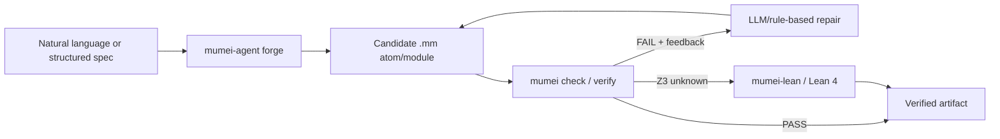
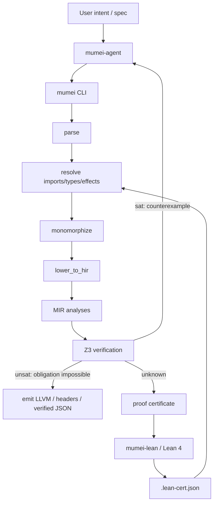
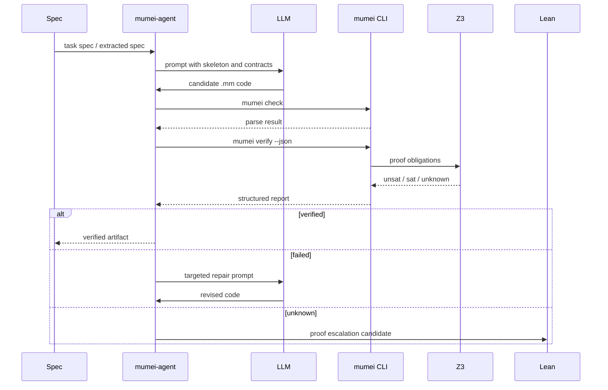
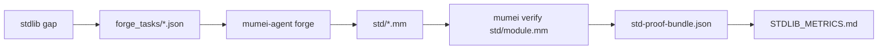

<p class="paper-nav"><a href="{{ site.url }}/">← Back to Mumei home</a></p>

# Mumei: An AI-Native Programming Language for Autonomous Formal Verification and Trustless Software Engineering

## Abstract

**Source references:** [mumei README](https://github.com/mumei-lang/mumei/blob/main/README.md), [mumei architecture](https://github.com/mumei-lang/mumei/blob/main/docs/ARCHITECTURE.md), [mumei-agent README](https://github.com/mumei-lang/mumei-agent/blob/develop/README.md), [mumei-lean README](https://github.com/mumei-lang/mumei-lean/blob/develop/README.md).

Large language models can produce programs that look idiomatic, compile, and pass superficial examples, yet violate latent safety, temporal, financial, or regulatory constraints. Mumei addresses this gap by treating every function-like unit, called an *atom*, as a proof obligation. A Mumei program is parsed, resolved, monomorphized, lowered, verified with Z3, and only then emitted as LLVM IR, C headers, or verified metadata. Companion capabilities now include multi-file cross-spec verification and the planned P14 Cross-Validation Framework for natural-language, foreign-code, and spec/code consistency checks. The companion system, mumei-agent, closes the loop by generating code from structured or natural-language specifications, invoking the compiler, reading structured verification feedback, and repairing failures until proofs pass. A second companion backend, mumei-lean, escalates proof obligations that fall outside the effective decidable fragments of SMT to Lean 4.

This paper draft presents Mumei as an autonomous proof-driven programming stack. The central thesis is that formal methods become practical for AI-generated software when proof obligations are made local, feedback is structured for machines, and proof backends are arranged as a hierarchy: fast SMT first, interactive theorem proving only when needed. We describe the core language, refinement types, effect and temporal-effect verification, ownership and concurrency checks, algebraic trait laws, advanced verification features, the autonomous generate-verify-fix loop, Lean 4 escalation, and seven core case studies: ownership transfer, RTGS settlement, RegTech compliance, medical-device control, Merkle tree verification, DeFi invariant verification, and ArkLib-style audit. Companion demos now also cover self-correction and blockchain audit scenarios. We also report the current implementation status, including SI-5 autonomous standard-library expansion metrics as of 2026-06-02: 54 standard-library modules, 325 atoms, 320 Z3-proven atoms, 5 reviewed trusted atoms, and a weighted health score of 0.997.

## 1. Introduction

**Source references:** [mumei README](https://github.com/mumei-lang/mumei/blob/main/README.md), [language reference](https://github.com/mumei-lang/mumei/blob/main/docs/LANGUAGE.md), [cross-project roadmap](https://github.com/mumei-lang/mumei/blob/main/docs/CROSS_PROJECT_ROADMAP.md), [mumei-demo scenarios](https://github.com/mumei-lang/mumei-demo/tree/main/scenarios).

Modern software development increasingly delegates first drafts of code to large language models. The resulting code is often persuasive: names are plausible, comments are fluent, control flow resembles production code, and simple unit tests may pass. The hard problem is not syntax. The hard problem is that many real failures are violations of *semantic obligations* that are not explicit in ordinary programming languages: a transition occurs before authorization, a settlement finalizes before validation, a politically exposed person is omitted from a compliance match, or a trait implementation violates an algebraic law.

Mumei starts from the opposite assumption: a generated program is not useful merely because it compiles. It is useful when its stated obligations are mathematically discharged. In Mumei, the smallest verification unit is an atom:

```mumei
atom increment(n: Nat)
    requires: n >= 0;
    ensures: result >= 1;
    body: n + 1;
```

The compiler encodes the atom body, precondition, postcondition, type refinements, effects, and call-site assumptions as solver obligations. In the normal path, Z3 discharges these obligations automatically. When Z3 returns a counterexample, Mumei reports it as structured feedback; when Z3 returns `unknown`, the obligation can be lifted into Lean 4.

The design goal is not to replace theorem provers with LLMs. It is to put LLMs into a loop where they are not the authority. The LLM proposes a program; the compiler and proof backends decide whether it is correct.

### 1.1 The "Looks Correct But Is Broken" Problem

**Source references:** [ownership-transfer demo](https://github.com/mumei-lang/mumei-demo/blob/main/scenarios/ownership_transfer/README.md), [RTGS settlement demo](https://github.com/mumei-lang/mumei-demo/blob/main/scenarios/rtgs_settlement/README.md), [RegTech compliance demo](https://github.com/mumei-lang/mumei-demo/blob/main/scenarios/regtech_compliance/README.md), [medical-device control demo](https://github.com/mumei-lang/mumei-demo/blob/main/scenarios/medical_device/README.md).

The core failure pattern is code that appears correct under casual inspection but violates an implicit safety property. In the ownership-transfer scenario, an LLM-generated `hostile_takeover` path attempts to reach `Transferred` from `Idle` without a pending transfer. The code is plausible because it manipulates the right domain vocabulary, but semantically it skips the required `propose -> accept` protocol. Mumei rejects it with a temporal-effect violation:

```text
InvalidPreState: 'accept' requires 'PendingTransfer'
but current state is 'Idle'
Counter-example: hostile_takeover(attacker=42)
```

In the RTGS settlement scenario, the code attempts to enter `Settled` directly from `Pending`, bypassing validation of sufficient funds:

```text
InvalidPreState: 'settle' requires 'Validated'
but current state is 'Pending'
Counter-example: hostile_settlement(sender_balance=0, receiver_balance=100, amount=50)
```

In the RegTech scenario, a classifier omits `CustomerType::PEP`, producing a non-exhaustive match that could allow high-risk customers to avoid compliance treatment:

```text
Match is not exhaustive: the following value is not covered by any arm:
  Counter-example: CustomerType::PEP (tag=3)
```

In the medical-device scenario, an insulin-pump controller attempts delivery from `Idle` without first entering `SafetyChecked`, so the implementation can skip the hourly dosage bound before administering insulin.

These are not formatting or style errors. They are semantic failures. The common form is:

$$
\text{Program appears plausible} \;\land\; \exists x.\; \text{Pre}(x) \land \neg \text{Post}(\text{Program}(x)).
$$

Mumei turns such latent failures into compile-time proof failures.

### 1.2 The Formal Methods Adoption Barrier

**Source references:** [mumei README](https://github.com/mumei-lang/mumei/blob/main/README.md), [mumei-lean README](https://github.com/mumei-lang/mumei-lean/blob/develop/README.md), [mumei-agent README](https://github.com/mumei-lang/mumei-agent/blob/develop/README.md).

Formal methods have historically suffered from a usability mismatch. Industrial developers often need assurance properties, but the cost of adopting proof assistants, writing invariants, and maintaining proof scripts is high. In contrast, SMT-based systems such as Dafny and F* reduce proof effort by automating large decidable fragments, but they still require users to know how to express specifications and debug solver failures.

The rise of LLM-generated code changes the economics. If an autonomous agent can draft implementation candidates, read solver feedback, and repair code, then the human-facing interface can move upward: from writing proof scripts to stating intent. Mumei's approach is to combine:

1. a small, contract-oriented programming language;
2. Z3 as the default automatic verifier;
3. Lean 4 as an escalation target for obligations beyond SMT;
4. structured diagnostic artifacts designed for machine consumption;
5. an autonomous repair loop that treats failed verification as training signal for the next candidate.

This reframes formal-methods adoption. The user does not need to become a Z3 expert for the common case. They state constraints such as non-negativity, state transitions, conservation laws, and resource ordering; the system attempts to forge a verified artifact.

### 1.3 Mumei's Vision: The Forging Metaphor

**Source references:** [mumei-agent forge tasks](https://github.com/mumei-lang/mumei-agent/tree/develop/forge_tasks), [mumei-agent generate strategy](https://github.com/mumei-lang/mumei-agent/blob/develop/agent/strategies/generate_strategy.py), [Mumei-Forge MCP server](https://github.com/mumei-lang/mumei/blob/main/mcp_server.py).

Mumei uses a forging metaphor: an atom is a blade, the compiler is the anvil, Z3 and Lean are the proving fire, and the agent is the blacksmith. The blacksmith does not simply write code and hope. It repeatedly heats, strikes, inspects, and repairs until the artifact satisfies its contract.



The metaphor is intentionally operational. A verified standard library can be expanded atom by atom; each new atom carries a contract, proof result, and proof certificate. Over time, the standard library becomes a cache of forged building blocks for future agents and applications.

## 2. System Architecture

**Source references:** [mumei architecture](https://github.com/mumei-lang/mumei/blob/main/docs/ARCHITECTURE.md), [mumei-agent README](https://github.com/mumei-lang/mumei-agent/blob/develop/README.md), [mumei-lean architecture](https://github.com/mumei-lang/mumei-lean/blob/develop/docs/ARCHITECTURE.md), [proof certificates](https://github.com/mumei-lang/mumei/blob/develop/docs/PROOF_CERTIFICATE.md).

Mumei is organized as a stack rather than a single compiler. The layers are deliberately separable: the core compiler can verify and emit artifacts without the agent; the agent can call the compiler as a subprocess or through MCP; Lean escalation is optional and consumes proof certificates rather than requiring changes to the compiler core.



### 2.1 Mumei Core

**Source references:** [mumei architecture](https://github.com/mumei-lang/mumei/blob/main/docs/ARCHITECTURE.md), [verification core](https://github.com/mumei-lang/mumei/blob/main/mumei-core/src/verification.rs), [parser AST](https://github.com/mumei-lang/mumei/blob/main/mumei-core/src/parser/ast.rs), [MIR analysis](https://github.com/mumei-lang/mumei/blob/main/mumei-core/src/mir_analysis.rs).

Mumei Core implements the language front end, semantic environment, and verification pipeline. Its current repository structure includes:

- `mumei-core`: parser, HIR, MIR, verification, resolver, manifest, registry, FFI support, emitter traits;
- `mumei-emit-llvm`: LLVM IR emitter;
- `mumei-emit-json`: verified metadata emitter;
- root `mumei` CLI: `build`, `verify`, `check`, `init`, `doc`, `infer-effects`, `infer-contracts`, and LSP support. The `verify`, `check`, `infer-effects`, and `infer-contracts` commands now also accept directory input, recursively processing all `.mm` files. The REPL `:load` command supports directories as well, and source loading automatically detects and handles non-UTF-8 encodings such as Shift-JIS.

The verification environment tracks refined types, structs, enums, traits, implementations, resources, effects, imported atoms, proof certificates, path abstractions, and linearity state. The default compiler pipeline is:

```text
source.mm -> parse -> resolve -> monomorphize -> lower_to_hir -> verify (Z3) -> emit
```

For an atom with precondition $P$, body semantics $B$, and postcondition $Q$, verification is encoded in the standard weakest-counterexample style:

$$
P(\vec{x}) \land B(\vec{x}, r) \land \neg Q(\vec{x}, r)
$$

If the formula is unsatisfiable, no counterexample exists and the atom is verified:

$$
\operatorname{unsat}\big(P(\vec{x}) \land B(\vec{x}, r) \land \neg Q(\vec{x}, r)\big).
$$

### 2.2 Mumei-Agent

**Source references:** [mumei-agent README](https://github.com/mumei-lang/mumei-agent/blob/develop/README.md), [generate strategy](https://github.com/mumei-lang/mumei-agent/blob/develop/agent/strategies/generate_strategy.py), [self-healing loop](https://github.com/mumei-lang/mumei-agent/blob/develop/agent/self_healing.py), [spec extractor](https://github.com/mumei-lang/mumei-agent/blob/develop/agent/spec_extractor.py).

mumei-agent is the autonomous layer. It accepts structured forge task specs or extracted specs, asks an LLM to generate Mumei code, validates parseability with `mumei check`, verifies with `mumei verify --json`, and repairs failures. Its generate loop is implemented as a sequence:

1. construct an atom or module skeleton from the specification;
2. generate `.mm` code;
3. run parse checks;
4. run full Z3 verification;
5. classify failures by violation type;
6. identify failing atoms;
7. build a targeted repair prompt from structured feedback;
8. retry until verification passes or the retry budget is exhausted.

This design treats formal verification as the supervising signal. The LLM has no authority to declare success; it can only propose a new candidate. The compiler returns success, counterexamples, unsat cores, or unknown obligations.

### 2.3 The Verification Hierarchy: Z3 + Lean 4

**Source references:** [mumei-lean README](https://github.com/mumei-lang/mumei-lean/blob/develop/README.md), [bridge script](https://github.com/mumei-lang/mumei-lean/blob/develop/scripts/bridge.py), [expression translator](https://github.com/mumei-lang/mumei-lean/blob/develop/scripts/expr_translator.py), [certificate integration](https://github.com/mumei-lang/mumei-lean/blob/develop/docs/INTEGRATION.md), [proof certificate schema](https://github.com/mumei-lang/mumei/blob/develop/docs/PROOF_CERTIFICATE.md).

The verification hierarchy is intentionally asymmetric. Z3 is fast, automatic, and the default. Lean 4 is more expressive and trusted for proofs that exceed the effective SMT fragment. In practice:

- Z3 handles linear arithmetic, many refinement obligations, match exhaustiveness, effect pre/post checks, resource ordering, and many quantified contracts;
- Lean handles proof obligations such as trace properties, inductive invariants, and global conservation theorems that are clearer as typed inductive proofs.

mumei-lean consumes `.proof-cert.json` or `.verified.json` artifacts, collects atoms whose Z3 result is `unknown`, emits Lean theorem files, runs `lake build`, and writes `.lean-cert.json` certificates. A successful Lean proof marks the relevant obligation as:

```json
"z3_check_result": "lean_verified"
```

Lean-backed certificates now carry an explicit translator contract. A `lean_verified` atom is accepted only when the certificate includes the current `translator_version` and `bridge_lemma_hash` fields, together with the Lean result metadata emitted by mumei-lean. This ties a proof to the exact Mumei-to-Lean lowering rules and bridge lemma set that produced it; if either version changes, the resolver reports `stale_translator` and requires regeneration rather than silently reusing an obsolete proof. The typed contract implementation in mumei-lean preserves the same metadata through ingestion, theorem generation, `lake build`, and certificate export.

The hierarchy can be summarized as:

$$
\text{Verified}(a) ::= \text{Z3Unsat}(a) \lor \text{LeanVerified}(a) \lor \text{ReviewedTrusted}(a).
$$

The trusted case is explicit and measured, not hidden.

## 3. Language Design

**Source references:** [language reference](https://github.com/mumei-lang/mumei/blob/main/docs/LANGUAGE.md), [parser AST](https://github.com/mumei-lang/mumei/blob/main/mumei-core/src/parser/ast.rs), [standard library](https://github.com/mumei-lang/mumei/tree/main/std), [concurrency docs](https://github.com/mumei-lang/mumei/blob/main/docs/CONCURRENCY.md).

Mumei's language design prioritizes local proof obligations and machine-checkable specifications. The surface language resembles a compact contract language with atoms, types, effects, resources, traits, loops, pattern matching, and explicit contracts.

### 3.1 Atoms and Contracts

**Source references:** [README atom example](https://github.com/mumei-lang/mumei/blob/main/README.md), [language atom syntax](https://github.com/mumei-lang/mumei/blob/main/docs/LANGUAGE.md#atom-syntax), [verification core](https://github.com/mumei-lang/mumei/blob/main/mumei-core/src/verification.rs).

Atoms are the unit of verification. An atom has parameters, optional return type, optional effects and resource annotations, a precondition, a postcondition, and a body.

```mumei
atom safe_div(a: i64, b: i64)
    requires: b != 0;
    ensures: result * b == a;
    body: a / b;
```

Conceptually, the compiler proves the Hoare triple:

$$
\{P\}\; B\; \{Q\}.
$$

For a deterministic expression body, this becomes:

$$
\forall \vec{x}.\; P(\vec{x}) \Rightarrow Q(\vec{x}, B(\vec{x})).
$$

Z3 typically checks the negation:

$$
\exists \vec{x}.\; P(\vec{x}) \land \neg Q(\vec{x}, B(\vec{x})).
$$

If that formula is unsatisfiable, the atom is accepted.

### 3.2 Refinement Types

**Source references:** [language refinement types](https://github.com/mumei-lang/mumei/blob/main/docs/LANGUAGE.md#refinement-types), [std/contracts.mm](https://github.com/mumei-lang/mumei/blob/main/std/contracts.mm), [std/core.mm](https://github.com/mumei-lang/mumei/blob/main/std/core.mm).

A refinement type restricts a base type by a predicate. Inline, the type form is $\{v \in T \mid \varphi(v)\}$. Displayed:

$$
\{v \in T \mid \varphi(v)\}.
$$

In Mumei syntax:

```mumei
type Nat = i64 where v >= 0;
type Port = i64 where v >= 1 && v <= 65535;
type RiskScore = i64 where v >= 0 && v <= 100;
```

A parameter of refined type $R = \{v \in T \mid \varphi(v)\}$ contributes $\varphi(x)$ to the verification context. For example, if `amount: TransactionAmount` and `TransactionAmount = i64 where v >= 0`, the verification context includes:

$$
amount \ge 0.
$$

Refinement types are deliberately lightweight: they let users express common domain constraints without writing a separate proof script.

### 3.3 Effect System

**Source references:** [README effect example](https://github.com/mumei-lang/mumei/blob/main/README.md), [capability security docs](https://github.com/mumei-lang/mumei/blob/main/docs/CAPABILITY_SECURITY.md), [std/effects.mm](https://github.com/mumei-lang/mumei/blob/main/std/effects.mm), [verification core effect context](https://github.com/mumei-lang/mumei/blob/main/mumei-core/src/verification.rs).

Mumei's effect system makes side effects explicit. An atom that writes files, logs, performs network IO, or triggers a domain-specific state transition must declare the corresponding effect. Undeclared effects are rejected at compile time.

```mumei
effect FileWrite;
effect Log;

atom write_log(msg: Nat)
    effects: [FileWrite, Log];
    requires: msg >= 0;
    ensures: result == msg;
    body: {
        perform FileWrite.write(msg);
        perform Log.info(msg);
        msg
    };
```

At a high level, if $E_{used}$ is the set of effects performed by the body and $E_{decl}$ is the declared set, Mumei checks:

$$
E_{used} \subseteq E_{decl}.
$$

Effect annotations also provide hooks for capability security and temporal verification.

### 3.4 Temporal Effect Verification

**Source references:** [MIR temporal effect analysis](https://github.com/mumei-lang/mumei/blob/main/mumei-core/src/mir_analysis.rs), [std/effects.mm](https://github.com/mumei-lang/mumei/blob/main/std/effects.mm), [std/ownership.mm](https://github.com/mumei-lang/mumei/blob/main/std/ownership.mm), [std/settlement.mm](https://github.com/mumei-lang/mumei/blob/main/std/settlement.mm).

Temporal effects model effects as finite state machines. A stateful effect declares states, an initial state, and transitions:

```mumei
effect Settlement
    states: [Pending, Validated, Settled];
    initial: Pending;
    transition validate: Pending -> Validated;
    transition settle: Validated -> Settled;
    transition reject: Pending -> Pending;
```

An atom can declare pre/post effect states:

```mumei
atom execute_settlement(sender_balance: i64, receiver_balance: i64, amount: i64)
    effects: [Settlement];
    effect_pre: { Settlement: Validated };
    effect_post: { Settlement: Settled };
    requires: sender_balance >= 0 && receiver_balance >= 0 && amount > 0 && sender_balance >= amount;
    ensures: result == sender_balance + receiver_balance;
    body: {
        perform Settlement.settle;
        let new_sender = sender_balance - amount;
        let new_receiver = receiver_balance + amount;
        new_sender + new_receiver
    };
```

The analysis tracks an effect-state map through MIR control flow. Each `perform e.op` is legal only if the current state matches a transition source. For the settlement example:

$$
\delta(\text{Pending}, \text{validate}) = \text{Validated}
$$

$$
\delta(\text{Validated}, \text{settle}) = \text{Settled}
$$

and the invalid transition is rejected:

$$
\delta(\text{Pending}, \text{settle}) = \bot.
$$

This is the basis of the ownership-transfer and RTGS case studies.

### 3.5 Ownership/Borrowing/Concurrency

**Source references:** [verification LinearityCtx](https://github.com/mumei-lang/mumei/blob/main/mumei-core/src/verification.rs), [MIR analysis](https://github.com/mumei-lang/mumei/blob/main/mumei-core/src/mir_analysis.rs), [concurrency docs](https://github.com/mumei-lang/mumei/blob/main/docs/CONCURRENCY.md), [std/settlement resources](https://github.com/mumei-lang/mumei/blob/main/std/settlement.mm).

Mumei includes ownership and linearity checks to prevent use-after-move, double move, conflicting merge, and borrow-related misuse. The current architecture uses MIR analyses as the primary path and retains `LinearityCtx` as a secondary Z3-integrated check for call-site borrow tracking and symbolic execution.

Concurrency safety is expressed through resource declarations and acquisition order. In the RTGS module:

```mumei
resource ledger priority: 1 mode: exclusive;
resource queue  priority: 2 mode: exclusive;
```

The intended deadlock-prevention condition is that resources are acquired in priority order. For acquisitions $r_i$ followed by $r_j$:

$$
priority(r_i) \le priority(r_j).
$$

The `full_settlement` atom acquires `ledger` before `queue`, satisfying the hierarchy. This style makes concurrency constraints explicit and verifiable rather than relying on convention.

### 3.6 Algebraic Trait Laws

**Source references:** [README trait law example](https://github.com/mumei-lang/mumei/blob/main/README.md), [language trait laws](https://github.com/mumei-lang/mumei/blob/main/docs/LANGUAGE.md#trait-definitions-with-laws), [verification law expansion](https://github.com/mumei-lang/mumei/blob/main/mumei-core/src/verification.rs).

Traits can carry algebraic laws. For example:

```mumei
trait Comparable {
    fn leq(a: Self, b: Self) -> bool;
    law reflexive: leq(x, x) == true;
    law transitive: leq(a, b) && leq(b, c) => leq(a, c);
}

impl Comparable for i64 {
    fn leq(a: i64, b: i64) -> bool { a <= b }
}
```

Mumei proves that each implementation satisfies the trait laws. The transitivity obligation has the form:

$$
\forall a,b,c.\; (leq(a,b) \land leq(b,c)) \Rightarrow leq(a,c).
$$

This mechanism prevents a common abstraction bug: an interface that compiles structurally while violating the algebraic assumptions required by generic clients.

### 3.7 Advanced Verification Features

**Source references:** [spec guide](https://github.com/mumei-lang/mumei/blob/main/docs/SPEC_GUIDE.md), [verification diagnostics](https://github.com/mumei-lang/mumei/blob/main/docs/DIAGNOSTICS.md), [proof certificate schema](https://github.com/mumei-lang/mumei/blob/main/docs/PROOF_CERTIFICATE.md), [mumei-agent CEGIS strategy](https://github.com/mumei-lang/mumei-agent/tree/develop/agent/strategies).

Mumei includes several advanced verification features that enhance the proof-driven development experience:

**Vacuity Mutation Checking**: The compiler can detect vacuous specifications by systematically mutating implementations and re-running postcondition proofs against the original contract. This prevents false positives where contracts appear correct but provide no meaningful guarantees.

**Z3 Timeout Heatmap Profiler**: A profiling tool records Z3 timeout patterns and solver resource pressure across obligations, helping developers identify performance bottlenecks in verification and optimize specifications for the decidable fragment.

**Loop Invariant Detection**: Automatic inference of loop invariants using dataflow analysis and pattern matching reduces the manual annotation burden for common loop patterns while maintaining formal verification guarantees.

**CEGIS Invariant Loop**: Counter-Example Guided Inductive Synthesis (CEGIS) automatically discovers and strengthens loop invariants when manual annotations are insufficient.

**Contract Isolation**: Manifest-based contract isolation ensures that verification failures in one module do not propagate to dependent modules, enabling modular development and faster incremental verification.

**Data Flow Trace**: Comprehensive dataflow tracking records how values flow through the program, enabling precise counterexample generation and better diagnostic messages when verification fails.

Recent benchmark history also gives the agent loop a quantitative feedback channel. The Zero-Human Challenge history improved from a 0.667 success rate on 2026-05-04 to 0.857 on 2026-05-25, with additional 2026-05-25 SV-COMP-style and Dafny puzzle-port snapshots reporting 0.880 and 0.920 success rates respectively; subsequent work has focused on improving the verification surface, diagnostic precision, and cross-module checking needed to make those feedback loops more reliable.

**Multi-file Cross-Spec Verification**: The compiler can verify contract consistency across multiple `.mm` files simultaneously. This enables cross-module invariant checking, detection of inter-module invariant violations, and dependency-cycle diagnostics before a multi-file verification run is accepted.

**Decidable-Fragment Warnings**: The `outside_decidable_fragment` diagnostic warns when a specification leaves the solver-friendly fragment. False-positive markers for the `^` XOR operator and the Mumei built-in `matches()` have been removed, making the warning more precise for proof-friendly specification guidance.

## 4. Autonomous Proof Loop

**Source references:** [mumei-agent README](https://github.com/mumei-lang/mumei-agent/blob/develop/README.md), [generate strategy](https://github.com/mumei-lang/mumei-agent/blob/develop/agent/strategies/generate_strategy.py), [prompts](https://github.com/mumei-lang/mumei-agent/tree/develop/agent/prompts), [mumei diagnostics](https://github.com/mumei-lang/mumei/blob/main/docs/DIAGNOSTICS.md).

The autonomous proof loop is the mechanism that turns formal verification from a terminal failure into an iterative repair signal.

### 4.1 Generate→Verify→Fix Cycle

**Source references:** [generate strategy](https://github.com/mumei-lang/mumei-agent/blob/develop/agent/strategies/generate_strategy.py), [agent generate CLI](https://github.com/mumei-lang/mumei-agent/blob/develop/agent/generate.py), [mumei client](https://github.com/mumei-lang/mumei-agent/blob/develop/agent/mumei_client.py).

The generate-verify-fix cycle is:



The loop can be expressed as a partial function over candidates:

$$
C_{i+1} = \operatorname{Repair}(C_i, \operatorname{Verify}(C_i)).
$$

The fixed point is not semantic self-confidence by the LLM. It is a candidate $C_k$ such that:

$$
\operatorname{Verify}(C_k) = \text{pass}.
$$

### 4.2 Structured Feedback

**Source references:** [verification diagnostics](https://github.com/mumei-lang/mumei/blob/main/mumei-core/src/verification.rs), [report schema](https://github.com/mumei-lang/mumei/blob/main/docs/REPORT_SCHEMA.md), [report formatter](https://github.com/mumei-lang/mumei-agent/blob/develop/agent/prompts/report_formatter.py), [counterexample visualizer](https://github.com/mumei-lang/mumei-agent/tree/develop/visualizer), [MCP-backed verification](https://github.com/mumei-lang/mumei-agent/blob/develop/README.md#mcp-backed-verification-opt-in).

Structured feedback is the key interface between the verifier and the repair agent. Mumei's error detail includes messages, spans, suggestions, and counterexamples. Reports can include violation type, failing atom, counterexample, and structured unsat core. A simplified report shape is:

```json
{
  "success": false,
  "failure_type": "postcondition",
  "atom": "safe_div",
  "counterexample": { "a": 1, "b": 0 },
  "structured_unsat_core": [
    { "label": "requires", "expr": "true" },
    { "label": "safety", "expr": "b != 0" }
  ],
  "suggestion": "Add a precondition excluding zero divisors."
}
```

For a failed postcondition, the useful solver object is often a model:

$$
M \models P(\vec{x}) \land B(\vec{x}, r) \land \neg Q(\vec{x}, r).
$$

For invariant failures, the useful object is a conflicting set of labeled assumptions, i.e. an unsat core:

$$
\operatorname{core} \subseteq \{a_1, \ldots, a_n\}
$$

such that:

$$
\operatorname{unsat}\left(\bigwedge_{a \in \operatorname{core}} a\right).
$$

Structured feedback lets the agent repair the specification or implementation directly instead of guessing from raw solver logs.

The MCP integration (P10) strengthens the feedback loop by providing richer semantic feedback through the mumei MCP server. The `MumeiMCPClient` can consume enhanced feedback including `semantic_feedback`, `machine_readable` diagnostics, detailed `counter_example` data, and `effect_violation` specifics, enabling more sophisticated repair strategies in the agent.

The P9 reconstruction loss is now formalized as a set rather than a vector. The `ReconstructionLoss` structure carries:

- `loss_set_size: usize`: the cardinality of $L_{recon}$; zero means no counterexamples were found;
- `is_zero_loss: bool`: true iff $L_{recon} = \emptyset$ and the proof is complete;
- `loss_vector: Vec<LossEntry>`: entries recording `violated_property`, `counter_example`, `magnitude`, and `components`.

The zero-loss condition is:

$$
L_{recon} = \emptyset \iff \text{the verifier finds no counterexamples.}
$$

This replaces the previous scalar-magnitude formulation and makes the feedback schema machine-readable for the P9 self-correction loop.

### 4.3 Lean 4 Escalation

**Source references:** [mumei-lean README](https://github.com/mumei-lang/mumei-lean/blob/develop/README.md), [ingest certificate script](https://github.com/mumei-lang/mumei-lean/blob/develop/scripts/ingest_cert.py), [export certificate script](https://github.com/mumei-lang/mumei-lean/blob/develop/scripts/export_cert.py), [Lean tactics](https://github.com/mumei-lang/mumei-lean/blob/develop/MumeiLean/Tactics.lean), [mumei-lean integration](https://github.com/mumei-lang/mumei-lean/blob/develop/docs/INTEGRATION.md).

Lean escalation is triggered when a property is desirable but not naturally discharged by Z3. mumei-lean scans certificates, collects `unknown` atoms, translates contract expressions to Lean propositions where possible, and emits theorem stubs. Successful proofs are exported back to Mumei as `.lean-cert.json`.

#### 4.3.1 Typed Translator Contract

The escalation boundary uses a typed contract rather than textual conventions. Each eligible atom carries `translator_ir` with a `TranslatorIRMetadata` structure that records:

- the obligation sort (contract obligation, loop invariant, etc.);
- a list of binders mapping Mumei identifiers to Lean identifiers and types;
- the theorem goal in Lean syntax;
- source provenance spans;
- lowering rules used during translation.

The contract includes `translator_version` and `bridge_lemma_hash` fields. The version identifies the Mumei-to-Lean translator surface, while the hash identifies the bridge lemma set for integer bounds, refinement/subtype lowering, guarded array access, string and regex bridge points, and effect-state tokens. Manual or partial translation cases remain explicit through `manual_lemma_reason`.

With metadata validation, the escalation rule becomes:

$$
\begin{aligned}
&\operatorname{Verify}_{Z3}(a) = \text{unknown}
\land \operatorname{Translate}(a) = ir
\land \operatorname{MetaValid}(ir, v, h) \\
&\land\; \operatorname{Verify}_{Lean}(a, ir) = \text{checked}
\land \operatorname{LeanMeta}(a) = (\text{lean\_verified}, v, h)
\Rightarrow \operatorname{Verified}(a).
\end{aligned}
$$

Here $v$ is the current translator version and $h$ is the current bridge lemma hash. With metadata validation, the escalation rule ensures that a `lean_verified` atom is accepted only when the certificate includes the current `translator_version` and `bridge_lemma_hash` fields together with the Lean result metadata. This ties a proof to the exact Mumei-to-Lean lowering rules and bridge lemma set that produced it; if either version changes, the resolver reports `stale_translator` and requires regeneration rather than silently reusing an obsolete proof.

Lean is not used to mask ordinary SMT failures. If Z3 finds a concrete counterexample, the candidate is wrong. Lean is reserved for obligations where SMT cannot decide, such as inductive trace properties.

The CLI now separates classification from artifact emission. `--escalate-lean` triggers escalation classification and prints `candidate_count` without writing a file. `--emit escalation-bundle` writes `<input>.escalation-bundle.json` to disk. `LeanEscalationMetrics` also tracks `lean_verified_accepted`, the count of `lean_verified` certificates accepted by the resolver, separately from `lean_successes`.

mumei-lean now includes RTGS settlement proofs, with `Settlement.lean` extended for list-wide nonnegativity. Its advanced contract translator supports loop invariants and recursive encoding, and its Mathlib4 integration design outlines richer bridge lemmas for future escalation coverage.

### 4.4 NLAE Integration (Experimental)

**Source references:** [NLAE guide](https://github.com/mumei-lang/mumei-agent/blob/develop/docs/NLAE_GUIDE.md), [mumei-agent roadmap P12](https://github.com/mumei-lang/mumei-agent/blob/develop/docs/ROADMAP.md#p12-nlae-integration-experimental--implemented), [latent protocol tests](https://github.com/mumei-lang/mumei-agent/blob/develop/tests/test_latent_protocol.py).

Mumei-agent includes experimental integration with Natural Language Autoencoders (NLAE) concepts, providing three opt-in capabilities:

**Latent-Space Debugging**: The `LatentDebugStrategy` encodes verification failures into a latent space, enabling pattern-based debugging that can identify similar failure modes across different codebases.

**Dense Property Generation**: The `DensePropertyGenerator` creates high-density `requires`/`ensures` specifications from natural language descriptions, increasing proof density while maintaining decidability.

**Latent Protocol for Agent Communication**: A standardized protocol for agent-to-agent communication using latent representations enables multi-agent workflows where different specialized agents collaborate on verification tasks.

These features are disabled by default and can be enabled via `ENABLE_LATENT_DEBUG`, `ENABLE_DENSE_PROPERTIES`, and `ENABLE_LATENT_PROTOCOL` environment variables.

### 4.5 P9 Self-Correction Loop

**Source references:** [mumei-agent self-healing](https://github.com/mumei-lang/mumei-agent/blob/develop/agent/self_healing.py), [agent configuration](https://github.com/mumei-lang/mumei-agent/blob/develop/agent/config.py), [P9 self-correction tests](https://github.com/mumei-lang/mumei-agent/tree/develop/tests).

mumei-agent now runs a dedicated `structured_self_correction_loop` with a configurable `self_correction_max_tokens` budget separate from `max_context_tokens`. The loop uses the formalized `ReconstructionLoss` as its convergence signal and terminates when `is_zero_loss == true`, i.e. when the verifier reports no remaining counterexamples. The decidable-fragment specification guide is automatically injected into every generation and repair prompt so the agent keeps candidates inside solver-friendly fragments while repairing failures.

## 5. Case Studies

**Source references:** [mumei-demo scenarios](https://github.com/mumei-lang/mumei-demo/tree/main/scenarios), [std/ownership.mm](https://github.com/mumei-lang/mumei/blob/main/std/ownership.mm), [std/settlement.mm](https://github.com/mumei-lang/mumei/blob/main/std/settlement.mm), [std/compliance.mm](https://github.com/mumei-lang/mumei/blob/main/std/compliance.mm), [medical-device scenario](https://github.com/mumei-lang/mumei-demo/blob/main/scenarios/medical_device/README.md), [self-correction demo](https://github.com/mumei-lang/mumei-demo/tree/main/scenarios/self_correction_demo), [blockchain audit demo](https://github.com/mumei-lang/mumei-demo/tree/main/scenarios/blockchain_audit), [demo harness contracts](https://github.com/mumei-lang/mumei-demo/blob/main/docs/HARNESS_CONTRACTS.md).

The case studies demonstrate seven classes of semantic properties: temporal authorization, financial conservation, regulatory exhaustiveness, safety-critical dosage control, cryptographic proof binding, smart-contract arithmetic safety, and audit-level theorem consistency. The broader demo suite now also includes a self-correction benchmark scenario for the P9-F repair loop and a blockchain audit scenario covering reentrancy, bounded-integer overflow, owner authorization, L1 Z3 certificates, and optional L3 Lean evidence.

### 5.1 Ownership Transfer

**Source references:** [ownership demo README](https://github.com/mumei-lang/mumei-demo/blob/main/scenarios/ownership_transfer/README.md), [std/ownership.mm](https://github.com/mumei-lang/mumei/blob/main/std/ownership.mm), [Ownership.lean](https://github.com/mumei-lang/mumei-lean/blob/develop/MumeiLean/Ownership.lean).

The ownership-transfer protocol has three states:

```mumei
effect Ownership
    states: [Idle, PendingTransfer, Transferred];
    initial: Idle;
    transition propose: Idle -> PendingTransfer;
    transition accept: PendingTransfer -> Transferred;
    transition cancel: PendingTransfer -> Idle;
```

The intended property is that ownership cannot reach `Transferred` without an `accept` after a pending transfer. In Lean, this is modeled as a trace theorem:

$$
\forall ops.\; accept \notin ops \Rightarrow run(Idle, ops) \ne Transferred.
$$

Operationally, Mumei rejects direct hostile transfer because:

$$
\delta(Idle, accept) = \bot.
$$

The verified implementation composes `propose_transfer` and `accept_transfer`, while `propose_and_cancel` returns to `Idle`. Z3 verifies local effect contracts; Lean certifies the global trace property `no_transfer_without_accept`.

### 5.2 RTGS Settlement

**Source references:** [RTGS demo README](https://github.com/mumei-lang/mumei-demo/blob/main/scenarios/rtgs_settlement/README.md), [std/settlement.mm](https://github.com/mumei-lang/mumei/blob/main/std/settlement.mm), [Settlement.lean](https://github.com/mumei-lang/mumei-lean/blob/develop/MumeiLean/Settlement.lean), [settlement tests](https://github.com/mumei-lang/mumei/blob/main/tests/test_settlement.mm).

The RTGS settlement protocol requires `Pending -> Validated -> Settled`. It combines temporal effects, resource hierarchy, loop invariants, decreases clauses, and quantified balance constraints.

A basic conservation obligation for a single transfer is:

$$
(sender - amount) + (receiver + amount) = sender + receiver.
$$

The global invariant can be stated as:

$$
\forall t.\; withdrawn(t) \le allocated(t).
$$

The implemented settlement proof focuses on two properties:

1. no settlement without validation;
2. global balance sum conservation across transfer traces.

The local Z3 obligation for `execute_settlement` is:

$$
 sender \ge 0 \land receiver \ge 0 \land amount > 0 \land sender \ge amount
 \Rightarrow
 (sender - amount) + (receiver + amount) = sender + receiver.
$$

The Lean theorem captures trace-level conservation:

$$
\forall initial, final.\; TransferTrace(initial, final) \Rightarrow sum(final) = sum(initial).
$$

This case study shows why the hierarchy matters: arithmetic conservation is easy for Z3 locally, while trace induction is clearer in Lean.

### 5.3 RegTech Compliance

**Source references:** [RegTech demo README](https://github.com/mumei-lang/mumei-demo/blob/main/scenarios/regtech_compliance/README.md), [std/compliance.mm](https://github.com/mumei-lang/mumei/blob/main/std/compliance.mm), [RegTech scenario JSON](https://github.com/mumei-lang/mumei-demo/blob/main/scenarios/regtech_compliance/scenario.json).

The RegTech compliance scenario checks that all customer categories are handled and that transaction limits follow risk classifications. The key bug is an omitted `PEP` case. Mumei rejects the non-exhaustive match with a concrete counterexample:

$$
customer\_type = PEP.
$$

The correct implementation defines customer classes and risk levels, then verifies constraints such as:

$$
\forall i \in [0,n).\; 0 \le arr[i] \land arr[i] \le limit.
$$

In Mumei contract syntax:

```mumei
requires: n >= 0 && limit > 0 && forall(i, 0, n, arr[i] >= 0 && arr[i] <= limit);
ensures: result == 1;
```

This is a two-layer case study: Z3 is sufficient for match exhaustiveness and quantified range constraints, so Lean escalation is unnecessary.

### 5.4 Medical Device Control

**Source references:** [medical-device README](https://github.com/mumei-lang/mumei-demo/blob/main/scenarios/medical_device/README.md), [buggy insulin-pump code](https://github.com/mumei-lang/mumei-demo/blob/main/scenarios/medical_device/buggy_code.mm), [correct insulin-pump code](https://github.com/mumei-lang/mumei-demo/blob/main/scenarios/medical_device/correct_code.mm), [medical-device scenario JSON](https://github.com/mumei-lang/mumei-demo/blob/main/scenarios/medical_device/scenario.json).

The medical-device scenario models an insulin pump whose delivery atom must respect both a temporal safety gate and an hourly dosage bound. The buggy implementation attempts `perform InsulinPump.deliver` directly from `Idle`, even though the effect definition requires:

$$
\delta(Idle, check) = SafetyChecked \quad\land\quad \delta(SafetyChecked, deliver) = Delivered.
$$

Skipping the `SafetyChecked` state also skips the arithmetic guard that the requested dose must fit inside the remaining hourly capacity. In Mumei contract form, the corrected implementation makes the dosage bound explicit:

```mumei
requires: glucose >= 70 && requested_dose > 0 && current_hour_dosage >= 0 && max_dose_per_hour > 0;
requires: current_hour_dosage + requested_dose <= max_dose_per_hour;
ensures: result == requested_dose;
ensures: result <= max_dose_per_hour - current_hour_dosage;
```

The implementation then decomposes delivery into `check_dosage_bounds` followed by `commit_insulin_delivery`, giving the explicit state sequence:

```text
Idle -> SafetyChecked -> Delivered
```

Z3 verifies the local dosage bounds and rejects the invalid delivery state with an `InvalidPreState` error. The Lean layer supplies the cumulative safety argument, represented in the scenario as `no_overdose_with_hourly_limit`: across a trace of checked deliveries, cumulative delivered insulin remains within the hourly limit. This case illustrates the intended split for safety-critical control software: bounded arithmetic and state preconditions are automatic SMT obligations, while trace-level cumulative safety is clearer as a Lean theorem.

### 5.5 Merkle Tree Verification

**Source references:** [merkle tree demo](https://github.com/mumei-lang/mumei-demo/tree/main/scenarios/merkle_tree_verification), [mumei-lean cryptographic proofs](https://github.com/mumei-lang/mumei-lean/blob/develop/MumeiLean/Crypto.lean).

The Merkle tree verification scenario demonstrates cryptographic correctness proofs. A buggy verifier accepts a path computation without requiring `hash_function_secure`. Mumei rejects the unbound root proof with an unsatisfied postcondition. The corrected contract requires the security flag plus `leaf + sibling_hash == expected_root` and verifies with Z3. The optional Lean layer targets the mumei-lean cryptographic proof modules for collision-resistance-oriented proof assets.

### 5.6 DeFi Invariant

**Source references:** [DeFi demo](https://github.com/mumei-lang/mumei-demo/tree/main/scenarios/defi_invariant), [mumei-lean smart-contract proofs](https://github.com/mumei-lang/mumei-lean/blob/develop/MumeiLean/SmartContract.lean).

The DeFi invariant scenario demonstrates financial safety in smart contracts. A buggy ERC-20 transfer calls a `Uint256` checker without proving the receiver-side upper bound. Mumei rejects the missing precondition as a boundary violation. The corrected `safe_transfer` requires `to_balance + amount <= 100`, the demo harness' bounded `Uint256` maximum, and verifies the refined result with Z3. The optional Lean layer targets the mumei-lean smart-contract proof modules for deeper invariant proofs.

### 5.7 ArkLib-Style Audit

**Source references:** [ArkLib audit demo](https://github.com/mumei-lang/mumei-demo/tree/main/scenarios/arklib_style_audit), [mumei-demo harness contracts](https://github.com/mumei-lang/mumei-demo/blob/main/docs/HARNESS_CONTRACTS.md).

The ArkLib-style audit scenario demonstrates top-level theorem verification for audit claims. A buggy theorem requires commitments to be both equal and unequal. Mumei rejects the contradictory `requires` clauses. The corrected theorem binds the pre/post/invariant hash to the expected implementation commitment and verifies with Z3. The NLAH-style harness records the L1 proof certificate, optional L3 bridge certificate, and dashboard evidence as auditable artifacts.

## 6. Autonomous Standard Library Expansion (SI-5)

**Source references:** [stdlib metrics](https://github.com/mumei-lang/mumei/blob/main/docs/STDLIB_METRICS.md), [forge tasks](https://github.com/mumei-lang/mumei-agent/tree/develop/forge_tasks), [forge task README](https://github.com/mumei-lang/mumei-agent/blob/develop/forge_tasks/README.md), [proof bundle workflow](https://github.com/mumei-lang/mumei/blob/main/.github/workflows/generate-std-certs.yml), [proof-friendly specification guidance](https://github.com/mumei-lang/mumei-agent/blob/develop/docs/ROADMAP.md#p8-c-proof-friendly-specification-metrics--complete-pr-87).

SI-5 is the autonomous proliferation track for expanding the verified standard library. Each forge task describes a target module, atom set, contracts, effects, and expected verification properties. mumei-agent generates and verifies the implementation, and successful modules become part of the standard library and proof bundle.

The current generated metrics report (2026-06-02):

- Modules: 54;
- Atoms total: 325;
- Proven atoms: 320;
- Reviewed trusted atoms: 5;
- TODO/FIXME/XXX/HACK markers: 0;
- Weighted health score: 0.997.

The health score is defined in the metrics document as:

$$
Health = \frac{proven + 0.8 \times trusted}{atoms} - TODO\_penalty.
$$

With the current values and zero TODO penalty:

$$
Health = \frac{320 + 0.8 \times 5}{325} = 0.9969 \approx 0.997.
$$

Failing verification halves the score. The point is not to pretend that trusted atoms are proven; it is to make the trust surface explicit, measured, and reducible. Recent SI-5 work reduced the reviewed trusted-atom surface from 48 to 5 while increasing total atom coverage from 304 to 325, showing that verification coverage improved rather than merely reclassifying proof debt. Recent SI-5 modules include verified containers, math utilities, ownership, settlement, compliance, crypto, HTTP, and JSON support.



SI-5 is important because it makes verification cumulative. Each newly verified atom becomes a reusable lemma-like software component for future generated programs.

### 6.1 Proof-Friendly Specification Guidance and P8-C Metrics

The SI-5 generation loop now includes proof-friendly specification guidance before the first candidate is emitted. mumei-agent exposes a `get_spec_guidelines` MCP tool that returns the same decidable-fragment catalog injected into generation prompts. The catalog recommends linear arithmetic, explicit bounds for array and sequence access, bounded quantifiers or constructible witnesses, and finite effect-state machines; it routes non-linear arithmetic, symbolic division/modulo, quantifier alternation, unbounded array triggers, and recursive temporal invariants toward Lean escalation instead of repeated blind SMT retries.

The guidance is operationalized through P8-C metrics. For each new specification attempt, mumei-agent records:

- `outside_decidable_fragment_warnings`;
- `z3_unknowns`;
- `first_pass_verification_success_rate`;
- `by_logic_fragment` success rates for tagged fragments.

These measurements close the loop between generation and verification. If a generated spec lands outside the decidable fragment, the prompt instructs the agent to simplify the specification, add explicit bounds or witnesses, or escalate to Lean before changing implementation code. The result is a more proof-friendly standard-library expansion pipeline: Z3 receives obligations shaped for its stable fragments, while Lean remains available for the obligations that genuinely require induction or richer semantic models.

## 7. Evaluation and Related Work

**Source references:** [mumei README](https://github.com/mumei-lang/mumei/blob/main/README.md), [mumei-agent benchmark history](https://github.com/mumei-lang/mumei-agent/blob/develop/docs/BENCHMARK_HISTORY.md), [mumei-demo showcase](https://github.com/mumei-lang/mumei-demo/blob/main/docs/DEMO_SHOWCASE.md), [mumei-lean README](https://github.com/mumei-lang/mumei-lean/blob/develop/README.md).

Mumei should be evaluated along several dimensions:

1. **proof success rate:** proportion of generated atoms verified by Z3 or Lean;
2. **repair convergence:** number of generate-verify-fix iterations before success;
3. **counterexample quality:** whether structured diagnostics point to the relevant bug;
4. **trust surface:** ratio of trusted to proven atoms;
5. **user burden:** amount of formal syntax required from the user;
6. **runtime artifact utility:** ability to emit LLVM IR, C headers, verified JSON, and proof bundles.

The current standard-library metrics provide one snapshot of proof health, but a full evaluation should include controlled tasks across arithmetic, state machines, concurrency, and domain-specific compliance.

### Comparison with Cedar

**Source references:** [Cedar Policy Language](https://www.cedarpolicy.com/), [mumei README](https://github.com/mumei-lang/mumei/blob/main/README.md), [capability security docs](https://github.com/mumei-lang/mumei/blob/main/docs/CAPABILITY_SECURITY.md).

Cedar is a policy language and authorization engine designed for analyzable access-control policies. Like Mumei, it emphasizes decidable reasoning over domain constraints. The difference is scope: Cedar focuses on authorization policies, while Mumei is a general proof-driven programming language with atoms, effects, resources, and code generation. Cedar asks whether a request is authorized under a policy; Mumei asks whether a program satisfies its contracts and can be safely emitted.

### Comparison with Lean 4 and Coq

**Source references:** [mumei-lean README](https://github.com/mumei-lang/mumei-lean/blob/develop/README.md), [Lean 4](https://lean-lang.org/), [Coq](https://coq.inria.fr/).

Lean 4 and Coq are expressive proof assistants with small trusted kernels and rich dependent type theories. They can express the deepest properties in this paper, including trace induction and algebraic invariants. Mumei is not a replacement for them. Instead, it uses Lean 4 as an escalation backend. The intended workflow is SMT-first automation with Lean for proof obligations that need induction, libraries, or human-readable theorem structure.

In formula form:

$$
\text{Mumei} = \text{Programming surface} + \text{SMT automation} + \text{Lean escalation} + \text{agentic repair}.
$$

### Comparison with Dafny and F*

**Source references:** [Dafny](https://dafny.org/), [F*](https://www.fstar-lang.org/), [mumei language reference](https://github.com/mumei-lang/mumei/blob/main/docs/LANGUAGE.md).

Dafny and F* are the closest relatives: both combine programming with specifications and SMT-backed verification. Mumei differs in three emphases:

1. atoms as the core compilation and proof unit;
2. structured feedback designed for autonomous repair loops;
3. explicit integration with AI agents and proof-certificate distribution.

Mumei is less mature than Dafny or F* as a verification ecosystem, but it is optimized for a different question: how can AI-generated code be forced through a proof loop before becoming a deployable artifact?

## 8. Implementation Status

**Source references:** [mumei README](https://github.com/mumei-lang/mumei/blob/main/README.md), [architecture source-file table](https://github.com/mumei-lang/mumei/blob/main/docs/ARCHITECTURE.md#source-files), [mumei-agent README](https://github.com/mumei-lang/mumei-agent/blob/develop/README.md), [mumei-lean README](https://github.com/mumei-lang/mumei-lean/blob/develop/README.md), [stdlib metrics](https://github.com/mumei-lang/mumei/blob/main/docs/STDLIB_METRICS.md), [trusted atom plan](https://github.com/mumei-lang/mumei/blob/main/docs/TRUSTED_ATOMS.md), [concurrency docs](https://github.com/mumei-lang/mumei/blob/main/docs/CONCURRENCY.md), [proof certificate schema](https://github.com/mumei-lang/mumei/blob/develop/docs/PROOF_CERTIFICATE.md), [NLAE guide](https://github.com/mumei-lang/mumei-agent/blob/develop/docs/NLAE_GUIDE.md), [agent harness spec](https://github.com/mumei-lang/mumei-agent/blob/develop/docs/AGENT_HARNESS_SPEC.md).

Implemented components include:

- parser and lexer for atoms, refinements, enums, pattern matching, effects, resources, loops, generics, traits, and laws;
- resolver and module environment for imports, types, effects, traits, resources, and proof certificates;
- monomorphization for generic definitions;
- HIR and MIR lowering;
- Z3 verification of requires/ensures contracts, refinements, quantifiers, arrays, match exhaustiveness, trait laws, resource hierarchy, and many effect obligations;
- temporal-effect analysis over MIR control flow;
- ownership/linearity checks including use-after-move and double-move detection;
- emitters for LLVM IR, C headers, and verified JSON metadata;
- proof certificate and proof bundle support;
- directory input for `verify`, `check`, `infer-effects`, `infer-contracts`, and REPL `:load`;
- non-UTF-8 encoding support with automatic detection via `chardet`;
- multi-file cross-spec verification, including cross-module invariant and dependency-cycle detection;
- Lean escalation CLI output for escalation bundles and metrics, including `--escalate-lean` separated from `--emit escalation-bundle`, `verify --emit escalation-metrics`, candidate grouping by `z3_result_class`, `lean_verified_accepted` in `LeanEscalationMetrics`, and acceptance metrics for `--allow-lean-verified` certificates;
- improved `outside_decidable_fragment` warnings, with false-positive markers for `^` and `matches()` removed;
- mumei-agent autonomous generation, verification, and repair;
- natural-language to Mumei spec extraction pipeline;
- formalized P9 reconstruction loss with `LossEntry`, `loss_set_size`, and `is_zero_loss`;
- structured P9 self-correction loop with a dedicated token budget;
- spec guide auto-injection into generation and repair prompts;
- mumei-lean bridge for certificate ingestion, Lean theorem generation, typed translator-contract validation, build-log parsing, Lean certificate export, RTGS settlement Lean proofs, an advanced contract translator for loop invariants and recursive encoding, and Mathlib4 integration design;
- demo scenarios for ownership transfer, RTGS settlement, RegTech compliance, medical-device control, natural-language-to-verified pipelines, self-correction, and blockchain audit;
- SI-5 standard-library metrics and forge tasks, including proof-friendly specification guidance in generation prompts;
- vacuity mutation checking for specification validation;
- Z3 timeout heatmap profiler for verification performance analysis;
- loop invariant detection and CEGIS invariant loop;
- contract isolation manifest support for modular verification;
- data flow trace for enhanced diagnostics;
- bidirectional MCP integration (P10) with richer semantic feedback;
- NLAE integration (P12) for latent-space debugging and dense property generation;
- NLAH-style harness contracts (P13) for scenario validation;
- Phase 4-6 demo scenarios (Merkle Tree, DeFi Invariant, ArkLib-Style Audit);
- FFI trusted atom tracking with a reduced trusted-atom budget, trusted-module inventory, and contract-coverage reporting for generated FFI property tests;
- `task_group:any` winner cancellation, where the winning child atomically completes the group, requests cancellation for remaining children, and the parent still joins every child for cleanup;
- Lean executable export and bridge harness contract metadata;
- current public release line: v0.6.0;
- updated standard library metrics: 54 modules, 325 atoms, 320 proven atoms, 5 reviewed trusted atoms, 0.997 health score.

Known limitations and active areas include:

- a small trusted-atom remainder remains in `std/http_server.mm` and `std/container/sorted_map.mm`;
- Lean escalation now has a typed translator contract, CLI bundle/metrics output, and acceptance metrics, but richer theorem templates and bridge lemmas are still needed for additional obligation classes;
- proof-friendly specification guidance is integrated into the generation pipeline, but its P8-C metrics must be monitored over larger task populations;
- P14 Cross-Validation Framework (V1-A through V1-E) is planned but not yet implemented;
- the natural-language extraction pipeline must conservatively distinguish missing requirements from underspecified intent;
- arXiv-ready presentation will require replacing Mermaid diagrams with TikZ or figures;
- benchmark evaluation should be expanded beyond current demos and standard-library health metrics.

## 9. Conclusion and Future Work

**Source references:** [cross-project roadmap](https://github.com/mumei-lang/mumei/blob/main/docs/CROSS_PROJECT_ROADMAP.md), [mumei-agent roadmap](https://github.com/mumei-lang/mumei-agent/blob/develop/docs/ROADMAP.md), [mumei-lean integration docs](https://github.com/mumei-lang/mumei-lean/blob/develop/docs/INTEGRATION.md), [mumei-demo showcase](https://github.com/mumei-lang/mumei-demo/blob/main/docs/DEMO_SHOWCASE.md).

Mumei demonstrates a practical path for AI-generated software that is not merely plausible but mechanically checked. The core idea is simple: require every atom to carry a contract, verify it before emission, expose failures as structured feedback, and let autonomous agents repair candidates under the supervision of proof tools. Z3 provides fast automatic verification; Lean 4 provides an escalation path for inductive and solver-hard properties; proof certificates and standard-library metrics make verification status explicit and auditable.

Future work includes:

1. expanding Lean theorem templates and bridge lemmas for more classes of `unknown` atoms;
2. reducing trusted standard-library atoms through SI-5 forging and Lean proofs;
3. improving proof-friendly specification guidance with P8-C data from larger generation cohorts;
4. improving natural-language specification extraction with ambiguity reporting;
5. strengthening concurrency and ownership proofs over MIR, including additional coverage beyond implemented `task_group:any` winner cancellation;
6. producing arXiv-ready figures and a quantitative evaluation suite;
7. integrating proof artifacts with package distribution, CI, and editor diagnostics;
8. validating the approach on larger safety-critical and compliance-heavy systems;
9. expanding NLAE capabilities for multi-agent verification workflows;
10. completing P13 agent harness externalization with telemetry and ablation metrics;
11. enhancing Lean theorem templates for additional obligation classes;
12. integrating benchmark evaluation results into the standard library expansion pipeline;
13. implementing the P14 Cross-Validation Framework: natural-language specification soundness verification (V1-A), foreign-code logical soundness verification (V1-B), spec-to-code conformance checking (V1-C), code-to-spec traceability verification (V1-D), and human-friendly UX (V1-E).

The broader claim is that formal methods and AI generation are complementary. LLMs are good at proposing candidates; solvers and proof assistants are good at rejecting invalid ones. Mumei combines them into a single forging loop.

## References

**Source references:** [mumei organization](https://github.com/mumei-lang), [mumei](https://github.com/mumei-lang/mumei), [mumei-agent](https://github.com/mumei-lang/mumei-agent), [mumei-lean](https://github.com/mumei-lang/mumei-lean), [mumei-demo](https://github.com/mumei-lang/mumei-demo), [Z3](https://github.com/mumei-lang/z3), [Lean 4](https://github.com/mumei-lang/lean4).

1. Mumei. *Mathematical Proof-Driven Programming Language*. GitHub repository. <https://github.com/mumei-lang/mumei>
2. Mumei Core Architecture. <https://github.com/mumei-lang/mumei/blob/main/docs/ARCHITECTURE.md>
3. Mumei Language Reference. <https://github.com/mumei-lang/mumei/blob/main/docs/LANGUAGE.md>
4. Mumei Standard Library Metrics. <https://github.com/mumei-lang/mumei/blob/main/docs/STDLIB_METRICS.md>
5. Mumei Agent. *AI-driven autonomous fix loop for Mumei*. <https://github.com/mumei-lang/mumei-agent>
6. Mumei Agent Forge Tasks. <https://github.com/mumei-lang/mumei-agent/tree/develop/forge_tasks>
7. Mumei Agent Proof-Friendly Specification Guidance. <https://github.com/mumei-lang/mumei-agent/blob/develop/docs/ROADMAP.md#p8-c-proof-friendly-specification-metrics--complete-pr-87>
8. mumei-lean. *External Lean 4 proof backend for Mumei*. <https://github.com/mumei-lang/mumei-lean>
9. mumei-lean Typed Translator Contract Integration. <https://github.com/mumei-lang/mumei-lean/blob/develop/docs/INTEGRATION.md>
10. MumeiLean Ownership Proof. <https://github.com/mumei-lang/mumei-lean/blob/develop/MumeiLean/Ownership.lean>
11. MumeiLean Settlement Proof. <https://github.com/mumei-lang/mumei-lean/blob/develop/MumeiLean/Settlement.lean>
12. Mumei Demo Scenarios. <https://github.com/mumei-lang/mumei-demo/tree/main/scenarios>
13. Ownership Transfer Demo. <https://github.com/mumei-lang/mumei-demo/tree/main/scenarios/ownership_transfer>
14. RTGS Settlement Demo. <https://github.com/mumei-lang/mumei-demo/tree/main/scenarios/rtgs_settlement>
15. RegTech Compliance Demo. <https://github.com/mumei-lang/mumei-demo/tree/main/scenarios/regtech_compliance>
16. Medical Device Control Demo. <https://github.com/mumei-lang/mumei-demo/tree/main/scenarios/medical_device>
17. Self-Correction Demo. <https://github.com/mumei-lang/mumei-demo/tree/main/scenarios/self_correction_demo>
18. Blockchain Audit Demo. <https://github.com/mumei-lang/mumei-demo/tree/main/scenarios/blockchain_audit>
19. Mumei v0.6.0 Release. <https://github.com/mumei-lang/mumei/releases/tag/v0.6.0>
20. Mumei Trusted Atom Tracking. <https://github.com/mumei-lang/mumei/blob/main/docs/TRUSTED_ATOMS.md>
21. Mumei Concurrency Design. <https://github.com/mumei-lang/mumei/blob/main/docs/CONCURRENCY.md>
22. de Moura, L., and Bjørner, N. *Z3: An Efficient SMT Solver*. TACAS 2008. <https://github.com/Z3Prover/z3>
23. de Moura, L., Ullrich, S. et al. *The Lean 4 Theorem Prover and Programming Language*. <https://lean-lang.org/>
24. The Coq Development Team. *The Coq Proof Assistant*. <https://coq.inria.fr/>
25. Leino, K. R. M. *Dafny: An Automatic Program Verifier for Functional Correctness*. LPAR 2010. <https://dafny.org/>
26. Swamy, N. et al. *F*: A Higher-Order Effectful Language Designed for Program Verification*. <https://www.fstar-lang.org/>
27. AWS. *Cedar Policy Language*. <https://www.cedarpolicy.com/>
28. Mumei Agent Harness Specification. <https://github.com/mumei-lang/mumei-agent/blob/develop/docs/AGENT_HARNESS_SPEC.md>
29. Mumei Demo Harness Contracts. <https://github.com/mumei-lang/mumei-demo/blob/main/docs/HARNESS_CONTRACTS.md>
30. Mumei LLM Benchmark History. <https://github.com/mumei-lang/mumei-agent/blob/develop/docs/BENCHMARK_HISTORY.md>

---

Copyright © 2026 Mumei Project Contributors

Licensed under the Apache License, Version 2.0 (the "License");
you may not use this file except in compliance with the License.
You may obtain a copy of the License at

    http://www.apache.org/licenses/LICENSE-2.0

Unless required by applicable law or agreed to in writing, software
distributed under the License is distributed on an "AS IS" BASIS,
WITHOUT WARRANTIES OR CONDITIONS OF ANY KIND, either express or implied.
See the License for the specific language governing permissions and
limitations under the License.
