# std/ Dependency Graph

_Generated: 2026-04-18 11:13 UTC_

This document is generated by `visualizer/generate_graph.py` from the output of the `visualize_std_graph` MCP tool. It renders natively on GitHub.

- **Green** (rounded): fully verified — no `trusted atom`.
- **Yellow** (hexagon): verified, but at least one `trusted atom` (proof hole) is present.
- **Red** (double border): verification failed or module missing (reserved for CI augmentation).

```mermaid
graph TD
    std_alloc_mm("std/alloc.mm\n26 atoms, 0 trusted")
    std_container_bounded_array_mm("std/container/bounded_array.mm\n8 atoms, 0 trusted")
    std_container_safe_queue_mm("std/container/safe_queue.mm\n8 atoms, 0 trusted")
    std_container_verified_vector_mm{{"std/container/verified_vector.mm\n5 atoms, 3 trusted"}}
    std_contracts_mm("std/contracts.mm\n13 atoms, 0 trusted")
    std_core_mm("std/core.mm\n9 atoms, 0 trusted")
    std_effects_mm("std/effects.mm\n0 atoms, 0 trusted")
    std_file_mm("std/file.mm\n5 atoms, 0 trusted")
    std_http_mm("std/http.mm\n12 atoms, 0 trusted")
    std_http_secure_mm("std/http_secure.mm\n8 atoms, 0 trusted")
    std_http_server_mm("std/http_server.mm\n4 atoms, 0 trusted")
    std_json_mm("std/json.mm\n20 atoms, 0 trusted")
    std_libc_mm("std/libc.mm\n9 atoms, 0 trusted")
    std_list_mm{{"std/list.mm\n24 atoms, 2 trusted"}}
    std_math_fixed_point_mm("std/math/fixed_point.mm\n8 atoms, 0 trusted")
    std_option_mm("std/option.mm\n8 atoms, 0 trusted")
    std_prelude_mm("std/prelude.mm\n3 atoms, 0 trusted")
    std_result_mm("std/result.mm\n12 atoms, 0 trusted")
    std_stack_mm("std/stack.mm\n5 atoms, 0 trusted")
    classDef green fill:#d4edda,stroke:#28a745,color:#155724;
    classDef yellow fill:#fff3cd,stroke:#ffc107,color:#856404;
    classDef red fill:#f8d7da,stroke:#dc3545,color:#721c24;
    class std_alloc_mm,std_container_bounded_array_mm,std_container_safe_queue_mm,std_contracts_mm,std_core_mm,std_effects_mm,std_file_mm,std_http_mm,std_http_secure_mm,std_http_server_mm,std_json_mm,std_libc_mm,std_math_fixed_point_mm,std_option_mm,std_prelude_mm,std_result_mm,std_stack_mm green;
    class std_container_verified_vector_mm,std_list_mm yellow;
```

Each node label carries `<path>\n<N> atoms, <M> trusted` so the density of proof holes is visible at a glance.

